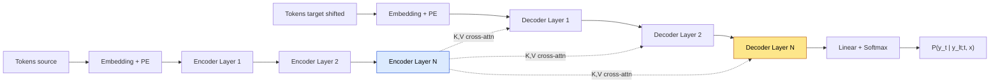

**T5** (*Text-to-Text Transfer Transformer*, Raffel et al., JMLR 2020) es el ejemplar moderno canónico de la rama **encoder-decoder** del Transformer. Donde BERT mantuvo solo el encoder y GPT mantuvo solo el decoder, T5 conservó la arquitectura completa de Vaswani et al. (2017) — encoder bidireccional + decoder autoregresivo con cross-attention — y la combinó con tres ideas radicales: (1) **reformular todo problema de NLP como text-to-text**, (2) un objetivo de pretraining nuevo llamado **span corruption**, y (3) un corpus masivo curado llamado **C4** (Colossal Clean Crawled Corpus). El resultado: un modelo único que en 2020 alcanzó SOTA simultáneamente en GLUE, SuperGLUE, SQuAD, CNN/DM y WMT translation.

Aunque los decoder-only grandes (GPT-3, GPT-4, Claude, LLaMA) desplazaron a T5 como protagonista de la frontera a partir de 2022, la arquitectura encoder-decoder sigue siendo la elección correcta en un nicho importante: **tareas con input + output asimétricos** donde el input es grande y bidireccionalmente significativo (un documento, un audio, una imagen) y el output es texto generado autoregresivamente. Whisper (audio→texto), modelos de traducción especializados, summarizers de producción y muchos pipelines multimodales siguen siendo encoder-decoder. Este fundamento cubre la arquitectura, el framework text-to-text, span corruption, C4, multi-task fine-tuning, la familia broader (BART, PEGASUS, mT5, Flan-T5) y la decisión arquitectónica entre las tres ramas del Transformer.

---

## 1. El espectro Transformer: tres ramas, tres usos

El paper original *Attention is all you need* (Vaswani et al., NeurIPS 2017) introdujo un Transformer **encoder-decoder** completo para traducción. En 2018 esa arquitectura se trifurcó:

- **Encoder-only** (BERT, octubre 2018): solo el stack del encoder. Atención bidireccional. Objetivo: Masked Language Modeling. Output: vector por token, vector `[CLS]` global. No genera texto. Ver [BERT](/fundamentos/bert).
- **Decoder-only** (GPT-1, junio 2018): solo el stack del decoder. Atención causal. Objetivo: next-token prediction. Output: distribución sobre el vocabulario para el siguiente token. Genera texto autoregresivamente. Ver [GPT family](/fundamentos/gpt-family).
- **Encoder-decoder** (T5, octubre 2019; BART, octubre 2019): ambos stacks. Encoder bidireccional + decoder causal + **cross-attention** que conecta los dos. Objetivo: span corruption (T5) o denoising (BART). Genera texto, pero condicionado a una representación rica del input.

La pregunta natural es: si BERT cubre clasificación y GPT cubre generación, ¿por qué seguir manteniendo encoder-decoder? La respuesta es la **asimetría de input/output**:

- En **clasificación** el output es una etiqueta. No hay generación. Un encoder solo basta.
- En **chat / generación libre** el output evoluciona token a token y el input es solo el prefijo. Un decoder solo basta.
- En **traducción**, **summarization**, **QA con documento grande**, **transcripción**, **paráfrasis** el input tiene una estructura propia (oración fuente, documento largo, audio) que se beneficia de procesarse bidireccionalmente **antes** de empezar a generar. El decoder, mientras genera, **consulta repetidamente** la representación del input via cross-attention.

Esa consulta repetida — la cross-attention — es el corazón de la arquitectura encoder-decoder. Es lo que la diferencia conceptualmente de "concatenar input y output en un decoder" (como hace GPT vía prompt).


La regla práctica de selección: **decoder-only** cuando el input es solo un prefijo del output (chat, completion); **encoder-only** cuando el output es un vector o etiqueta (retrieval, clasificación); **encoder-decoder** cuando input y output son texto pero con roles asimétricos (translation, summarization, QA con doc grande, transcripción).


---

## 2. Recap de la arquitectura encoder-decoder original

Antes de entrar a las decisiones específicas de T5, conviene recordar la estructura general que T5 hereda de Vaswani 2017.

### 2.1 Encoder stack

Un stack de $N$ capas idénticas, cada una con dos sub-bloques:

1. **Multi-head self-attention** sin máscara causal: cada token atiende a todos los demás (pasado y futuro).
2. **Feed-forward network** posicional: dos linears con activación no lineal.

Con residual + LayerNorm alrededor de cada sub-bloque:

$$h_\ell' = \text{LN}(h_{\ell-1} + \text{MHA}(h_{\ell-1}))$$
$$h_\ell = \text{LN}(h_\ell' + \text{FFN}(h_\ell'))$$

(En el paper original, post-norm; T5 cambia a pre-norm + RMSNorm, como veremos.)

El output del encoder es una secuencia de vectores $H_{\text{enc}} \in \mathbb{R}^{T_{\text{src}} \times d_{\text{model}}}$ que representa la fuente bidireccionalmente.

### 2.2 Decoder stack

Un stack de $N$ capas idénticas, cada una con **tres** sub-bloques:

1. **Masked multi-head self-attention** sobre el output generado hasta el momento (con máscara causal).
2. **Cross-attention**: queries del decoder, keys y values del encoder.
3. **Feed-forward network** posicional.

### 2.3 Cross-attention: la conexión

La cross-attention es el mecanismo que distingue encoder-decoder de las otras dos ramas. Matemáticamente es la misma operación de atención escalada por dot product, pero con una diferencia clave en de dónde vienen $Q$, $K$, $V$:

$$\text{CrossAttention}(Q_{\text{dec}}, K_{\text{enc}}, V_{\text{enc}}) = \text{softmax}\left(\frac{Q_{\text{dec}} K_{\text{enc}}^T}{\sqrt{d_k}}\right) V_{\text{enc}}$$

donde:

- $Q_{\text{dec}} = h_{\text{dec}} W_Q$ — queries proyectadas desde el estado del decoder en la capa actual.
- $K_{\text{enc}} = H_{\text{enc}} W_K$ — keys proyectadas desde la salida del encoder.
- $V_{\text{enc}} = H_{\text{enc}} W_V$ — values proyectados desde la salida del encoder.

Los pesos $W_Q$, $W_K$, $W_V$ son aprendibles y específicos de cada capa del decoder. Las dimensiones: $Q \in \mathbb{R}^{T_{\text{tgt}} \times d_k}$, $K, V \in \mathbb{R}^{T_{\text{src}} \times d_k}$. El producto $Q K^T \in \mathbb{R}^{T_{\text{tgt}} \times T_{\text{src}}}$ es la matriz de atención cruzada: cuánto cada token del target presta atención a cada token de la fuente.

Implicaciones prácticas:

- **No hay máscara causal** en cross-attention: el decoder puede mirar toda la fuente en cualquier paso.
- **El KV-cache del encoder se calcula una vez** (al principio de la generación) y se reusa en cada paso del decoder. Esto es eficiente.
- **La cross-attention es donde "habla la fuente con el destino"**: visualizar estas matrices muestra alineamientos interpretables en traducción (token por token cruza el alineamiento estándar de SMT).

### 2.4 Esquema visual



---

## 3. T5 como ejemplar refinado

T5 hereda esta estructura pero aplica varias decisiones modernas que lo distinguen del Transformer original. Raffel et al. corrieron un *ablation study* gigantesco (cientos de experimentos) para justificar cada elección.

### 3.1 Pre-norm con RMSNorm

T5 usa **pre-norm** (igual que GPT-2 y posteriores) en vez del post-norm de Vaswani. Y reemplaza LayerNorm por **RMSNorm**:

$$\text{RMSNorm}(x) = \gamma \cdot \frac{x}{\sqrt{\frac{1}{d}\sum_{i=1}^{d} x_i^2 + \epsilon}}$$

Sin centrar (no resta $\mu$), sin bias $\beta$. Es ~10% más rápido y empíricamente equivalente. T5 fue uno de los primeros modelos grandes en adoptarlo (antes que LLaMA).

### 3.2 Relative position bias

T5 **no usa embeddings posicionales absolutos** (ni sinusoidales como Vaswani, ni aprendidos como BERT). En su lugar suma un **bias escalar** a los logits de atención, dependiente de la distancia relativa entre query y key:

$$\text{logits}_{ij} = \frac{q_i \cdot k_j}{\sqrt{d_k}} + b(i - j)$$

donde $b: \mathbb{Z} \to \mathbb{R}$ es una función aprendida que mapea distancias relativas a biases. T5 discretiza las distancias en *buckets logarítmicos* (32 buckets por dirección) para manejar distancias arbitrariamente grandes con pocos parámetros.

Ventajas:

- Extrapolación parcial a contextos más largos que los vistos en training.
- No requiere modificar embeddings al cambiar la longitud de contexto.
- Inductive bias más limpio (la posición absoluta no importa, solo la relativa).

### 3.3 Position bias compartido entre capas

Para ahorrar memoria, T5 **comparte la tabla de relative position bias entre todas las capas del encoder** (y entre todas las del decoder). Es decir, hay una sola función $b(\cdot)$ por stack, no una por capa. Esto es una decisión empíricamente justificada: el ablation mostró que compartir no hace daño y reduce parámetros.

### 3.4 No scaling en attention scores

Sorprendentemente, T5 **no divide por $\sqrt{d_k}$** en el cálculo de attention. Raffel et al. encontraron que con su esquema de inicialización y RMSNorm, el factor de escala no es necesario. Esto es una excepción notable respecto a casi todos los demás Transformers.

### 3.5 SentencePiece tokenizer

T5 usa **SentencePiece** (Kudo & Richardson 2018) con vocabulario de **32k tokens**. SentencePiece es subword-level, similar a BPE, pero opera sobre Unicode (no requiere pre-tokenización por whitespace) y es por defecto multilingüe-friendly. Para mT5, el vocabulario se amplía a 250k tokens para cubrir 101 idiomas.

### 3.6 Variantes de tamaño

| Variante | Capas (enc+dec) | $d_{\text{model}}$ | $d_{\text{ff}}$ | Heads | Parámetros |
|---|---|---|---|---|---|
| **T5-Small** | 6+6 | 512 | 2048 | 8 | 60M |
| **T5-Base** | 12+12 | 768 | 3072 | 12 | 220M |
| **T5-Large** | 24+24 | 1024 | 4096 | 16 | 770M |
| **T5-3B** | 24+24 | 1024 | 16384 | 32 | 3B |
| **T5-11B** | 24+24 | 1024 | 65536 | 128 | 11B |

T5-11B fue, en 2020, uno de los modelos densos más grandes públicamente liberados. Su pretraining costó aproximadamente entre 1 y 2 millones de USD en TPUs (estimación pública).

---

## 4. Text-to-text framework: la idea unificadora

La contribución conceptual más influyente de T5 no es arquitectónica sino de **interfaz**: reformular **todo** problema de NLP como una transformación de texto a texto. Input es texto, output es texto, loss es cross-entropy autoregresivo sobre el output.

### 4.1 Ejemplos canónicos

| Tarea | Input | Output |
|---|---|---|
| Traducción EN→DE | `translate English to German: That is good.` | `Das ist gut.` |
| Summarization | `summarize: state authorities dispatched...` | `six people hospitalized after a storm in Attala county.` |
| CoLA (aceptabilidad) | `cola sentence: The course is jumping well.` | `not acceptable` |
| STS-B (similitud) | `stsb sentence1: ... sentence2: ...` | `3.8` |
| MNLI | `mnli premise: ... hypothesis: ...` | `entailment` |
| SQuAD | `question: ... context: ...` | `the answer span` |

Lo notable: **regresión como texto**. STS-B requiere un score continuo entre 0 y 5. T5 lo predice como string (`"3.8"`) y aplica cross-entropy carácter por carácter. Funciona porque el espacio de strings tiene suficiente estructura para que el modelo aprenda a producir números válidos. Es claramente subóptimo desde una perspectiva clásica de ML (¿por qué cross-entropy para una regresión?), pero la simplicidad del framework gana: una única loss, una única arquitectura, un único checkpoint para decenas de tareas.

### 4.2 Loss única

El loss es **cross-entropy autoregresivo sobre el target**, idéntica a la de un decoder GPT:

$$\mathcal{L} = -\sum_{t=1}^{T_{\text{tgt}}} \log p_\theta(y_t \mid y_{<t}, x)$$

donde $x$ es el input texto (procesado por el encoder) y $y$ es el output texto (generado por el decoder). El loss del prompt no participa: solo penaliza los tokens del output. Esto es equivalente al [loss masking](/fundamentos/loss-masking) que se usa en SFT.

### 4.3 Implicaciones

- **Un solo checkpoint sirve para todas las tareas** (después de multi-task fine-tuning).
- **Tareas nuevas se añaden cambiando el prefix**, no la arquitectura. Esto anticipó el paradigma de prompting de GPT-3.
- **La capacidad del modelo se divide entre tareas**: si entrenas T5 en GLUE + SuperGLUE + WMT, las representaciones internas tienen que ser útiles para todo.
- **Algunas tareas pierden estructura clásica**: regresión como string, clasificación como string. Esto se paga en eficiencia (parsear el output) pero se gana en uniformidad.

---

## 5. Span corruption: el objetivo de pretraining

El segundo aporte central de T5 es el objetivo de pretraining. BERT usa MLM (enmascara 15% de tokens individuales). GPT usa next-token prediction (no enmascara, predice secuencialmente). T5 introduce **span corruption**, una variante de denoising autoencoding adaptada a encoder-decoder.

### 5.1 Procedimiento

1. **Seleccionar el 15% de tokens** del input aleatoriamente.
2. **Agrupar en spans contiguos** con longitud media de **3 tokens** (distribución empírica).
3. **Reemplazar cada span por un único sentinel token** `<X>`, `<Y>`, `<Z>`, ... en orden.
4. **Target**: concatenación de sentinels + spans originales + sentinel final.

### 5.2 Ejemplo (del PDF de la Clase 22)

**Original**:
```
Thank you for inviting me to your party last week
```

**Input al encoder** (después de corrupción):
```
Thank you <X> me to your party <Y> week
```

**Target del decoder**:
```
<X> for inviting <Y> last <Z>
```

El sentinel final `<Z>` marca el final del último span. El decoder aprende a producir, dado el contexto bidireccional del input corrupto, los spans originales en orden.

### 5.3 Por qué span corruption (no MLM ni next-token)

Raffel et al. compararon varios objetivos sistemáticamente:

| Objetivo | Cómo funciona | Compute para producir target | Performance |
|---|---|---|---|
| **Language modeling** (next-token) | Predecir secuencialmente sobre todo el texto | Alto (predice cada token) | Baseline |
| **MLM tipo BERT** | Predecir tokens enmascarados individuales | Bajo (solo predice 15%) | Mejor que LM |
| **Deshuffling** | Reordenar tokens shuffled | Alto | Peor |
| **Span corruption** (T5) | Predecir spans contiguos enmascarados | Bajo (solo el 15%) | **Mejor** |

Span corruption gana sobre MLM por dos razones:

1. **Spans contiguos** preservan información local que el modelo tiene que reconstruir como bloque coherente, no como tokens independientes.
2. **Targets más cortos**: como solo predice el 15%, la compute es menor que LM puro.
3. **Compatible con encoder-decoder**: encoder ve input corrupto bidireccionalmente, decoder genera spans autoregresivamente. Usa ambos stacks.

### 5.4 Comparación con BART

BART (Lewis et al. 2020) usa un objetivo similar pero más general: **denoising arbitrario** (mask, delete, shuffle, rotate). Mostraron que **text infilling** (enmascarar spans de longitud variable y predecirlos) es el más efectivo, esencialmente lo mismo que span corruption de T5. Las diferencias son menores: BART enmascara con un solo `<MASK>` por span (T5 usa sentinels únicos), y BART entrenó sobre la misma data que RoBERTa (no C4).

---

## 6. C4: Colossal Clean Crawled Corpus

El pretraining de T5 requirió un corpus masivo y curado. Common Crawl directo (todo el web crawl público) es ruidoso: HTML, JavaScript, boilerplate, duplicados, contenido tóxico. Google preparó **C4** específicamente para T5.

### 6.1 Tamaño y filtros

- **750 GB** de texto inglés filtrado.
- Origen: un dump de Common Crawl de abril 2019.
- Filtros aplicados:
  - **Detección de idioma**: solo páginas detectadas como inglés con confianza alta.
  - **Líneas con badwords**: eliminadas (lista de palabras explícitas).
  - **Boilerplate**: eliminar páginas con menos de 3 oraciones por página, líneas con menos de 5 palabras.
  - **Deduplication**: oraciones repetidas en múltiples páginas eliminadas.
  - **JavaScript removal**: páginas con tokens de código JS removidas.
  - **Lorem ipsum**: páginas con texto placeholder eliminadas.
  - **`{`-bracket filter**: páginas con muchos `{` (probablemente código) eliminadas.
  - **robots.txt**: respetar exclusiones.

El resultado es un corpus considerablemente más limpio que CC raw, y desde 2020 se convirtió en un benchmark estándar de pretraining (LLaMA-1, MPT, Falcon, Pythia y muchos otros incluyeron variantes de C4 en su mix).

### 6.2 Variantes

- **C4** (English): 750GB, inglés.
- **mC4** (multilingual C4): ~26TB, 101 idiomas. Base de mT5 y modelos multilingües subsiguientes.
- **C4.en.noclean**: versión sin filtros, para estudios de robustez.
- **RealNews**, **WebText-like subset**, etc.: subsets temáticos.

### 6.3 Crítica

Investigadores posteriores (Dodge et al. 2021, *Documenting the English Colossal Clean Crawled Corpus*) mostraron que los filtros heurísticos de C4 introducen **sesgos sistemáticos**: el filtro de badwords elimina desproporcionadamente texto LGBTQ+ y afroamericano, el filtro de líneas cortas elimina texto poético y dialectos. Esto motivó el desarrollo de corpus mejor curados (RedPajama, RefinedWeb, DCLM, FineWeb) en 2023-2025.

---

## 7. Multi-task fine-tuning

T5 introduce una distinción metodológica importante: después del **unsupervised pretraining** sobre C4 (span corruption), aplica un **supervised multi-task fine-tuning** sobre una mezcla grande de tareas etiquetadas, antes (o en vez) del fine-tuning específico a cada tarea downstream.

### 7.1 Mezcla de tareas

La mezcla incluye:

- **GLUE** (8 tareas): CoLA, SST-2, MRPC, STS-B, QQP, MNLI, QNLI, RTE.
- **SuperGLUE** (8 tareas más difíciles): BoolQ, CB, COPA, MultiRC, ReCoRD, RTE, WiC, WSC.
- **CNN/DailyMail**: summarization extractivo-abstractivo de noticias.
- **SQuAD**: extractive QA.
- **WMT 14-19**: traducción EN-DE, EN-FR, EN-RO.

### 7.2 Estrategias de sampling

Cuando se mezclan datasets de tamaños muy distintos (SQuAD tiene ~100k ejemplos, WMT tiene millones), hay que decidir cómo balancearlos. T5 evaluó:

- **Examples-proportional**: probabilidad proporcional al tamaño. WMT domina.
- **Equal**: cada tarea con igual probabilidad. SQuAD se sobre-muestrea.
- **Temperature-scaled**: probabilidad $\propto |D_i|^{1/T}$ con $T$ típicamente 2-4. Compromiso entre los dos extremos.

T5 usa **temperature-scaled con $T = 2$** en la mezcla principal. Esto sub-muestrea WMT y sobre-muestrea SuperGLUE, dando un balance razonable.

### 7.3 Resultados (T5-11B)

| Benchmark | T5-11B | SOTA previo |
|---|---|---|
| **GLUE** average | 90.3 | 88.5 (ALBERT) |
| **SuperGLUE** average | 89.3 | 84.6 (RoBERTa) |
| **SQuAD 1.1** F1 | 95.6 | 94.6 |
| **SQuAD 2.0** F1 | 92.1 | 90.7 |
| **CNN/DM** ROUGE-1 | 43.52 | 41.7 |
| **WMT EN→DE** BLEU | 32.1 | 31.4 |

En 2020 estos números eran SOTA en casi todas las categorías. T5-11B fue, durante un par de años, el modelo más fuerte en NLP general (sin contar GPT-3, que es difícil de comparar por su evaluación zero-shot).

---

## 8. Las tres ramas en una tabla

| Dimensión | Encoder-only (BERT) | Decoder-only (GPT) | Encoder-Decoder (T5/BART) |
|---|---|---|---|
| Stacks | 1 encoder | 1 decoder | 1 encoder + 1 decoder |
| Atención | Bidireccional | Causal | Bidir (enc) + Causal (dec) + Cross |
| Cross-attention | No | No | Sí (decoder → encoder) |
| Pretraining típico | MLM (15% mask) | Next-token | Span corruption / denoising |
| Genera texto | No | Sí | Sí |
| In-context learning | Limitado | Sí (a escala) | Limitado |
| KV-cache en inferencia | No aplica | Sobre la única secuencia | Encoder una vez + decoder por paso |
| Fuerte en | Clasificación, NER, embeddings | Chat, generation libre, código | Translation, summarization, structured I/O |
| Ejemplo canónico | BERT, RoBERTa | GPT, LLaMA, Claude | T5, BART, Whisper |

### Cuándo elegir cada uno

| Caso de uso | Mejor familia | Razón |
|---|---|---|
| Clasificación a escala | Encoder | Costo bajo por consulta |
| NER, extracción estructurada | Encoder | Output tipo tagging |
| Embeddings para retrieval | Encoder | Bidireccionalidad mejora representación |
| Cross-encoder re-ranking | Encoder | Atención bidireccional query↔doc |
| Chat / asistencia conversacional | Decoder | Naturaleza autoregresiva |
| Generación libre, code completion | Decoder | Único stack autoregresivo |
| In-context / few-shot prompting | Decoder grande | Emergente a escala |
| **Traducción** | Encoder-Decoder o Decoder grande | Asimetría fuente↔target; hoy compite con decoders zero-shot |
| **Summarization** | Encoder-Decoder (T5, BART, PEGASUS) | Doc largo bidireccional + output corto |
| **Document Q&A con docs grandes** | Encoder-Decoder | Encoder procesa doc completo, decoder genera respuesta |
| **Transcripción audio→texto** | Encoder-Decoder (Whisper) | Encoder audio + decoder texto + cross-attention |
| **Image captioning** | Encoder-Decoder | Vision encoder + text decoder |
| **Speech translation** | Encoder-Decoder | Audio source + text target en otro idioma |

Hoy (2026) muchas de estas tareas se hacen con un decoder grande zero-shot. Pero cuando el dominio es específico, el corpus de fine-tuning es chico, o el costo de inferencia es crítico, encoder-decoder sigue siendo competitivo: un T5-Base fine-tuneado a summarization clínica puede igualar o superar a un GPT-4 zero-shot a una fracción del costo por consulta.

---

## 9. Variantes de T5

T5 se convirtió en una familia de modelos derivados.

### 9.1 mT5

Xue et al. (NAACL 2021), *mT5: A massively multilingual pre-trained text-to-text transformer*. Variante de T5 entrenada sobre **mC4** (101 idiomas) con vocabulario de 250k tokens. Tamaños: Small (300M), Base (580M), Large (1.2B), XL (3.7B), XXL (13B). Sigue siendo el baseline encoder-decoder multilingüe canónico.

### 9.2 UMT5

Chung et al. (2022). Refinamiento de mT5 con un corpus mejor balanceado entre idiomas (UniMax sampling). Reduce el sesgo hacia inglés/chino.

### 9.3 ByT5

Xue et al. (TACL 2022). T5 **byte-level**: elimina el tokenizer y opera directamente sobre bytes UTF-8 (vocabulario de 256). Pros: robusto a typos, multilingüe puro, sin OOVs. Contras: secuencias mucho más largas (4-6x), más caro de entrenar.

### 9.4 Flan-T5

Wei et al. (2022), *Finetuned Language Models are Zero-Shot Learners*. Chung et al. (2022), *Scaling Instruction-Finetuned Language Models*. Flan-T5 es T5 **instruction-tuned** sobre una mezcla masiva (~1800 tareas) de instrucciones formateadas como `instrucción → respuesta`. Resultado: Flan-T5-XXL (11B) compite con GPT-3.5 en zero-shot en muchas tareas, a una fracción del costo. Es uno de los modelos open-weights más usados para fine-tuning de tareas específicas.

### 9.5 T0

Sanh et al. (ICLR 2022). T5 entrenado con un esquema similar (multi-task prompted training) pero con énfasis en **zero-shot generalization** a tareas no vistas. Mostró que el prompt format importa más que la cantidad de tasks.

### 9.6 T5-LM-Adapt, T5-XXL Adapted

Variantes de T5 fine-tuneadas con next-token prediction puro (sin span corruption) sobre prefix-LM, para acercar T5 al paradigma de prompting de GPT.

### 9.7 LongT5, T5-Efficient

LongT5 (Guo et al. 2022) extiende el contexto a 16k tokens via atención sparse + transient global. T5-Efficient (Tay et al. 2022) explora variantes con distinto trade-off compute/calidad.

---

## 10. Familia encoder-decoder broader

T5 es el ejemplar más conocido, pero la familia encoder-decoder tiene varios miembros importantes.

### 10.1 BART (Lewis et al. 2020)

*BART: Denoising Sequence-to-Sequence Pre-training for Natural Language Generation, Translation, and Comprehension*. Encoder-decoder con objetivo de **denoising más general** que T5: el encoder ve texto corrupto con varias transformaciones (token masking, token deletion, sentence permutation, document rotation, text infilling) y el decoder reconstruye el texto original.

- Arquitectura: igual a Transformer original (LayerNorm post-norm, no RMSNorm).
- Vocabulario: BPE con 50k tokens (igual que RoBERTa).
- Corpus: similar a RoBERTa (160GB).
- Tamaños: base (140M), large (400M).
- Resultados: SOTA en summarization (XSum, CNN/DM) y competitivo en GLUE.

BART es la opción canónica cuando se quiere encoder-decoder pero entrenado sobre el corpus "estilo RoBERTa". En la práctica, BART-Large y T5-Base son intercambiables como puntos de partida para fine-tuning de summarization.

Ver [paper BART](/papers/bart-lewis-2020).

### 10.2 PEGASUS (Zhang et al. 2020)

*PEGASUS: Pre-training with Extracted Gap-sentences for Abstractive Summarization*. Encoder-decoder **especializado en summarization**. El objetivo de pretraining es **gap-sentence generation**: enmascarar oraciones completas del documento (no spans) y predecirlas.

- Selección de oraciones a enmascarar: las más "importantes" según ROUGE-1 con el resto del documento (intuición: parecen oraciones de resumen).
- Corpus: C4 + HugeNews (3.8B documentos).
- Resultados: SOTA en 12 datasets de summarization en 2020 (XSum, CNN/DM, Reddit TIFU, arXiv, PubMed, etc.).

PEGASUS demostró que **el objetivo de pretraining puede alinearse con la tarea downstream** para ganancia adicional. Es la primera elección si el caso de uso es exclusivamente summarization.

Ver [paper PEGASUS](/papers/pegasus-zhang-2020).

### 10.3 ProphetNet (Qi et al. 2020)

Variante de encoder-decoder con **n-gram prediction**: el decoder predice no solo el siguiente token sino los próximos $n$ tokens (típicamente $n = 2$). Esto se entrena con una loss adicional que penaliza errores de predicción a corto plazo. Mejora levemente summarization y generation, pero no se popularizó.

### 10.4 MASS (Song et al. 2019)

*Masked Sequence-to-Sequence Pre-training*. Anterior a T5 y BART. Enmascara un span continuo en el encoder y el decoder lo predice. Conceptualmente intermedio entre BERT y T5. Histórico, importante para entender la genealogía.

### 10.5 Whisper (Radford et al. 2022)

*Robust Speech Recognition via Large-Scale Weak Supervision*. Encoder-decoder donde el **encoder procesa audio** (espectrograma) y el **decoder genera texto** (transcripción o traducción). Es el ejemplo más exitoso de encoder-decoder multimodal en 2022-2025. La cross-attention conecta representaciones de audio con tokens de texto.

### 10.6 mBART, mBART-50

Liu et al. (2020). Versión multilingüe de BART, entrenada en 25 (mBART) o 50 (mBART-50) idiomas con denoising. Compite con mT5 en traducción.

---

## 11. Limitaciones reconocibles

T5 y sus descendientes encoder-decoder tienen limitaciones que explican por qué dejaron de ser dominantes a partir de 2022.

### 11.1 Cómputo de pretraining alto

T5-11B costó alrededor de 1-2 millones de USD en TPU-v3-1024 (estimación pública). Pretraining encoder-decoder es más caro que decoder-only de tamaño equivalente porque hay que mantener dos stacks. La cross-attention también añade memoria activación.

### 11.2 Fixed context length

T5 entrenó con **input 512 tokens, output 512 tokens**. Esto es mucho menos que GPT-3 (2048) o GPT-4 (128k). LongT5 amplió a 16k pero sigue siendo modesto. Para tareas como resumen de libros completos o RAG con cientos de documentos, T5 base no alcanza sin truncar o sliding-window.

### 11.3 Hallucinations sin instruction-tuning

T5 base (sin Flan-tuning) tiende a alucinar contenido en summarization: inventa hechos no presentes en el documento. Esto se mitiga con instruction-tuning (Flan-T5) y con RLHF, pero la versión vanilla es problemática para producción.

### 11.4 Inferior a GPT-3 en zero-shot prompting

T5 fue diseñado para fine-tuning + multi-task. Zero-shot directo sobre tareas no vistas es notablemente peor que GPT-3 175B. La razón estructural: el span corruption no induce in-context learning emergente con la misma fuerza que next-token prediction. Flan-T5 lo compensa parcialmente vía instruction-tuning masivo, pero aún así Flan-T5-XXL (11B) no iguala a GPT-3 175B en muchos benchmarks zero-shot.

### 11.5 KV-cache duplicado

En inferencia, encoder-decoder tiene dos KV-caches: uno para el encoder (calculado una vez) y otro para el decoder (acumulado por paso). Esto añade complejidad de implementación respecto a decoder-only, aunque no es un cuello de botella mayor.

### 11.6 Menor adopción de optimizaciones recientes

Innovaciones como Flash Attention, GQA, MLA y MoE se aplican casi exclusivamente a decoder-only. Los modelos encoder-decoder no se han modernizado al mismo ritmo. Esto los deja atrás en eficiencia de inferencia.

---

## 12. Adopción práctica

### 12.1 HuggingFace `T5ForConditionalGeneration`

La API estándar para T5 en `transformers`:

```python
from transformers import T5Tokenizer, T5ForConditionalGeneration

tokenizer = T5Tokenizer.from_pretrained("google/flan-t5-large")
model = T5ForConditionalGeneration.from_pretrained("google/flan-t5-large")

inputs = tokenizer("summarize: " + long_text, return_tensors="pt", max_length=512, truncation=True)
output_ids = model.generate(**inputs, max_length=128, num_beams=4, length_penalty=2.0)
summary = tokenizer.decode(output_ids[0], skip_special_tokens=True)
```

La interfaz expone el patrón completo: prefix → input → generate → decode.

### 12.2 Checkpoints más usados

- **`google/t5-small`, `t5-base`, `t5-large`, `t5-3b`, `t5-11b`**: T5 original.
- **`google/flan-t5-small`, `flan-t5-base`, `flan-t5-large`, `flan-t5-xl`, `flan-t5-xxl`**: instruction-tuned. La elección por defecto para casi cualquier caso nuevo.
- **`google/mt5-base`, `mt5-large`, `mt5-xl`**: multilingüe.
- **`google/byt5-small`, `byt5-base`**: byte-level.
- **`facebook/bart-base`, `bart-large`, `bart-large-cnn`**: BART y BART fine-tuned a CNN/DM.
- **`google/pegasus-xsum`, `pegasus-cnn_dailymail`**: PEGASUS fine-tuned.
- **`openai/whisper-tiny`, `whisper-base`, `whisper-large-v3`**: Whisper (audio).

### 12.3 Fine-tuning con LoRA y QLoRA

Para fine-tunear Flan-T5-XXL (11B) en GPU consumer, **LoRA** (Hu et al. 2021) y **QLoRA** (Dettmers et al. 2023) son la técnica estándar. Se congela el modelo base y se entrenan solo adapters de rango bajo sobre las matrices de atención. Reduce los parámetros entrenables de 11B a ~10M, permitiendo fine-tuning en una sola A100 40GB.

### 12.4 Casos de uso típicos en 2026

- **Resumen de documentos clínicos / legales**: Flan-T5-Large fine-tuneado a dominio específico.
- **Traducción especializada** (legal, médica, EN↔ES): mT5 o NLLB (que es similar arquitectónicamente).
- **Transcripción y traducción de audio**: Whisper-Large-v3.
- **Image captioning, OCR**: BLIP-2 (encoder visual + Q-Former + LLM), TrOCR (BART-like).
- **Pipelines internos donde el costo importa**: T5-Base fine-tuneado supera a GPT-4 zero-shot en costo total.

---

## 13. T5 en summarization práctica

Como el fundamento se vincula directamente con la Clase 22 (Text Summarization), vale la pena detallar el patrón canónico.

### 13.1 Setup

- **Modelo**: `google/flan-t5-large` (770M) o `google/pegasus-large` para summarization pura.
- **Input**: prefijo `"summarize: "` + documento truncado a 512 (T5) o 1024 (PEGASUS) tokens.
- **Output**: 64-256 tokens según longitud deseada del resumen.

### 13.2 Fine-tuning

- **Dataset**: CNN/DM, XSum, o dataset específico del dominio.
- **Loss**: cross-entropy autoregresiva sobre el resumen target. Solo el target contribuye al loss; el input prefix se enmascara (loss masking).
- **Learning rate**: 1e-4 a 5e-5 (LR menor que el pretrain).
- **Optimizer**: AdaFactor (recomendado por Raffel) o AdamW.
- **Epochs**: 3-5 sobre el dataset.

### 13.3 Decoding

Para summarization, la mejor calidad se obtiene con **beam search**:

- **Beam size**: $k = 4$ a $8$.
- **Length penalty** $\alpha$: 1.5-2.0, penaliza beams demasiado cortos.
- **Trigram blocking** (Paulus et al. 2018): prohibir repetir cualquier trigrama dentro del output. Crítico contra repeticiones.
- **No_repeat_ngram_size**: 3 típicamente.
- **Min/max length**: forzar rangos razonables.

Ver [decoding strategies](/fundamentos/decoding-strategies) para detalles. Para resúmenes muy variados o creativos, top-p sampling con $p = 0.95$ es una alternativa, pero pierde algo de precisión.

### 13.4 Métricas típicas

ROUGE-1 / ROUGE-2 / ROUGE-L sobre test set. Resultados de referencia (CNN/DM):

| Modelo | ROUGE-1 | ROUGE-2 | ROUGE-L |
|---|---|---|---|
| Lead-3 (baseline) | 40.4 | 17.6 | 36.7 |
| PEGASUS-Large | 44.2 | 21.5 | 41.1 |
| T5-11B | 43.5 | 21.6 | 40.7 |
| BART-Large | 44.2 | 21.3 | 40.9 |
| Flan-T5-XXL fine-tuned | 44.5 | 21.7 | 41.3 |

Las diferencias son pequeñas; la elección entre PEGASUS, BART y T5 depende más del corpus, el dominio y la disponibilidad de checkpoints fine-tuneados que de la arquitectura per se.

---

## 14. Conexiones en el curso

### 14.1 Clases

- **[Clase 14](/clases/clase-14)** — Transformer original (Vaswani 2017): la arquitectura encoder-decoder base que T5 hereda.
- **[Clase 20](/clases/clase-20)** — ELMo / BERT / GPT / ChatGPT: contexto de pretrained models y las tres ramas.
- **[Clase 22](/clases/clase-22)** — Text Summarization: la clase donde T5 aparece como protagonista (slides 36-41 del PDF).

### 14.2 Papers

- [T5: Exploring the Limits of Transfer Learning with a Unified Text-to-Text Transformer](/papers/t5-raffel-2020) (Raffel et al., JMLR 2020).
- [BART: Denoising Sequence-to-Sequence Pre-training](/papers/bart-lewis-2020) (Lewis et al., ACL 2020).
- [PEGASUS: Gap-sentences for Abstractive Summarization](/papers/pegasus-zhang-2020) (Zhang et al., ICML 2020).
- [BERT: Pre-training of Deep Bidirectional Transformers](/papers/bert-devlin-2018) (Devlin et al., NAACL 2019).
- [Attention Is All You Need](/papers/attention-is-all-you-need-vaswani-2017) (Vaswani et al., NeurIPS 2017).

### 14.3 Fundamentos relacionados

- [Arquitectura Transformer](/fundamentos/transformer) — bloque base original con encoder-decoder.
- [BERT](/fundamentos/bert) — rama encoder-only.
- [GPT family](/fundamentos/gpt-family) — rama decoder-only.
- [Text Summarization](/fundamentos/text-summarization) — la tarea más representativa de encoder-decoder.
- [Decoding Strategies](/fundamentos/decoding-strategies) — beam search, top-p, trigram blocking.
- [Pretraining BERT](/fundamentos/pretraining-bert) — paradigma pretrain+finetune.
- [Loss masking](/fundamentos/loss-masking) — técnica común entre T5 fine-tuning y SFT.
- [BPE](/fundamentos/bpe) — comparación con SentencePiece.
- [Seq2Seq](/fundamentos/seq2seq) — predecesor RNN del encoder-decoder.
- [Foundation Models](/fundamentos/foundation-models) — T5 como uno de los primeros foundation models text-to-text.

---

## 15. Resumen

- **T5** (Raffel et al. JMLR 2020) es el ejemplar canónico moderno de la arquitectura **encoder-decoder**, una de las tres ramas del Transformer junto a encoder-only (BERT) y decoder-only (GPT).
- **Arquitectura**: encoder bidireccional + decoder causal + **cross-attention** (queries del decoder, keys/values del encoder). La cross-attention es lo que distingue la rama.
- **Refinamientos T5 vs Vaswani original**: pre-norm con **RMSNorm**, **relative position bias** discretizado en buckets (no PEs absolutos), **bias compartido entre capas**, **no scaling** en attention scores, **SentencePiece** con 32k vocab.
- **Text-to-text framework**: todo problema de NLP se reformula como `input texto → output texto` con prefijo de tarea. Una sola loss (cross-entropy autoregresiva sobre el target), un solo checkpoint para decenas de tareas.
- **Span corruption pretraining**: 15% de tokens en spans contiguos (media 3 tokens) reemplazados por sentinels `<X>`, `<Y>`, `<Z>`. Target = concatenación de sentinels + spans originales. Mejor que MLM y que next-token sobre encoder-decoder.
- **C4** (750GB inglés filtrado de Common Crawl): filtros de idioma, badwords, boilerplate, dedup, JavaScript, robots.txt. Base de pretraining de T5; reutilizado por LLaMA, Falcon, MPT y muchos otros.
- **Multi-task fine-tuning** post-pretraining: GLUE, SuperGLUE, SQuAD, CNN/DM, WMT, con sampling temperature-scaled.
- **Resultados T5-11B en 2020**: GLUE 90.3, SuperGLUE 89.3, SQuAD F1 95.6, CNN/DM ROUGE-1 43.5.
- **Tres ramas, tres usos**: encoder para clasificación/retrieval/embeddings; decoder para chat/code/in-context learning; encoder-decoder para tareas con input+output asimétricos (translation, summarization, transcripción).
- **Variantes**: **mT5** (101 idiomas), **UMT5**, **ByT5** (byte-level), **Flan-T5** (instruction-tuned, comparable a GPT-3.5 en muchas tareas), **T0** (zero-shot prompted), **LongT5** (16k contexto).
- **Familia broader**: **BART** (denoising general), **PEGASUS** (gap-sentence, SOTA summarization), **Whisper** (audio→texto), **mBART**, **MASS**, **ProphetNet**.
- **Limitaciones**: pretraining caro (~1-2M USD para T5-11B), contexto fijo 512-1024, hallucinations sin instruction-tuning, inferior a GPT-3 zero-shot, menor adopción de Flash Attention/GQA/MoE.
- **Adopción 2026**: HuggingFace `T5ForConditionalGeneration`, Flan-T5 como default para fine-tuning, LoRA/QLoRA para reducir compute. Casos típicos: summarization clínica/legal, traducción especializada, transcripción audio.
- **En summarization**: Flan-T5 / PEGASUS / BART fine-tuneados con beam search (k=4-8), length penalty (1.5-2), trigram blocking. ROUGE-1 ~43-44 en CNN/DM.

T5 demostró que el text-to-text framework podía unificar la práctica de NLP, y que encoder-decoder seguía siendo la elección correcta cuando input y output son texto con roles asimétricos. Aunque los decoder-only grandes lo desplazaron como protagonista de la frontera, encoder-decoder sigue siendo la arquitectura correcta para summarization, traducción especializada, transcripción de audio y todo escenario donde un encoder bidireccional sobre un input estructurado se paga.

---

**Referencias:**

- Raffel, C., Shazeer, N., Roberts, A., Lee, K., Narang, S., Matena, M., Zhou, Y., Li, W., Liu, P. J. (2020). *Exploring the Limits of Transfer Learning with a Unified Text-to-Text Transformer*. JMLR 21(140).
- Lewis, M. et al. (2020). *BART: Denoising Sequence-to-Sequence Pre-training for Natural Language Generation, Translation, and Comprehension*. ACL 2020.
- Zhang, J., Zhao, Y., Saleh, M., Liu, P. J. (2020). *PEGASUS: Pre-training with Extracted Gap-sentences for Abstractive Summarization*. ICML 2020.
- Xue, L. et al. (2021). *mT5: A massively multilingual pre-trained text-to-text transformer*. NAACL 2021.
- Xue, L. et al. (2022). *ByT5: Towards a token-free future with pre-trained byte-to-byte models*. TACL.
- Chung, H. W. et al. (2022). *Scaling Instruction-Finetuned Language Models* (Flan-T5).
- Wei, J. et al. (2022). *Finetuned Language Models Are Zero-Shot Learners* (FLAN).
- Sanh, V. et al. (2022). *Multitask Prompted Training Enables Zero-Shot Task Generalization* (T0). ICLR 2022.
- Guo, M. et al. (2022). *LongT5: Efficient Text-To-Text Transformer for Long Sequences*.
- Liu, Y. et al. (2020). *Multilingual Denoising Pre-training for Neural Machine Translation* (mBART).
- Radford, A. et al. (2022). *Robust Speech Recognition via Large-Scale Weak Supervision* (Whisper).
- Vaswani, A. et al. (2017). *Attention Is All You Need*. NeurIPS 2017.
- Kudo, T., Richardson, J. (2018). *SentencePiece: A simple and language independent subword tokenizer and detokenizer for Neural Text Processing*. EMNLP 2018.
- Dodge, J. et al. (2021). *Documenting the English Colossal Clean Crawled Corpus*.
- Hu, E. et al. (2021). *LoRA: Low-Rank Adaptation of Large Language Models*.
- Dettmers, T. et al. (2023). *QLoRA: Efficient Finetuning of Quantized LLMs*.
- Zhang, B., Sennrich, R. (2019). *Root Mean Square Layer Normalization*.
