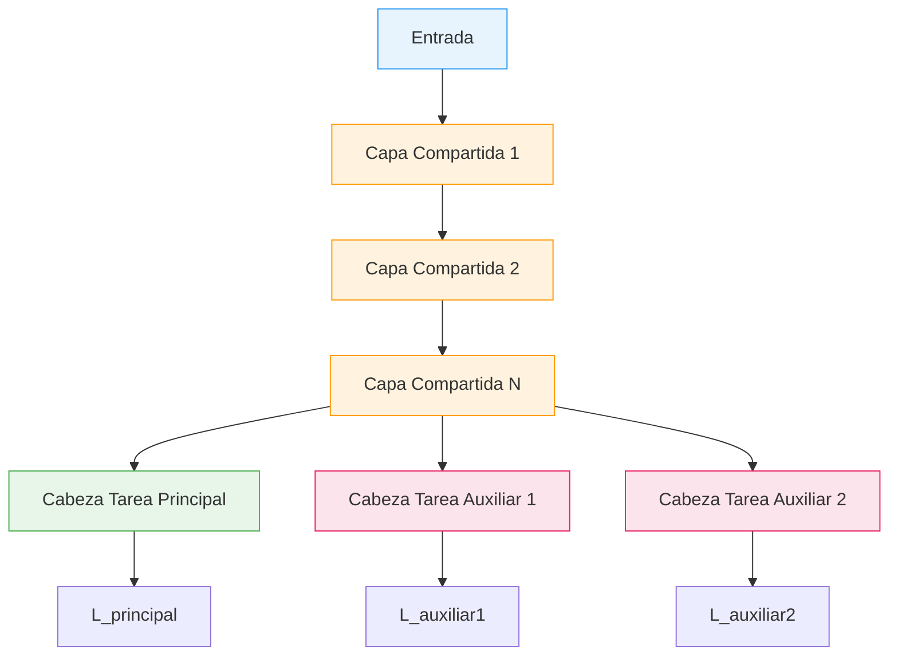

El aprendizaje multitarea (Multi-Task Learning, MTL) entrena un unico modelo en varias tareas relacionadas de forma simultanea. Al compartir representaciones internas entre tareas, el modelo aprende features mas robustos y generaliza mejor que si se entrenara en cada tarea por separado.

---

## 1. Motivacion

Un modelo entrenado en una sola tarea puede sobreajustarse a correlaciones espurias en los datos. Si la unica senal de supervision es "sonrie / no sonrie", la red podria aprender atajos que funcionan en entrenamiento pero no generalizan.

Las tareas auxiliares proporcionan **senales de supervision adicionales** que fuerzan a las capas compartidas a aprender representaciones mas ricas:

```text
Solo tarea principal (Smiling):
  La red tiene una sola senal binaria para aprender sobre caras.
  Puede encontrar atajos que no generalizan.

Con tarea auxiliar (Smiling + Young):
  Las capas compartidas deben ser utiles para AMBAS tareas.
  Esto fuerza features mas generales (bordes, texturas, formas faciales)
  que benefician la tarea principal.
```


Las tareas auxiliares no son un fin en si mismas. Su proposito es mejorar el rendimiento de la **tarea principal** al enriquecer las representaciones internas del modelo con senales de supervision complementarias.


---

## 2. Que es Multi-Task Learning

Multi-Task Learning es el paradigma de entrenar un modelo en **multiples tareas relacionadas simultaneamente**, de modo que las representaciones compartidas se beneficien de todas las senales de supervision.

La intuicion es simple: si dos tareas comparten estructura (por ejemplo, ambas necesitan entender rostros), las capas compartidas que reciben gradientes de ambas tareas aprenderan features mas completos que si solo recibieran gradientes de una.

| Aspecto | Single-Task | Multi-Task |
|---|---|---|
| Senales de supervision | 1 | Multiples |
| Representaciones | Especializadas | Generales |
| Riesgo de overfitting | Mayor | Menor |
| Datos requeridos | Mas para la misma calidad | Aprovecha datos de tareas relacionadas |

---

## 3. Arquitectura

La arquitectura tipica de MTL consiste en un **backbone compartido** que extrae features comunes, seguido de **cabezas especificas** para cada tarea.



Existen dos enfoques principales para compartir parametros:

### Hard Parameter Sharing

Las tareas comparten las mismas capas base. Es el enfoque mas comun y el que se usa en el laboratorio:

```text
             Capas compartidas (mismos pesos)
Entrada -> Conv1 -> Conv2 -> FC1 -> FC2 -----> Cabeza Principal
                                    |
                                    +--------> Cabeza Auxiliar
```

- Las capas compartidas reciben gradientes de **todas** las tareas
- Reduce el riesgo de overfitting (Baxter, 1997): mas tareas implican menor espacio de hipotesis efectivo
- Eficiente en parametros: un solo backbone para todas las tareas

### Soft Parameter Sharing

Cada tarea tiene su propia red, pero se agrega un termino de regularizacion que penaliza la divergencia entre los pesos de las distintas redes:

$$R_{soft} = \sum_{l} \| \theta_A^{(l)} - \theta_B^{(l)} \|_2^2$$

- Mayor flexibilidad: cada tarea puede tener representaciones ligeramente distintas
- Mas parametros y mayor costo computacional
- Util cuando las tareas estan relacionadas pero no comparten la misma estructura optima

---

## 4. CombinedLoss: como combinar las perdidas

Cada tarea genera su propia perdida. La perdida total es una combinacion ponderada:


L_{total} = \alpha \, L_{primary} + \beta \, L_{auxiliary}


Los pesos $\alpha$ y $\beta$ controlan la importancia relativa de cada tarea. En la practica, es comun fijar $\alpha = 1$ y tratar $\beta$ (o $\lambda$) como hiperparametro:

$$L_{total} = L_{principal} + \lambda \cdot L_{auxiliar}$$

### Estrategias de balanceo de pesos

| Estrategia | Descripcion |
|---|---|
| **Peso fijo** | Elegir $\lambda$ manualmente (comun: 0.1 a 0.5) |
| **Proporcional al inverso** | Si $L_{aux}$ es $K$ veces mayor que $L_{main}$, usar $\lambda = 1/K$ |
| **Uncertainty weighting** | Aprender los pesos automaticamente (Kendall et al., 2018) |

### Problema de escala entre losses

Un problema critico surge cuando las tareas tienen funciones de perdida con **ordenes de magnitud distintos**:

```text
main_loss (Cross-Entropy) ~= 0.5      (valores entre 0 y ~5)
aux_loss  (MSE landmarks) ~= 500.0    (coordenadas generan valores grandes)

Con lambda = 0.2:
  L_total = 0.5 + 0.2 * 500 = 100.5
  -> La tarea auxiliar DOMINA los gradientes
  -> La red ignora la tarea principal

Solucion: lambda = 0.001
  L_total = 0.5 + 0.001 * 500 = 1.0   <- balanceado
```


Cuando se combinan losses de distinto tipo (por ejemplo, Cross-Entropy para clasificacion y MSE para regresion), la diferencia de magnitud puede hacer que una tarea domine completamente el entrenamiento. La regla practica: si la loss auxiliar es $K$ veces mayor, usar $\lambda \approx 1/K$.


### Uncertainty Weighting (Kendall et al., 2018)

En lugar de elegir $\lambda$ manualmente, se pueden aprender los pesos automaticamente modelando la **incertidumbre homocedastica** de cada tarea:

$$L_{total} = \frac{1}{2\sigma_1^2} L_1 + \frac{1}{2\sigma_2^2} L_2 + \log \sigma_1 + \log \sigma_2$$

Los parametros $\sigma_1, \sigma_2$ se aprenden junto con el modelo. Tareas con mayor incertidumbre reciben menor peso automaticamente, y el termino $\log \sigma$ evita que los pesos colapsen a cero.

---

## 5. Clasificadores auxiliares: el caso GoogLeNet

Un caso clasico de tareas auxiliares es la arquitectura **GoogLeNet (Inception v1)**, que introduce clasificadores auxiliares en capas intermedias de la red durante el entrenamiento:

```text
Entrada -> ... -> Inception_4a -> Clasificador Auxiliar 1 -> L_aux1
                       |
                       v
               ... -> Inception_4e -> Clasificador Auxiliar 2 -> L_aux2
                            |
                            v
                    ... -> FC -> Clasificador Principal -> L_main
```

El objetivo original era combatir el **problema de gradientes que se desvanecen** en redes profundas: los clasificadores intermedios inyectan gradientes directamente en capas interiores, asegurando que estas tambien reciban senales de aprendizaje significativas.

La perdida total se combinaba como:

$$L_{total} = L_{main} + 0.3 \cdot L_{aux1} + 0.3 \cdot L_{aux2}$$

En la practica, estos clasificadores auxiliares se descartan durante la inferencia y solo se usan durante el entrenamiento como mecanismo de regularizacion.

---

## 6. Cuando ayudan las tareas auxiliares

Las tareas auxiliares son beneficiosas cuando:

- **Las tareas comparten estructura**: ambas necesitan representaciones similares (por ejemplo, ambas requieren entender geometria facial)
- **Datos limitados para la tarea principal**: la tarea auxiliar aporta supervision adicional que compensa la escasez de datos
- **La tarea auxiliar provee senal complementaria**: la informacion auxiliar enriquece las representaciones de formas que la tarea principal sola no puede
- **Se quiere mejorar la robustez**: multiples senales de supervision reducen la dependencia de correlaciones espurias

---

## 7. Cuando NO ayudan las tareas auxiliares

Las tareas auxiliares pueden ser contraproducentes (fenomeno conocido como **transferencia negativa**) cuando:

- **Las tareas no estan relacionadas**: predecir sonrisas y predecir el clima no comparten estructura util. Forzar representaciones compartidas perjudica ambas tareas
- **La tarea auxiliar domina el entrenamiento**: un $\lambda$ demasiado alto o una loss auxiliar de magnitud mucho mayor hace que el modelo optimice la tarea equivocada
- **Mal balanceo de pesos**: si $\lambda$ es muy alto la auxiliar domina; si es muy bajo no tiene efecto. Encontrar el balance correcto requiere experimentacion
- **La tarea auxiliar es trivial o demasiado dificil**: si la auxiliar es demasiado facil, no aporta gradientes informativos; si es demasiado dificil, aporta ruido

| Situacion | Consecuencia |
|---|---|
| Tareas no relacionadas | Transferencia negativa, ambas tareas empeoran |
| $\lambda$ muy alto | La tarea auxiliar domina los gradientes |
| $\lambda$ muy bajo | La tarea auxiliar no tiene efecto (desperdicio de computo) |
| Scale mismatch sin corregir | La tarea con loss mayor controla el entrenamiento |

---

## 8. Implementacion en PyTorch

### Modelo con backbone compartido y dos cabezas



```python
import torch
import torch.nn as nn
import torch.nn.functional as F

class MultiTaskModel(nn.Module):
    def __init__(self, num_classes_main=1, num_classes_aux=1):
        super().__init__()
        # Backbone compartido
        self.conv1 = nn.Conv2d(3, 16, 3, padding=1)
        self.conv2 = nn.Conv2d(16, 32, 3, padding=1)
        self.pool = nn.MaxPool2d(2, 2)
        self.fc_shared = nn.Linear(32 * 8 * 8, 128)

        # Cabeza principal
        self.head_main = nn.Linear(128, num_classes_main)

        # Cabeza auxiliar
        self.head_aux = nn.Linear(128, num_classes_aux)

    def forward(self, x):
        # Backbone compartido
        x = self.pool(F.relu(self.conv1(x)))
        x = self.pool(F.relu(self.conv2(x)))
        x = x.view(x.size(0), -1)
        x = F.relu(self.fc_shared(x))

        # Dos salidas separadas
        out_main = self.head_main(x)
        out_aux = self.head_aux(x)
        return out_main, out_aux


class CombinedLoss(nn.Module):
    """Combina la loss principal y auxiliar con un peso lambda."""
    def __init__(self, aux_weight=0.2, aux_type='classification'):
        super().__init__()
        self.aux_weight = aux_weight
        self.aux_type = aux_type

    def forward(self, main_pred, aux_pred, main_target, aux_target):
        # Loss principal: clasificacion binaria
        main_loss = F.binary_cross_entropy_with_logits(
            main_pred, main_target
        )

        # Loss auxiliar: depende del tipo de tarea
        if self.aux_type == 'classification':
            aux_loss = F.binary_cross_entropy_with_logits(
                aux_pred, aux_target
            )
        elif self.aux_type == 'regression':
            aux_loss = F.mse_loss(aux_pred, aux_target)

        total = main_loss + self.aux_weight * aux_loss
        return total, main_loss, aux_loss


# Uso
model = MultiTaskModel(num_classes_main=1, num_classes_aux=10)
criterion = CombinedLoss(aux_weight=0.1, aux_type='regression')
optimizer = torch.optim.Adam(model.parameters(), lr=1e-3)

# Loop de entrenamiento
for images, main_labels, aux_labels in train_loader:
    main_pred, aux_pred = model(images)
    total_loss, main_loss, aux_loss = criterion(
        main_pred, aux_pred, main_labels, aux_labels
    )
    optimizer.zero_grad()
    total_loss.backward()
    optimizer.step()
```


```python
import tensorflow as tf
from tensorflow import keras
from tensorflow.keras import layers

def build_multitask_model(input_shape=(32, 32, 3),
                          num_classes_main=1,
                          num_classes_aux=1):
    inputs = keras.Input(shape=input_shape)

    # Backbone compartido
    x = layers.Conv2D(16, 3, padding='same', activation='relu')(inputs)
    x = layers.MaxPooling2D(2)(x)
    x = layers.Conv2D(32, 3, padding='same', activation='relu')(x)
    x = layers.MaxPooling2D(2)(x)
    x = layers.Flatten()(x)
    x = layers.Dense(128, activation='relu')(x)

    # Cabeza principal
    out_main = layers.Dense(num_classes_main, name='main')(x)

    # Cabeza auxiliar
    out_aux = layers.Dense(num_classes_aux, name='aux')(x)

    model = keras.Model(inputs, [out_main, out_aux])
    return model


model = build_multitask_model(num_classes_aux=10)
model.compile(
    optimizer='adam',
    loss={
        'main': keras.losses.BinaryCrossentropy(from_logits=True),
        'aux': keras.losses.MeanSquaredError(),
    },
    loss_weights={'main': 1.0, 'aux': 0.1},
)

# model.fit(x_train, {'main': y_main, 'aux': y_aux}, epochs=10)
```


```python
import jax
import jax.numpy as jnp
from flax import linen as nn
from flax.training import train_state
import optax

class MultiTaskModel(nn.Module):
    num_classes_main: int = 1
    num_classes_aux: int = 1

    @nn.compact
    def __call__(self, x, training=True):
        # Backbone compartido
        x = nn.Conv(16, (3, 3), padding='SAME')(x)
        x = nn.relu(x)
        x = nn.max_pool(x, (2, 2), strides=(2, 2))
        x = nn.Conv(32, (3, 3), padding='SAME')(x)
        x = nn.relu(x)
        x = nn.max_pool(x, (2, 2), strides=(2, 2))
        x = x.reshape((x.shape[0], -1))
        x = nn.Dense(128)(x)
        x = nn.relu(x)

        # Cabeza principal
        out_main = nn.Dense(self.num_classes_main)(x)

        # Cabeza auxiliar
        out_aux = nn.Dense(self.num_classes_aux)(x)

        return out_main, out_aux


def combined_loss(main_pred, aux_pred, main_target, aux_target,
                  aux_weight=0.1):
    # Loss principal: binary cross-entropy con logits
    main_loss = optax.sigmoid_binary_cross_entropy(
        main_pred, main_target
    ).mean()

    # Loss auxiliar: MSE
    aux_loss = jnp.mean((aux_pred - aux_target) ** 2)

    total = main_loss + aux_weight * aux_loss
    return total, (main_loss, aux_loss)
```



---

## 9. Conexion con regularizacion

El aprendizaje multitarea actua como una forma de **regularizacion implicita**. Al forzar a las capas compartidas a ser utiles para multiples tareas, se previene la especializacion excesiva en patrones de una sola tarea.

| Tecnica | Mecanismo | Como previene overfitting |
|---|---|---|
| **L2 / Weight Decay** | Penaliza magnitud de pesos | Pesos pequenos, funciones suaves |
| **Dropout** | Desactiva neuronas aleatoriamente | Previene co-adaptacion |
| **Multi-Task Learning** | Multiples senales de supervision | Representaciones generales, no especializadas |

La diferencia fundamental es que L2 y Dropout restringen los **pesos** directamente, mientras que MTL restringe las **representaciones**: las features aprendidas deben ser utiles para todas las tareas, no solo para una. Esto produce un efecto regularizador sin necesidad de penalizaciones explicitas sobre los parametros.


Multi-Task Learning se puede ver como una forma de **regularizacion funcional**: en lugar de restringir el espacio de pesos (como L2) o la estructura de la red (como Dropout), restringe el espacio de representaciones al exigir que sean utiles para multiples objetivos simultaneamente.


---

## Para Profundizar

- [Laboratorio 08: Tareas Auxiliares](/laboratorios/lab-08/tareas-auxiliares/) -- implementacion practica con CelebA, comparando entrenamientos con y sin tareas auxiliares
- [Fundamentos: Regularizacion](/fundamentos/regularizacion/) -- otras tecnicas de regularizacion (L2, Dropout, Early Stopping) y como se complementan con MTL
