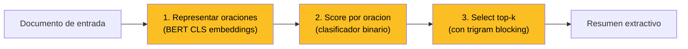
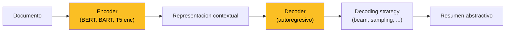

**Text Summarization** es la tarea de NLP que toma un texto de entrada y produce un texto de salida más corto preservando la información esencial. Aparece embebida en sistemas que usamos a diario sin darnos cuenta: el **trailer** de una película condensa dos horas en dos minutos, el **headline** de una noticia resume un artículo de mil palabras, el **abstract** de un paper sintetiza diez páginas, las **notas al margen** de un libro destilan capítulos completos. En todos los casos hay una operación cognitiva común — leer mucho, escribir poco, no perder lo importante.

La motivación operativa es directa: el volumen de texto disponible crece más rápido que la capacidad humana de leerlo. Resumir es la única forma escalable de **navegar información**. Por eso summarization es uno de los pilares aplicados del NLP moderno, junto con traducción, búsqueda y question answering. Esta página consolida los conceptos transversales del área — definición formal, taxonomía, enfoques extractivo y abstractivo, datasets canónicos, métricas, pipelines, prompt-based summarization en la era LLM, aplicaciones por dominio, retos abiertos y evolución histórica — y sirve como fundamento transversal de la **Clase 22** del curso IA UC.

---

## 1. Definición formal

Dado un texto de entrada $x$ — que puede ser una sola noticia, varios documentos, una conversación, o un libro entero — el sistema produce un texto $y$ tal que:

$$|y| < |x|, \qquad y \text{ preserva la información importante de } x.$$

La longitud $|y|$ se mide típicamente en tokens, palabras u oraciones. La **tasa de compresión** $\rho = |y|/|x|$ varía dramáticamente según el flavour: un headline puede comprimir 100:1, un abstract científico ~20:1, un resumen ejecutivo de reunión ~10:1.

La operación "preservar información importante" es donde reside toda la dificultad. Un sistema de summarization debe cumplir tres habilidades simultáneas:

- **Identificar las ideas centrales** del documento. ¿Qué es lo que importa? ¿La conclusión del paper o la metodología? ¿Lo que dijo el CEO o lo que respondió el analista?
- **Descartar lo irrelevante**. Detalles, redundancias, ejemplos secundarios, contexto que el lector ya tiene.
- **Integrar significativamente** las ideas que sobreviven. No basta con yuxtaponer fragmentos: el resumen debe ser coherente, fluido, y leíble por sí mismo.


Summarization no es compresión sintáctica: es **selección + síntesis semántica**. Por eso es tan difícil de evaluar — el espacio de resúmenes "correctos" para un mismo documento es enorme, y dos resúmenes humanos del mismo texto rara vez son idénticos.


---

## 2. Taxonomía: flavours de summarization

El campo se descompone en varios ejes ortogonales. Un sistema de producción típicamente fija una combinación específica de estos flavours.

### 2.1 Single-document vs Multi-document

- **Single-document**: un solo texto de entrada. Caso más estudiado, dominante en benchmarks académicos. Ejemplo: resumir una noticia, un paper, una clínica electrónica.
- **Multi-document**: varios textos relacionados. Caso típico de **news aggregators** ("aquí están las 12 noticias sobre el mismo evento, dame un resumen unificado"). Introduce dificultades adicionales: detectar redundancia entre fuentes, resolver conflictos, decidir qué fuente prevalece.

### 2.2 Generic vs Query-focused

- **Generic**: el sistema decide qué es importante sin instrucción específica.
- **Query-focused**: el resumen responde a una consulta del usuario. "Resume este paper desde la perspectiva del método experimental". Es la modalidad que potencia herramientas como NotebookLM o Perplexity.

### 2.3 Headline vs Multi-sentence vs Long-form

Por la longitud objetivo:

- **Headline summarization**: una sola oración corta, típicamente menos de 15 palabras. Gigaword es el benchmark canónico.
- **Multi-sentence summarization**: 2 a 6 oraciones. CNN/DailyMail y XSum son los benchmarks dominantes.
- **Long-form summarization**: párrafos extensos, típicamente para documentos muy largos (libros, papers científicos, transcripciones). ArXiv, PubMed y BookSum cubren este nicho.

### 2.4 English vs Chinese vs Multilingual

El idioma del par (input, summary) condiciona toda la pipeline:

- **English**: el campo más maduro, con datasets masivos y modelos pre-entrenados.
- **Chinese**: LCSTS, NLPCC. Tokenización a nivel carácter o subword, vocabulario denso.
- **Multilingual**: mBART, mT5 y modelos foundation soportan summarization en decenas de idiomas. **Cross-lingual summarization** (entrada en un idioma, resumen en otro) es un nicho activo de investigación.

---

## 3. Approaches: extractive, abstractive, hybrid

La división conceptual más profunda del campo.

### 3.1 Extractive summarization

**Idea**: el resumen está compuesto exclusivamente por oraciones (o fragmentos) **copiadas literalmente del documento original**. El sistema selecciona; no genera.

**Ventajas**:

- **Garantía de fidelidad léxica**: lo que aparece en el resumen está garantizado que estaba en el documento. No hay alucinaciones.
- **Más fácil de modelar**: es un problema de clasificación binaria (¿esta oración entra al resumen, sí o no?) o de ranking.
- **Menos data requerida**: no necesitás aprender a generar lenguaje, solo a puntuar.

**Desventajas**:

- **Inflexible**: no puede parafrasear, no puede combinar dos oraciones en una, no puede simplificar.
- **Coherencia pobre**: si seleccionás oraciones sueltas dispersas, el flujo del resumen sufre — anáforas rotas, referencias colgando, transiciones abruptas.
- **Cota superior baja**: si las oraciones del documento son largas y barrocas, el resumen lo será también.

**Sistemas representativos**:

- **LEAD-3 baseline**: tomar las primeras 3 oraciones del documento. Trivial pero sorprendentemente fuerte en noticias (donde los periodistas ya escriben con la pirámide invertida).
- **TextRank** (Mihalcea & Tarau 2004): grafo de oraciones, PageRank sobre similitud coseno.
- **LexRank** (Erkan & Radev 2004): variante con normalización TF-IDF.
- **BERTSum** ([Liu 2019](#liu-2019)): BERT fine-tuned, clasificación binaria sobre embeddings CLS.
- **MatchSum** (Zhong 2020): formula extractive como matching documento-resumen.

### 3.2 Abstractive summarization

**Idea**: el sistema **genera texto nuevo**, palabra a palabra, que puede no aparecer literalmente en el documento. Parafrasea, simplifica, combina, generaliza.

**Ventajas**:

- **Más humano**: los resúmenes humanos son casi siempre abstractivos. Reformulamos lo que leemos.
- **Más flexible**: puede comprimir más, evitar redundancia, mejorar la fluidez.
- **Mejor coherencia**: el modelo controla todo el flujo del texto generado.

**Desventajas**:

- **Hallucinations**: el modelo puede inventar hechos que no están en el documento. Es el problema central del campo desde 2020.
- **Más difícil de modelar**: necesita generar lenguaje natural fluido y fiel simultáneamente.
- **Más data requerida**: pares (artículo, summary) en cantidades masivas.

**Sistemas representativos**:

- **Pointer-Generator** ([See, Liu & Manning 2017](/papers/pointer-generator-see-2017)): primer modelo deep abstractive de impacto. Mezcla generación con copy mechanism para mitigar OOV y alucinaciones.
- **T5** (Raffel 2020): encoder-decoder pre-entrenado en text-to-text, summarization como tarea downstream natural.
- **BART** (Lewis 2020): denoising autoencoder pre-entrenado, dominante en summarization 2020-2022.
- **PEGASUS** (Zhang 2020): pre-entrenamiento con **Gap Sentences Generation** específicamente diseñado para summarization.
- **GPT-3.5 / GPT-4 / Claude**: zero-shot o few-shot vía prompt, sin fine-tuning específico.

### 3.3 Hybrid: extract-then-rewrite

Combinación creciente desde 2018: primero un extractor selecciona los fragmentos más relevantes (reduce el problema de input largo), luego un abstractor parafrasea. Útil para documentos muy largos donde el contexto de un Transformer no alcanza.

Sistemas: Chen & Bansal (2018), BottomUp Summarization, REGS.

### 3.4 Tabla comparativa

| Eje | Extractive | Abstractive | Hybrid |
| --- | --- | --- | --- |
| **Fidelidad léxica** | Garantizada | No garantizada (hallucinations) | Parcial |
| **Fluidez** | Pobre (oraciones sueltas) | Alta (texto generado) | Media a alta |
| **Flexibilidad** | Baja (solo selecciona) | Alta (parafrasea, simplifica) | Media |
| **Dificultad** | Baja a media | Alta | Media a alta |
| **Data requerida** | Pares con etiqueta oración | Pares (artículo, summary) masivos | Ambas |
| **Latencia inferencia** | Baja | Alta (autoregresivo) | Media |
| **Hallucinations** | Imposibles por construcción | Riesgo central | Reducidas |
| **Cota superior accuracy** | Limitada por las oraciones del input | Mucho más alta | Alta |

---

## 4. Datasets canónicos

El campo vive de la disponibilidad de pares (texto, summary) anotados.

| Dataset | Tamaño | Dominio | Característica |
| --- | --- | --- | --- |
| **CNN/DailyMail** (Hermann 2015) | 312K | Noticias | Multi-sentence summaries (~3-4 frases) por bullet points editoriales. Benchmark más usado. |
| **Gigaword** (Graff 2003 / Rush 2015) | 4M | Headlines | Pares (lead paragraph, headline). Headline generation. |
| **XSum** (Narayan 2018) | 225K | BBC | **Extreme summarization**: una sola oración muy abstractiva. |
| **LCSTS** (Hu 2015) | 2M | Microblog chino | Sina Weibo, headline generation en chino. |
| **WikiHow** (Koupaee 2018) | 200K | Procedural | Artículos how-to con summary inicial. |
| **Newsroom** (Grusky 2018) | 1.3M | Noticias | 38 medios, diversidad de estilos extractivo/abstractivo. |
| **Multi-News** (Fabbri 2019) | 56K | Multi-doc news | Múltiples artículos sobre el mismo evento. |
| **Reddit-TIFU** (Kim 2019) | 120K | Social media | Posts de r/TIFU con TL;DR self-summary. |
| **BillSum** (Kornilova 2019) | 22K | Legal | Textos de proyectos de ley del Congreso US. |
| **BIGPATENT** (Sharma 2019) | 1.3M | Patentes | Documentos largos, summaries técnicos. |
| **ArXiv** (Cohan 2018) | 215K | Científico | Papers con abstract como target. Long-form. |
| **PubMed** (Cohan 2018) | 133K | Médico | Papers biomédicos. Long-form. |
| **AESLC** (Zhang & Tetreault 2019) | 18K | Emails | Annotated Enron Subject Line Corpus. |
| **SAMSum** (Gliwa 2019) | 16K | Diálogo | Chats anotados con summaries. Conversational. |
| **BookSum** (Kryściński 2021) | varios | Libros | Capítulos y libros completos. Stress test long-form. |

CNN/DailyMail y XSum son los **dos benchmarks dominantes** de la literatura post-2017. XSum es notablemente más abstractivo (los summaries no se pueden reconstruir copiando del input), lo que penaliza más a sistemas extractivos.

---

## 5. Construcción de datasets

Anotar pares (documento, summary) a mano es caro: requiere lectores con tiempo, expertise de dominio, y validación. Por eso casi todos los datasets grandes se construyen vía **web scraping y heurísticas** que aprovechan estructuras editoriales existentes.

**Estrategias canónicas**:

- **News + headlines**: el headline es el "summary" del artículo. Funciona para datasets como Gigaword, Newsroom, XSum.
- **News + bullet highlights**: CNN y DailyMail publican bullet points editoriales arriba de cada artículo. Se interpretan como summary multi-sentence.
- **Abstracts + papers**: el abstract es el resumen del paper. ArXiv, PubMed, SciSummNet.
- **Wikipedia first section**: la introducción de un artículo Wikipedia funciona como resumen del cuerpo. Datasets WikiSum, BIGPATENT.
- **TV digests, previews**: trailers, recaps de episodios. Menos explotado pero promisorio.
- **User-generated TL;DR**: Reddit-TIFU, donde los usuarios ya escriben su propio resumen.
- **Academic abstracts en publishing platforms**: bioRxiv, SSRN.

**Heurística general**: cuanto más **cerca del dominio target** sea la fuente, mejor. Entrenar un modelo legal con noticias generales degrada accuracy 20-30%. Por eso BillSum, BIGPATENT y PubMed coexisten como datasets verticales.

**Calidad del dataset = calidad del modelo**. Los datasets construidos por scraping arrastran problemas: summaries truncos, encabezados publicitarios filtrados, errores OCR. Limpieza cuidadosa es parte indisociable del trabajo.

---

## 6. Métricas de evaluación

Evaluar summaries es notoriamente difícil porque el espacio de resúmenes "correctos" es enorme. Las métricas dominantes son **proxies imperfectos** que mezclamos en la práctica.

### 6.1 ROUGE: lexical overlap

**ROUGE** (Recall-Oriented Understudy for Gisting Evaluation; Lin 2004) es la familia dominante desde 2004. Compara n-gramas del summary generado contra uno (o varios) summaries de referencia.

- **ROUGE-1**: overlap de unigrams (palabras sueltas).
- **ROUGE-2**: overlap de bigrams. Captura algo de orden local.
- **ROUGE-L**: longest common subsequence — flexible al orden, captura coherencia.

Para ROUGE-1 recall:

$$\text{ROUGE-1}_{\text{recall}} = \frac{\sum_{w \in S_{\text{ref}}} \min(\text{count}_{\text{gen}}(w), \text{count}_{\text{ref}}(w))}{\sum_{w \in S_{\text{ref}}} \text{count}_{\text{ref}}(w)}$$

donde $S_{\text{ref}}$ es el summary de referencia. Se reporta también precision y F1.

**Limitaciones**:

- Penaliza paráfrasis válidas. "El paciente murió" vs "El paciente falleció" → ROUGE bajo aunque semánticamente idénticos.
- Premiá overlap léxico aunque la idea esté mal. Un summary que copia palabras del input pero las combina mal puede ganar ROUGE alto.
- No detecta hallucinations: un summary con un hecho inventado puede tener ROUGE alto si las palabras coinciden.

A pesar de las limitaciones, ROUGE sigue siendo el estándar de facto. Ver el fundamento dedicado [ROUGE metric](/fundamentos/rouge-metric) para el detalle.

### 6.2 BERTScore: semantic match

**BERTScore** (Zhang 2020) computa similitud coseno entre embeddings BERT de tokens del summary generado y de referencia. Más robusto a paráfrasis que ROUGE porque trabaja en espacio semántico.

$$\text{BERTScore}_{\text{recall}} = \frac{1}{|x|} \sum_{x_i \in x} \max_{\hat{x}_j \in \hat{x}} x_i^\top \hat{x}_j$$

donde $x_i$ son embeddings de tokens del summary referencia y $\hat{x}_j$ del generado.

### 6.3 BLEURT: learned metric

**BLEURT** (Sellam 2020) entrena un modelo BERT específicamente para predecir juicios humanos sobre calidad de generación. Captura aspectos que ROUGE y BERTScore pierden (gramaticalidad, coherencia). Costoso de evaluar pero más fiel.

### 6.4 Human evaluation: gold standard

Pedirle a anotadores humanos que puntúen summaries en ejes como **fluency**, **coverage**, **faithfulness**, **conciseness**. Es el estándar último pero es caro: ~3-5 dólares por anotación, con baja agreement inter-anotador para tareas difíciles.

### 6.5 Faithfulness: el reto post-2020

Con el auge de modelos abstractivos surgió la necesidad de detectar **alucinaciones** — hechos en el summary que no están en el documento.

- **FactCC** (Kryściński 2020): clasificador BERT entrenado para detectar inconsistencias factuales.
- **QAGS** (Wang 2020): genera preguntas a partir del summary, las responde usando el documento, compara respuestas. Si la respuesta cambia, hay hallucination.
- **SummaC** (Laban 2022): NLI a nivel oración.

Estas métricas son ortogonales a ROUGE/BERTScore: un summary puede tener ROUGE alto y faithfulness bajo. En producción se reportan ambas.


**Ninguna métrica única es suficiente** para summarization. La práctica estándar reporta ROUGE-1/2/L + BERTScore + un check de faithfulness, y para validaciones críticas, human evaluation en muestra.


---

## 7. Pipeline canónico extractivo

El pipeline clásico extractivo se descompone en tres pasos.

### 7.1 Representar oraciones

Cada oración del documento se codifica como un vector. En la era pre-BERT se usaban features hechos a mano (posición en el documento, longitud, TF-IDF, presencia de keywords). Desde 2019 lo dominante es **embedding contextual** vía BERT: la oración se pasa por el encoder y se toma el vector CLS o el promedio de tokens.

Variante BERTSum: se insertan tokens [CLS] al inicio de cada oración del documento (no del input completo) y se entrena el encoder con segment embeddings alternados para que cada CLS represente su oración en contexto del documento.

### 7.2 Scoring

Sobre cada embedding se aplica un **clasificador binario** ($\sigma(\mathbf{w}^\top \mathbf{h}_i + b)$) entrenado para predecir si la oración $i$ pertenece al summary. El ground-truth se construye con un **oracle**: para cada documento, se buscan greedy las oraciones del input que maximizan ROUGE contra el summary de referencia y se etiquetan como positivas.

### 7.3 Selección top-k con trigram blocking

Tras scoring, se eligen las $k$ oraciones con score más alto (típicamente $k=3$ para CNN/DailyMail). El **trigram blocking** es una heurística simple pero efectiva: si una oración candidata comparte un trigrama con cualquier oración ya seleccionada, se descarta. Reduce redundancia drásticamente.

---

## 8. Pipeline canónico abstractivo

El paradigma encoder-decoder es la espina dorsal del summarization abstractivo moderno.

### 8.1 Encoder

Codifica el documento completo en una representación contextual. Tres opciones dominantes:

- **BERT encoder** (pre-entrenado con MLM): Liu 2019 lo usa para BERTSum y BERTSumAbs.
- **T5 encoder** (pre-entrenado text-to-text con span corruption): Raffel 2020.
- **BART encoder** (pre-entrenado como denoising autoencoder con varios tipos de corrupción): Lewis 2020.

El cuello de botella es el **límite de context** del Transformer: BERT-base tope 512 tokens, BART y T5 hasta 1024-2048. Para documentos más largos hace falta truncar, segmentar (chunk-wise summarization) o usar variantes de atención eficiente (Longformer, BigBird, LED).

### 8.2 Decoder

Genera el summary token a token, de izquierda a derecha, atendiendo a la representación del encoder vía **cross-attention**. Es la pieza que distingue summarization de classification: no produce una etiqueta sino una secuencia.

Durante entrenamiento se usa **teacher forcing** (al decoder se le da el token correcto del summary en cada paso). Durante inferencia, el decoder consume su propia salida — propenso a **exposure bias** y a errores acumulados.

### 8.3 Decoding strategy

La elección de cómo decodificar el siguiente token afecta dramáticamente la calidad del summary. Estrategias dominantes:

- **Greedy**: argmax en cada paso. Rápido pero subóptimo.
- **Beam search**: mantiene los top-k candidatos. Estándar en summarization (k=4 típico).
- **Sampling con temperature**: introduce diversidad.
- **Top-k / top-p (nucleus) sampling**: trunca la distribución antes de samplear.

Ver el fundamento [decoding strategies](/fundamentos/decoding-strategies) para el detalle. Para summarization, beam search con length penalty es el estándar histórico; sampling diversa gana terreno con LLMs grandes.

### 8.4 Fine-tuning sobre datos paired

El modelo se entrena (o fine-tunea desde checkpoint pre-entrenado) sobre pares (artículo, summary) con loss de cross-entropy token a token:

$$\mathcal{L} = -\sum_{t=1}^{|y|} \log p(y_t \mid y_{<t}, x)$$

Sobre CNN/DailyMail o XSum, fine-tuning de BART o T5 típicamente toma 24-72 horas en una GPU A100 para alcanzar SOTA.

### 8.5 Modelos representativos

- **T5** (Raffel 2020): "Text-To-Text Transfer Transformer". Encoder-decoder pre-entrenado con span corruption sobre C4. Summarization es una tarea downstream natural usando el prefijo `summarize:`.
- **BART** (Lewis 2020): denoising autoencoder pre-entrenado con varios tipos de noise (token masking, sentence permutation, document rotation). Dominó CNN/DailyMail y XSum 2020-2021.
- **PEGASUS** (Zhang 2020): pre-entrenamiento **Gap Sentences Generation** — oraciones enteras del documento se enmascaran y el modelo aprende a reconstruirlas. Diseñado específicamente para summarization.
- **GPT-3.5-turbo via prompt**: zero-shot o few-shot. Sin fine-tuning. Competitivo con BART en muchos benchmarks, dominante en flexibilidad.

---

## 9. Prompt-based summarization en la era LLM

Desde ChatGPT (2022) el paradigma dominante en producción cambió: en lugar de fine-tunear un modelo específico para summarization, se usa un LLM instruction-tuned vía prompt. Esto se conecta con [in-context learning](/fundamentos/in-context-learning) y la familia [GPT](/fundamentos/gpt-family).

### 9.1 Prompts canónicos

- `"Please provide a concise summary of the following text:"`
- `"Write a summary of the article below in three sentences."`
- `"Summarize the key findings of this paper for a non-technical audience."`
- `"TL;DR:"` (estilo Reddit, muy compacto).

### 9.2 Bullet point y structured outputs

LLMs son particularmente buenos generando outputs estructurados:

- `"Summarize this earnings call as a bulleted list of key takeaways for an investor."`
- `"Extract from this medical note the: (1) chief complaint, (2) diagnosis, (3) treatment plan."`

Esto desplazó a sistemas extractivos clásicos en aplicaciones de business intelligence y dashboards.

### 9.3 Audience-aware summarization

`"Summarize this paper as if explaining it to a 5 year old"` o `"Summarize for a domain expert"` ajusta tono y nivel de detalle. Era impensable pre-LLM.

### 9.4 Trade-offs

| Eje | Fine-tuned BART/T5 | LLM prompt-based |
| --- | --- | --- |
| **Quality SOTA en benchmark** | Mejor en ROUGE de CNN/DailyMail | Peor en ROUGE, mejor en human eval |
| **Latencia** | 200-500 ms en GPU | 2-10 s vía API |
| **Costo por resumen** | Costo amortizado, marginal cero | $0.001 - $0.05 por llamada |
| **Flexibilidad** | Una tarea fija | Cualquier flavour vía prompt |
| **Faithfulness** | Hallucinations moderadas | Hallucinations en sweet spot pero más variadas |
| **Operación** | Hosting propio | Dependencia de proveedor |

En 2026 la decisión real depende del volumen, criticidad y presupuesto. Para pipelines de millones de resúmenes/día con dominio fijo (financiero, legal), fine-tuning específico sigue ganando. Para herramientas de usuario con baja cardinalidad por día, LLM vía API es lo dominante.

---

## 10. Aplicaciones por dominio

Summarization se especializa fuertemente según vertical.

- **Legal**: contratos (cláusulas críticas, obligaciones, fechas), procedimientos judiciales (escritos, sentencias), regulaciones (cambios respecto a versión previa). Sistemas como Harvey, Casetext.
- **Medical**: notas clínicas (motivo de consulta, diagnóstico, plan), revistas médicas (estado del arte de una condición), genética (interpretación de variantes). Aplicaciones FHIR-related: resumen de [DocumentReference](https://www.hl7.org/fhir/documentreference.html) bundles, condensación de [Encounter](https://www.hl7.org/fhir/encounter.html) histórico. Crítico que los hechos no se inventen.
- **Financial**: market reports, earnings calls (transcripciones largas → bullets de takeaways), 10-K filings (extracción de riesgos). Empresas: Bloomberg Terminal usa summarization extensivamente.
- **Business**: meeting minutes (Zoom, Otter.ai integran summarization), executive briefs (resumen de docenas de informes para un C-level), customer feedback aggregation.
- **Consumer**:
  - **Video summaries**: YouTube genera capítulos y resúmenes automáticos.
  - **Document Q&A**: NotebookLM permite hacer preguntas sobre un set de documentos, devolviendo respuestas con citaciones.
  - **News aggregators**: Google News, Apple News, Inoreader resumen titulares cruzados.
  - **Mailbox triage**: Superhuman y otros clientes generan resúmenes de hilos largos.

Cada vertical tiene **vocabulario y convenciones propias** que motivan datasets dedicados (BillSum para legal, PubMed para médico, FinSum para financial).

---

## 11. Retos abiertos

A pesar del progreso, summarization sigue siendo un problema activo.

- **Hallucinations / faithfulness**: el reto número uno. Modelos abstractivos modernos producen entre 5% y 30% de summaries con al menos un hecho no soportado por el input, dependiendo del dominio. Mitigaciones: pre-entrenamiento con tareas factually-grounded (PEGASUS-X, FactPEGASUS), RLHF orientado a faithfulness, post-editing con verificadores.
- **Long-document summarization**: el límite de context del Transformer estándar (8K a 200K tokens) se queda corto para libros, papers largos, transcripciones de horas. Estrategias: chunking + recursive summarization, hierarchical attention, retrieval-augmented summarization, modelos con atención dispersa (Longformer, BigBird, LED, Mamba).
- **Multi-document fusion**: redundancia (la misma noticia contada por tres medios), conflictos entre fuentes (dos medios reportan números distintos), atribución (¿de qué fuente sale cada hecho del summary?). Multi-News y WCEP son los benchmarks.
- **Domain adaptation**: un modelo entrenado en news degrada 10-20% al evaluarlo en legal o médico. Domain-adaptive pre-training y instruction tuning específico ayudan, pero el costo es alto.
- **Multilingual + cross-lingual**: cross-lingual summarization (input en chino, summary en inglés) sigue siendo difícil. mBART, mT5 y modelos foundation son la frontera.
- **Evaluation gap**: ROUGE es proxy imperfecto, human evaluation es caro y no escala. Métricas aprendidas (BLEURT, BARTScore, GPTScore) mejoran pero no resuelven. Es un meta-problema: necesitamos mejores ways de medir lo que queremos medir.
- **Bias y fairness**: summarization puede amplificar sesgos del corpus de entrenamiento (qué se considera "importante"). Underexplored.

---

## 12. Evolución histórica

Tres olas claras desde 1958 hasta 2026.

| Año | Hito | Contribución |
| --- | --- | --- |
| 1958 | **Luhn** | Primer extractor automático. Score por frecuencia ponderada (TF) y posición. |
| 1969 | **Edmundson** | Suma score de Luhn + ubicación + cue words + título. |
| 2000s | **TextRank** (Mihalcea 2004), **LexRank** (Erkan 2004) | Graph-based extractive con PageRank. |
| 2010s | **MMR**, **Submodular** | Maximal Marginal Relevance, optimización submodular para diversidad. |
| 2015 | **Rush, Chopra, Weston** | Primer modelo neural attention-based (Gigaword). |
| 2017 | **Pointer-Generator** ([See, Liu & Manning](/papers/pointer-generator-see-2017)) | Copy mechanism + coverage. Primer deep abstractive de impacto. |
| 2018 | **XSum** (Narayan) | Extreme summarization benchmark — fuerza a los modelos a ser realmente abstractivos. |
| 2019 | **BERTSum** ([Liu](#liu-2019)) | BERT fine-tuned para extractive + abstractive. |
| 2020 | **T5** (Raffel), **BART** (Lewis), **PEGASUS** (Zhang) | Encoder-decoder pre-entrenados. Dominan benchmarks. |
| 2020 | **BERTScore**, **BLEURT** | Métricas learned, alternativas a ROUGE. |
| 2021 | **FactCC, QAGS, SummaC** | Métricas de faithfulness. |
| 2022 | **ChatGPT** | Summarization vía prompt instruction-tuned. Cambio de paradigma operativo. |
| 2023 | **GPT-4**, **Claude 2** | Long-context (32K-200K). Summarization de libros enteros. |
| 2024+ | **Claude 3, Gemini, GPT-4o** | Multimodal summarization (texto + imagen + video). |

Las tres olas: **clásico estadístico/grafos** (hasta 2014), **deep abstractive con encoder-decoder** (2015-2022), **LLM instruction-tuned via prompt** (2022+).

---

## 13. Conexiones con el curso

Summarization integra muchos conceptos del curso IA UC.

- **[Clase 14 (Transformers)](/clases/clase-14)**: el encoder-decoder backbone de BART, T5, PEGASUS es exactamente el Transformer estudiado allí. Ver [Transformer](/fundamentos/transformer).
- **[Clase 15 (Mecanismo de atención)](/clases/clase-15)**: la **cross-attention** del decoder (que atiende a la representación del encoder) es donde el modelo decide qué del documento mirar al generar cada token. Ver [mecanismo de atención](/fundamentos/mecanismo-atencion).
- **[Clase 16 (Intro NLP)](/clases/clase-16)**: BoW, TF-IDF y embeddings clásicos son los precursores históricos. LexRank y TextRank usan TF-IDF y similitud coseno directamente. Ver [Bag of Words](/fundamentos/bag-of-words).
- **[Clase 20 (BERT/GPT/ChatGPT)](/clases/clase-20)**: los modelos pre-entrenados que potencian summarization moderno. BERT y BART son la base de extractive y abstractive respectivamente; GPT-3.5/4 son el paradigma prompt-based. Ver [BERT](/fundamentos/bert), [GPT family](/fundamentos/gpt-family), [embeddings contextualizados](/fundamentos/embeddings-contextualizados).
- **Clase 22 (Summarization)**: la clase principal de este fundamento.
- **Lab-22**: implementación práctica — fine-tuning T5/BART sobre CNN/DailyMail + prompt engineering con LLMs.

### Fundamentos relacionados

- **[Transformer](/fundamentos/transformer)**: backbone arquitectural.
- **[Mecanismo de atención](/fundamentos/mecanismo-atencion)**: cross-attention en decoder.
- **[Seq2seq](/fundamentos/seq2seq)**: el paradigma encoder-decoder histórico.
- **[BERT](/fundamentos/bert)**: encoder pre-entrenado base de BERTSum.
- **[GPT family](/fundamentos/gpt-family)**: decoders autoregresivos.
- **[In-context learning](/fundamentos/in-context-learning)**: paradigma prompt-based.
- **[Embeddings contextualizados](/fundamentos/embeddings-contextualizados)**: representación de oraciones para extractive.
- **[Bag of Words](/fundamentos/bag-of-words)**: representación clásica usada en TextRank/LexRank.
- **ROUGE metric** (`/fundamentos/rouge-metric`): métrica canónica.
- **Decoding strategies** (`/fundamentos/decoding-strategies`): beam search, sampling, etc.

### Papers relevantes

- [Pointer-Generator (See, Liu & Manning 2017)](/papers/pointer-generator-see-2017) — primer abstractive deep de impacto.
- **BART** (Lewis 2020), **T5** (Raffel 2020), **PEGASUS** (Zhang 2020) — los tres pilares encoder-decoder pre-entrenados. 
- **BERTSum** (Liu 2019) — BERT fine-tuned para summarization extractive y abstractive.
- **XSum** (Narayan 2018) — benchmark extreme.
- **CNN/DailyMail** (Hermann 2015) — benchmark dominante.

---

## 14. Resumen

1. **Definición**: summarization toma $x$ y produce $y$ con $|y| < |x|$, preservando información importante. Tres habilidades: identificar lo central, descartar lo irrelevante, integrar coherentemente.
2. **Taxonomía**: single vs multi-document, generic vs query-focused, headline vs multi-sentence vs long-form, monolingual vs multilingual.
3. **Approaches**: **extractive** (selecciona oraciones, fiel pero rígido), **abstractive** (genera texto nuevo, flexible pero con riesgo de hallucinations), **hybrid** (extract-then-rewrite).
4. **Datasets**: CNN/DailyMail y XSum son los benchmarks dominantes. Gigaword (headlines), LCSTS (chino), SAMSum (diálogo), ArXiv/PubMed (long-form científico) cubren los flavours principales.
5. **Construcción de datasets**: scraping web aprovechando estructuras editoriales (headlines, abstracts, bullets, first sections). Cuanto más cerca del dominio, mejor.
6. **Métricas**: ROUGE-1/2/L (lexical), BERTScore (semántico), BLEURT (learned), human eval (gold), FactCC/QAGS/SummaC (faithfulness). Ninguna métrica única es suficiente.
7. **Pipeline extractive**: representar oraciones (BERT CLS) → score binario → top-k con trigram blocking.
8. **Pipeline abstractive**: encoder-decoder Transformer pre-entrenado (BART, T5, PEGASUS), fine-tuneado sobre pares (artículo, summary), con beam search en decoding.
9. **Prompt-based en era LLM**: instruction-tuned models (GPT-3.5/4, Claude) hacen summarization vía prompt, soportando bullet points, audience-aware, structured outputs. Trade-off costo vs flexibilidad vs SOTA.
10. **Aplicaciones**: legal, medical, financial, business, consumer (video, document Q&A, news aggregators).
11. **Retos abiertos**: hallucinations, long-document, multi-document fusion, domain adaptation, multilingual, evaluation gap.
12. **Evolución**: Luhn (1958) → graph-based (2000s) → Pointer-Generator (2017) → BERTSum/BART/T5/PEGASUS (2019-2020) → ChatGPT y LLMs prompt-based (2022+).

---

## Referencias clave

- [Pointer-Generator (See, Liu & Manning 2017)](/papers/pointer-generator-see-2017) — copy mechanism + coverage para abstractive.
- **BERTSum** (Liu 2019) — BERT fine-tuned para summarization.
- **BART** (Lewis 2020) — denoising autoencoder encoder-decoder.
- **T5** (Raffel 2020) — Text-To-Text Transfer Transformer.
- **PEGASUS** (Zhang 2020) — Gap Sentences Generation pre-training para summarization.
- **XSum** (Narayan 2018), **CNN/DailyMail** (Hermann 2015), **Gigaword** (Rush 2015) — datasets canónicos.
- **ROUGE** (Lin 2004), **BERTScore** (Zhang 2020), **BLEURT** (Sellam 2020), **FactCC** (Kryściński 2020) — métricas dominantes.

Para el recorrido teórico ver **Clase 22** y su práctica asociada. Para código aplicado, ver **Laboratorio 22** (fine-tuning T5/BART + prompt engineering con LLMs).
