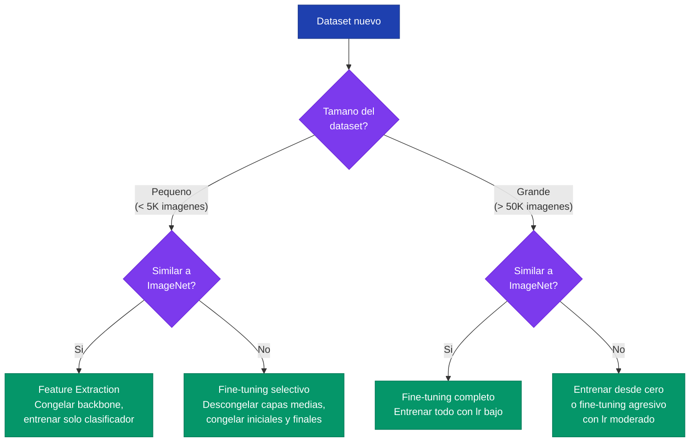

Transfer learning es la tecnica de reutilizar un modelo entrenado en un dataset grande (como ImageNet) para resolver un problema diferente, generalmente con muchos menos datos. Es una de las estrategias mas efectivas en deep learning aplicado.

---

## 1. El Problema: Entrenar desde Cero

Entrenar una red profunda desde cero requiere:

- **Datos masivos** -- ImageNet tiene 1.2 millones de imagenes; la mayoria de problemas reales tienen cientos o miles
- **Computo intensivo** -- entrenar ResNet-50 en ImageNet toma dias en multiples GPUs
- **Riesgo de overfitting** -- con pocos datos, la red memoriza en vez de generalizar

En la practica, muy pocos equipos tienen los recursos para entrenar desde cero. La alternativa es aprovechar el conocimiento ya aprendido por modelos preentrenados.


Con datasets pequenos (< 10,000 imagenes), entrenar desde cero casi siempre produce overfitting severo. Transfer learning permite alcanzar rendimientos competitivos incluso con cientos de imagenes, porque las capas convolucionales ya contienen representaciones utiles aprendidas de millones de imagenes.


---

## 2. Que es Transfer Learning

La idea central es simple: un modelo entrenado en ImageNet ya aprendio a detectar bordes, texturas, formas y patrones complejos. Estos features son **genericos** y utiles para casi cualquier tarea de vision.

Transfer learning consiste en:

1. Tomar un modelo preentrenado en un dataset grande (source domain)
2. Adaptarlo a un problema diferente (target domain) con menos datos
3. Aprovechar las representaciones ya aprendidas en vez de partir de pesos aleatorios

El resultado tipico: un modelo fine-tuned con 1,000 imagenes supera a uno entrenado desde cero con 10,000 imagenes.

---

## 3. Jerarquia de Features en CNNs

La razon por la que transfer learning funciona esta en como las CNNs organizan sus representaciones internas. Las capas forman una jerarquia de features, de lo generico a lo especifico:

| Profundidad | Que detecta | Ejemplo | Transferibilidad |
|---|---|---|---|
| Capas iniciales (conv1-2) | Bordes, colores, texturas basicas | Lineas horizontales, gradientes de color | Muy alta -- universal |
| Capas medias (conv3-4) | Texturas complejas, patrones | Patrones de pelaje, estructuras repetitivas | Alta -- transferible entre dominios similares |
| Capas profundas (conv5+) | Partes de objetos, formas semanticas | Ojos, ruedas, petalos | Media -- especifica al dominio |
| Clasificador (FC) | Combinacion final para clases | "gato persa", "rosa roja" | Baja -- especifica a la tarea |



Las capas iniciales de una CNN aprenden features **universales** (bordes, texturas) que son utiles para cualquier tarea de vision. Por eso transfer learning funciona: estas representaciones se transfieren directamente sin necesidad de re-aprenderlas.


---

## 4. Estrategias de Transfer Learning

### 4.1 Feature Extraction

Se congelan **todas** las capas convolucionales y solo se entrena un nuevo clasificador (head). El backbone preentrenado actua como extractor de features fijo.

- Se reemplaza la ultima capa fully connected por una nueva con el numero de clases deseado
- Solo los pesos del nuevo clasificador se actualizan durante el entrenamiento
- Es la estrategia mas rapida y segura con pocos datos



```python
import torch
import torch.nn as nn
from torchvision import models

# Cargar modelo preentrenado
modelo = models.resnet50(weights=models.ResNet50_Weights.IMAGENET1K_V1)

# Congelar TODAS las capas
for param in modelo.parameters():
    param.requires_grad = False

# Reemplazar clasificador (solo esta capa se entrena)
num_features = modelo.fc.in_features
modelo.fc = nn.Linear(num_features, 102)  # 102 clases de flores

# Verificar: solo los parametros del clasificador requieren gradiente
params_entrenables = sum(p.numel() for p in modelo.parameters() if p.requires_grad)
params_totales = sum(p.numel() for p in modelo.parameters())
print(f"Entrenables: {params_entrenables:,} / {params_totales:,}")
# Entrenables: 206,952 / ~25.7M
```


```python
import tensorflow as tf

# Cargar modelo preentrenado sin la capa de clasificacion
base_model = tf.keras.applications.ResNet50(
    weights='imagenet',
    include_top=False,
    input_shape=(224, 224, 3)
)

# Congelar todas las capas del backbone
base_model.trainable = False

# Construir modelo con nuevo clasificador
modelo = tf.keras.Sequential([
    base_model,
    tf.keras.layers.GlobalAveragePooling2D(),
    tf.keras.layers.Dense(102, activation='softmax')
])

modelo.summary()  # Solo la capa Dense es entrenable
```


```python
import jax
import jax.numpy as jnp
from flax import linen as nn
from flax.training import train_state
import optax

# Concepto: en JAX/Flax, se controla que parametros se actualizan
# via mascaras en el optimizador

class TransferModel(nn.Module):
    num_clases: int = 102

    @nn.compact
    def __call__(self, x, train=True):
        # Backbone (se congela via mascara del optimizador)
        x = nn.Conv(64, (7, 7), strides=2, padding='SAME', name='backbone_conv')(x)
        x = nn.BatchNorm(use_running_average=not train)(x)
        x = nn.relu(x)
        x = jnp.mean(x, axis=(1, 2))  # Global average pooling
        # Clasificador (se entrena)
        x = nn.Dense(self.num_clases, name='classifier')(x)
        return x

# Crear mascara: True = entrenar, False = congelar
def crear_mascara(params):
    return jax.tree_util.tree_map_with_path(
        lambda path, _: 'classifier' in str(path), params)

modelo = TransferModel()
params = modelo.init(jax.random.PRNGKey(0), jnp.ones((1, 224, 224, 3)))
mascara = crear_mascara(params)
optimizer = optax.masked(optax.adam(1e-3), mascara)
```



### 4.2 Fine-Tuning

Se descongelan **algunas o todas** las capas y se entrenan con un learning rate muy pequeno. Los pesos preentrenados se ajustan gradualmente al nuevo dominio.

- El learning rate debe ser mucho menor que para entrenar desde cero
- Las capas iniciales (features genericos) se ajustan menos que las finales
- Requiere mas datos que feature extraction para evitar overfitting



```python
import torch
import torch.nn as nn
from torchvision import models

modelo = models.resnet50(weights=models.ResNet50_Weights.IMAGENET1K_V1)

# Reemplazar clasificador
modelo.fc = nn.Linear(modelo.fc.in_features, 102)

# Fine-tuning: todas las capas entrenables, pero con lr diferenciado
optimizer = torch.optim.SGD([
    {'params': modelo.conv1.parameters(), 'lr': 1e-5},     # capas iniciales: lr muy bajo
    {'params': modelo.layer1.parameters(), 'lr': 1e-5},
    {'params': modelo.layer2.parameters(), 'lr': 1e-4},
    {'params': modelo.layer3.parameters(), 'lr': 1e-4},
    {'params': modelo.layer4.parameters(), 'lr': 1e-3},    # capas profundas: lr medio
    {'params': modelo.fc.parameters(), 'lr': 1e-2},        # clasificador: lr alto
], momentum=0.9)
```


```python
import tensorflow as tf

base_model = tf.keras.applications.ResNet50(
    weights='imagenet', include_top=False, input_shape=(224, 224, 3))

# Descongelar las ultimas capas para fine-tuning
base_model.trainable = True
for layer in base_model.layers[:-20]:  # congelar todo excepto ultimas 20 capas
    layer.trainable = False

modelo = tf.keras.Sequential([
    base_model,
    tf.keras.layers.GlobalAveragePooling2D(),
    tf.keras.layers.Dense(102, activation='softmax')
])

# Compilar con learning rate bajo
modelo.compile(
    optimizer=tf.keras.optimizers.Adam(learning_rate=1e-4),
    loss='sparse_categorical_crossentropy',
    metrics=['accuracy']
)
```


```python
import jax
import jax.numpy as jnp
import optax

# En JAX, fine-tuning con lr diferenciado se logra
# combinando optimizadores con mascaras

def crear_optimizador(params):
    # Definir lr por grupo de capas
    def es_backbone(path):
        return 'classifier' not in str(path)

    mascara_backbone = jax.tree_util.tree_map_with_path(
        lambda path, _: es_backbone(path), params)
    mascara_classifier = jax.tree_util.tree_map_with_path(
        lambda path, _: not es_backbone(path), params)

    # Combinar optimizadores con diferentes learning rates
    tx = optax.chain(
        optax.masked(optax.adam(1e-5), mascara_backbone),     # backbone: lr bajo
        optax.masked(optax.adam(1e-3), mascara_classifier),   # classifier: lr alto
    )
    return tx
```



### 4.3 Gradual Unfreezing

Una variante mas conservadora de fine-tuning: se descongelan las capas **progresivamente**, empezando desde la capa mas cercana al clasificador hacia las capas iniciales.

```python
# Epoch 1-3: solo clasificador
for param in modelo.parameters():
    param.requires_grad = False
modelo.fc.requires_grad_(True)

# Epoch 4-6: descongelar layer4
modelo.layer4.requires_grad_(True)

# Epoch 7-9: descongelar layer3
modelo.layer3.requires_grad_(True)

# Epoch 10+: descongelar todo
modelo.requires_grad_(True)
```

Esta estrategia reduce el riesgo de destruir los features genericos aprendidos en las capas iniciales mientras permite que las capas mas profundas se adapten al nuevo dominio.

---

## 5. Learning Rate para Fine-Tuning

El learning rate es el hiperparametro mas critico en fine-tuning. Si es demasiado alto, se destruyen las representaciones preentrenadas. Si es demasiado bajo, el modelo no se adapta al nuevo dominio.

### Regla general

| Entrenamiento | Learning rate tipico |
|---|---|
| Desde cero | $10^{-2}$ a $10^{-1}$ |
| Fine-tuning (todas las capas) | $10^{-4}$ a $10^{-3}$ |
| Feature extraction (solo clasificador) | $10^{-3}$ a $10^{-2}$ |

El fine-tuning usa un lr entre **10x y 100x menor** que entrenar desde cero.

### Discriminative Learning Rates

En vez de un solo lr para toda la red, se asignan lr diferentes por grupo de capas. La intuicion: las capas iniciales contienen features genericos que necesitan ajustarse poco, mientras que las capas finales deben adaptarse mas al nuevo dominio.


\text{lr}_i = \text{lr}_{\text{base}} \times \gamma^{(N - i)}


Donde $i$ es el indice del grupo de capas (0 = mas profunda), $N$ es el numero total de grupos, y $\gamma \in [0.1, 0.5]$ es el factor de decaimiento. Con $\gamma = 0.1$ y $\text{lr}_{\text{base}} = 10^{-3}$:

| Grupo | Learning rate |
|---|---|
| Clasificador (fc) | $10^{-3}$ |
| layer4 | $10^{-4}$ |
| layer3 | $10^{-5}$ |
| layer2 | $10^{-6}$ |
| layer1 + conv1 | $10^{-7}$ |

---

## 6. Cuando Usar Cada Estrategia

La eleccion de estrategia depende de dos factores: el **tamano del dataset** y la **similitud** con el dominio del modelo preentrenado (tipicamente ImageNet).



### Matriz de decision detallada

| Escenario | Datos | Dominio | Estrategia | Razon |
|---|---|---|---|---|
| Clasificar flores | Pocos | Similar (fotos naturales) | Feature extraction | Los features de ImageNet son directamente utiles |
| Clasificar satelites | Pocos | Diferente | Fine-tuning capas medias | Features iniciales (bordes) son utiles, pero los de alto nivel no |
| Diagnostico medico | Muchos | Diferente | Fine-tuning completo o desde cero | Suficientes datos para adaptar toda la red |
| Detectar razas de perros | Muchos | Muy similar | Fine-tuning completo con lr bajo | ImageNet ya tiene muchas razas; solo ajustar |

---

## 7. Modelos Preentrenados Comunes

PyTorch provee modelos preentrenados via `torchvision.models`. Los mas usados para transfer learning:

| Modelo | Parametros | Top-1 Acc | Uso tipico |
|---|---|---|---|
| AlexNet | 61M | 56.5% | Educativo, benchmarks simples |
| VGG-16 | 138M | 71.6% | Feature extraction (features ricos) |
| ResNet-50 | 25.6M | 76.1% | Balance calidad/eficiencia |
| ResNet-152 | 60.2M | 78.3% | Maxima calidad sin restriccion de computo |
| Inception v3 | 27.2M | 77.3% | Multiples escalas |
| EfficientNet-B0 | 5.3M | 77.1% | Dispositivos con recursos limitados |
| EfficientNet-B7 | 66M | 84.1% | Maxima precision |

```python
from torchvision import models

# Cargar cualquier modelo preentrenado
resnet50 = models.resnet50(weights=models.ResNet50_Weights.IMAGENET1K_V1)
vgg16 = models.vgg16(weights=models.VGG16_Weights.IMAGENET1K_V1)
efficientnet = models.efficientnet_b0(weights=models.EfficientNet_B0_Weights.IMAGENET1K_V1)
inception = models.inception_v3(weights=models.Inception_V3_Weights.IMAGENET1K_V1)
```

---

## 8. Implementacion Completa en PyTorch

Un pipeline completo de fine-tuning con ResNet-50 para clasificar flores:

```python
import torch
import torch.nn as nn
from torchvision import models, transforms, datasets

# --- 1. Preparar datos con normalizacion de ImageNet ---
mean = [0.485, 0.456, 0.406]
std = [0.229, 0.224, 0.225]

train_transforms = transforms.Compose([
    transforms.RandomResizedCrop(224),
    transforms.RandomHorizontalFlip(),
    transforms.ToTensor(),
    transforms.Normalize(mean, std)
])

test_transforms = transforms.Compose([
    transforms.Resize(256),
    transforms.CenterCrop(224),
    transforms.ToTensor(),
    transforms.Normalize(mean, std)
])

train_dataset = datasets.ImageFolder('flowers/train', transform=train_transforms)
test_dataset = datasets.ImageFolder('flowers/test', transform=test_transforms)

train_loader = torch.utils.data.DataLoader(train_dataset, batch_size=32, shuffle=True)
test_loader = torch.utils.data.DataLoader(test_dataset, batch_size=32)

# --- 2. Cargar modelo y reemplazar clasificador ---
modelo = models.resnet50(weights=models.ResNet50_Weights.IMAGENET1K_V1)
modelo.fc = nn.Linear(modelo.fc.in_features, 102)

# --- 3. Optimizador con learning rates diferenciados ---
optimizer = torch.optim.Adam([
    {'params': modelo.conv1.parameters(), 'lr': 1e-6},
    {'params': modelo.bn1.parameters(), 'lr': 1e-6},
    {'params': modelo.layer1.parameters(), 'lr': 1e-5},
    {'params': modelo.layer2.parameters(), 'lr': 1e-5},
    {'params': modelo.layer3.parameters(), 'lr': 1e-4},
    {'params': modelo.layer4.parameters(), 'lr': 1e-4},
    {'params': modelo.fc.parameters(), 'lr': 1e-3},
])

criterion = nn.CrossEntropyLoss()
device = torch.device('cuda' if torch.cuda.is_available() else 'cpu')
modelo = modelo.to(device)

# --- 4. Entrenamiento ---
for epoch in range(10):
    modelo.train()
    total_loss = 0
    for imgs, labels in train_loader:
        imgs, labels = imgs.to(device), labels.to(device)
        optimizer.zero_grad()
        salida = modelo(imgs)
        loss = criterion(salida, labels)
        loss.backward()
        optimizer.step()
        total_loss += loss.item()
    print(f"Epoch {epoch+1}, Loss: {total_loss/len(train_loader):.4f}")
```


La **normalizacion de ImageNet** (mean y std) es obligatoria cuando se usa un modelo preentrenado en ImageNet. Los pesos fueron aprendidos con datos normalizados; si se omite, las activaciones de las primeras capas seran incorrectas y el modelo no funcionara bien.


---

## 9. Overfitting en Fine-Tuning

Aunque transfer learning reduce drasticamente el overfitting comparado con entrenar desde cero, el riesgo persiste con datasets pequenos. Las capas descongeladas tienen millones de parametros que pueden memorizar los datos de entrenamiento.

### Senales de overfitting

- Train accuracy >> test accuracy (gap > 10pp)
- Train loss baja pero test loss sube
- Visualizaciones de features no muestran patrones semanticos claros

### Tecnicas de mitigacion

| Tecnica | Descripcion | Efectividad |
|---|---|---|
| **Data augmentation** | Rotaciones, flips, cambios de color, recortes | Alta -- genera variabilidad sin mas datos |
| **Dropout** | Desactivar neuronas aleatoriamente durante entrenamiento | Media -- ya incluido en muchos modelos |
| **Weight decay** | Penalizar pesos grandes ($L_2$ regularization) | Media |
| **Early stopping** | Detener entrenamiento cuando test loss sube | Alta -- simple y efectivo |
| **Congelar mas capas** | Reducir parametros entrenables | Alta -- menos parametros = menos overfitting |
| **Reducir lr** | Learning rate mas bajo = cambios mas graduales | Media |

### Data augmentation en PyTorch

```python
from torchvision import transforms

train_transforms = transforms.Compose([
    transforms.RandomResizedCrop(224, scale=(0.8, 1.0)),
    transforms.RandomHorizontalFlip(),
    transforms.RandomRotation(15),
    transforms.ColorJitter(brightness=0.2, contrast=0.2, saturation=0.2, hue=0.1),
    transforms.ToTensor(),
    transforms.Normalize([0.485, 0.456, 0.406], [0.229, 0.224, 0.225])
])
```


En el laboratorio 09, un modelo AlexNet entrenado desde cero en Oxford Flowers obtuvo 98% train / 80% test (gap de 18pp). El mismo modelo con fine-tuning desde ImageNet alcanzo ~100% train / 96% test (gap de 4pp). Transfer learning redujo el overfitting drasticamente sin cambiar la arquitectura.


---

## Para Profundizar

- [Laboratorio 09 - Flores, Overfitting y Fine-tuning](/laboratorios/lab-09/) -- aplicacion practica con AlexNet y Oxford Flowers
- [Laboratorio 05 - AlexNet](/laboratorios/lab-05/) -- arquitectura base usada para transfer learning
