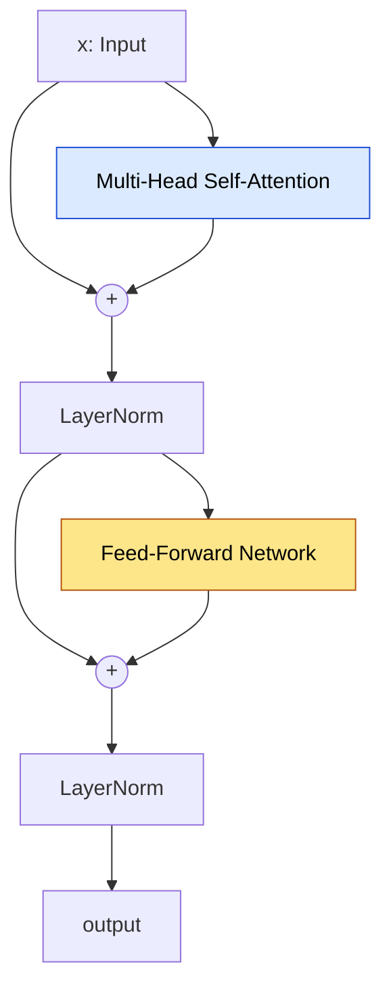
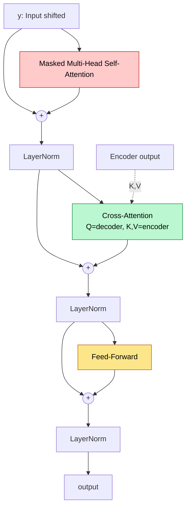

El **Transformer** es la arquitectura introducida por **Vaswani et al. (NeurIPS 2017)** en el paper *Attention Is All You Need*. Reemplaza por completo las recurrencias y convoluciones por **self-attention pura**, manteniendo la estructura clasica **encoder-decoder** de Seq2Seq pero permitiendo paralelismo masivo en training.

Esta arquitectura es la base de **BERT, GPT, T5, BART, LLaMA, Claude, Gemini** y practicamente todos los LLMs modernos. Tambien se extendio a vision (ViT), audio (Whisper) y multimodalidad.

---

## 1. Vision Global

El Transformer es un **stack de N capas identicas** en el encoder y otro stack de **N capas identicas** en el decoder. En el paper original $N = 6$. No hay recurrencia: la informacion temporal se inyecta solo via **positional encoding**.

```mermaid
graph BT
    subgraph Input
        X[Tokens fuente]
        IE[Input Embedding × √d]
        IP[+ Positional Encoding]
        X --> IE --> IP
    end

    subgraph Encoder["Encoder Stack (N capas)"]
        E1[Encoder Layer 1]
        E2[Encoder Layer 2]
        EN[Encoder Layer N]
        IP --> E1 --> E2 -.-> EN
    end

    subgraph Output
        Y[Tokens shifted right]
        OE[Output Embedding × √d]
        OP[+ Positional Encoding]
        Y --> OE --> OP
    end

    subgraph Decoder["Decoder Stack (N capas)"]
        D1[Decoder Layer 1]
        D2[Decoder Layer 2]
        DN[Decoder Layer N]
        OP --> D1 --> D2 -.-> DN
    end

    EN -.K,V cross-attn.-> D1
    EN -.K,V cross-attn.-> D2
    EN -.K,V cross-attn.-> DN

    DN --> LIN[Linear]
    LIN --> SM[Softmax]
    SM --> PROB[P(y_t | y_<t, x)]

    style Encoder fill:#dbeafe,color:#000,stroke:#1d4ed8
    style Decoder fill:#fde68a,color:#000,stroke:#b45309
```

Los stacks son **identicos en estructura** pero con pesos independientes en cada capa. La unica conexion entre encoder y decoder es la **cross-attention**: el decoder consulta las representaciones finales del encoder a traves de queries propias.


La idea radical del Transformer: **no hay recurrencia ni convolucion**. Todo es atencion + feedforward. Esto permite que cada posicion atienda a cualquier otra en **un solo paso** (path length $O(1)$ en vez de $O(n)$ como en RNN), y que el training se paralelice completo sobre la dimension temporal.


---

## 2. Embedding Layer + Escala

Los tokens de entrada (indices del vocabulario) se mapean a vectores densos de dimension $d_{model}$ via una tabla de lookup aprendible:

$$E \in \mathbb{R}^{|V| \times d_{model}}$$

En el paper original $d_{model} = 512$. Cada token $t$ se convierte en $E[t] \in \mathbb{R}^{d_{model}}$.

**Detalle clave**: el embedding se **multiplica por $\sqrt{d_{model}}$** antes de sumarse al positional encoding:

$$x = E[t] \cdot \sqrt{d_{model}} + PE(\text{pos})$$

El motivo: el embedding se inicializa con varianza $1/d_{model}$ (Xavier-like), por lo que sus magnitudes son pequenas. Multiplicar por $\sqrt{d_{model}}$ lo escala a magnitud $O(1)$, comparable al positional encoding (que tiene amplitud entre -1 y 1). Sin esa escala, el PE dominaria al embedding y el modelo perderia la informacion del token.

---

## 3. Positional Encoding (resumen)

Como no hay recurrencia, hay que inyectar informacion de **posicion**. Vaswani usa **encodings sinusoidales fijos** (no aprendidos):

$$PE(p, 2i) = \sin\left(\frac{p}{10000^{2i/d_{model}}}\right)$$
$$PE(p, 2i+1) = \cos\left(\frac{p}{10000^{2i/d_{model}}}\right)$$

donde $p$ es la posicion absoluta y $i$ el indice de dimension. La eleccion sinusoidal permite que el modelo aprenda posiciones **relativas** facilmente, ya que $PE(p+k)$ es funcion lineal de $PE(p)$.

Variantes modernas: positional embeddings aprendidos (BERT, GPT-2), **RoPE** (rotary, LLaMA), **ALiBi** (slopes lineales, sin PE explicito). Ver el fundamento dedicado de [Positional Encoding](/fundamentos/positional-encoding) para detalles completos.

---

## 4. Encoder Layer

Cada capa del encoder tiene **dos sub-bloques** con residual connection y layer normalization:



Formalmente, cada sub-bloque aplica:

$$\text{LayerNorm}(x + \text{Sublayer}(x))$$

donde $\text{Sublayer}(x)$ es **multi-head self-attention** en el primer sub-bloque y **FFN position-wise** en el segundo. Esto se conoce como **post-norm** (Vaswani 2017).

La salida final del encoder, despues de las $N$ capas, son representaciones contextualizadas de cada token de entrada. Esas representaciones se entregan como **keys y values** al decoder via cross-attention.

---

## 5. Feed-Forward Network Position-Wise

Despues de la atencion, cada posicion pasa por una **MLP de 2 capas** identica para todas las posiciones (pero distinta entre capas):

$$\text{FFN}(x) = \max(0, x W_1 + b_1) W_2 + b_2$$

Dimensiones tipicas:
- $W_1 \in \mathbb{R}^{d_{model} \times d_{ff}}$
- $W_2 \in \mathbb{R}^{d_{ff} \times d_{model}}$
- $d_{ff} = 2048$ en el paper original (4× $d_{model}$).

**Position-wise**: la misma MLP se aplica independientemente a cada posicion del batch. Equivale a dos convoluciones 1×1 sobre la dimension temporal.

**Por que se necesita**:
- La self-attention **mezcla informacion entre tokens** (mixing temporal).
- La FFN **mezcla informacion entre dimensiones del embedding** (mixing de features) en cada token por separado.
- La FFN introduce la **no-linealidad** (ReLU o GELU) que la atencion -- pura suma ponderada -- no tiene.

Sin FFN, el Transformer seria una sucesion de transformaciones lineales + softmax, con expresividad muy limitada. Las FFN concentran la mayor parte de los **parametros** del modelo (mas que la atencion).

---

## 6. Layer Normalization vs Batch Normalization

**Batch normalization** normaliza cada feature **a traves del batch**: para cada dimension $d$, calcula $\mu_d, \sigma_d^2$ sobre los $B$ ejemplos. Funciona bien en CNNs con batches grandes y secuencias de longitud fija.

**Layer normalization** (Ba, Kiros & Hinton 2016) normaliza **a traves de las features dentro de un solo ejemplo**:

$$\text{LN}(x) = \gamma \cdot \frac{x - \mu}{\sqrt{\sigma^2 + \epsilon}} + \beta$$

donde $\mu$ y $\sigma^2$ se calculan sobre la dimension de features (los $d_{model}$ valores) de **un mismo token**. $\gamma, \beta \in \mathbb{R}^{d_{model}}$ son escalas aprendibles.

**Por que LN gana en NLP**:
- **Independiente del batch size**: BN colapsa con batches pequenos (batch=1, comun en eval). LN funciona igual con cualquier batch.
- **Independiente de la longitud de secuencia**: secuencias variables en NLP causan problemas en BN.
- **Determinista en eval**: no requiere running statistics como BN.
- **Mejor gradiente**: en secuencias largas, BN tiene varianzas inestables entre posiciones; LN no.

Variantes modernas: **RMSNorm** (LLaMA, simplificacion sin centrado), **ScaleNorm**.

---

## 7. Residual Connections

Cada sub-bloque suma la entrada a su salida: $x + \text{Sublayer}(x)$. Esta es la idea de **ResNet (He et al. 2015)** trasladada a Transformers.

Beneficios:
- **Gradiente fluye** directo a capas tempranas, evitando vanishing gradients en stacks profundos.
- **Identidad como default**: si $\text{Sublayer}(x) \approx 0$, la capa es identidad. El modelo solo necesita aprender la **correccion** sobre la representacion previa.
- **Permite stacks de 12, 24, 96+ capas** sin colapso. GPT-3 tiene 96 capas; sin residuals seria intratable.

Sin residual connections, los Transformers profundos no convergerian. Es uno de los tres ingredientes (junto con attention y FFN) sin los cuales la arquitectura no funciona.

---

## 8. Pre-Norm vs Post-Norm

El paper original **Vaswani 2017** usa **post-norm**:

$$\text{output} = \text{LayerNorm}(x + \text{Sublayer}(x))$$

Pero cuando se entrenan stacks muy profundos (ej. GPT-2/3, 24-96 capas), post-norm tiene **inestabilidad numerica**: las activaciones crecen con la profundidad, y se requieren learning-rate warmup largos para no divergir.

**Pre-norm** (Xiong et al. 2020, GPT-2 en adelante):

$$\text{output} = x + \text{Sublayer}(\text{LayerNorm}(x))$$

Aqui la LN se aplica **antes** del sub-bloque, no despues de la suma residual. La rama residual queda **limpia** (no normalizada), lo que da **mejor flujo de gradiente** en stacks profundos y permite trainings mas estables sin warmup tan agresivo.

| Aspecto | Post-norm (Vaswani) | Pre-norm (GPT-2+, LLaMA) |
|---|---|---|
| Formula | $\text{LN}(x + \text{Sub}(x))$ | $x + \text{Sub}(\text{LN}(x))$ |
| Estabilidad profundos | Mala | Buena |
| Warmup necesario | Largo | Corto/ninguno |
| Final norm | No requerida | Requiere LN final extra |
| Performance asintotica | Comparable | Comparable |

Hoy practicamente **todos los LLMs modernos usan pre-norm** (GPT, LLaMA, Gemma, Mistral, Claude).

---

## 9. Decoder Layer

El decoder es estructuralmente similar al encoder, pero con **tres sub-bloques** en lugar de dos:



### 9.1 Masked Multi-Head Self-Attention

La self-attention dentro del decoder debe ser **causal**: la posicion $t$ solo puede atender a posiciones $\leq t$, nunca al futuro. Razon: el decoder es **autorregresivo** -- en inferencia generara token por token, asi que en training no puede "ver el futuro" o el modelo aprenderia a copiar el target.

Implementacion: una **mascara triangular superior** con $-\infty$ se suma a los logits antes del softmax:

$$\text{mask}_{ij} = \begin{cases} 0 & \text{si } j \leq i \\ -\infty & \text{si } j > i \end{cases}$$

Despues del softmax, las posiciones futuras tienen peso $0$. Esto permite procesar **toda la secuencia target en paralelo** durante training (teacher forcing) manteniendo el comportamiento autorregresivo.

### 9.2 Cross-Attention

El decoder consulta al encoder. Detalles en la seccion siguiente.

### 9.3 FFN

Identica a la del encoder: dos capas con ReLU/GELU intermedio.

Ambos sub-bloques usan residual + LN igual que el encoder.

---

## 10. Cross-Attention en Detalle

La cross-attention es el **unico canal de informacion** del encoder al decoder. Es donde el decoder "lee la fuente" para decidir el siguiente token.

Las queries vienen de la salida del sub-bloque previo del **decoder**, mientras que keys y values vienen de la salida final del **encoder**:

$$Q = X_{\text{dec}} W^Q, \quad K = X_{\text{enc}} W^K, \quad V = X_{\text{enc}} W^V$$

$$\text{CrossAttn}(X_{\text{dec}}, X_{\text{enc}}) = \text{softmax}\left(\frac{Q K^T}{\sqrt{d_k}}\right) V$$

Propiedades:
- **No causal**: el decoder puede atender a **cualquier** posicion del encoder (toda la oracion fuente esta disponible).
- **Generaliza Bahdanau**: el cross-attention del Transformer es la generalizacion multi-head de la atencion encoder-decoder de Bahdanau 2015.
- **Inicializacion del decoder**: en cada capa del decoder, el cross-attention se ejecuta **despues** del masked self-attention. Asi la query incorpora el contexto generado hasta el momento.

En modelos **decoder-only** (GPT, LLaMA) no hay cross-attention -- solo hay masked self-attention sobre el prompt + tokens generados. En modelos **encoder-only** (BERT) tampoco hay cross-attention.

---

## 11. Output Head

Despues del stack del decoder, la representacion final $h_t \in \mathbb{R}^{d_{model}}$ se proyecta al vocabulario:

$$\text{logits} = h_t W_{\text{out}}^T, \quad W_{\text{out}} \in \mathbb{R}^{|V| \times d_{model}}$$

$$P(y_t \mid y_{<t}, x) = \text{softmax}(\text{logits})$$

**Tied embeddings (weight tying)**: el paper original ata $W_{\text{out}} = E$, es decir, la matriz Linear de salida es la **misma** que la matriz de embeddings de entrada (transpuesta). Beneficios:
- Reduce parametros considerablemente (en GPT-2 small: 38M vs 50M sin tying).
- Funciona como **regularizacion**: forza que los embeddings de entrada y salida vivan en el mismo espacio.
- Mejora perplexity en LM benchmarks (Press & Wolf 2017).

Variantes modernas (LLaMA, GPT-3 grande) **no atan** los pesos, ya que con vocabularios grandes y modelos enormes el ahorro de parametros es marginal y el modelo se beneficia de tener una proyeccion de salida independiente.

---

## 12. Variantes Arquitecturales

Tres familias surgieron del Transformer original:

### 12.1 Encoder-only

- Solo el stack del encoder (sin decoder, sin causal mask).
- Self-attention bidireccional: cada token ve a todos los demas.
- Pretraining con **Masked Language Modeling** (MLM).
- Casos: **BERT** (Devlin 2018), **RoBERTa**, **DeBERTa**, **ELECTRA**.
- Tareas: clasificacion, QA extractivo, NER, similarity.

### 12.2 Decoder-only

- Solo el stack del decoder (sin encoder, sin cross-attention).
- Self-attention causal: cada token ve solo a los anteriores.
- Pretraining con **next-token prediction** (autoregressive LM).
- Casos: **GPT-1/2/3/4**, **LLaMA-1/2/3**, **Mistral**, **Claude**, **Gemini**, **Qwen**.
- Tareas: generacion abierta, in-context learning, instruction following, chat.

### 12.3 Encoder-Decoder

- La arquitectura original completa.
- Encoder bidireccional + decoder causal con cross-attention.
- Casos: **T5** (Raffel 2020), **BART** (Lewis 2020), **mT5**, **FLAN-T5**, **Whisper** (audio→texto), **NMT** clasico.
- Tareas: traduccion, summarization, seq-to-seq estructurado.

| Familia | Atencion | Pretraining | Ejemplo |
|---|---|---|---|
| Encoder-only | Bidireccional | MLM | BERT |
| Decoder-only | Causal | Next-token | GPT, LLaMA |
| Encoder-Decoder | Bi + Causal + Cross | Span corruption / denoising | T5, BART |

---

## 13. Implementacion en 3 Frameworks



```python
import torch
import torch.nn as nn

class TransformerEncoderLayer(nn.Module):
    def __init__(self, d_model=512, n_heads=8, d_ff=2048, dropout=0.1):
        super().__init__()
        self.self_attn = nn.MultiheadAttention(d_model, n_heads, dropout=dropout, batch_first=True)
        self.ffn = nn.Sequential(
            nn.Linear(d_model, d_ff), nn.ReLU(),
            nn.Dropout(dropout), nn.Linear(d_ff, d_model),
        )
        self.ln1 = nn.LayerNorm(d_model)
        self.ln2 = nn.LayerNorm(d_model)
        self.drop = nn.Dropout(dropout)

    def forward(self, x, src_mask=None):
        # post-norm (Vaswani 2017)
        a, _ = self.self_attn(x, x, x, attn_mask=src_mask, need_weights=False)
        x = self.ln1(x + self.drop(a))
        f = self.ffn(x)
        x = self.ln2(x + self.drop(f))
        return x

class TransformerDecoderLayer(nn.Module):
    def __init__(self, d_model=512, n_heads=8, d_ff=2048, dropout=0.1):
        super().__init__()
        self.self_attn = nn.MultiheadAttention(d_model, n_heads, dropout=dropout, batch_first=True)
        self.cross_attn = nn.MultiheadAttention(d_model, n_heads, dropout=dropout, batch_first=True)
        self.ffn = nn.Sequential(
            nn.Linear(d_model, d_ff), nn.ReLU(),
            nn.Dropout(dropout), nn.Linear(d_ff, d_model),
        )
        self.ln1 = nn.LayerNorm(d_model)
        self.ln2 = nn.LayerNorm(d_model)
        self.ln3 = nn.LayerNorm(d_model)
        self.drop = nn.Dropout(dropout)

    def forward(self, y, mem, tgt_mask=None, mem_mask=None):
        a, _ = self.self_attn(y, y, y, attn_mask=tgt_mask, need_weights=False)
        y = self.ln1(y + self.drop(a))
        c, _ = self.cross_attn(y, mem, mem, attn_mask=mem_mask, need_weights=False)
        y = self.ln2(y + self.drop(c))
        f = self.ffn(y)
        y = self.ln3(y + self.drop(f))
        return y

class Transformer(nn.Module):
    def __init__(self, src_vocab, tgt_vocab, d_model=512, n_heads=8,
                 d_ff=2048, n_layers=6, max_len=5000, dropout=0.1):
        super().__init__()
        self.src_emb = nn.Embedding(src_vocab, d_model)
        self.tgt_emb = nn.Embedding(tgt_vocab, d_model)
        self.pos_enc = nn.Parameter(torch.zeros(1, max_len, d_model))  # o sinusoidal fijo
        self.encoder = nn.ModuleList([
            TransformerEncoderLayer(d_model, n_heads, d_ff, dropout) for _ in range(n_layers)
        ])
        self.decoder = nn.ModuleList([
            TransformerDecoderLayer(d_model, n_heads, d_ff, dropout) for _ in range(n_layers)
        ])
        self.out = nn.Linear(d_model, tgt_vocab, bias=False)
        self.d_model = d_model

    def encode(self, src):
        x = self.src_emb(src) * (self.d_model ** 0.5) + self.pos_enc[:, :src.size(1)]
        for layer in self.encoder:
            x = layer(x)
        return x

    def decode(self, tgt, mem, tgt_mask):
        y = self.tgt_emb(tgt) * (self.d_model ** 0.5) + self.pos_enc[:, :tgt.size(1)]
        for layer in self.decoder:
            y = layer(y, mem, tgt_mask=tgt_mask)
        return self.out(y)

    def forward(self, src, tgt):
        T = tgt.size(1)
        causal = torch.triu(torch.full((T, T), float('-inf'), device=tgt.device), diagonal=1)
        mem = self.encode(src)
        return self.decode(tgt, mem, causal)
```


```python
import jax
import jax.numpy as jnp
from flax import linen as nn

class TransformerEncoderLayer(nn.Module):
    d_model: int = 512
    n_heads: int = 8
    d_ff: int = 2048
    dropout: float = 0.1

    @nn.compact
    def __call__(self, x, mask=None, train=False):
        a = nn.MultiHeadDotProductAttention(num_heads=self.n_heads,
                                            dropout_rate=self.dropout)(x, x, mask=mask, deterministic=not train)
        x = nn.LayerNorm()(x + a)
        h = nn.Dense(self.d_ff)(x)
        h = nn.relu(h)
        h = nn.Dense(self.d_model)(h)
        x = nn.LayerNorm()(x + h)
        return x

class TransformerDecoderLayer(nn.Module):
    d_model: int = 512
    n_heads: int = 8
    d_ff: int = 2048
    dropout: float = 0.1

    @nn.compact
    def __call__(self, y, mem, tgt_mask=None, mem_mask=None, train=False):
        a = nn.MultiHeadDotProductAttention(num_heads=self.n_heads,
                                            dropout_rate=self.dropout)(y, y, mask=tgt_mask, deterministic=not train)
        y = nn.LayerNorm()(y + a)
        c = nn.MultiHeadDotProductAttention(num_heads=self.n_heads,
                                            dropout_rate=self.dropout)(y, mem, mask=mem_mask, deterministic=not train)
        y = nn.LayerNorm()(y + c)
        h = nn.Dense(self.d_ff)(y)
        h = nn.relu(h)
        h = nn.Dense(self.d_model)(h)
        y = nn.LayerNorm()(y + h)
        return y

class Transformer(nn.Module):
    src_vocab: int
    tgt_vocab: int
    d_model: int = 512
    n_heads: int = 8
    d_ff: int = 2048
    n_layers: int = 6

    @nn.compact
    def __call__(self, src, tgt, train=False):
        x = nn.Embed(self.src_vocab, self.d_model)(src) * jnp.sqrt(self.d_model)
        y = nn.Embed(self.tgt_vocab, self.d_model)(tgt) * jnp.sqrt(self.d_model)
        # (PE omitido por brevedad)
        for _ in range(self.n_layers):
            x = TransformerEncoderLayer(self.d_model, self.n_heads, self.d_ff)(x, train=train)
        T = tgt.shape[1]
        causal = nn.make_causal_mask(tgt)
        for _ in range(self.n_layers):
            y = TransformerDecoderLayer(self.d_model, self.n_heads, self.d_ff)(y, x, tgt_mask=causal, train=train)
        return nn.Dense(self.tgt_vocab, use_bias=False)(y)
```


```python
import tensorflow as tf

class TransformerEncoderLayer(tf.keras.layers.Layer):
    def __init__(self, d_model=512, n_heads=8, d_ff=2048, dropout=0.1):
        super().__init__()
        self.mha = tf.keras.layers.MultiHeadAttention(num_heads=n_heads, key_dim=d_model // n_heads, dropout=dropout)
        self.ffn = tf.keras.Sequential([
            tf.keras.layers.Dense(d_ff, activation='relu'),
            tf.keras.layers.Dropout(dropout),
            tf.keras.layers.Dense(d_model),
        ])
        self.ln1 = tf.keras.layers.LayerNormalization()
        self.ln2 = tf.keras.layers.LayerNormalization()

    def call(self, x, mask=None, training=False):
        a = self.mha(x, x, attention_mask=mask, training=training)
        x = self.ln1(x + a)
        f = self.ffn(x, training=training)
        x = self.ln2(x + f)
        return x

class TransformerDecoderLayer(tf.keras.layers.Layer):
    def __init__(self, d_model=512, n_heads=8, d_ff=2048, dropout=0.1):
        super().__init__()
        self.self_attn = tf.keras.layers.MultiHeadAttention(num_heads=n_heads, key_dim=d_model // n_heads, dropout=dropout)
        self.cross_attn = tf.keras.layers.MultiHeadAttention(num_heads=n_heads, key_dim=d_model // n_heads, dropout=dropout)
        self.ffn = tf.keras.Sequential([
            tf.keras.layers.Dense(d_ff, activation='relu'),
            tf.keras.layers.Dropout(dropout),
            tf.keras.layers.Dense(d_model),
        ])
        self.ln1 = tf.keras.layers.LayerNormalization()
        self.ln2 = tf.keras.layers.LayerNormalization()
        self.ln3 = tf.keras.layers.LayerNormalization()

    def call(self, y, mem, tgt_mask=None, training=False):
        a = self.self_attn(y, y, attention_mask=tgt_mask, use_causal_mask=True, training=training)
        y = self.ln1(y + a)
        c = self.cross_attn(y, mem, training=training)
        y = self.ln2(y + c)
        f = self.ffn(y, training=training)
        y = self.ln3(y + f)
        return y

class Transformer(tf.keras.Model):
    def __init__(self, src_vocab, tgt_vocab, d_model=512, n_heads=8, d_ff=2048, n_layers=6):
        super().__init__()
        self.src_emb = tf.keras.layers.Embedding(src_vocab, d_model)
        self.tgt_emb = tf.keras.layers.Embedding(tgt_vocab, d_model)
        self.encoder = [TransformerEncoderLayer(d_model, n_heads, d_ff) for _ in range(n_layers)]
        self.decoder = [TransformerDecoderLayer(d_model, n_heads, d_ff) for _ in range(n_layers)]
        self.out = tf.keras.layers.Dense(tgt_vocab, use_bias=False)
        self.d_model = d_model

    def call(self, inputs, training=False):
        src, tgt = inputs
        x = self.src_emb(src) * tf.math.sqrt(tf.cast(self.d_model, tf.float32))
        y = self.tgt_emb(tgt) * tf.math.sqrt(tf.cast(self.d_model, tf.float32))
        for layer in self.encoder:
            x = layer(x, training=training)
        for layer in self.decoder:
            y = layer(y, x, training=training)
        return self.out(y)
```



---

## 14. Hyperparametros del Paper Vaswani

El paper original presenta dos configuraciones:

| Modelo | $d_{model}$ | $h$ (heads) | $d_{ff}$ | $N$ (capas) | $d_k = d_v$ | Dropout | Params |
|---|---|---|---|---|---|---|---|
| Transformer base | 512 | 8 | 2048 | 6 | 64 | 0.1 | 65M |
| Transformer big | 1024 | 16 | 4096 | 6 | 64 | 0.3 | 213M |

Notar:
- $d_k = d_v = d_{model} / h$ siempre (cada head opera en subespacio 64-dim).
- $d_{ff} = 4 \cdot d_{model}$ (regla heuristica que se mantiene hasta hoy).
- Dropout aplicado en attention output, FFN output y embedding + PE.
- Optimizer: **Adam** con $\beta_1 = 0.9, \beta_2 = 0.98, \epsilon = 10^{-9}$.
- LR schedule: **warmup + decay** ($\text{lr} = d_{model}^{-0.5} \cdot \min(\text{step}^{-0.5}, \text{step} \cdot \text{warmup}^{-1.5})$).
- Label smoothing: $\epsilon_{ls} = 0.1$.

Resultados WMT 2014 EN-DE: BLEU 28.4 (big), state-of-art en 2017.

---

## 15. Tabla GPT Scaling

La familia GPT muestra como el mismo decoder-only Transformer se escala drasticamente:

| Modelo | Ano | Layers | Heads | $d_{model}$ | Context | Params |
|---|---|---|---|---|---|---|
| GPT | 2018 | 12 | 12 | 768 | 512 | 0.12B |
| GPT-2 | 2019 | 48 | 25 | 1600 | 1024 | 1.5B |
| GPT-3 | 2020 | 96 | 96 | 12288 | 2048 | 175B |
| GPT-4 | 2023 | ? | ? | ? | 8K-128K | ~1.76T (rumor MoE) |
| GPT-4o | 2024 | ? | ? | ? | 128K | no publico |

(GPT-4 nunca publico arquitectura oficial; cifras provienen de filtraciones y analisis indirectos.)

Observaciones:
- El **scaling no fue solo profundidad**: $d_{model}$ crece de 768 a 12288 (16×) en 2 anos.
- El **context window** crece dramaticamente con tecnicas como RoPE, ALiBi, YaRN, FlashAttention.
- Las **leyes de scaling** (Kaplan 2020, Chinchilla 2022) guian estas decisiones de escala parametros vs tokens.

---

## 16. Resumen

- **Transformer** = encoder + decoder, ambos stacks de $N$ capas identicas.
- **Encoder layer**: Multi-Head Self-Attention + FFN, cada uno con residual + LN.
- **Decoder layer**: Masked Self-Attention + Cross-Attention + FFN, cada uno con residual + LN.
- **FFN position-wise**: 2 capas con expansion $d_{ff} = 4 d_{model}$, introduce no-linealidad y mezcla features.
- **Layer normalization**, no batch norm, por independencia de batch y longitud.
- **Residual connections** permiten stacks profundos.
- **Pre-norm** (moderno) gana sobre **post-norm** (Vaswani original) en estabilidad para modelos profundos.
- **Cross-attention**: unico canal encoder→decoder, $Q$ del decoder, $K, V$ del encoder.
- **Variantes**: encoder-only (BERT), decoder-only (GPT), encoder-decoder (T5).
- **Hyperparametros tipicos**: $d_{model} = 512, h = 8, d_{ff} = 2048, N = 6$ (base).
- **Scaling**: GPT pasa de 0.12B (2018) a 1.76T (2023, estimado).

Ver tambien: [Mecanismo de Atencion](/fundamentos/mecanismo-atencion) · [Self-Attention](/fundamentos/self-attention) · [Positional Encoding](/fundamentos/positional-encoding) · [Pretraining BERT](/fundamentos/pretraining-bert) · [Vision Transformer](/fundamentos/vision-transformer) · [Paper Attention is All You Need (Vaswani 2017)](/papers/attention-is-all-you-need-vaswani-2017) · [Clase 14](/clases/clase-14).
