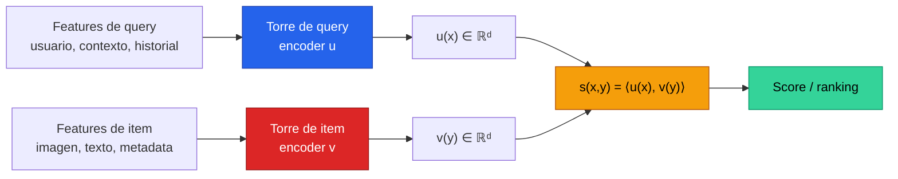
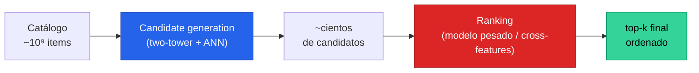

El **two-tower retrieval** (o **dual encoder**) es el patrón arquitectónico que sostiene a casi todos los sistemas de recomendación y búsqueda a escala industrial: **dos redes neuronales independientes** —una codifica la *query* (usuario, contexto, pregunta) y otra codifica el *item* (producto, video, pin, passage)— proyectan ambos lados a un **espacio vectorial común** donde la **similaridad geométrica** (producto punto, coseno o distancia) equivale a relevancia. Su gracia es **factorizar el cómputo**: los embeddings de millones o billones de items se precalculan *offline* una sola vez, y en *serving* basta con codificar la query y buscar sus vecinos más cercanos. Este fundamento desarrolla el patrón desde el problema de escala que lo motiva, pasando por su entrenamiento con **in-batch negatives** y la **corrección log-Q**, hasta mostrar que la arquitectura de la **[Clase 25](/clases/clase-25)** (recsys multimodal de Pinterest) es —exactamente— un two-tower disfrazado.

---

## 1. El problema: retrieval sobre millones de items

El recomendador o buscador ideal asignaría a cada par (query, item) un score de relevancia $s(x, y)$ usando un **modelo pesado** que cruce ambas entradas con atención completa —un *cross-encoder*— y luego ordenaría los items por ese score. El obstáculo es la **escala**: un catálogo de YouTube, Pinterest o Amazon tiene entre $10^7$ y $10^9$ items. Evaluar un cross-encoder para **cada item del catálogo en cada request** es computacionalmente imposible: si una sola pasada del modelo cuesta $1$ ms y hay $10^9$ items, una sola recomendación tomaría **11 días**.

La solución es la misma que aparece en [dense retrieval](/fundamentos/dense-retrieval) y en *entity/patient matching*: **dividir el trabajo en dos etapas**, una barata que acota el espacio de búsqueda (recall) y una cara que decide finamente (precisión). El two-tower es la maquinaria que hace barata la primera etapa.


La restricción central del two-tower es **arquitectónica**: query e item **nunca interactúan** dentro de la red. No hay atención cruzada, no hay features que mezclen ambos lados. Cada torre ve solo su entrada. Es precisamente esta independencia la que permite **precalcular** todos los embeddings de items y reducir el retrieval a una **búsqueda de vecinos** en lugar de $N$ evaluaciones de modelo. Se sacrifica expresividad (un cross-encoder modela mejor) a cambio de escalabilidad.


---

## 2. La idea two-tower: dos encoders → espacio común → similaridad

La idea, en una línea: en vez de un modelo $f(x, y)$ que recibe query e item juntos, se entrenan **dos funciones separadas** $u(\cdot)$ y $v(\cdot)$ que mapean cada lado a $\mathbb{R}^d$, y el score se define como una **operación de similaridad simple y barata** entre los dos vectores:

$$s(x, y) = \langle u(x),\; v(y) \rangle = u(x)^\top v(y)$$

Las tres elecciones habituales de similaridad:

| Métrica | Fórmula | Cuándo se usa |
|---|---|---|
| Producto punto | $u^\top v$ | Default en recsys (sampled softmax); permite *maximum inner product search* |
| Coseno | $\dfrac{u^\top v}{\lVert u\rVert\,\lVert v\rVert}$ | Cuando la magnitud no debe importar; equivale a dot product con embeddings $L_2$-normalizados |
| Distancia euclidiana | $\lVert u - v\rVert_2$ | Comparación por **mínima distancia** (la que usa la Clase 25); con vectores normalizados es monótona al coseno |

Con vectores **normalizados** a norma unitaria, las tres son equivalentes hasta una transformación monótona: $\lVert u - v\rVert_2^2 = 2 - 2\,u^\top v$. Por eso *maximizar producto punto* y *minimizar distancia euclidiana* devuelven **el mismo ranking**, un hecho clave para conectar la Clase 25 (mínima distancia) con el aparato clásico de recsys (dot product).

---

## 3. Arquitectura: torre de query, torre de item

Cada torre es una red arbitraria —MLP sobre features, CNN sobre imágenes, BERT sobre texto, o una combinación— cuya única restricción es **emitir un vector de dimensión $d$** comparable con el de la otra torre.



Propiedades estructurales que definen al patrón:

- **Asimetría de torres.** Las dos torres **no comparten pesos** en general (a diferencia de una red siamesa pura): la torre de usuario y la de item modelan distribuciones distintas. Pueden compartir solo embeddings de features comunes.
- **Precálculo del lado item.** Como $v(y)$ no depende de la query, todos los $v(y_1), \ldots, v(y_N)$ se computan en batch *offline* y se guardan en un **índice**. La torre de item puede ser arbitrariamente pesada porque su costo es amortizado.
- **Cómputo online mínimo.** En *serving* solo se ejecuta $u(x)$ una vez, y luego una búsqueda de vecinos contra el índice. El costo por request es $O(\text{una pasada de torre} + \text{ANN})$, no $O(N)$.

Esta es exactamente la factorización que [DSSM](/papers/dssm-huang-2013) introdujo en 2013 para web search y que [metric learning](/fundamentos/metric-learning) formaliza como aprender una métrica de similaridad en un espacio embebido.

---

## 4. Entrenamiento: in-batch negatives y sampled softmax

El reto de entrenar un two-tower es que el objetivo natural —un **softmax sobre todo el catálogo**— es intratable: el denominador suma sobre $N \approx 10^9$ items.

$$P(y \mid x) = \frac{e^{s(x, y)}}{\sum_{y' \in \mathcal{Y}} e^{s(x, y')}}$$

La técnica dominante es **in-batch negatives** con **sampled softmax**. Dentro de un mini-batch de $B$ pares positivos $\{(x_i, y_i)\}$, se reutilizan los items de *los otros pares del batch* como **negativos gratis** para cada query. Esto convierte cada fila en una clasificación de $B$ vías y reaprovecha embeddings ya computados —de ahí su eficiencia. La pérdida es la cross-entropy:

$$\mathcal{L} = -\frac{1}{B}\sum_{i=1}^{B} \log \frac{e^{s(x_i, y_i)}}{\sum_{j=1}^{B} e^{s(x_i, y_j)}}$$

El problema es el **sesgo de muestreo**: los items **populares** aparecen en muchos más batches y por tanto son negativos con muchísima más frecuencia que los items de cola. El modelo "aprende" a castigar a los items populares, lo que distorsiona la estimación del softmax completo. La solución del paper de [Two-Tower (Yi et al., 2019)](/papers/two-tower-yi-2019) es la **corrección log-Q** (*sampling-bias-corrected logits*): restar el log de la probabilidad de muestreo $Q(y_j)$ de cada logit antes del softmax, estimando $Q$ en streaming con un *count-min sketch*:

$$s^{\text{corr}}(x_i, y_j) = s(x_i, y_j) - \log Q(y_j)$$


Sin la corrección log-Q, el modelo penaliza de más a los items frecuentes y de menos a los raros, porque su frecuencia como negativo refleja popularidad, **no** irrelevancia. Restar $\log Q(y_j)$ "deshace" ese sesgo y deja logits que aproximan el softmax sobre todo el catálogo. Es el truco que hizo viable entrenar two-towers directamente sobre el stream de logs sin un vocabulario de items fijo.


Otras palancas de entrenamiento: **hard negatives** (negativos difíciles muestreados explícitamente, como en ANCE), **normalización** $L_2$ de los embeddings, y un **factor de temperatura** $\tau$ que escala los logits ($s/\tau$) para afilar o suavizar la distribución —un puente directo con el [aprendizaje contrastivo](/fundamentos/aprendizaje-contrastivo) (InfoNCE es, esencialmente, sampled softmax con in-batch negatives).

---

## 5. Candidate generation vs ranking: el patrón de dos etapas

El two-tower casi nunca trabaja solo: es la **primera etapa** de un pipeline cuyo arquetipo canónico es el [YouTube Deep Neural Network (Covington et al., 2016)](/papers/youtube-dnn-covington-2016).



- **Candidate generation (retrieval).** El two-tower reduce billones de items a unos **cientos** de candidatos. Optimiza **recall**: basta con no perder los items buenos. Modela señales gruesas (historial del usuario, embeddings).
- **Ranking.** Un modelo más expresivo —que sí puede cruzar features de query e item, usar atención, y cientos de features densas/categóricas— reordena finamente esos pocos candidatos. Optimiza **precisión** y la métrica de negocio (watch time, engagement).

Esta separación es el mismo *blocking + scoring* del retrieval clásico y de matching de entidades: un componente barato acota, uno caro decide. La justificación es puramente económica: aplicar el ranker pesado a todo el catálogo es inviable; aplicarlo a 500 candidatos no lo es.

---

## 6. Serving: Approximate Nearest Neighbor (ANN)

Una vez entrenado el modelo, *recomendar* se reduce a **un problema de búsqueda geométrica**: dado $u(x)$, encontrar los $k$ items $y$ que maximizan $u(x)^\top v(y)$ —el problema de **Maximum Inner Product Search (MIPS)**, equivalente a *nearest neighbor* tras normalizar.

Hacer esto **exacto** sigue siendo $O(N)$ por request. En producción se usa **ANN (Approximate Nearest Neighbor)**: estructuras de índice que devuelven vecinos *casi* exactos en tiempo **sublineal**, sacrificando un poco de recall:

| Familia | Idea | Implementación típica |
|---|---|---|
| Cuantización | Comprimir vectores (PQ, *product quantization*) y comparar en el espacio cuantizado | **FAISS** (Meta), **ScaNN** (Google) |
| Grafos de proximidad | Navegar un grafo de vecinos (HNSW) hasta converger al más cercano | **HNSW**, FAISS-HNSW |
| Particionamiento | Dividir el espacio en celdas (IVF, *inverted file*) y buscar solo en las relevantes | FAISS-IVF, ScaNN |

**ScaNN** (Guo et al., 2020) introdujo *anisotropic vector quantization*, optimizada específicamente para preservar el **producto punto** (no solo la distancia), lo que la alinea perfecto con el objetivo del two-tower. En la práctica, el índice ANN se reconstruye periódicamente (por ejemplo, cada pocas horas) re-embebiendo el catálogo con la torre de item actual. Ver también [model serving](/fundamentos/model-serving) y [MLOps](/fundamentos/mlops) para el ciclo de vida operacional.

---

## 7. Linaje histórico: de DSSM a los dual encoders modernos

El patrón tiene una genealogía clara que conviene tener presente:

- **2013 — [DSSM (Huang et al.)](/papers/dssm-huang-2013).** *Deep Structured Semantic Model* para web search en Microsoft. Primer dual encoder neuronal: dos MLPs (sobre *word hashing* de trigramas de caracteres) proyectan query y documento a un espacio común; entrenamiento con softmax sobre documentos clickeados vs. no clickeados. Es el **ancestro directo** de todo lo que sigue.
- **2016 — [YouTube DNN (Covington et al.)](/papers/youtube-dnn-covington-2016).** Llevó el patrón a recomendación a escala de mil millones de usuarios, formalizó **candidate generation vs ranking** y el truco de tratar la recomendación como **clasificación extrema** con sampled softmax.
- **2019 — [Two-Tower (Yi et al.)](/papers/two-tower-yi-2019).** Sistematizó el entrenamiento sobre *streaming* de logs con la **corrección log-Q** del sesgo de muestreo, haciendo el patrón robusto sin vocabulario de items fijo.
- **2020 — DPR / ColBERT / dense retrieval.** El mismo patrón cruza al NLP: dos encoders BERT para *open-domain QA* y RAG (ver [dense retrieval](/fundamentos/dense-retrieval)). "Dual encoder" pasa a ser el término dominante en NLP; "two-tower" en recsys —son lo mismo.

El hilo conductor: **factorizar el score en dos encoders independientes** para poder precalcular un lado e indexarlo.

---

## 8. Relación con metric learning y contrastive learning

El two-tower **es** una instancia de [metric learning](/fundamentos/metric-learning): aprende un espacio donde la distancia codifica (ir)relevancia. Sus parientes cercanos:

- **[Triplet loss](/fundamentos/triplet-loss).** Empuja un *anchor* hacia su positivo y lejos de un negativo con un margen: $\max(0,\, d(a,p) - d(a,n) + \alpha)$. Es el primo "por tripletas" del two-tower; el in-batch softmax es una generalización a *muchos* negativos simultáneos.
- **[Aprendizaje contrastivo](/fundamentos/aprendizaje-contrastivo).** La pérdida InfoNCE de SimCLR/CLIP es **idénticamente** un sampled softmax con in-batch negatives y temperatura. CLIP, de hecho, es un two-tower puro: una torre de imagen y una de texto a un espacio común, entrenado contrastivamente. El two-tower de recsys y el contrastive de visión/lenguaje convergieron en la misma maquinaria.

La diferencia es de **objetivo y supervisión**: en recsys el "positivo" es un click/engagement (señal implícita, ruidosa), mientras que en contrastive self-supervised el positivo es una vista aumentada del mismo dato. La arquitectura subyacente y la matemática del entrenamiento son las mismas.

---

## 9. La arquitectura de la Clase 25 como two-tower

La **[Clase 25](/clases/clase-25)** (recsys multimodal, caso Pinterest) presenta una arquitectura que, vista de frente, **es un two-tower** aunque no se le nombre así. Vale la pena hacer el mapeo explícito.

**La torre de item (pin tower).** Cada pin tiene **imagen y texto**. La arquitectura los codifica en paralelo y los fusiona:

```
imagen --> CNN --------\
                        concat --> FC --> "pin representation" ∈ ℝᵈ
texto  --> BERT -------/
```

Esto es **exactamente** la torre de item de un two-tower multimodal: un encoder (aquí, CNN + BERT con *late fusion* por concatenación seguida de una capa *fully-connected*) que produce un único embedding $v(\text{pin}) \in \mathbb{R}^d$. Es el mismo espíritu de [image captioning](/fundamentos/image-captioning) y de los modelos multimodales contrastivos: fusionar modalidades en una representación conjunta.

**La torre de query (usuario) e inferencia por mínima distancia.** El usuario está representado por su **conjunto de pins** (su historial/board). La recomendación se hace comparando el embedding de un pin candidato contra ese conjunto y eligiendo por **mínima distancia**:

$$\hat{y} = \arg\min_{\text{candidato } c}\; \min_{p \in \text{pins del usuario}} \; \lVert v(c) - v(p) \rVert_2$$

Esto es retrieval two-tower con tres matices reveladores:

1. **Torres acopladas (siamesas).** Query e item se codifican con **la misma** pin tower —es un dual encoder de **pesos compartidos**, el extremo simétrico del espectro. El "usuario" no es una torre aparte sino un *conjunto* de embeddings de item.
2. **Mínima distancia = máximo producto punto.** Como vimos en la sección 2, con embeddings normalizados minimizar $\lVert v(c) - v(p) \rVert_2$ es **monótonamente equivalente** a maximizar $v(c)^\top v(p)$. La "comparación por mínima distancia" de la Clase 25 es, literalmente, el MIPS/ANN de las secciones 2 y 6.
3. **Agregación por max-similaridad.** Tomar el pin del usuario *más cercano* (en vez de un promedio) es una agregación de tipo *late interaction*, emparentada con el *MaxSim* de ColBERT: el usuario es relevante a un candidato si **alguno** de sus pins lo es.


La Clase 25 no inventa una arquitectura nueva: aplica el patrón **two-tower / dual encoder** con (a) una torre multimodal CNN+BERT como encoder de item, (b) pesos compartidos entre "query" e item, y (c) **inferencia por vecino más cercano** (mínima distancia ≡ máximo producto punto). Reconocer esto conecta el caso Pinterest con DSSM, YouTube DNN, CLIP y dense retrieval: **es el mismo patrón** que sostiene búsqueda, recomendación y RAG a escala.


Para el contexto más amplio de cómo este retriever encaja en un sistema completo de recomendación (generación de candidatos, ranking, señales implícitas, métricas de negocio), ver [recommender systems](/fundamentos/recommender-systems).

---

## Para profundizar

- **Clase del curso:** [Clase 25 — Sistemas de recomendación multimodales](/clases/clase-25).
- **Fundamentos relacionados:** [Recommender Systems](/fundamentos/recommender-systems) · [Metric Learning](/fundamentos/metric-learning) · [Triplet Loss](/fundamentos/triplet-loss) · [Aprendizaje Contrastivo](/fundamentos/aprendizaje-contrastivo) · [Dense Retrieval](/fundamentos/dense-retrieval) · [Model Serving](/fundamentos/model-serving).
- **Papers fundacionales:** [DSSM — Huang et al. 2013](/papers/dssm-huang-2013) (el ancestro dual-encoder) · [YouTube DNN — Covington et al. 2016](/papers/youtube-dnn-covington-2016) (candidate generation vs ranking) · [Two-Tower — Yi et al. 2019](/papers/two-tower-yi-2019) (corrección log-Q del sesgo de muestreo).
