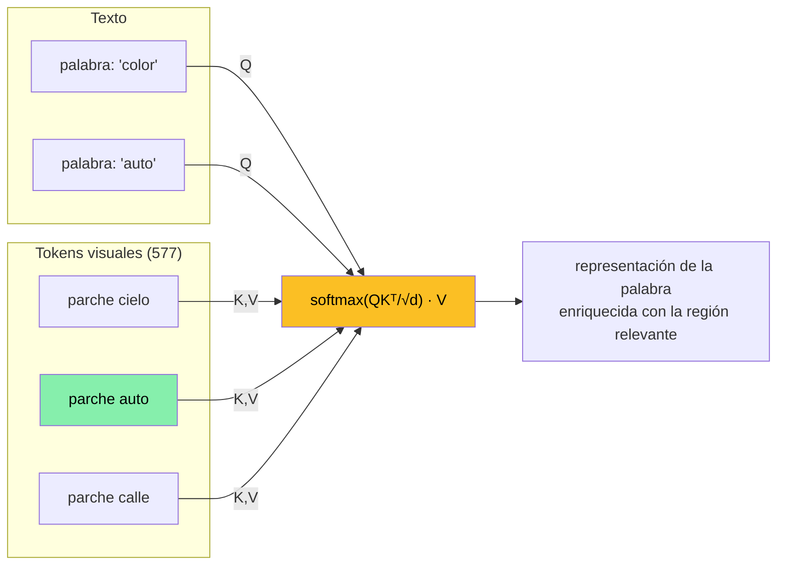
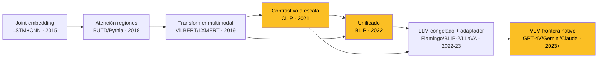

Un **Vision-Language Model (VLM)** es un modelo que procesa **imagen y texto conjuntamente** en un mismo espacio computacional, para realizar tareas que exigen razonar sobre ambas modalidades a la vez: responder preguntas sobre una foto, describirla, recuperar imágenes a partir de un texto, o seguir instrucciones que mezclan lo visual y lo lingüístico. Mientras que tareas como el [Visual Question Answering](/fundamentos/visual-question-answering) o el [Image Captioning](/fundamentos/image-captioning) describen **qué se le pide** al sistema, este fundamento trata sobre **la familia de modelos** que resuelve esas tareas y, sobre todo, sobre el **paradigma** que las hace posibles: cómo se alinean dos modalidades tan distintas como un texto y una imagen.

El reto de fondo es que **texto e imagen son matemáticamente incompatibles**. El lenguaje es **discreto, secuencial y composicional**: una frase es una secuencia de símbolos de un vocabulario finito, con una sintaxis que compone significado de partes ("el gato negro" se construye a partir de "gato" y "negro"). Una imagen es **continua, espacial y densa**: una grilla de millones de valores de píxel sin un vocabulario, sin orden lineal natural y sin unidades semánticas predefinidas — no hay un "símbolo gato" en los píxeles, hay manchas de color que un modelo debe aprender a agrupar. Un VLM es, en esencia, **la maquinaria que tiende un puente entre estos dos mundos**: convierte la imagen en algo que un procesador de lenguaje pueda manipular, y aprende una correspondencia entre regiones visuales y conceptos lingüísticos.

Este fundamento es transversal: sustenta la [Clase 23](/clases/clase-23), el Laboratorio 23 (BLIP), todo el [dominio Multimodal](/dominios/multimodal) y cualquier clase futura que toque modelos con visión (GPT-4V, Gemini, Claude). Da por conocido qué es VQA y qué es captioning; aquí el foco está en los **modelos** y el **paradigma**.

---

## 1. El problema central: alinear modalidades incompatibles

Todo VLM debe resolver tres subproblemas encadenados:

1. **Representar la imagen** como una estructura que una red de procesamiento de secuencias pueda consumir (idealmente, una secuencia de vectores — "tokens visuales").
2. **Representar el texto** como una secuencia de vectores (esto ya lo resuelven los [embeddings](/fundamentos/embeddings-distribuidos) y los tokenizadores).
3. **Fusionar ambas** en un espacio compartido donde "la palabra *perro*" y "la región de píxeles que muestra un perro" queden próximas o puedan interactuar.

El punto (3) es el corazón del campo. Hay dos grandes filosofías para lograrlo — alinear las modalidades en un **espacio común por contraste**, o **fusionarlas profundamente con atención cruzada** — y veremos ambas en las secciones 3 y 4. Pero primero hay que resolver (1): cómo una imagen, que no tiene tokens, se convierte en una secuencia de tokens. La respuesta moderna es el **Vision Transformer**.


El lenguaje es **discreto y composicional**; la imagen es **continua y espacial**. Un VLM no "entiende" la imagen como entiende el texto: aprende una **función de alineación** que mapea regiones visuales a conceptos lingüísticos. Casi todas las virtudes y todas las fallas de los VLMs (aciertos en reconocimiento, fallas en conteo y geometría) se explican por **cómo de bien o mal funciona esa alineación**.


---

## 2. Cómo una imagen se vuelve tokens: el Vision Transformer

Antes de los VLMs modernos, las imágenes se procesaban con CNN (un vector global) o con detectores de objetos (regiones, como en [Pythia](/papers/pythia-jiang-2018)). El cambio de paradigma que habilitó los VLMs actuales fue tratar la imagen **como si fuera una frase**: una secuencia de "palabras visuales". Eso es el **Vision Transformer (ViT)**, detallado en [/fundamentos/vision-transformer](/fundamentos/vision-transformer) y en el paper [ViT (Dosovitskiy 2021)](/papers/vit-dosovitskiy-2021).

### 2.1 De píxeles a parches a tokens

El ViT recorta la imagen en una **grilla de parches cuadrados** (típicamente $16\times16$ píxeles) que no se solapan. Cada parche se aplana en un vector y se proyecta linealmente a la dimensión del modelo. Concretamente, para el encoder visual de **blip-vqa-base** (un ViT-B/16 que opera sobre imágenes de $384\times384$):

$$
\text{número de parches} = \left(\frac{384}{16}\right)^2 = 24 \times 24 = 576
$$

A esos 576 parches se les antepone un **token especial `[CLS]`** (un vector aprendible que sirve como resumen global de la imagen), dando **577 tokens**, cada uno un vector de **768 dimensiones**. La secuencia de entrada al Transformer visual es entonces una matriz $577 \times 768$ — exactamente el mismo formato que tendría una frase de 577 subpalabras.

| Componente | Valor en blip-vqa-base (ViT-B/16) |
| --- | --- |
| Resolución de entrada | $384 \times 384$ |
| Tamaño de parche | $16 \times 16$ |
| N.º de parches | $24 \times 24 = 576$ |
| Tokens totales (con `[CLS]`) | $577$ |
| Dimensión de cada token | $768$ |

### 2.2 Las tres operaciones del ViT

1. **Patch embedding (proyección lineal).** Cada parche aplanado ($16\times16\times3 = 768$ valores) se multiplica por una matriz aprendible. Equivale a una convolución con stride 16 y kernel $16\times16$: cada parche se vuelve un vector. Esta es la operación que convierte píxeles continuos en "tokens".
2. **Positional embedding.** Como la self-attention es invariante al orden, sin información posicional el modelo no sabría dónde está cada parche. Se suma a cada token un vector que codifica su posición en la grilla. Sin esto, la imagen sería un "saco de parches" sin geometría. Ver [/fundamentos/positional-encoding](/fundamentos/positional-encoding).
3. **Self-attention entre parches.** Cada parche atiende a todos los demás: el parche que muestra una oreja puede "consultar" al que muestra el hocico para reconocer un perro. Tras varias capas, cada token integra contexto global. Es el mismo mecanismo del [Transformer](/fundamentos/transformer) y la [self-attention](/fundamentos/self-attention).

### 2.3 Por qué esto importa para el conteo (y por qué los VLMs cuentan mal)

Aquí hay una diferencia conceptual crítica con la generación anterior. En [Pythia](/papers/pythia-jiang-2018) y los modelos *bottom-up*, la imagen se representaba como un conjunto de **regiones de objetos** propuestas por un detector tipo Faster R-CNN: cada región era, por construcción, **un objeto candidato individualizado**. Si había tres gatos, en principio había tres cajas.

El ViT **no individualiza objetos**. Sus tokens son **parches de posición fija**, no instancias semánticas. Un gato grande puede ocupar 40 parches; tres gatos pequeños pueden caer cada uno en un solo parche o repartirse entre varios. **No hay correspondencia uno-a-uno entre tokens y objetos.** Para contar, el modelo tendría que agregar mentalmente "estos parches forman una instancia, estos otros forman otra" — una operación de segmentación de instancias que el ViT no realiza explícitamente. Por eso los VLMs basados en ViT, pese a su potencia, **siguen contando mal**: la representación de entrada no preserva la noción de "objeto distinto". Es el mismo síntoma que en Pythia (donde la suma ponderada de regiones destruía la cardinalidad), pero por una razón distinta: aquí el problema nace ya en la **tokenización** de la imagen.

---

## 3. Cross-attention: la fusión visión-lenguaje

Resuelto cómo tokenizar la imagen, queda el problema central: **fusionar** los tokens visuales con los del texto. En los VLMs generativos el mecanismo dominante es la **atención cruzada (cross-attention)**, una variante de la atención del [Transformer](/fundamentos/transformer) donde **las consultas vienen de una modalidad y las claves/valores de la otra**.

### 3.1 La mecánica

En la self-attention estándar, las matrices Query ($Q$), Key ($K$) y Value ($V$) provienen de la misma secuencia. En la **cross-attention multimodal** de un VLM:

- **$Q$ proviene del texto**: cada palabra (o token de la pregunta/descripción) genera una consulta.
- **$K$ y $V$ provienen de la imagen**: los 577 tokens visuales aportan claves y valores.

La fórmula es la atención de producto escalar escalado de siempre:

$$
\text{Attention}(Q, K, V) = \mathrm{softmax}\!\left(\frac{Q K^\top}{\sqrt{d}}\right) V
$$

La interpretación es lo esencial: para **cada palabra**, el modelo calcula cuánto se "parece" su consulta a cada token visual ($QK^\top$), normaliza esos pesos con softmax, y devuelve una **combinación ponderada de los parches de la imagen**. En otras palabras, **cada palabra recupera del lienzo visual aquello que le es relevante**. La palabra "color" en "¿de qué color es el auto?" aprenderá a poner peso alto sobre los parches del auto.

### 3.2 Por qué la cross-attention acierta... y por qué falla en la geometría

**El acierto.** Cuando la pregunta menciona un objeto claramente presente, la atención **se concentra** en los parches correctos y el modelo "lee" la respuesta de ahí. Los mapas de atención de los VLMs suelen mostrar, ante "¿de qué color es el plátano?", un foco nítido sobre el plátano. Reconocer presencia y atributos de objetos salientes es donde los VLMs brillan.

**El fallo espacial.** El mismo mecanismo que acierta tiene una debilidad estructural: la salida es una **suma ponderada** $\sum_i \alpha_i v_i$ de los tokens visuales. Esa suma es una operación **conmutativa y permutación-invariante** sobre los valores: una vez calculados los pesos, **el resultado no depende de en qué orden o posición estaban los parches**. Aunque el positional embedding inyectó posición en cada token, **la agregación ponderada tiende a difuminar la geometría relativa**: "la taza a la izquierda del plato" exige saber qué token está a la izquierda de cuál, pero el promedio ponderado mezcla las contribuciones y disuelve esa relación. Por eso los VLMs:

- aciertan en "¿hay una taza?" (presencia),
- fallan en "¿la taza está a la izquierda o a la derecha del plato?" (relación espacial),
- y fallan en "¿cuántas tazas hay?" (cardinalidad, sección 2.3).

Reconocer **qué** hay es fácil; razonar sobre **dónde** y **cuántos** es difícil — y la raíz es que la fusión por atención prioriza *contenido* sobre *estructura*.

---

## 4. Dos paradigmas de VLM: contrastivo vs. generativo

No todos los VLMs fusionan con cross-attention. Hay dos grandes arquitecturas, con objetivos y capacidades muy distintas.

### 4.1 Paradigma contrastivo (dual-encoder)

El ejemplo canónico es **CLIP** ([Radford 2021](/papers/clip-radford-2021)). La idea: **dos torres separadas** — un encoder de imagen (un ViT o ResNet) y un encoder de texto (un Transformer) — que producen, cada una, **un único vector** por su entrada. No hay interacción entre modalidades durante el procesamiento; las torres nunca se "miran".

El entrenamiento es **contrastivo**: dado un lote de $N$ pares (imagen, texto) correctos, se calcula la matriz $N\times N$ de similitudes coseno entre todos los vectores de imagen y todos los de texto, y se entrena para que **la diagonal (pares verdaderos) tenga similitud alta** y el resto baja. Es exactamente el [aprendizaje contrastivo](/fundamentos/aprendizaje-contrastivo) aplicado cross-modal. El resultado es un **espacio de embeddings compartido** donde una foto de un perro y el texto "un perro" caen cerca.

Esto es excelente para:

- **Retrieval** (buscar la imagen más parecida a un texto, o viceversa): basta comparar vectores.
- **Clasificación zero-shot**: para clasificar una imagen entre clases nuevas, se comparan su embedding con los embeddings de los textos "una foto de un {clase}".

Pero tiene un límite duro: **CLIP no genera texto**. Solo mide similitud. No puede responder una pregunta abierta ni describir una escena con una frase nueva; solo puede decir cuál de un conjunto de textos dados encaja mejor.

### 4.2 Paradigma generativo (fusión profunda)

Aquí entran la cross-attention (sección 3) y las arquitecturas **encoder-decoder**. Los tokens visuales y los textuales **interactúan capa a capa**, y un **decoder genera texto autoregresivamente** condicionado a la imagen. Esto sí permite VQA con respuesta libre y captioning. El costo: más cómputo, y no produce un embedding único cómodo para retrieval masivo.

### 4.3 Tabla comparativa

| Dimensión | Contrastivo / dual-encoder (CLIP) | Generativo / fusión profunda (BLIP, LLaVA) |
| --- | --- | --- |
| Arquitectura | Dos torres independientes | Encoder(es) + cross-attention + decoder |
| Interacción entre modalidades | Ninguna (solo al final, por coseno) | Profunda, capa a capa |
| Objetivo de entrenamiento | Contrastivo (alinear espacios) | Generación (LM) + a veces contrastivo + matching |
| Salida | Vector / similitud | **Texto libre** |
| Fortaleza | Retrieval, zero-shot, escala | VQA abierto, captioning, diálogo |
| Limitación | No genera lenguaje | Más caro; sin embedding único para retrieval |

### 4.4 BLIP: unificar ambos mundos

**BLIP** (el modelo del Laboratorio 23) es interesante porque **no elige**: con su **MED (Multimodal mixture of Encoder-Decoder)** combina los tres modos en un solo conjunto de pesos compartidos:

1. **Encoder unimodal** (estilo CLIP): produce embeddings de imagen y texto para un objetivo **contrastivo** imagen-texto.
2. **Encoder basado en imagen**: inserta cross-attention para un objetivo de **matching** imagen-texto (¿coinciden este texto y esta imagen?).
3. **Decoder basado en imagen**: con cross-attention y atención causal, **genera** descripciones o respuestas (objetivo de lenguaje).

Así BLIP hace retrieval *y* generación con la misma red, y por eso es un ejemplo didáctico perfecto: encarna la convergencia de los dos paradigmas.

---

## 5. El espectro arquitectónico histórico

La historia de los VLMs es una progresión en **cómo se representa la imagen** y **cómo se fusiona con el texto**. Conviene verla como una sola línea evolutiva que desemboca en los modelos frontera de hoy (ver también el [dominio Multimodal](/dominios/multimodal)).

| Época | Paradigma | Representación de imagen | Fusión | Ejemplos |
| --- | --- | --- | --- | --- |
| 2015 | Joint embedding | Vector global (CNN) | Producto / concat | LSTM+CNN (Antol) |
| 2018 | Atención sobre regiones | $K$ regiones de detector | Top-down attention | BUTD, [Pythia](/papers/pythia-jiang-2018) |
| 2019 | Transformer multimodal | Regiones + co-atención | Cross/co-attention, pre-entrenado | ViLBERT, LXMERT |
| 2021 | Contrastivo a escala | ViT (un vector) | Coseno (sin fusión) | [CLIP](/papers/clip-radford-2021), ALIGN |
| 2022 | Unificado | ViT (parches) | MED (contrastivo + matching + gen) | BLIP |
| 2022-23 | LLM congelado + adaptador | ViT (parches) → puente | Q-Former / proyección → LLM | Flamingo, BLIP-2, LLaVA |
| 2023+ | VLM frontera nativo | Tokens visuales nativos | Integración nativa en el LLM | GPT-4V, Gemini, Claude |

La tendencia de fondo de los últimos años es **reutilizar un LLM potente ya entrenado** y solo aprender un **puente** que convierta los tokens visuales en algo que el LLM pueda leer:

- **Flamingo** intercala bloques de cross-attention dentro de un LLM congelado para que atienda a la imagen.
- **BLIP-2** introduce el **Q-Former**, un Transformer ligero con un puñado de *queries* aprendibles que destilan los 577 tokens visuales a unos pocos tokens "legibles" por el LLM. Congela el ViT *y* el LLM; solo entrena el Q-Former.
- **LLaVA** usa una simple proyección lineal/MLP de los features de CLIP al espacio de embeddings del LLM, más *instruction tuning* visual.

La ventaja es enorme: el conocimiento del mundo, la fluidez y el razonamiento del LLM se heredan gratis; solo hay que enseñarle a "ver". Los VLM frontera (GPT-4V, Gemini, Claude) integran la visión de forma nativa a gran escala, pero conceptualmente siguen el mismo patrón: **tokens visuales que entran a un Transformer de lenguaje**.


La gran idea moderna es la **modularidad**: en vez de entrenar un modelo multimodal monolítico desde cero, se toma un **encoder visual** (ViT/CLIP) y un **LLM**, ambos preentrenados y congelados, y se aprende solo un **adaptador** que traduce visión a "lenguaje que el LLM entiende". Q-Former (BLIP-2) y la proyección de LLaVA son ese adaptador. Esto hereda el razonamiento del LLM casi gratis.


---

## 6. Generación autoregresiva en VLMs

Los VLMs generativos producen su salida **un token a la vez**, igual que un modelo de lenguaje, pero **condicionados a la imagen**. La factorización es la del modelado de lenguaje, con la imagen como contexto adicional:

$$
P(y \mid \text{imagen}) = \prod_{t=1}^{T} P\big(y_t \mid y_{<t},\ \text{imagen}\big)
$$

Cada token $y_t$ se genera atendiendo a (i) los tokens ya generados $y_{<t}$ (vía atención causal) y (ii) los tokens visuales (vía cross-attention). La imagen actúa como un *prefijo* o *condicionamiento* fijo que orienta toda la secuencia.

Como en cualquier generación, **la estrategia de decoding importa**: *greedy* (elegir el token más probable), *beam search* (mantener varias hipótesis), o *nucleus / top-p sampling* (muestrear del núcleo de probabilidad) producen salidas con distinto balance entre fidelidad y diversidad. En VQA suele usarse greedy/beam (se quiere la respuesta más probable y corta); en captioning a veces se muestrea para variedad. El detalle completo está en [/fundamentos/decoding-strategies](/fundamentos/decoding-strategies). Esta naturaleza autoregresiva, como veremos, es una de las raíces de la **alucinación**.

---

## 7. Alucinación en VLMs

La **alucinación** — que el modelo afirme con seguridad algo que **no está en la imagen** — es el problema de fiabilidad más serio de los VLMs y especialmente crítico en dominios como el médico. No es un *bug* aislado: es una consecuencia estructural de cómo funcionan estos modelos. Tiene cuatro causas que conviene distinguir.

### 7.1 Las cuatro causas

**(a) Entrada fuera de distribución (OOD).** El modelo solo aprendió la alineación visión-lenguaje para lo que vio en entrenamiento. Ante una imagen muy distinta de su distribución de entrenamiento (un animal raro, una imagen médica, una escena inusual), **no tiene representaciones fiables** y "redondea" hacia lo más parecido que conoce. Cuanto más OOD la entrada, más alucina.

**(b) Ausencia de mecanismo de abstención.** Un decoder autoregresivo, por construcción, **siempre emite un token** — el softmax sobre el vocabulario *siempre* produce una distribución y siempre se elige algo. No hay una opción nativa de "no sé" o "no estoy seguro". Frente a evidencia visual insuficiente, el modelo no puede callar: **está obligado a inventar una respuesta**. Esta es quizá la causa más subestimada.

**(c) El prior lingüístico domina cuando la evidencia visual es ambigua.** El LLM (o el decoder) trae un fortísimo conocimiento del lenguaje: sabe que "el cielo es azul", que "los plátanos son amarillos", que "después de *un perro* viene a menudo *corriendo*". Cuando la señal visual es débil o ambigua, el modelo **se apoya en lo que es lingüísticamente probable** en lugar de en lo que ve. Es el mismo *language prior* que aqueja al VQA clásico (ver [/fundamentos/visual-question-answering](/fundamentos/visual-question-answering)), ahora amplificado por LLMs masivos.

**(d) Exposure bias.** Durante el entrenamiento se usa *teacher forcing*: en cada paso, el modelo recibe como contexto la **palabra correcta** del texto de referencia, nunca sus propios errores. Pero en inferencia el modelo se alimenta de **sus propias predicciones** ($y_{<t}$ generado por él, no la verdad). Si comete un error temprano, ese error entra en el contexto y los siguientes tokens se condicionan a una premisa falsa: **los errores se acumulan y se auto-refuerzan** a lo largo de la frase. Cuanto más larga la salida, más espacio para que la alucinación crezca.

### 7.2 El ejemplo del ornitorrinco

Un ejemplo ilustra cómo la alucinación **depende de la tarea**, no solo del modelo. Imaginemos una foto de un ornitorrinco (animal raro, OOD para casi cualquier VLM):

- **En VQA** ("¿qué animal es?"), la respuesta es **un solo token**: el modelo elige el "vecino más cercano" en su espacio aprendido. Como nunca vio bien un ornitorrinco, responde algo como **"monkey"** o **"duck"** — un error breve, una sola decisión equivocada (causa **a**: OOD; causa **b**: tuvo que decir *algo*).

- **En captioning** ("describe la imagen"), la salida es **una frase completa**: "a baby bird is held in a box". Aquí la alucinación es mucho peor, porque el **exposure bias** (causa **d**) entra en juego: una vez que el modelo eligió "bird", todo lo que sigue se condiciona a esa premisa falsa, y el **prior lingüístico** (causa **c**) rellena un contexto plausible pero inventado ("held in a box", "baby") que **no está en la imagen**. La frase larga le da espacio a la alucinación para **inventar contexto entero**.

Misma imagen, mismo modelo, **distinta tarea → distinta magnitud de alucinación**. La generación de secuencias largas es intrínsecamente más propensa a alucinar que la emisión de un token único.


La alucinación no es un error aleatorio: es la **interacción de cuatro fuerzas** — entrada OOD, imposibilidad de abstenerse, dominio del prior lingüístico y acumulación de errores autoregresivos (exposure bias). Por eso **alucinar más en captioning que en VQA con la misma imagen** es esperable: cuanto más larga la generación, más se amplifican esas fuerzas. En aplicaciones críticas, un VLM que "siempre responde con seguridad" es justamente lo peligroso.


### 7.3 Mitigaciones

Ninguna elimina el problema, pero lo atenúan:

- **RLHF / alineación** ([/fundamentos/rlhf](/fundamentos/rlhf)): entrenar al modelo a preferir respuestas calibradas y a decir "no puedo determinarlo" — un sustituto aprendido de la abstención ausente (causa b).
- **Grounding explícito**: forzar al modelo a anclar afirmaciones en regiones concretas (cajas, máscaras), de modo que no pueda afirmar lo que no localiza.
- **Datos curados y balanceados**: reducir los sesgos del corpus que alimentan el prior lingüístico (causa c).
- **Restricciones de decoding**: limitar la generación a vocabularios/respuestas verificables, o penalizar afirmaciones de baja confianza visual.
- **Verificación posterior / reentrada**: un segundo paso que contrasta la salida contra la imagen.

---

## 8. Conexión con el curso

Los VLMs son el hilo que conecta visión, lenguaje y generación. Los puntos de contacto principales:

- **[Clase 23](/clases/clase-23) — Pythia (VQA como clasificación).** El modelo central de la clase representa la imagen con **regiones de detector** y resuelve VQA **clasificando** sobre un vocabulario cerrado. Es el contrapunto pre-ViT, pre-generativo: ahí la imagen *sí* se individualiza en objetos, pero la salida está cerrada.
- **Laboratorio 23 — BLIP (VQA como generación).** El lab usa un VLM generativo de verdad: ViT para tokenizar la imagen, cross-attention para fusionar, decoder autoregresivo para **generar** la respuesta. Es donde se observan en vivo los aciertos (reconocimiento), las fallas (conteo, geometría) y las alucinaciones de este fundamento.
- **[Visual Question Answering](/fundamentos/visual-question-answering)** e **[Image Captioning](/fundamentos/image-captioning)** — las dos **tareas** que los VLMs resuelven; este fundamento describe los **modelos** que las resuelven.
- **[Clase 14 — Transformer](/clases/clase-14)** y **[/fundamentos/transformer](/fundamentos/transformer)** — la arquitectura base, tanto del ViT como de la cross-attention y del decoder.
- **[/fundamentos/vision-transformer](/fundamentos/vision-transformer)** — el detalle de cómo la imagen se vuelve tokens (sección 2).
- **[/fundamentos/aprendizaje-contrastivo](/fundamentos/aprendizaje-contrastivo)** — el objetivo de entrenamiento de CLIP (sección 4.1).
- **[/fundamentos/decoding-strategies](/fundamentos/decoding-strategies)** — cómo se genera la salida (sección 6).
- **[/fundamentos/rlhf](/fundamentos/rlhf)** — una de las mitigaciones de alucinación (sección 7.3).
- **[Dominio Multimodal](/dominios/multimodal)** — el área transversal donde los VLMs son el modelo protagonista actual.

---

## 9. Resumen

1. Un **VLM** procesa imagen y texto conjuntamente. Su reto de fondo es **alinear modalidades incompatibles**: texto discreto/composicional vs. imagen continua/espacial.
2. La imagen se vuelve **tokens** vía **ViT**: parches $16\times16$ → patch embedding lineal → token `[CLS]` + positional embedding → self-attention. En blip-vqa-base: $384^2$ imagen → 576 parches + CLS = **577 tokens de 768-dim**.
3. El ViT **no individualiza objetos** (sus tokens son parches de posición fija, no instancias), por eso los VLMs **cuentan mal** — a diferencia de las regiones de detector de Pythia.
4. La **cross-attention** fusiona las modalidades: $Q$ del texto, $K,V$ de la imagen, $\mathrm{softmax}(QK^\top/\sqrt d)V$. Cada palabra recupera una **suma ponderada** de parches. Acierta en presencia/atributos; falla en geometría y conteo porque la suma ponderada **disuelve la estructura espacial**.
5. **Dos paradigmas:** **contrastivo/dual-encoder** (CLIP: dos torres, alineación por contraste, retrieval/zero-shot, **no genera**) y **generativo/fusión profunda** (cross-attention + decoder, **genera texto**, VQA/captioning). **BLIP** los unifica con el **MED**.
6. **Espectro histórico:** joint embedding → atención sobre regiones (Pythia) → Transformers multimodales → contrastivo a escala (CLIP) → unificado (BLIP) → **LLM congelado + adaptador** (Flamingo, BLIP-2/Q-Former, LLaVA) → **VLM frontera nativo** (GPT-4V, Gemini, Claude).
7. **Generación autoregresiva:** $P(y\mid\text{imagen})=\prod_t P(y_t\mid y_{<t},\text{imagen})$, con greedy/beam/nucleus decoding.
8. **Alucinación**, cuatro causas: (a) OOD, (b) sin abstención (siempre emite token), (c) prior lingüístico domina ante ambigüedad visual, (d) exposure bias (errores autoregresivos se acumulan). **Depende de la tarea**: ornitorrinco → VQA "monkey" (1 token) vs. captioning "a baby bird is held in a box" (frase inventada). Se atenúa con RLHF, grounding, datos curados y restricciones de decoding.
9. **Transversalidad:** los VLMs unen ViT, atención, Transformers, contrastivo y generación — el motor de la IA multimodal actual y la base de la Clase 23 y el Laboratorio 23.

---

## Recursos relacionados















