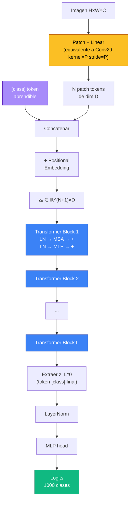
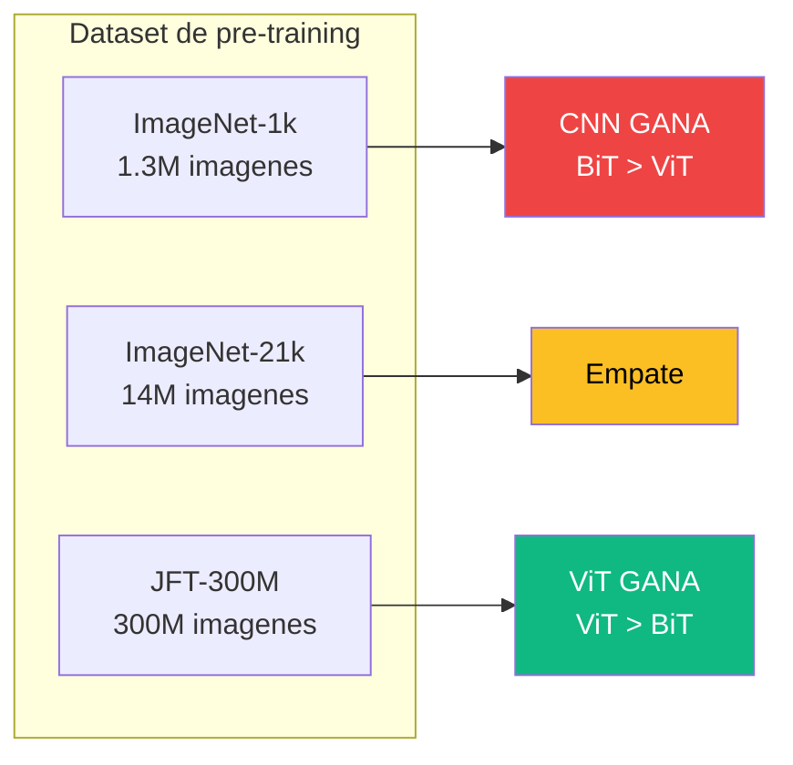

El **Vision Transformer (ViT)** es la arquitectura propuesta por **Dosovitskiy et al. (ICLR 2021, "An Image is Worth 16x16 Words")** que demostro que un Transformer **puro**, sin convoluciones, puede igualar y superar a las mejores CNNs en clasificacion de imagenes — siempre que se entrene con suficientes datos. Es el punto de inflexion que llevo la receta de los **Transformers** desde NLP al dominio visual y abrio la era de los modelos multi-modales (CLIP, DALL-E, SAM).

---

## 1. Motivacion

Para 2020 los Transformers ya dominaban NLP: BERT, GPT-2, T5. La pregunta natural era: **¿funcionarian en vision sin las convoluciones?**

Las CNNs tienen **inductive biases** muy especificos cableados en su arquitectura:

- **Localidad**: un kernel 3x3 solo mira una vecindad pequena.
- **Equivarianza traslacional**: la misma feature en otra posicion produce la misma activacion desplazada.
- **Jerarquia 2D**: la grilla espacial se preserva capa a capa, con receptive fields que crecen.

Estos sesgos son utiles cuando hay pocos datos: ahorran capacidad efectiva del modelo. Pero tambien son **restrictivos** — limitan que tipo de funciones puede aprender la red.


La hipotesis de ViT: **un Transformer puro tiene menos sesgos arquitectonicos**, por lo tanto requiere mas datos para entrenarse, pero **escala mejor** y termina superando a las CNNs cuando hay datos suficientes. Es la apuesta de "menos prior, mas datos, modelo mas general".


---

## 2. El Problema de Aplicar Transformer a Pixeles

Tratar cada pixel como un token es **inviable**. Para una imagen de $224 \times 224 \times 3$:

$$n = 224 \times 224 = 50{,}176 \text{ tokens}$$

La complejidad de la [self-attention](self-attention) es $O(n^2 \cdot d)$. Solo el termino cuadratico es:

$$n^2 = 50{,}176^2 \approx 2.5 \times 10^9 \text{ operaciones por capa por head}$$

Para un modelo de 12 capas y 12 cabezas: $\sim 3.6 \times 10^{11}$ operaciones por imagen, **solo en el calculo de atencion**. Inviable en memoria y compute.

Necesitamos **reducir drasticamente el numero de tokens** sin perder la informacion espacial.

---

## 3. La Solucion: Patches como Tokens

La idea central de ViT es simple: en lugar de pixeles, **dividir la imagen en parches** $P \times P$ y tratar cada parche como un token. Es analogo a dividir un texto en palabras (no caracteres).

Para $P = 16$ y $H = W = 224$:

$$N = \frac{HW}{P^2} = \frac{224 \times 224}{16 \times 16} = 196 \text{ tokens}$$

De 50,176 a **196 tokens**: 256x menos. La atencion ahora es perfectamente tratable.


---

## 4. Patch Embedding

### 4.1 Definicion

Imagen $\mathbf{x} \in \mathbb{R}^{H \times W \times C}$. Dividida en $N = HW/P^2$ parches, cada uno aplanado a un vector de dimension $P^2 \cdot C$.

Para $P = 16$, $C = 3$: cada parche es un vector de $16 \cdot 16 \cdot 3 = 768$ dimensiones.

### 4.2 Proyeccion lineal

Cada parche se proyecta a la dimension del modelo $D$ mediante una matriz aprendible $E \in \mathbb{R}^{(P^2 C) \times D}$:

$$\mathbf{x}_p^{\text{emb}} = [\mathbf{x}_p^1 E; \, \mathbf{x}_p^2 E; \, \ldots; \, \mathbf{x}_p^N E] \in \mathbb{R}^{N \times D}$$

### 4.3 Equivalencia con convolucion


La operacion "dividir en patches + proyectar linealmente" es **matematicamente equivalente** a una convolucion 2D con `kernel_size = P`, `stride = P` y `out_channels = D`. Esto explica por que las implementaciones eficientes usan `nn.Conv2d` para esta etapa: aprovecha kernels CUDA optimizados.


```python
# Ambas formas son equivalentes:
# 1. Reshape + linear
patches = rearrange(img, 'b c (h p1) (w p2) -> b (h w) (p1 p2 c)', p1=P, p2=P)
embeds = patches @ E  # (B, N, D)

# 2. Conv2d (mas rapido en GPU)
embeds = Conv2d(C, D, kernel_size=P, stride=P)(img)  # (B, D, H/P, W/P)
embeds = embeds.flatten(2).transpose(1, 2)            # (B, N, D)
```

---

## 5. El Token [class]

ViT introduce un **token aprendible adicional** que no proviene de ningun parche, prepended al inicio de la secuencia. Es un parametro $\mathbf{x}_{\text{class}} \in \mathbb{R}^D$ que se aprende junto al resto del modelo.

$$\mathbf{z}_0 = [\mathbf{x}_{\text{class}}; \, \mathbf{x}_p^1 E; \, \ldots; \, \mathbf{x}_p^N E]$$

La secuencia tiene ahora $N + 1 = 197$ tokens. Despues de pasar por las $L$ capas del Transformer, **solo se usa la representacion final del token [class]** $\mathbf{z}_L^0$ para clasificar:

$$y = \text{LN}(\mathbf{z}_L^0) \to \text{MLP head}$$

La idea viene directo de **BERT** (`[CLS]` token). Mediante self-attention, este token agrega informacion de todos los parches a lo largo de las capas, actuando como un "resumen aprendido" de la imagen.

**Alternativa**: hacer **global average pooling** sobre todos los $\mathbf{z}_L^i$ (i=1..N) en lugar del token [class]. Funciona casi igual de bien, pero ViT eligio mantener el token para conservar paralelismo total con BERT.

---

## 6. Positional Embedding

Como en cualquier Transformer, la self-attention es **permutation-equivariant**: sin informacion posicional, mezclar el orden de los parches no cambia la salida. Necesitamos sumar [positional encodings](positional-encoding).

ViT usa **positional embeddings aprendibles** $E_{\text{pos}} \in \mathbb{R}^{(N+1) \times D}$ (uno por posicion, incluyendo el token [class]):

$$\mathbf{z}_0 = [\mathbf{x}_{\text{class}}; \, \mathbf{x}_p^1 E; \, \ldots; \, \mathbf{x}_p^N E] + E_{\text{pos}}$$

### 6.1 ¿Codificacion 1D o 2D?

Naturalmente uno pensaria en codificar explicitamente $(\text{row}, \text{col})$ — un encoding 2D. El paper experimenta con tres variantes:

- **Sin pos embedding**: caida grande en accuracy.
- **1D learnable** (default): trata los 196 parches como una secuencia plana.
- **2D learnable** (separar fila/columna): **no mejora** sobre 1D.


**Resultado sorprendente**: el modelo aprende la estructura 2D **del orden secuencial** sin que se la codifiquemos explicitamente. Inspeccionando los embeddings entrenados (Fig. 7 del paper), la similitud coseno entre posiciones cercanas en la grilla 2D es alta — el modelo descubre la geometria por si mismo.


---

## 7. Pipeline Completo

ViT es esencialmente el **Transformer encoder** estandar (Vaswani 2017) aplicado a la secuencia de patch embeddings. Una capa $l$ aplica:

$$\mathbf{z}_l' = \text{MSA}(\text{LN}(\mathbf{z}_{l-1})) + \mathbf{z}_{l-1}$$

$$\mathbf{z}_l = \text{MLP}(\text{LN}(\mathbf{z}_l')) + \mathbf{z}_l'$$

Donde MSA = Multi-head Self-Attention y MLP es un feed-forward de 2 capas con GELU. **Notar**: ViT usa **pre-norm** (LayerNorm antes de cada bloque), no post-norm como el Transformer original — es mas estable para entrenar.

Despues de $L$ capas:

$$y = \text{LN}(\mathbf{z}_L^0) \quad \text{(token [class] de la ultima capa)}$$



---

## 8. Variantes de Tamano

El paper define tres familias, escalando profundidad, ancho y heads (Tabla 1):

| Modelo     | Layers $L$ | Hidden $D$ | Heads $h$ | MLP size | Params |
|------------|------------|------------|-----------|----------|--------|
| ViT-Base   | 12         | 768        | 12        | 3072     | 86M    |
| ViT-Large  | 24         | 1024       | 16        | 4096     | 307M   |
| ViT-Huge   | 32         | 1280       | 16        | 5120     | 632M   |

La notacion **ViT-B/16** significa "Base con patch size 16". Patches mas pequenos (e.g. **/14**) producen secuencias mas largas → mas atencion fina pero mucho mas costoso:

- B/16 → 196 tokens
- B/14 → 256 tokens
- B/8 → 784 tokens (4x mas FLOPs en atencion)

---

## 9. Resultados

Pre-train en **JFT-300M** (~300M imagenes etiquetadas, dataset interno de Google), fine-tune en ImageNet (Tabla 2 del paper):

| Modelo          | ImageNet top-1 | CIFAR-100 | Params  |
|-----------------|----------------|-----------|---------|
| BiT-L (ResNet152x4) | 87.54%     | 93.51%    | 928M    |
| ViT-L/16        | 87.76%         | 93.90%    | 307M    |
| ViT-H/14        | **88.55%**     | **94.55%**| 632M    |

ViT-H/14 establecio **estado del arte en ImageNet** en 2021. Y **ViT-L/16 supera a BiT** (la mejor CNN basada en ResNet) **con ~3x menos parametros y menos compute de pretraining**.

---

## 10. Comparacion con CNN: el Cruce de Datos

El resultado mas importante del paper esta en la **Figura 3-4**: como cambia la performance segun el tamano del dataset de pre-training.



- **Dataset chico** (ImageNet-1k, 1.3M): CNN gana. Los inductive biases (localidad, equivarianza) ayudan a generalizar con pocos datos.
- **Dataset mediano** (ImageNet-21k, 14M): empate.
- **Dataset grande** (JFT-300M): ViT supera consistentemente a las CNNs. Sin sesgos restrictivos, escala mejor.
- **Cruce**: aproximadamente entre 30M y 100M imagenes.


**La leccion**: los inductive biases son una **muleta util cuando hay pocos datos**, pero un **techo cuando hay muchos**. Mas datos + arquitectura mas general > menos datos + arquitectura especializada. Esta es la misma leccion que aprendieron los LLMs en NLP.


---

## 11. Inductive Biases Comparados

| Sesgo                      | CNN                     | ViT                                |
|----------------------------|-------------------------|------------------------------------|
| Localidad                  | Si (kernel 3x3)         | Solo dentro del patch              |
| Equivarianza traslacional  | Si (weight sharing)     | No (pos embed lo rompe)            |
| Jerarquia espacial 2D      | Si (pooling, strides)   | No (secuencia plana)               |
| Atencion global            | No (capas finales solo) | Si (desde la primera capa)         |

ViT tiene **un solo bias 2D**: la proyeccion lineal compartida por todos los parches (analoga a weight sharing convolucional, pero solo dentro de cada patch). Self-attention es **global desde la primera capa** — cualquier parche puede atender a cualquier otro.

Trade-off: **menos sesgos** = mas datos requeridos para evitar overfit, pero **techo mas alto**.

---

## 12. Analisis Interno: ¿Que Aprende ViT?

El paper incluye varios analisis cualitativos (Fig. 6-7) que muestran que ViT **redescubre** muchas propiedades de las CNNs sin estar forzado.

### 12.1 Distancia de atencion por capa

Se mide la **distancia espacial promedio** entre el query y las posiciones a las que atiende cada head:

- **Capas iniciales**: algunos heads tienen distancia muy corta (similar a un kernel 3x3 — atencion local), pero **otros heads atienden globalmente** desde la primera capa. CNN no puede esto.
- **Capas profundas**: todos los heads atienden globalmente. Analogo al receptive field creciente de las CNNs profundas.

### 12.2 Position embeddings aprendidos

Visualizando la similitud coseno entre embeddings de distintas posiciones, **vecinos espaciales (en la grilla 2D) tienen embeddings similares**, y la similitud decae con la distancia. El modelo descubrio la topologia 2D solo a partir del orden 1D y la senal de clasificacion.

### 12.3 Mapas de atencion

Visualizando la atencion del token [class] sobre los parches en la ultima capa, se observa que **se concentra en los objetos relevantes** (gatos, perros, fondos sobresalientes), funcionando como un detector implicito.

---

## 13. Variantes y Descendientes

ViT abrio una familia entera de arquitecturas:

| Modelo      | Ano  | Aporte clave                                                              |
|-------------|------|---------------------------------------------------------------------------|
| **DeiT**    | 2021 | Training data-efficient con destilacion. Mata el requisito de JFT-300M, entrena solo con ImageNet-1k. |
| **Swin**    | 2021 | Atencion en **ventanas locales** con shift entre capas. Jerarquia multi-escala. Detection y segmentation. |
| **MAE**     | 2022 | **Masked Autoencoder**: pre-train enmascarando 75% de los parches y reconstruyendo. Self-supervised. |
| **DINO**    | 2021 | Self-supervised via self-distillation. Features sin etiquetas para segmentacion. |
| **ConvNeXt**| 2022 | Modernizar CNN con trucos de ViT (kernels grandes, GELU, LayerNorm). Compite de tu a tu. |
| **CLIP**    | 2021 | ViT como image encoder de modelo multi-modal. Zero-shot classification.   |

Para 2023, **ViT y derivados son el estandar** en grandes modelos visuales y multi-modales (SAM, DINOv2, CLIP, Flamingo).

---

## 14. Implementacion en Tres Frameworks

### 14.1 Patch Embedding y ViT minimal



```python
import torch
import torch.nn as nn

class PatchEmbedding(nn.Module):
    def __init__(self, img_size=224, patch_size=16, in_chans=3, embed_dim=768):
        super().__init__()
        self.n_patches = (img_size // patch_size) ** 2
        # Conv2d con stride=patch_size es equivalente a "split + linear"
        self.proj = nn.Conv2d(in_chans, embed_dim,
                              kernel_size=patch_size, stride=patch_size)

    def forward(self, x):  # x: (B, C, H, W)
        x = self.proj(x)               # (B, D, H/P, W/P)
        x = x.flatten(2).transpose(1, 2)  # (B, N, D)
        return x


class ViT(nn.Module):
    def __init__(self, img_size=224, patch_size=16, in_chans=3,
                 embed_dim=768, depth=12, n_heads=12, mlp_ratio=4.,
                 num_classes=1000):
        super().__init__()
        self.patch_embed = PatchEmbedding(img_size, patch_size, in_chans, embed_dim)
        n_patches = self.patch_embed.n_patches

        self.cls_token = nn.Parameter(torch.zeros(1, 1, embed_dim))
        self.pos_embed = nn.Parameter(torch.zeros(1, n_patches + 1, embed_dim))

        encoder_layer = nn.TransformerEncoderLayer(
            d_model=embed_dim, nhead=n_heads,
            dim_feedforward=int(embed_dim * mlp_ratio),
            activation="gelu", batch_first=True, norm_first=True,
        )
        self.blocks = nn.TransformerEncoder(encoder_layer, num_layers=depth)
        self.norm = nn.LayerNorm(embed_dim)
        self.head = nn.Linear(embed_dim, num_classes)

        nn.init.trunc_normal_(self.pos_embed, std=0.02)
        nn.init.trunc_normal_(self.cls_token, std=0.02)

    def forward(self, x):
        B = x.shape[0]
        x = self.patch_embed(x)                         # (B, N, D)
        cls = self.cls_token.expand(B, -1, -1)          # (B, 1, D)
        x = torch.cat([cls, x], dim=1)                  # (B, N+1, D)
        x = x + self.pos_embed                          # (B, N+1, D)
        x = self.blocks(x)                              # (B, N+1, D)
        x = self.norm(x[:, 0])                          # token [class]
        return self.head(x)                             # (B, num_classes)
```



```python
import jax
import jax.numpy as jnp
import flax.linen as nn

class PatchEmbedding(nn.Module):
    patch_size: int = 16
    embed_dim: int = 768

    @nn.compact
    def __call__(self, x):  # x: (B, H, W, C)  Flax usa channels-last
        x = nn.Conv(
            features=self.embed_dim,
            kernel_size=(self.patch_size, self.patch_size),
            strides=(self.patch_size, self.patch_size),
            padding="VALID",
        )(x)                                  # (B, H/P, W/P, D)
        B, h, w, D = x.shape
        return x.reshape(B, h * w, D)         # (B, N, D)


class TransformerBlock(nn.Module):
    embed_dim: int
    n_heads: int
    mlp_ratio: float = 4.

    @nn.compact
    def __call__(self, x):
        h = nn.LayerNorm()(x)
        h = nn.MultiHeadDotProductAttention(num_heads=self.n_heads)(h, h)
        x = x + h
        h = nn.LayerNorm()(x)
        h = nn.Dense(int(self.embed_dim * self.mlp_ratio))(h)
        h = nn.gelu(h)
        h = nn.Dense(self.embed_dim)(h)
        return x + h


class ViT(nn.Module):
    img_size: int = 224
    patch_size: int = 16
    embed_dim: int = 768
    depth: int = 12
    n_heads: int = 12
    num_classes: int = 1000

    @nn.compact
    def __call__(self, x):
        B = x.shape[0]
        n_patches = (self.img_size // self.patch_size) ** 2

        x = PatchEmbedding(self.patch_size, self.embed_dim)(x)   # (B, N, D)
        cls = self.param("cls_token", nn.initializers.zeros, (1, 1, self.embed_dim))
        pos = self.param("pos_embed", nn.initializers.normal(0.02),
                         (1, n_patches + 1, self.embed_dim))

        cls = jnp.broadcast_to(cls, (B, 1, self.embed_dim))
        x = jnp.concatenate([cls, x], axis=1) + pos              # (B, N+1, D)

        for _ in range(self.depth):
            x = TransformerBlock(self.embed_dim, self.n_heads)(x)

        x = nn.LayerNorm()(x[:, 0])
        return nn.Dense(self.num_classes)(x)
```



```python
import tensorflow as tf
from tensorflow.keras import layers, Model

class PatchEmbedding(layers.Layer):
    def __init__(self, patch_size=16, embed_dim=768, **kwargs):
        super().__init__(**kwargs)
        self.proj = layers.Conv2D(
            filters=embed_dim,
            kernel_size=patch_size,
            strides=patch_size,
            padding="valid",
        )

    def call(self, x):  # x: (B, H, W, C)
        x = self.proj(x)                              # (B, H/P, W/P, D)
        B = tf.shape(x)[0]
        return tf.reshape(x, (B, -1, x.shape[-1]))    # (B, N, D)


class TransformerBlock(layers.Layer):
    def __init__(self, embed_dim, n_heads, mlp_ratio=4., **kwargs):
        super().__init__(**kwargs)
        self.ln1 = layers.LayerNormalization()
        self.attn = layers.MultiHeadAttention(
            num_heads=n_heads, key_dim=embed_dim // n_heads
        )
        self.ln2 = layers.LayerNormalization()
        self.mlp = tf.keras.Sequential([
            layers.Dense(int(embed_dim * mlp_ratio), activation="gelu"),
            layers.Dense(embed_dim),
        ])

    def call(self, x):
        h = self.ln1(x)
        x = x + self.attn(h, h)
        x = x + self.mlp(self.ln2(x))
        return x


class ViT(Model):
    def __init__(self, img_size=224, patch_size=16, embed_dim=768,
                 depth=12, n_heads=12, num_classes=1000, **kwargs):
        super().__init__(**kwargs)
        self.n_patches = (img_size // patch_size) ** 2
        self.patch_embed = PatchEmbedding(patch_size, embed_dim)

        self.cls_token = self.add_weight(
            "cls_token", shape=(1, 1, embed_dim),
            initializer="zeros", trainable=True,
        )
        self.pos_embed = self.add_weight(
            "pos_embed", shape=(1, self.n_patches + 1, embed_dim),
            initializer=tf.keras.initializers.TruncatedNormal(stddev=0.02),
            trainable=True,
        )

        self.blocks = [TransformerBlock(embed_dim, n_heads) for _ in range(depth)]
        self.norm = layers.LayerNormalization()
        self.head = layers.Dense(num_classes)

    def call(self, x):
        B = tf.shape(x)[0]
        x = self.patch_embed(x)                               # (B, N, D)
        cls = tf.broadcast_to(self.cls_token, (B, 1, x.shape[-1]))
        x = tf.concat([cls, x], axis=1) + self.pos_embed      # (B, N+1, D)
        for blk in self.blocks:
            x = blk(x)
        x = self.norm(x[:, 0])
        return self.head(x)
```



---

## 15. Resumen

- **ViT** demuestra que un Transformer puro, sin convoluciones, puede dominar vision **si tiene suficientes datos**.
- La idea clave es trivial pero potente: **patches como tokens**. Imagen 224x224 → 196 tokens, atencion ahora tractable.
- Necesita tres ingredientes: **patch embedding** (equivalente a Conv2d kernel=stride=P), **token [class]** (a la BERT), **positional embeddings aprendibles**.
- Bajo dataset chico, las CNNs ganan por sus inductive biases. Bajo dataset grande (JFT-300M), ViT supera. Cruce ~100M imagenes.
- Pre-norm Transformer, GELU, AdamW, fine-tuning a alta resolucion son detalles practicos que importan.
- Descendientes **DeiT, Swin, MAE, DINO, CLIP** transformaron a ViT en el estandar de vision moderna.


**Lectura conceptual**: ViT es el equivalente visual de la receta GPT/BERT. Misma arquitectura (Transformer encoder), distinta tokenizacion. La unificacion arquitectonica entre vision y lenguaje fue el ingrediente que hizo posibles los **modelos multi-modales** de la generacion siguiente (CLIP, DALL-E 2, GPT-4V).


---

## Ver tambien

- [Self-Attention](self-attention) — el bloque que hace todo el trabajo dentro de cada layer.
- [Transformer](transformer) — la arquitectura completa que ViT adapta sin cambios estructurales.
- [Redes Convolucionales](redes-convolucionales) — el incumbente al que ViT desafio.
- [Positional Encoding](positional-encoding) — comparativa entre encodings sinusoidales, aprendidos 1D/2D.
- [Transfer Learning](transfer-learning) — pre-train en JFT, fine-tune downstream: receta esencial para ViT.
- [Paper: Dosovitskiy et al. 2021](/papers/vit-dosovitskiy-2021) — paper original.
- [Clase 14 — Transformers](/clases/clase-14) — donde introducimos la familia completa.
