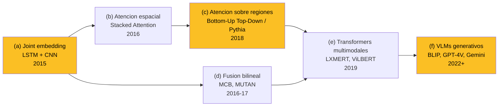
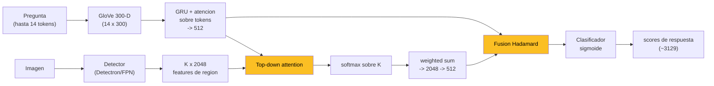

El **Visual Question Answering (VQA)** consiste en, dada una **imagen** y una **pregunta en lenguaje natural** sobre ella, producir una **respuesta en lenguaje natural**. La formulación es engañosamente simple — "¿de qué color es el plátano?", "¿cuántas personas hay?", "¿está lloviendo?" — pero exige al sistema combinar percepción visual, comprensión del lenguaje, conocimiento del mundo y razonamiento. Por eso se le considera una tarea **"AI-complete"**: para responder bien una pregunta arbitraria sobre una imagen arbitraria hay que dominar simultáneamente visión, lenguaje y sentido común, los tres pilares que históricamente se estudiaron por separado en la IA.

VQA nació en 2015 (Antol et al.) como una reacción crítica al *image captioning*: si un modelo puede generar descripciones plausibles explotando solo estadísticas del lenguaje (las playas mencionan arena, las cocinas mencionan platos), entonces el captioning no prueba comprensión visual genuina. VQA propone un test más exigente y, crucialmente, **automáticamente evaluable**: una pregunta cerrada con respuesta corta cuya corrección se mide por consenso humano. Es una versión moderna del Test de Turing visual. Desde entonces, VQA se ha convertido en uno de los **benchmarks estándar de razonamiento multimodal**, reportado desde los baselines LSTM+CNN de 2015 hasta los grandes Vision-Language Models (VLMs) como GPT-4V, Gemini y Claude.

Como combina visión y lenguaje, VQA es un concepto **transversal** que toca clasificación de imágenes, detección de objetos, embeddings de palabra, atención, Transformers y modelos generativos. Es el fundamento transversal de la [Clase 23](/clases/clase-23) y se conecta directamente con el [dominio Multimodal](/dominios/multimodal).

---

## 1. Qué es VQA y por qué importa

### 1.1 Formulación de la tarea

Formalmente, un sistema VQA recibe:

- una **imagen** $I$,
- una **pregunta en lenguaje natural** $q$ sobre esa imagen,

y debe producir una **respuesta** $a$. El paper fundacional ([Antol 2015](/papers/vqa-antol-2015)) define dos modalidades de evaluación:

1. **Open-ended (abierta):** el sistema genera una respuesta libre. En la práctica los modelos clásicos la implementan como **clasificación sobre las $K$ respuestas más frecuentes** del dataset (típicamente $K=1000$ a $3129$), pero conceptualmente la respuesta puede ser cualquier cadena. Es la modalidad más realista y la dominante hoy.
2. **Multiple-choice (selección múltiple):** el sistema elige entre 18 respuestas candidatas predefinidas por pregunta. Más fácil de evaluar y útil para modelos que no generan texto, pero menos representativa del problema real.

### 1.2 Tipos de respuesta

Una taxonomía tripartita, introducida en Antol 2015 y que se volvió canónica, agrupa las respuestas en:

| Tipo de respuesta | Descripción | Ejemplo de pregunta |
| --- | --- | --- |
| **Yes/No** | Respuesta binaria (a veces "maybe") | "¿Está rota la pizza?" |
| **Number** | Una cantidad numérica | "¿Cuántas porciones hay?" |
| **Other** | Todo lo demás: colores, objetos, lugares, acciones | "¿De qué color son sus ojos?" |

Esta división no es arbitraria: cada tipo activa mecanismos cognitivos distintos (verificación binaria, conteo, reconocimiento abierto) y los modelos rinden muy diferente en cada uno. Casi todas las tablas de resultados de la literatura reportan accuracy desagregada en estas tres columnas más el "All" global.

### 1.3 Por qué la brevedad es una virtud de diseño

En VQA v1, el **89,32 %** de las respuestas en imágenes reales son de **una sola palabra** (6,91 % de dos palabras, 2,74 % de tres). Esto no es un accidente: es la propiedad que hace la tarea **tratable de evaluar**. Si las respuestas fueran oraciones largas, habría que recurrir a métricas blandas (BLEU, METEOR, CIDEr) que correlacionan mal con el juicio humano. Al ser cortas, la **coincidencia exacta con respuestas humanas** se vuelve una métrica fiable. La riqueza del problema sobrevive (las preguntas son arbitrarias y exigen razonamiento), pero la medición se simplifica.


VQA cumple tres criterios que lo hacen un benchmark "AI-complete" ideal: (1) requiere **conocimiento multimodal** genuino (no basta solo visión ni solo lenguaje); (2) tiene una **métrica cuantitativa bien definida**; y (3) es **automáticamente evaluable** sin jueces humanos costosos por cada predicción. El captioning falla en (2) y (3).


---

## 2. Datasets

El campo VQA vive de sus datasets. Cada uno ataca una debilidad del anterior, en una progresión que cuenta la historia del subcampo.

### 2.1 VQA v1 (Antol 2015)

El dataset fundacional. Combina dos fuentes de imágenes:

- **Imágenes reales:** 204.721 imágenes de **MS COCO**, elegidas por sus escenas ricas en múltiples objetos.
- **Escenas abstractas (clipart):** 50.000 escenas sintéticas que eliminan la visión de bajo nivel (segmentación, detección ruidosa) para aislar el **razonamiento de alto nivel**.

Recolectado vía Amazon Mechanical Turk con **3 preguntas por imagen** y **10 respuestas por pregunta** (de 10 anotadores únicos distintos al autor de la pregunta). Total: ~0,76 M preguntas y ~10 M respuestas. Las 10 respuestas por pregunta son una decisión de diseño clave: capturan la **distribución de respuestas legítimas** (ante "¿de qué color es la mesa?", "white", "tan" y "off-white" pueden ser todas correctas) y habilitan la métrica de consenso.

### 2.2 VQAv2 (Goyal 2017) — el dataset balanceado

VQA v1 tenía un pecado original: los **language priors** (ver sección 3). [Goyal et al. 2017](/papers/vqav2-goyal-2017) lo corrigen con una intervención quirúrgica sobre los datos. Para cada triplete $(I, Q, A)$ buscan **otra imagen $I'$ semánticamente similar** (vecina en el espacio fc7 de VGGNet) para la cual **la misma pregunta $Q$ tiene una respuesta distinta** $A' \neq A$. El dataset resultante:

- ~1,1 millones de pares (imagen, pregunta), casi el doble de v1.
- ~13 millones de respuestas asociadas.
- La **entropía de $P(A \mid \text{tipo de }Q)$ aumenta un 56 %** respecto a v1.

Es el **benchmark estándar de facto** desde 2017. El VQA Challenge corre sobre VQAv2 desde ese año y es el dataset sobre el que se entrena [Pythia](/papers/pythia-jiang-2018).

### 2.3 GQA, OK-VQA, TextVQA y otros

La segunda generación de datasets ataca habilidades específicas:

| Dataset | Año | Foco | Aporte distintivo |
| --- | --- | --- | --- |
| **VQA v1** (Antol) | 2015 | General | Define la tarea, métrica y baseline LSTM+CNN. |
| **VQAv2** (Goyal) | 2017 | General balanceado | Pares de imágenes complementarias; mata el atajo del lenguaje. |
| **CLEVR** (Johnson) | 2017 | Razonamiento composicional | Escenas sintéticas con preguntas multi-paso ("¿hay más cubos rojos que cilindros?"). Diagnóstico puro. |
| **GQA** (Hudson) | 2019 | Composicionalidad sobre imágenes reales | Preguntas generadas a partir de *scene graphs*; métricas de consistencia y validez. |
| **OK-VQA** (Marino) | 2019 | Conocimiento externo | Preguntas que requieren **conocimiento fuera de la imagen** (sentido común, hechos del mundo). No basta con mirar. |
| **TextVQA** (Singh) | 2019 | Lectura de texto en escena | Preguntas cuya respuesta está en **texto dentro de la imagen** (carteles, etiquetas). Une VQA con [Scene Text Recognition](/fundamentos/scene-text-recognition). |
| **VizWiz** (Gurari) | 2018 | Accesibilidad real | Fotos tomadas por personas ciegas, preguntas auténticas, imágenes de baja calidad. |

CLEVR aísla el **razonamiento composicional** con un mundo sintético controlado; GQA lo lleva a imágenes reales con métricas más finas; OK-VQA fuerza al modelo a usar conocimiento externo; TextVQA añade la dimensión de lectura. Cada uno expone una grieta distinta del paradigma VQA estándar.

---

## 3. El problema de los language priors

Este es, retrospectivamente, el aporte conceptual más importante del campo. En VQA v1, un modelo que **ignora completamente la imagen** (solo lee la pregunta) alcanza **48,76 %** de accuracy open-ended — superando incluso al baseline de nearest neighbor que sí usa la imagen, y muy por encima del modelo de solo-imagen (28,13 %, peor que el prior trivial "yes" con 29,66 %).

### 3.1 Qué está pasando

El dataset, construido por humanos, hereda los **sesgos del mundo y del lenguaje**:

- Los plátanos suelen ser amarillos → "¿de qué color es el plátano?" → "yellow" casi siempre acierta.
- "How many..." se responde "2" el 26-39 % de las veces.
- "What sport is..." → "tennis" el 41 % de las veces (en v1).
- "Is there a clock..." → "yes" el **98 %** de las veces.
- "Do you see a ..." → responder ciegamente "yes" da **87 %** de VQA accuracy.

El modelo puede memorizar la distribución condicional $P(A \mid \text{n-grama}(Q))$ y "hacer trampa": responder bien **sin nunca mirar la imagen**. La tarea diseñada como "visual" se resuelve parcialmente como NLP puro. Esto es grave porque **infla las capacidades aparentes** y da una falsa impresión de progreso: el benchmark premia el atajo equivocado.

### 3.2 Cómo VQAv2 lo mitiga

La clave técnica de Goyal et al. es que **no basta con uniformizar $P(A)$** (la marginal de respuestas). Aunque "yes" y "no" aparecieran 50/50 globalmente, los modelos seguirían explotando $P(A \mid Q)$. Lo que se necesita es **alta entropía en $P(A \mid Q)$**, balanceando **a nivel de cada pregunta individual**.

El balanceo con imágenes complementarias logra justo eso. Considera un modelo ciego que ve $(Q, I)$ y $(Q, I')$: como $Q$ es idéntica y el modelo ignora la imagen, **no tiene forma de diferenciar los dos casos**. Producirá la misma respuesta para ambos y, por construcción, una estará mal. Al re-evaluar modelos de v1 sobre VQAv2, todos **caen ~6-7 puntos** (MCB: 60,36 → 54,22), y la caída se concentra en las preguntas Yes/No (~11-12 puntos), la firma inequívoca del prior.


La línea conceptual es nítida: Antol 2015 **descubre** el problema (modelo ciego con ~49 %) → VQAv2 lo **corrige en los datos** (pares complementarios, +56 % entropía) → Pythia y los modelos modernos lo **combaten en la arquitectura** (atención, features de detección). Entender los language priors es entender por qué existe toda la maquinaria moderna de VQA.


Aun así, el balanceo **no es perfecto**: el 22 % de las preguntas resulta "not possible" (ningún vecino sirve) y el 9 % termina con $A = A'$. Por eso los language priors **persisten parcialmente** incluso en VQAv2, y benchmarks aún más agresivos como **VQA-CP** (priors deliberadamente invertidos entre train y test) muestran que modelos como Pythia todavía dependen de ellos.

---

## 4. La métrica de evaluación por consenso

Para la tarea open-ended, la accuracy de una respuesta predicha se define como:

$$
\text{acc}(a) = \min\!\left(\frac{\#\,\text{humanos que dieron } a}{3},\ 1\right)
$$

Es decir, una respuesta es **100 % correcta si al menos 3 de los 10 anotadores la dieron**. Si solo 1 la dio, recibe $1/3 \approx 0{,}33$; si 2, $2/3 \approx 0{,}67$; si 3 o más, $1{,}0$. Antes de comparar, todas las respuestas se **normalizan**: minúsculas, números a dígitos, sin puntuación ni artículos.

### 4.1 Por qué se diseñó así

1. **Robustez ante discrepancias legítimas.** Varios colores pueden ser correctos para "¿de qué color es la mesa?". Exigir coincidencia con *una* sola referencia sería injusto; el consenso de 3/10 captura "una respuesta es correcta si una fracción razonable de humanos coincide".
2. **Evita métricas blandas problemáticas.** Los autores rechazan explícitamente Word2Vec ("agrupa palabras que queremos distinguir, como 'left' y 'right'") y BLEU/ROUGE (degeneran a coincidencia exacta con respuestas de una palabra y correlacionan mal con el juicio humano).
3. **Consistencia con el techo humano.** Para comparar máquina vs. humano sin sesgo, las accuracies de máquina se promedian sobre los $\binom{10}{9}$ subconjuntos de 9 anotadores, evitando que el modelo "vea" su propia referencia.

### 4.2 Implicación arquitectónica: clasificación multi-etiqueta

Como una pregunta puede tener varias respuestas con crédito parcial, VQA es naturalmente un problema de **clasificación multi-etiqueta con etiquetas blandas**. La etiqueta de cada respuesta candidata $a$ es un score $s_a = \min(\#\text{votos}/3, 1) \in [0,1]$, y el modelo se entrena con **binary cross-entropy con activación sigmoide** (no softmax) sobre el vocabulario de respuestas:

$$\mathcal{L} = -\sum_{a \in \mathcal{A}} \big[\, s_a \log \hat{y}_a + (1 - s_a)\log(1 - \hat{y}_a) \,\big]$$

La sigmoide permite que **varias respuestas reciban crédito simultáneamente**, alineándose con la naturaleza multi-anotador del dataset. Esta elección, popularizada por Teney et al. ("Tips and Tricks for VQA"), es un truco clave de la era up-down y la que usa Pythia.

El **techo humano** en VQA v1 es 83,30 % (imágenes reales). El mejor baseline de 2015 lograba 58,16 % — una brecha de ~25 puntos que confirmaba que VQA estaba lejos de resuelto, exactamente la propiedad "AI-complete" buscada.

---

## 5. Arquitecturas: la evolución

La historia arquitectónica de VQA recorre seis paradigmas, cada uno mejorando cómo se **fusiona** la visión con el lenguaje y dónde y cómo se **atiende** a la imagen.

### (a) Joint embedding LSTM + CNN (2015)

El baseline fundacional **deeper LSTM Q + norm I** de Antol et al.:

1. La pregunta pasa palabra a palabra por una **LSTM de dos capas** → embedding de 1024-D.
2. La imagen pasa por **VGGNet** (congelado), se toman 4096 activaciones, se normalizan en $\ell_2$ y se proyectan a 1024-D.
3. **Fusión por producto elemento a elemento** (Hadamard) de los dos vectores. La ablación del paper muestra que esta fusión multiplicativa supera a la concatenación en +0,95 % con la mitad de parámetros.
4. Un **MLP + softmax** sobre las $K=1000$ respuestas más frecuentes.

El cuello de botella: la imagen se resume en **un solo vector global**, sin localización. No puede "mirar" la región relevante para la pregunta.

### (b) Atención espacial — Stacked Attention (2016)

[Stacked Attention Networks](/papers/stacked-attention-yang-2016) (Yang 2016) introduce la primera atención visual influyente para VQA. En lugar de un vector global, la imagen se representa como una **grilla** de features convolucionales (p. ej. $14\times14\times512$), y la pregunta genera una **distribución de atención espacial** sobre esa grilla, enfocándose en las celdas relevantes. El "stacked" se refiere a aplicar atención en **múltiples capas** para razonamiento multi-paso: una primera pasada localiza groseramente, una segunda refina.

### (c) Atención sobre regiones — Bottom-Up Top-Down y Pythia (2018)

El salto clave de [Bottom-Up Attention](/papers/bottom-up-attention-anderson-2018) (Anderson 2018) es **reemplazar la grilla uniforme por las regiones propuestas por un detector de objetos**. En lugar de atender a celdas arbitrarias, el modelo atiende a **objetos semánticamente coherentes**:

- **Bottom-up (data-driven):** un Faster R-CNN preentrenado en Visual Genome propone $K$ regiones salientes, cada una un vector de 2048-D. Es la atención "natural" — ciertos objetos saltan a la vista.
- **Top-down (task-driven):** la pregunta guía *cuáles* de esas $K$ regiones merecen atención. Es la atención "voluntaria", modulada por el objetivo.

[Pythia](/papers/pythia-jiang-2018) (Jiang 2018) es la reimplementación afinada que ganó el VQA Challenge 2018. Se detalla en la sección 6.

### (d) Fusión bilineal — MCB y MUTAN (2016-2017)

Una línea paralela ataca **cómo fusionar** las modalidades. La fusión ideal sería el **pooling bilineal** $q^\top W \hat{v}$, que captura todas las interacciones de segundo orden entre texto y visión — pero el tensor $W$ es gigantesco (millones de parámetros).

- [MCB](/papers/mcb-fukui-2016) (Multimodal Compact Bilinear Pooling, Fukui 2016): aproxima el producto exterior bilineal proyectando a un espacio de menor dimensión vía **Count Sketch** y multiplicando en el dominio de Fourier (FFT). Ganó el VQA Challenge 2016.
- [MUTAN](/papers/mutan-ben-younes-2017) (Ben-younes 2017): usa una **descomposición de Tucker** del tensor bilineal para controlar explícitamente la complejidad, factorizando la interacción en proyecciones de bajo rango.

El producto de **Hadamard** que usa Pythia es la versión más barata de esta familia: equivale a forzar $W$ a ser **diagonal** — mucho menos parámetros, casi todo el beneficio.

### (e) Transformers multimodales (2019)

**ViLBERT** y **LXMERT** (ambos 2019) reemplazan la atención top-down de una sola pasada por **co-atención cruzada multicapa** entre tokens de texto y regiones de imagen. Se **preentrenan** con objetivos tipo BERT (masked language modeling, masked region modeling, image-text matching) sobre grandes corpus imagen-texto, y luego se hace fine-tuning en VQA. Superaron a Pythia y se generalizaron a muchas tareas multimodales. Ver [Transformer](/fundamentos/transformer).

### (f) VLMs generativos (2022+)

**BLIP / BLIP-2**, Flamingo, LLaVA y los modelos comerciales **GPT-4V, Gemini y Claude** con visión responden preguntas sobre imágenes de forma **conversacional, en lenguaje natural libre**, sin la restricción de las top-$K$ respuestas. Se detallan en la sección 8.

### Tabla resumen de paradigmas

| Paradigma | Representación de imagen | Fusión | Salida | Hito |
| --- | --- | --- | --- | --- |
| Joint embedding | Vector global (VGG) | Hadamard | Softmax $K$ | Antol 2015 |
| Atención espacial | Grilla $14\times14$ | Suma ponderada | Softmax $K$ | SAN 2016 |
| Atención sobre regiones | $K\times2048$ (detector) | Hadamard | Sigmoide $K$ | BUTD / Pythia 2018 |
| Fusión bilineal | Grilla o regiones | Bilinear (MCB/Tucker) | Softmax $K$ | MCB 2016, MUTAN 2017 |
| Transformer multimodal | Regiones + co-atención | Self/cross-attention | Clasificación | LXMERT, ViLBERT 2019 |
| VLM generativo | Patches / Q-Former | Atención + LLM | Texto libre | BLIP, GPT-4V 2022+ |

---

## 6. Pythia en detalle

[Pythia](/papers/pythia-jiang-2018) es el modelo central de la [Clase 23](/clases/clase-23) y el ejemplo canónico de un sistema VQA "clásico" (era pre-Transformers). Es una reimplementación modular y afinada de Bottom-Up Top-Down que llevó la accuracy en VQAv2 de **65,67 %** (BUTD baseline) a **70,24 %** (single model) y **72,27 %** (ensemble de 30 modelos diversos), ganando el VQA Challenge 2018 — sin arquitectura nueva, solo ingeniería incremental.

### 6.1 Arquitectura paso a paso

1. **Embedding de la pregunta.** Hasta 14 tokens → embeddings **GloVe de 300-D** → **GRU** que produce un estado de 512-D. Pythia añade un módulo de **atención sobre los tokens** de la pregunta (no toma solo el último estado). Ver [word embeddings](/fundamentos/word-embeddings) y [LSTM y GRU](/fundamentos/lstm-gru).

2. **Características de imagen.** El detector (Detectron con FPN, backbone ResNeXt) produce $V \in \mathbb{R}^{K \times 2048}$ — un vector de 2048-D por cada una de las $K$ regiones. La mejor configuración usa $K = 100$ cajas fijas por imagen.

3. **Top-down attention.** Combina el vector de pregunta $q$ (512) con cada $v_i$ (2048), calcula logits de atención $a_i = w_a^\top f_a(W_v v_i \circ W_q q)$ con ReLU + weight normalization, aplica **softmax sobre las $K$ regiones**:

$$\alpha_i = \frac{\exp(a_i)}{\sum_{j=1}^K \exp(a_j)}, \qquad \hat{v} = \sum_{i=1}^K \alpha_i v_i$$

y proyecta $\hat{v}$ (2048-D) a 512-D. Ver [mecanismo de atención](/fundamentos/mecanismo-atencion).

4. **Fusión multimodal por Hadamard.** Las dos representaciones de 512-D se combinan por **multiplicación elemento a elemento**:

$$h = (W_q' q) \circ (W_v' \hat{v}), \qquad h \in \mathbb{R}^{5000}$$

(el mejor hidden size es 5000). El Hadamard "mezcla información multimodal sin aumentar la dimensión": captura interacciones multiplicativas de segundo orden que la concatenación (solo aditiva) no puede.

5. **Clasificador sigmoide multi-etiqueta.** El vector fusionado pasa por capas lineales y una **sigmoide** que emite un score independiente en $[0,1]$ por cada respuesta del vocabulario (~3129 respuestas frecuentes):

$$\hat{y} = \sigma\big(W_2\, g(W_1 h)\big) \in [0,1]^{|\mathcal{A}|}$$

### 6.2 Las mejoras de Pythia sobre BUTD

El paper es un manual de ingeniería de VQA. Cada peldaño suma accuracy en VQAv2 test-dev:

| Mejora | test-dev |
| --- | --- |
| BUTD baseline (2017) | 65,32 |
| + weight norm + ReLU + Hadamard + GloVe | 66,91 |
| + learning schedule con warmup | 68,05 |
| + Detectron & fine-tuning | 68,49 |
| + data augmentation (Visual Genome, VisDial, mirroring) | 69,24 |
| + grid features | 69,81 |
| + 100 bboxes fijos | 70,01 |
| Ensemble 30× diverso | **72,18** |

Lección metodológica perdurable: el **learning rate schedule**, la **fusión**, la **data augmentation** y el **ensembling diverso** valieron tantos puntos como cualquier "arquitectura nueva".

---

## 7. Limitaciones persistentes

Las fallas de Pythia (que la Clase 23 usa pedagógicamente) son **consecuencias del paradigma up-down**, no accidentes:

- **Language priors residuales.** A pesar de VQAv2 balanceado, el modelo sigue explotando correlaciones del lenguaje: ante "is it a cat?" tiende a responder "yes" casi siempre. La fusión Hadamard y el clasificador sigmoide no imponen ninguna restricción que obligue a verificar visualmente la presencia del objeto.

- **Conteo y composicionalidad.** El modelo falla en "are there two cats?". La atención top-down produce una **suma ponderada** $\hat{v} = \sum_i \alpha_i v_i$ que **colapsa las $K$ regiones en un único vector**: ese promedio **destruye la información de cardinalidad** (cuántas instancias distintas se activaron). Contar requiere preservar identidades de instancia, algo que un soft attention + suma ponderada no hace. El conteo ("Number") rinde ~36-38 % incluso para los mejores modelos clásicos — el talón de Aquiles histórico del campo, ya señalado en Antol 2015.

- **Binding de atributos.** "The red cup next to the blue plate" confunde al modelo, porque la asociación atributo-objeto (*binding*) no está modelada explícitamente; la atención difusa no garantiza ligar el color correcto al objeto correcto.

- **Razonamiento espacial.** Preguntas sobre relaciones espaciales ("¿qué hay a la izquierda de la silla?") exigen entender geometría relativa, débil en features de región agregadas.

- **Vocabulario de respuestas cerrado.** El clasificador opera sobre un **vocabulario fijo** (~3129 respuestas). Toda respuesta fuera de ese conjunto es **inalcanzable**: el modelo clasifica, no genera lenguaje. Una pregunta cuya respuesta no esté en el vocabulario tiene accuracy 0 garantizada.

Estas limitaciones —junto con la persistencia de sesgos demostrada por VQA-CP— son exactamente lo que motiva la transición a Transformers multimodales y, sobre todo, a los VLMs generativos.

---

## 8. VQA en la era de los VLMs

Los grandes Vision-Language Models cambiaron el paradigma. En lugar de clasificar sobre un vocabulario cerrado, **generan la respuesta como texto libre**, y muchos lo hacen **zero-shot** (sin fine-tuning específico en VQA).

### 8.1 Cómo lo hacen

El patrón dominante (BLIP-2, LLaVA, GPT-4V, Gemini, Claude) acopla un **encoder visual** congelado (típicamente un [ViT](/papers/vit-dosovitskiy-2020)) con un **LLM** preentrenado, mediante un puente que proyecta las features visuales al espacio de embeddings del lenguaje:

- **BLIP-2** introduce el **Q-Former**, un Transformer ligero con queries aprendibles que extrae las features visuales más relevantes y las inyecta como tokens al LLM. Congela tanto el ViT como el LLM, entrenando solo el puente.
- **LLaVA** usa una simple proyección lineal/MLP del encoder CLIP al espacio del LLM, más instruction tuning con datos de conversación visual.
- **GPT-4V / Gemini / Claude** integran visión nativamente en LLMs de gran escala, respondiendo preguntas sobre imágenes de forma conversacional.

La imagen se convierte en una secuencia de tokens visuales que se concatena con la pregunta tokenizada; el LLM genera la respuesta autoregresivamente.

### 8.2 Qué cambia y qué no

- **Vocabulario abierto.** Ya no hay restricción de top-$K$ respuestas; el modelo puede generar cualquier cadena, incluyendo explicaciones y cadenas de razonamiento (chain-of-thought visual).
- **Conocimiento del mundo.** El LLM aporta conocimiento externo masivo, resolviendo tareas tipo OK-VQA que los modelos clásicos no podían.
- **Conteo y razonamiento espacial mejoran**, pero siguen siendo débiles relativos a la percepción de objetos: los VLMs aún cometen errores de conteo y de relaciones espaciales finas.
- **Lo que no cambia:** la tarea es conceptualmente la misma que Antol et al. definieron en 2015. **VQAv2 sigue siendo un benchmark reportado** para evaluar VLMs, con la misma fórmula de consenso $\min(\#/3, 1)$. El paper de 2015 no solo creó un dataset: creó **una forma de pensar la comprensión visual** como pregunta-respuesta.


La evolución es una espiral: del **vocabulario cerrado** (clasificación sobre $K$ respuestas, 2015-2019) al **vocabulario abierto** (generación de texto libre, 2022+). Pero la pregunta sigue siendo la misma, la métrica de consenso sigue siendo válida, y los problemas duros (conteo, composicionalidad, razonamiento espacial, sesgos) **no se han resuelto del todo** — solo se han atenuado.


---

## 9. Conexión con el lab-23 y otras clases

### 9.1 Lab-23 (BLIP)

El [Laboratorio 23](/laboratorios/lab-23) usa **BLIP**, un VLM generativo, para hacer VQA en la práctica. Es el contraste perfecto con Pythia: donde Pythia clasifica sobre un vocabulario cerrado con detección + atención + Hadamard, BLIP **genera la respuesta como texto** con un encoder-decoder multimodal preentrenado. El lab permite ver de primera mano cómo un VLM moderno responde preguntas abiertas, sus aciertos y sus fallas residuales (conteo, alucinaciones).

### 9.2 Otras clases

VQA integra prácticamente todo el curso:

- **[Clase 09 (CNN)](/clases/clase-09):** los backbones visuales (VGG, ResNet, ResNeXt) que extraen features de imagen. Ver [redes convolucionales](/fundamentos/redes-convolucionales).
- **Detección de objetos:** el componente bottom-up de Pythia es un Faster R-CNN/Detectron. Ver [detección de objetos](/fundamentos/deteccion-de-objetos).
- **[Word embeddings](/fundamentos/word-embeddings):** GloVe codifica la pregunta en Pythia.
- **[LSTM y GRU](/fundamentos/lstm-gru):** la GRU/LSTM que procesa la pregunta en los modelos clásicos.
- **[Clase 15 (atención)](/clases/clase-15):** la top-down attention y la co-atención multimodal heredan del [mecanismo de atención](/fundamentos/mecanismo-atencion).
- **[Clase 14 (Transformers)](/clases/clase-14):** LXMERT, ViLBERT y los VLMs usan el [Transformer](/fundamentos/transformer).
- **[Image Captioning](/fundamentos/image-captioning):** la tarea hermana de VQA, también multimodal; BUTD y los VLMs resuelven ambas con la misma maquinaria.
- **[Scene Text Recognition](/fundamentos/scene-text-recognition):** TextVQA une VQA con lectura de texto en escena.

---

## 10. Resumen

1. **VQA** = dada imagen + pregunta en lenguaje natural → respuesta en lenguaje natural. Tarea "AI-complete": exige visión + lenguaje + conocimiento + razonamiento, automáticamente evaluable.
2. **Tipos de respuesta:** Yes/No, Number, Other. El 89 % de las respuestas son de una sola palabra — lo que hace la coincidencia exacta una métrica fiable.
3. **Datasets:** VQA v1 (Antol 2015, fundacional), VQAv2 (Goyal 2017, balanceado, estándar de facto), GQA/OK-VQA/TextVQA/CLEVR (segunda generación, habilidades específicas).
4. **Language priors:** un modelo ciego alcanza ~49 % en v1 explotando $P(A \mid Q)$. VQAv2 lo mitiga con pares de imágenes complementarias (+56 % entropía), pero el sesgo persiste parcialmente.
5. **Métrica:** $\text{acc} = \min(\#\text{humanos}/3, 1)$ sobre 10 anotadores. Implica clasificación multi-etiqueta con BCE + sigmoide.
6. **Arquitecturas:** (a) joint embedding LSTM+CNN → (b) atención espacial (SAN) → (c) atención sobre regiones (BUTD, Pythia) → (d) fusión bilineal (MCB, MUTAN) → (e) Transformers multimodales (LXMERT, ViLBERT) → (f) VLMs generativos (BLIP, GPT-4V).
7. **Pythia:** GloVe+GRU para la pregunta, $K\times2048$ regiones de un detector, top-down attention, fusión Hadamard, clasificador sigmoide. 72,27 % en VQAv2, ganador del Challenge 2018, todo con ingeniería incremental.
8. **Limitaciones:** conteo, composicionalidad, binding de atributos, razonamiento espacial, sesgos residuales, vocabulario cerrado. Consecuencias del paradigma up-down.
9. **VLMs:** generan respuesta libre, zero-shot, con conocimiento del mundo. Misma tarea conceptual de 2015, mismo benchmark VQAv2, problemas duros aún sin resolver del todo.
10. **Transversalidad:** VQA integra CNN, detección, embeddings, atención, Transformers y modelos generativos — el ejemplo paradigmático de IA multimodal.

---

## Recursos relacionados

### Papers

- [VQA (Antol 2015)](/papers/vqa-antol-2015) — el paper fundacional: tarea, dataset v1, métrica de consenso, baseline LSTM+CNN.
- [VQAv2 (Goyal 2017)](/papers/vqav2-goyal-2017) — "Making the V in VQA Matter": dataset balanceado con imágenes complementarias.
- [Pythia (Jiang 2018)](/papers/pythia-jiang-2018) — entrada ganadora del VQA Challenge 2018; modelo central de la clase.
- [Bottom-Up Attention (Anderson 2018)](/papers/bottom-up-attention-anderson-2018) — atención sobre regiones de detección; base de Pythia.
- [Stacked Attention (Yang 2016)](/papers/stacked-attention-yang-2016) — primera atención espacial influyente para VQA.
- [MCB (Fukui 2016)](/papers/mcb-fukui-2016) — Multimodal Compact Bilinear Pooling; ganador del Challenge 2016.
- [MUTAN (Ben-younes 2017)](/papers/mutan-ben-younes-2017) — fusión bilineal con descomposición de Tucker.

### Fundamentos

- [Image Captioning](/fundamentos/image-captioning) — la tarea hermana multimodal.
- [Mecanismo de atención](/fundamentos/mecanismo-atencion) — base de la top-down y la co-atención.
- [Transformer](/fundamentos/transformer) — arquitectura de los VLMs multimodales.
- [Redes convolucionales](/fundamentos/redes-convolucionales) — backbones visuales.
- [Detección de objetos](/fundamentos/deteccion-de-objetos) — el componente bottom-up.
- [Word embeddings](/fundamentos/word-embeddings) — GloVe para codificar la pregunta.
- [LSTM y GRU](/fundamentos/lstm-gru) — encoder de la pregunta en modelos clásicos.
- [Scene Text Recognition](/fundamentos/scene-text-recognition) — conexión con TextVQA.

### Clase y dominio

- [Clase 23](/clases/clase-23) — VQA e Image Captioning, la clase principal de este fundamento.
- [Laboratorio 23](/laboratorios/lab-23) — VQA práctico con BLIP.
- [Dominio Multimodal](/dominios/multimodal) — el área transversal donde VQA es un benchmark central.
