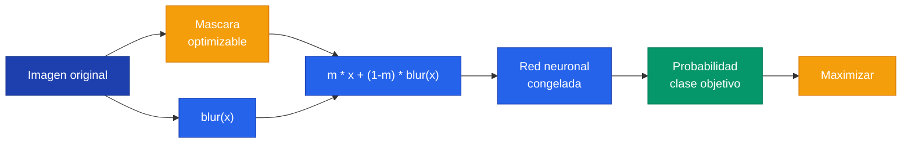

## 1. Que es Attribution

**Attribution** es una tecnica de interpretabilidad que busca determinar que elementos del input contribuyeron mas al valor del output. Mientras que feature visualization genera imagenes sinteticas, attribution trabaja con imagenes reales para explicar decisiones concretas del modelo.

| Tecnica | Pregunta que responde | Input |
|---|---|---|
| Feature Visualization | Que patron maximiza una neurona? | Imagen sintetica (generada desde ruido) |
| Attribution | Que parte de ESTA imagen causo la prediccion? | Imagen real (dada) |

---

## 2. Extremal Perturbation

> Paper: Fong et al. (2019). *Understanding Deep Networks via Extremal Perturbations and Smooth Masks.*

La idea central de **extremal perturbation** es: dada un area fija (ej: 12% de la imagen), encontrar la mascara optima que aplicada sobre el input maximiza la respuesta de una clase de interes.


m^* = \arg\max_m \; \phi(m \odot x + (1-m) \odot \text{blur}(x))


sujeto a $\text{area}(m) = a$

Donde $m$ es la mascara (valores 0-1), $x$ la imagen original, $\phi$ la salida del modelo para la clase de interes, $\text{blur}(x)$ es la imagen borrosa (perturbada), y $a$ el area fija.



Los parametros principales de la funcion son:

| Parametro | Descripcion | Ejemplo |
|---|---|---|
| `model` | Modelo a analizar | `alexnet` |
| `x` | Tensor del input (con batch dim) | `x.unsqueeze(0)` |
| `category_id` | Indice de la clase objetivo | `245` (French Bulldog) |
| `areas` | Lista de fracciones de area visible | `[0.05, 0.1, 0.2]` |
| `debug` | Mostrar proceso de optimizacion | `True` |

Para interpretar los resultados: rojo/calido indica alta importancia y azul/frio indica baja importancia. Una mascara bien centrada en el objeto significa que el modelo aprendio features correctos. Una mascara dispersa o enfocada en el fondo indica bias, atajos o correlaciones espurias.

---

## 3. Ejemplo con ImageNet

Utilizamos una imagen que contiene un French Bulldog (clase 245) y un Egyptian Cat (clase 285):

```python
from torchray.attribution.extremal_perturbation import extremal_perturbation
from torchray.benchmark import get_example_data, plot_example

# Obtener imagen de ejemplo con 2 categorias
_, x, category_id_1, category_id_2 = get_example_data()
# category_id_1 = 245 (French Bulldog)
# category_id_2 = 285 (Egyptian Cat)
```

Alternativa si `get_example_data` falla (Wikimedia blocking):

```python
from PIL import Image
from torchvision.transforms import Compose, Resize, ToTensor, Normalize

img = Image.open('dog and cats.jpg')
transform = Compose([
    Resize(224),
    ToTensor(),
    Normalize(mean=[0.485, 0.456, 0.406], std=[0.229, 0.224, 0.225]),
])
x = transform(img).unsqueeze(0).to(device)
category_id_1 = 245  # French Bulldog
category_id_2 = 285  # Egyptian Cat
```

Ejecutamos extremal perturbation para cada clase:

```python
mask_1, _ = extremal_perturbation(
    alexnet, x, category_id_1,
    debug=True, areas=[0.12],
)

mask_2, _ = extremal_perturbation(
    alexnet, x, category_id_2,
    debug=True, areas=[0.05],
)
```

La mascara para bulldog cubre al perro y la mascara para gato cubre al gato. El modelo se fija en los elementos correctos para tomar sus decisiones.

---

## 4. Attribution en Flowers: Base vs Fine-tuned

### Set de train (ambos predicen bien)

Comparamos las mascaras sobre la misma imagen para el modelo base y el fine-tuned:

```python
# Modelo base
x = ds_train[index][0].to(device).unsqueeze(0)
label = ds_train[index][1]
base_mask, _ = extremal_perturbation(
    base_alexnet, x, label,
    debug=True, areas=[0.2],
)

# Modelo fine-tuned (con datos normalizados)
x_norm = normalized_train_dataset[index][0].to(device).unsqueeze(0)
finetuned_mask, _ = extremal_perturbation(
    finetuned_alexnet, x_norm, label,
    debug=True, areas=[0.2],
)
```


A pesar de que ambos modelos predicen correctamente la clase, miran cosas MUY diferentes. El modelo base da importancia al FONDO de la imagen. El modelo fine-tuned da importancia a la FLOR. Predecir bien no garantiza que el modelo aprendio correctamente.


### Set de test (base falla, fine-tuned acierta)

Primero encontramos una imagen que el modelo base clasifica mal pero el fine-tuned clasifica bien:

```python
def get_wrong_indices(model, dataloader):
    indices = []
    with torch.no_grad():
        for x, target in dataloader:
            x, target = x.to(device), target.to(device)
            pred = model(x).argmax(dim=1)
            wrong = pred != target
            indices.append(wrong)
    indices = torch.cat(indices).squeeze()
    return torch.nonzero(indices)

base_mistakes = get_wrong_indices(base_alexnet, test_dl)
finetuned_mistakes = get_wrong_indices(finetuned_alexnet, normalized_test_dl)

# Encontrar imagen que base clasifica mal pero fine-tuned clasifica bien
for index in base_mistakes:
    if index not in finetuned_mistakes:
        break
index = int(index)
```

Ejecutamos attribution sobre la imagen mal clasificada para ambos modelos. El modelo base coloca la mascara en el fondo y las hojas, NO en la flor. El modelo fine-tuned centra la mascara en la flor.

### Diagnostico del error

Usamos attribution con la clase PREDICHA (no la clase real) para entender que le hizo pensar al modelo base que era otra clase:

```python
# Que le hizo pensar al modelo base que era otra clase?
x = ds_test[index][0].to(device).unsqueeze(0)
base_mask, _ = extremal_perturbation(
    base_alexnet, x, base_alexnet_prediction,  # clase predicha, no la real
    debug=True, areas=[0.2],
)
```

El resultado muestra que el modelo se enfoco en hojas y fondo que correlacionaban con la clase incorrecta en el set de entrenamiento.

---

## 5. Conclusiones

| Escenario | Modelo base | Modelo fine-tuned |
|---|---|---|
| Train (acierta) | Mascara en fondo | Mascara en flor |
| Test (base falla) | Mascara dispersa/fondo | Mascara centrada en flor |

Attribution es una herramienta de **auditoria**: permite entender POR QUE un modelo toma sus decisiones y detectar cuando aprende atajos incorrectos (**shortcut learning**).

El experimento demuestra que un modelo puede tener alta accuracy en train pero estar aprendiendo las cosas equivocadas -- solo attribution revela esto.
