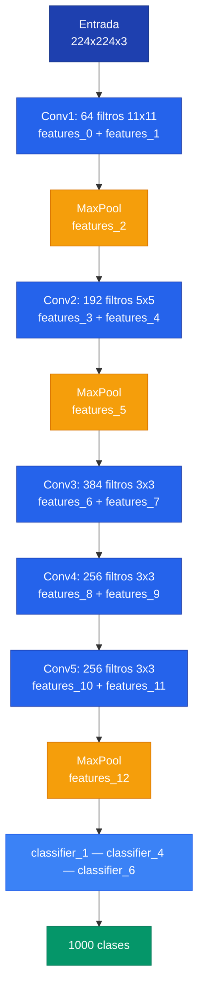

## 1. El Problema

Los nombres internos de PyTorch no coinciden con los nombres "populares" de la literatura. Cuando trabajamos con **feature visualization**, necesitamos especificar exactamente que capa queremos visualizar, y esto requiere entender como PyTorch organiza internamente los modulos.

Por ejemplo, `features_12` NO es la capa 12 — es el elemento 13 (indice 12) del `nn.Sequential` llamado `features`.


El indice en `nn.Sequential` NO es el numero de capa convolucional. `features_1` es el segundo elemento del Sequential (un ReLU), no la primera convolucion.


---

## 2. Como PyTorch Nombra las Capas

Cuando un modulo usa **`nn.Sequential`** sin nombres explicitos, PyTorch asigna nombres automaticamente con el formato `atributo_indice`. Esto significa que cada operacion dentro del Sequential recibe un indice consecutivo, sin importar si es una convolucion, una activacion o un pooling.

Veamos el constructor de AlexNet para ilustrar:

```python
self.features = nn.Sequential(
    nn.Conv2d(3, 64, ...),   # features_0
    nn.ReLU(inplace=True),   # features_1  <- "capa 1 conv" post-activacion
    nn.MaxPool2d(...),        # features_2
    nn.Conv2d(64, 192, ...),  # features_3
    nn.ReLU(inplace=True),   # features_4
    nn.MaxPool2d(...),        # features_5
    ...
)
```

La funcion `get_model_layers(model)` de **lucent** retorna la lista de nombres de capas accesibles:

```python
from lucent.modelzoo.util import get_model_layers
get_model_layers(alexnet)
# ['features_0', 'features_1', ..., 'features_12', 'classifier_1', ...]
```

---

## 3. AlexNet

**AlexNet** tiene 5 capas convolucionales y 3 capas fully connected. Es una de las arquitecturas mas simples y por eso es ideal para comenzar a explorar feature visualization.

### Arquitectura



### Tabla completa de capas

| Nombre lucent | Operacion | Salida |
|---|---|---|
| features_0 | Conv2d(3, 64, 11, stride=4, pad=2) | 55x55x64 |
| features_1 | ReLU | 55x55x64 |
| features_2 | MaxPool2d(3, stride=2) | 27x27x64 |
| features_3 | Conv2d(64, 192, 5, pad=2) | 27x27x192 |
| features_4 | ReLU | 27x27x192 |
| features_5 | MaxPool2d(3, stride=2) | 13x13x192 |
| features_6 | Conv2d(192, 384, 3, pad=1) | 13x13x384 |
| features_7 | ReLU | 13x13x384 |
| features_8 | Conv2d(384, 256, 3, pad=1) | 13x13x256 |
| features_9 | ReLU | 13x13x256 |
| features_10 | Conv2d(256, 256, 3, pad=1) | 13x13x256 |
| features_11 | ReLU | 13x13x256 |
| features_12 | MaxPool2d(3, stride=2) | 6x6x256 |

Las 5 capas convolucionales activadas para lucent son **`features_1`**, **`features_4`**, **`features_7`**, **`features_9`** y **`features_11`** (los ReLU, que representan la salida activada de cada convolucion).

---

## 4. VGG19

**VGG19** tiene 16 capas convolucionales y 3 capas fully connected. Su estructura es mas profunda que AlexNet, pero mantiene el patron de usar `nn.Sequential` para el bloque `features`.

Para inspeccionar la arquitectura:

```python
import torchvision.models as models
vgg19 = models.vgg19(pretrained=True)
print(vgg19.features)
```

### Mapeo de nombres populares

| Capa | Nombre popular | features_X |
|---|---|---|
| 1 | conv1_1 | features_1 |
| 2 | conv1_2 | features_3 |
| 3 | conv2_1 | features_6 |
| 4 | conv2_2 | features_8 |
| 5 | conv3_1 | features_11 |
| 6 | conv3_2 | features_13 |
| 7 | conv3_3 | features_15 |
| 8 | conv3_4 | features_17 |
| 9 | conv4_1 | features_20 |
| 10 | conv4_2 | features_22 |
| 11 | conv4_3 | features_24 |
| 12 | conv4_4 | features_26 |
| 13 | conv5_1 | features_29 |
| 14 | conv5_2 | features_31 |
| 15 | conv5_3 | features_33 |
| 16 | conv5_4 | features_35 |

---

## 5. GoogLeNet (Inception v1)

**GoogLeNet** tiene una estructura diferente: 2 convoluciones iniciales seguidas de 9 **modulos inception**. A diferencia de AlexNet y VGG, los nombres son legibles porque PyTorch los define con nombres explicitos (no con `nn.Sequential` anonimo).

```python
get_model_layers(googlenet)[:20]
# ['conv1', 'conv2', 'conv3', 'inception3a', 'inception3b', 
#  'inception4a', 'inception4b', 'inception4c', 'inception4d', 'inception4e',
#  'inception5a', 'inception5b', ...]
```

### Sub-capas de cada modulo inception

Cada modulo inception contiene ramas paralelas con sufijos descriptivos: **`_1x1`**, **`_3x3`**, **`_5x5`** y **`_pool_proj`**. Para acceder a las capas se usan directamente los nombres: `conv1`, `inception3a`, etc.

---

## 6. ResNet50

**ResNet50** tiene una estructura mas profunda: `conv1` + `bn1` + `relu` + `maxpool` seguido de 4 grupos de capas (**layer groups**) y finalmente `avgpool` + `fc`.

Cada layer group contiene N bloques **bottleneck** (3, 4, 6 y 3 respectivamente), lo que genera mucha profundidad. La recomendacion es trabajar a nivel de grupos en lugar de capas individuales.

```python
get_model_layers(resnet50)[:20]
# ['conv1', 'bn1', 'relu', 'maxpool', 'layer1', 'layer2', 'layer3', 'layer4', ...]
```

Para el laboratorio nos enfocamos en: **`relu`**, **`layer1`**, **`layer2`**, **`layer3`** y **`layer4`**.

---

## 7. Sintaxis de Direccionamiento

El formato general para especificar que visualizar es **`'nombre_capa:numero_canal'`**. Para clases se usa **`'labels:indice'`** (0-999 en ImageNet).

```python
# Canal especifico de una capa
render.render_vis(alexnet, 'features_11:9')    # canal 9 de la 5ta conv de AlexNet
render.render_vis(vgg19, 'features_35:0')      # canal 0 de la ultima conv de VGG19
render.render_vis(googlenet, 'inception4b:3')  # canal 3 del modulo inception4b

# Clase completa (imagen que maximiza la probabilidad de esa clase)
render.render_vis(alexnet, 'labels:162')       # clase 162 = beagle
render.render_vis(alexnet, 'labels:8')         # clase 8 = gallina (hen)
```
