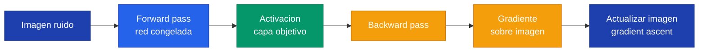

## 1. Que es Feature Visualization

**Feature visualization** es una tecnica para visualizar que inputs maximizan la respuesta de un componente de una red neuronal. En lugar de preguntarnos "que hace esta neurona cuando ve una imagen real", preguntamos "que imagen haria que esta neurona se active al maximo".

Los componentes que podemos visualizar incluyen:

- **Neurona individual**: una unidad especifica en un mapa de activacion
- **Canal** (mapa de activacion): todas las neuronas espaciales de un filtro
- **Capa completa**: la activacion total de una capa
- **Clase de salida**: el logit correspondiente a una clase de ImageNet


En entrenamiento normal se optimizan los PESOS con gradient descent. En feature visualization se congelan los pesos y se optimiza la IMAGEN con gradient ascent.


---

## 2. El Algoritmo: Gradient Ascent sobre el Input

El proceso de feature visualization invierte la direccion habitual de optimizacion. En lugar de ajustar los pesos para reducir el error, ajustamos los pixeles de la imagen para maximizar una activacion objetivo.

```text
Entrenamiento normal (gradient descent):
  Input FIJO → Red → Loss → Actualizar PESOS
  Objetivo: minimizar el error

Feature Visualization (gradient ascent):
  Input VARIABLE → Red CONGELADA → Activacion objetivo → Actualizar IMAGEN
  Objetivo: maximizar la activacion de un componente
```


x^* = \arg\max_x \; a_l(x) - \lambda \cdot R(x)


Donde $a_l(x)$ es la activacion del componente objetivo y $R(x)$ es un termino de regularizacion. El parametro $\lambda$ controla cuanta regularizacion aplicamos.

El flujo completo del algoritmo es:



### Regularizacion

Sin regularizacion, la imagen optimizada es ruido de alta frecuencia — pixeles aleatorios que activan la neurona pero no tienen estructura visual reconocible. La libreria `lucent` aplica dos tecnicas de regularizacion:

- **Decorrelated space**: optimizar en espacio de frecuencias, no pixeles — produce imagenes mas naturales
- **Transformation robustness**: aplicar jitter, rotacion y escala durante la optimizacion — evita artefactos

---

## 3. render_vis en la Practica

La funcion principal de `lucent` es `render.render_vis`. Sus parametros mas importantes son:

```python
render.render_vis(
    model,                    # modelo en .eval()
    'features_11:9',          # objetivo: capa:canal
    show_image=True,          # desplegar imagen en notebook
    preprocess=True,          # normalizar con media/std de ImageNet
    thresholds=(512,),        # pasos de optimizacion
)
```

Para visualizar el canal 9 de la capa 5 de AlexNet:

```python
_ = render.render_vis(alexnet, 'features_11:9', show_image=True)
```

Para visualizar una clase completa (clase 162, beagle):

```python
_ = render.render_vis(alexnet, 'labels:162', show_image=True)
```

---

## 4. Channel Visualization

**Channel visualization** consiste en visualizar multiples canales de una capa para ver que patrones detecta cada filtro. Esto nos permite construir un panorama completo de lo que una capa ha aprendido.

La funcion auxiliar `get_images()` genera una grilla de visualizaciones:

```python
def get_images(model, layers, rows, cols, preprocess=True, transforms=None):
    fig = plt.figure(figsize=(4*len(layers)*cols, 4*rows))
    outer_grid = fig.add_gridspec(1, len(layers))
    for layer_index, layer in enumerate(layers):
        inner_grid = outer_grid[0, layer_index].subgridspec(rows, cols, wspace=0, hspace=0)
        axs = inner_grid.subplots()
        for i in range(rows):
            for j in range(cols):
                image = render.render_vis(model, f'{layer}:{i*cols+j}',
                                          preprocess=preprocess, transforms=transforms,
                                          show_image=False)[0][0]
                axs[i][j].imshow(image)
                axs[i][j].axis('off')
```

Configuracion de capas representativas para cada arquitectura:

```python
layers = {
    alexnet:  ['features_1', 'features_7', 'features_11'],
    vgg19:    ['features_1', 'features_17', 'features_35'],
    googlenet: ['conv1', 'inception4b', 'inception5b'],
    resnet50: ['relu', 'layer2', 'layer4'],
}
```

Uso con cada modelo:

```python
get_images(alexnet, layers[alexnet], 3, 3)
get_images(vgg19, layers[vgg19], 3, 3)
get_images(googlenet, layers[googlenet], 3, 3)
get_images(resnet50, layers[resnet50], 3, 3)
```

---

## 5. Aprendizaje Jerarquico Composicional


Las CNNs profundas aprenden de forma jerarquica: primeras capas detectan bordes y colores, capas medias detectan texturas y patrones, capas profundas detectan partes de objetos y conceptos complejos.


Podemos verificar esto visualizando las 5 capas de AlexNet en orden:

```python
layers = ['features_1', 'features_4', 'features_7', 'features_9', 'features_11']
for layer in layers:
    render.render_vis(alexnet, f'{layer}:0', show_image=True)
```

| Profundidad | Que aprende | Ejemplo |
|---|---|---|
| Primera capa | Bordes, gradientes de color | Lineas horizontales, verticales, diagonales |
| Capas medias | Texturas, patrones repetitivos | Cuadriculas, circulos, pelaje |
| Ultima capa | Partes de objetos, conceptos | Ojos, patas, ruedas |

La primera capa es similar en TODAS las arquitecturas — todas necesitan detectar los mismos bordes basicos. La ultima capa varia mucho entre modelos. AlexNet (menos profunda) tiene features finales mucho menos complejos que ResNet.

---

## 6. Label Visualization

La visualizacion de labels usa el formato `'labels:indice'` donde el indice corresponde a las 1000 clases de ImageNet (0-999).

Ejemplo con la clase 8 (gallina/hen) en las 4 arquitecturas:

```python
_ = render.render_vis(alexnet, 'labels:8', show_image=True)
_ = render.render_vis(vgg19, 'labels:8', show_image=True)
_ = render.render_vis(googlenet, 'labels:8', show_image=True)
_ = render.render_vis(resnet50, 'labels:8', show_image=True)
```

Las 4 arquitecturas generan imagenes con rasgos claramente asociados a gallinas (crestas, plumas, colores). Todas aprendieron a reconocer gallinas por su aspecto visual, aunque cada modelo enfatiza distintos detalles.

Estas imagenes son "alucinaciones" del modelo — no son fotografias reales. Muestran lo que el modelo CREE que una gallina se ve, basado en lo que aprendio durante el entrenamiento con ImageNet.
