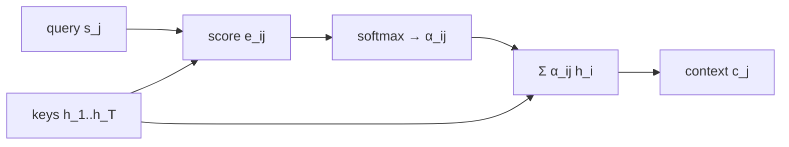

La Parte 1 entreno un seq2seq estandar donde el encoder comprimia toda la oracion fuente en un unico context vector $\mathbf{C}$ (el ultimo hidden state). Este vector fijo es el cuello de botella mas conocido del seq2seq clasico: a medida que las oraciones crecen, $\mathbf{C}$ tiene que cargar cada vez mas informacion en el mismo numero de dimensiones, y el decoder no tiene forma de volver a "mirar" partes especificas del input cuando le hace falta. Esta segunda parte agrega un **attention module** estilo Bahdanau (additive attention) sobre el mismo encoder-decoder, lo entrena en el mismo dataset SCAN, y visualiza el alineamiento aprendido como un heatmap.

El modelo final entrena por **300 epochs** y satura en **eval accuracy ~0.93 token-level con padding incluido**, frente al **~0.91** de Parte 1. La diferencia parece chica en esta metrica — pero la metrica es enganosa (el padding la infla) y la mejora real sentence-level es mucho mayor. La parte mas valiosa empiricamente es la **visualizacion del attention map**, que muestra alineamientos interpretables aprendidos sin supervision explicita.

## Por que attention

La idea es facil de intuir con una analogia. En la Parte 1, el "traductor" leia toda la oracion en ingles, cerraba los ojos, y escribia la traduccion de memoria. Todo el peso de la traduccion estaba en lo que pudiera caber en $\mathbf{h}_T$. Con attention, el traductor lee la oracion en ingles y **mantiene los ojos abiertos**: cada vez que va a escribir una palabra en frances, vuelve a mirar el ingles y decide cuales palabras del original son las mas relevantes **para esa palabra especifica**.

En cuando va a escribir `croissance` mira mas a `growth`; cuando va a escribir `annees` mira mas a `years`. La atencion no es algo que se le programa al modelo — es algo que el modelo **aprende solo**, simplemente porque es la forma mas efectiva de minimizar la cross-entropy.

Formalmente, en lugar de exigirle al encoder que resuma todo en un solo vector $\mathbf{h}_T$, dejamos que el decoder **atienda** en cada paso $j$ a *todos* los hidden states del encoder $\{\mathbf{h}_1, \ldots, \mathbf{h}_T\}$, ponderados por pesos $\alpha_{ij}$ que el modelo aprende. El context vector deja de ser fijo y pasa a ser **adaptativo** por paso del decoder.

## El attention module (Bahdanau additive)

El notebook implementa la variante **additive attention** de Bahdanau et al. (2015) *(notebook 2, cells 13-15)*. Tres pasos.

**1. Score (alignment).** Para el hidden state del decoder en el paso $j$ (la *query*) $\mathbf{s}_j$ y cada hidden state del encoder (la *key*) $\mathbf{h}_i$, calculamos un score escalar via una pequena MLP de una capa oculta:

$$
e_{ij} \;=\; \mathbf{v}^\top \tanh\!\left(\mathbf{W}\,\mathbf{s}_j \;+\; \mathbf{U}\,\mathbf{h}_i\right)
$$

donde $\mathbf{W}, \mathbf{U}$ proyectan query y key al mismo espacio de dimension `units`, y $\mathbf{v}$ colapsa el resultado a un escalar. Las tres matrices se aprenden end-to-end. Se llama *additive* porque la query y la key se **suman** dentro del $\tanh$, en contraste con la *dot-product attention* (Luong, y mas tarde Transformer) donde se multiplican.

**2. Pesos (softmax sobre las posiciones del input).**

$$
\alpha_{ij} \;=\; \frac{\exp(e_{ij})}{\sum_{k=1}^{T} \exp(e_{kj})}
$$

Los $\alpha_{ij}$ son no-negativos y suman 1 sobre $i$. Para cada paso del decoder $j$ tenemos una **distribucion de probabilidad** sobre las posiciones del input — "que fraccion de mi atencion va a cada palabra fuente". Softmax es la opcion natural porque:

- Convierte scores crudos en probabilidades interpretables.
- Amplifica diferencias (es un argmax "suave"): si un score es mucho mayor, despues de softmax queda cerca de 1.
- Es diferenciable, necesario para backprop.

**3. Context vector adaptativo.**

$$
\mathbf{c}_j \;=\; \sum_{i=1}^{T} \alpha_{ij}\, \mathbf{h}_i
$$

A diferencia de la Parte 1, $\mathbf{c}_j$ **cambia en cada paso** del decoder. Si en el paso $j=1$ el decoder enfoca el primer token de entrada y en el paso $j=2$ enfoca el ultimo, los context vectors $\mathbf{c}_1$ y $\mathbf{c}_2$ seran muy distintos aunque el encoder no haya cambiado.

### Detalle importante: en Bahdanau, Key = Value

En la terminologia que Transformers haria popular despues, una operacion de attention tiene tres "roles": Query (Q), Key (K), Value (V). En **Bahdanau additive attention**, la *key* y la *value* son **el mismo vector** $\mathbf{h}_i$: se usa para calcular el score (rol de key) y tambien para construir el context vector $\mathbf{c}_j = \sum \alpha \mathbf{h}$ (rol de value). No hay matrices separadas $\mathbf{W}_K, \mathbf{W}_V$ — solo una unica proyeccion $\mathbf{U}$ sobre $\mathbf{h}_i$.

La separacion explicita Q/K/V con tres matrices distintas llega recien con Transformers (Vaswani et al. 2017). Es uno de los avances clave que les da mas capacidad expresiva: el modelo puede aprender a comparar con una representacion (key) y extraer informacion con otra distinta (value).

### Codigo del `AttentionModule`

La clase del notebook *(notebook 2, cell 15)* es notablemente corta — 6 lineas operativas:

```python
class AttentionModule(nn.Module):
    def __init__(self, units):
        super().__init__()
        self.W = nn.Linear(units, units)   # proyecta la query
        self.U = nn.Linear(units, units)   # proyecta la key
        self.V = nn.Linear(units, 1)       # colapsa a un escalar

    def forward(self, query, values):
        query_with_time_axis = query.unsqueeze(1)
        score = self.V(torch.tanh(self.W(query_with_time_axis) + self.U(values)))
        attention_weights = torch.softmax(score, dim=1)
        context_vector = attention_weights * values
        context_vector = torch.sum(context_vector, 1)
        return context_vector
```

Tres detalles tecnicos que vale la pena entender:

**`unsqueeze(1)` para broadcasting.** La query tiene shape `(B, units)` y values tiene shape `(B, max_len, units)`. Antes de sumarlas dentro del $\tanh$, se necesita una dimension intermedia de tamano 1 en la query: `(B, 1, units)`. PyTorch entonces "estira" automaticamente esa dimension para cada una de las `max_len` posiciones. El resultado es que la query proyectada se compara con **cada** $\mathbf{h}_i$ en una sola operacion matricial, sin loops.

**`softmax(score, dim=1)`.** Este `dim=1` no es cosmetico. Las dimensiones de `score` son `(B, max_len, 1)`:

- `dim=0` (batch) sumaria pesos entre **muestras distintas del batch** — sin sentido, son ejemplos independientes.
- `dim=1` (posiciones del encoder) suma pesos sobre las posiciones del input para cada muestra — exactamente lo que queremos.

Es el tipo de bug que **no tira error en PyTorch** pero invalida el aprendizaje. Por eso el `dim=1` esta explicito.

**`attention_weights * values` con shape `(B, max_len, 1)`.** El `1` que sale del softmax no es redundante — es el broadcasting marker. Permite que en la siguiente linea cada peso escalar $\alpha_{ij}$ se multiplique por todo el vector $\mathbf{h}_i$:

```text
(B, max_len, 1)  *  (B, max_len, hidden_size)   →   (B, max_len, hidden_size)
```

Si fuera `(B, max_len)` la multiplicacion no broadcastearia correctamente. El `unsqueeze` implicito que da `dim=1` en softmax es lo que hace la operacion natural.



## Decoder con attention

El encoder permanece practicamente igual *(notebook 2, cell 12)*. El unico cambio es el return: ahora devuelve **tambien la secuencia completa de hidden states**, no solo el ultimo:

```python
# Parte 1: _, hidden_state = self.lstm(embedded);  return hidden_state
# Parte 2:
all_enc_hidden_states, hidden_state = self.lstm(embedded)
return hidden_state, all_enc_hidden_states
```

Esa sola linea es lo que cambia la naturaleza del modelo: pasamos de "el decoder ve un resumen comprimido" a "el decoder ve todos los hidden states y aprende a elegir".

En el decoder *(notebook 2, cell 17)* hay tres modificaciones puntuales:

```python
# 1. h2o ahora recibe 2*hidden_size (concat de s_t y c_t)
self.h2o = nn.Linear(2*hidden_size, dst_vocab_size)

# 2. Se agrega el sub-modulo de attention
self.attention = AttentionModule(hidden_size)

# 3. En el loop autoregresivo:
for i in range(max_output_length):
    (hidden_state, cell_state) = self.lstm_cell(y_t, state)
    context_vector = self.attention(query=hidden_state, values=all_enc_hidden_states)
    concat_input = torch.cat((hidden_state, context_vector), -1)
    P_t = self.h2o(concat_input)
    # resto igual a Parte 1: argmax, embedding, siguiente paso
```

El decoder dispone ahora de **dos fuentes de informacion** en cada paso: su propio estado recurrente $\mathbf{s}_j$ (que recuerda lo generado hasta ahora) y un resumen ponderado del input $\mathbf{c}_j$ enfocado en lo que necesita justo en ese paso.

### Dos factores de 2 distintos

En el modelo hay dos lugares donde aparece un factor de 2 multiplicando `hidden_size`. **Vienen de razones distintas y conviene no confundirlos:**

| Donde | Por que |
| --- | --- |
| `DecoderModule(... 2*hidden_size ...)` en `SeqToSeq` *(notebook 2, cell 30)* | **Bidireccionalidad del encoder** — los hidden states forward y backward se concatenan, dando vectores de `2*hidden_size`. El decoder entero trabaja con esta dimension. |
| `Linear(2*hidden_size, dst_vocab_size)` dentro del decoder *(notebook 2, cell 17)* | **Concatenacion** de $\mathbf{s}_j$ con $\mathbf{c}_j$ — dos vectores del mismo tamano unidos en la ultima dimension. |

Con `hidden_size=150` en el `SeqToSeq`, el decoder internamente trabaja con dimension `300` (por bidireccionalidad) y la `h2o` recibe `600` (por la concatenacion s ⊕ c). Si el encoder fuera unidireccional, desapareceria el primer factor pero **el segundo seguiria existiendo** — viene de la atencion, no del encoder.

## Entrenamiento

Mismo setup que la Parte 1 *(notebook 2, cells 25-33)*:

- **Dataset:** SCAN `tasks_simple` — comandos en ingles a secuencias de acciones del robot.
- **Hyperparams:** `embedding_size=100`, `hidden_size=150`, `batch_size=128`, `lr=0.001` (Adam), `n_epochs=300`.
- **Loss:** cross-entropy token a token con flatten `(B, L, V) → (B·L, V)`, igual que Parte 1.
- **Sin teacher forcing en training** — el decoder se alimenta de sus propias predicciones via `argmax`. La Parte 3 retomara este punto.
- **Sin `ignore_index=0`** en `cross_entropy` — el padding contamina la metrica reportada, igual que en Parte 1.

La unica diferencia practica respecto a Parte 1 es el costo computacional adicional del attention module: en cada paso del decoder hay que computar $T$ scores, un softmax y una suma ponderada — overhead $O(T)$ por paso, $O(T \cdot L)$ por secuencia. Para SCAN, con secuencias cortas, el impacto es menor; en datasets de traduccion real es el principal motivo por el que mas adelante se busco reemplazar las RNN por self-attention puro (Transformer).

## Resultados con attention

### Curva de eval accuracy


| Epoch | Eval accuracy aprox |
| --- | --- |
| 0 (inicio) | ~0.05 |
| 50 | ~0.85 |
| 100 | ~0.91 |
| 150 (entrada al plateau) | ~0.92 |
| 300 (final) | **~0.93** |

La curva sube **muy rapido** las primeras 50 epochs (de 0.05 a 0.85 — el modelo aprende patrones obvios y a predecir padding). Despues entra en un regimen de **refinamiento gradual** hasta los ~150 epochs, donde alcanza un plateau cerca de **0.93** que se mantiene casi plano hasta los 300 epochs. Aparecen dos dips menores cerca de epochs ~80 y ~130, pero son menos pronunciados que los dips de Parte 1 (epochs 120 y 180).

### Comparacion contra Parte 1

| Modelo | Eval acc plateau | Dips visibles | Forma del plateau |
| --- | --- | --- | --- |
| Parte 1 (sin attention) | **~0.91** | epochs 120, 180 | con oscilaciones sostenidas |
| Parte 2 (con attention) | **~0.93** | epochs 80, 130 (menores) | casi liso despues de epoch 150 |

La diferencia 0.91 → 0.93 parece chica, pero esta **subestimada por la metrica**. Recordar que la accuracy reportada es **token-level con padding incluido**. Una estimacion grosera del sentence-level (probabilidad de acertar una secuencia completa de 20 tokens) seria:

- Parte 1: $0.91^{20} \approx 15\%$ de secuencias completas correctas.
- Parte 2: $0.93^{20} \approx 23\%$ de secuencias completas correctas.

**La mejora real es ~50% en sentence-level**, no 2 puntos. En la literatura de SCAN modelos con attention superan el 99% sentence-level frente a < 80% de los Seq2Seq basicos, lo que confirma que el techo de la arquitectura Parte 1 esta lejos del optimo.

## Visualizacion del attention map

### Como se obtienen los pesos

El notebook **duplica** las clases (`AttentionModule`, `DecoderModule`, `SeqToSeq`) en celdas 37-39, agregando una sola modificacion: que devuelvan los pesos $\alpha_{ij}$ junto con el context vector y los outputs:

```python
# AttentionModule (cell 37)
return context_vector, attention_weights.squeeze()   # devuelve tambien los pesos

# DecoderModule (cell 38)
attentions.append(att)                                # acumula los pesos del loop
return torch.stack(out, dim=1), torch.stack(attentions, dim=1)
```

El `.squeeze()` quita la dimension de tamano 1 que tenian los pesos por el broadcasting, dejandolos en `(B, max_len)` por paso. Acumulados a lo largo del loop, dan una matriz de atencion `(B, max_output_len, max_len_src)` — para cada muestra del batch, una matriz `output × input`.

### Transferencia de pesos entrenados

Una vez entrenado `model` (sin instrumentacion), el notebook construye `new_model` (con instrumentacion) y le transfiere los pesos *(notebook 2, cell 41)*:

```python
trained_state_dict = model.state_dict()
new_model.load_state_dict(trained_state_dict)
```

Esto funciona porque **las dos versiones tienen la misma arquitectura** — mismas matrices `W`, `U`, `V` con los mismos shapes, solo cambian los `return`. El `state_dict` es independiente de la logica del `forward`, asi que la transferencia es directa.

### Heatmap con seaborn

La funcion `visualize` *(notebook 2, cell 45)* mapea los indices de tokens a sus strings via `vocab.itos`, y plotea un heatmap donde:

- **Filas (Y):** tokens predichos por el decoder.
- **Columnas (X):** tokens del input.
- **Color:** intensidad de $\alpha_{ij}$ (rojo intenso = mucha atencion, blanco = poca).

`vmin=0, vmax=1` fija la escala (los pesos estan acotados por softmax). El indice de muestra del batch se controla con `batch_idx`.

### Heatmap observado: `run thrice after look`


Caso elegido (con `batch_idx=5`):

- **Input:** `run thrice after look <pad> <pad> <pad>`
- **Output predicho:** `i_look`, `i_run`, `i_run`, `i_run`
- **Output esperado:** `I_LOOK I_RUN I_RUN I_RUN` ✓

Este caso es didacticamente espectacular por **tres razones**.

**1. El modelo manejo correctamente la semantica de `after`.** En SCAN, `A thrice after B` significa "hacer B, despues hacer A tres veces" — el `after` invierte el orden. El modelo no solo lo entendio sino que ademas lo refleja en la atencion: el primer token generado (`i_look`) atiende a `look`, aunque `look` aparece *al final* del input.

**2. La atencion muestra el "razonamiento" paso a paso.** Lectura fila por fila:

| Token generado | A donde mira el modelo | Interpretacion |
| --- | --- | --- |
| `i_look` | **`look`** (rojo intenso) | Sabe que la primera accion es `look` y mira directo ahi. Alineacion perfecta. |
| `i_run` | **`run` Y `look`** (ambos naranjas) | Atencion dividida — esta soltando `look` y agarrando `run`. **Transicion visible.** |
| `i_run` | **`run`** (rojo intenso) | Ya solto `look`, foco total en `run`. |
| `i_run` | **`run`** (rojo intenso) | Sigue en `run`. |

La segunda fila es la mas valiosa: ahi se ve **el momento exacto** en que el modelo cambia su foco de atencion. Es interpretabilidad pura — no necesitas instrumentar nada extra, la atencion es por construccion observable.

**3. `thrice` casi no recibe atencion, pero el modelo cuenta correctamente.** Genera exactamente 3 tokens `i_run`, pero el heatmap no muestra atencion sobre la palabra `thrice` durante la generacion. **El conteo no esta en la atencion, esta en el hidden state recurrente del decoder.** El LSTMCell mantiene internamente cuantos `i_run` ya genero y cuando parar.

Esta es una observacion conceptual importante: **atencion y memoria son complementarias**. La atencion da *contenido* (que palabra mirar); la memoria recurrente da *posicion* (en que paso del output estoy). En este modelo los dos mecanismos coexisten. Los Transformers, al eliminar las RNN, tienen que recuperar esa nocion de posicion via **positional embeddings** — pero esa historia es para otra clase.

### Diagnostico de calidad

Tres senales de que el modelo entreno bien:

1. **Acerto la traduccion completa** de un caso con `after` (semanticamente complejo).
2. **Atencion bien concentrada** en posiciones relevantes (rojos intensos, no difusos).
3. **Transicion clara** entre la fase `i_look` y la fase `i_run`, mostrando que el modelo lee el input dinamicamente.

Si el heatmap hubiera estado uniformemente naranja claro por toda la matriz, indicaria que la atencion no aprendio a distinguir y el modelo no esta aprovechando el mecanismo. Aqui hay focos nitidos y una geometria interpretable.

## Conexion historica

Este resultado replica en miniatura el motivo historico por el que attention destrono al seq2seq estandar en traduccion automatica entre 2014 y 2017 (Bahdanau et al. 2015, Luong et al. 2015), y abrio el camino al Transformer (Vaswani et al. 2017), que llevo la idea al extremo eliminando las RNN por completo y separando explicitamente Q, K y V. La intuicion "el decoder debe poder volver a mirar el input dinamicamente" es la misma; lo que cambia despues son la formulacion del score (additive → multiplicative), la separacion de roles (key = value → key ≠ value), y la base recurrente (RNN → self-attention puro).
