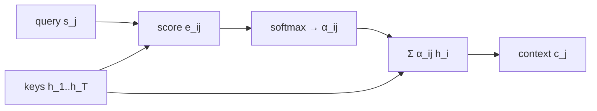

La parte 1 entreno un seq2seq estandar donde el encoder comprimia toda la oracion fuente en un unico context vector $\mathbf{C}$ (el ultimo hidden state). Este vector fijo es el cuello de botella mas conocido del seq2seq clasico: a medida que las oraciones crecen, $\mathbf{C}$ tiene que cargar cada vez mas informacion en el mismo numero de dimensiones, y el decoder no tiene forma de volver a "mirar" partes especificas del input cuando le hace falta. Esta segunda parte agrega un **attention module** estilo Bahdanau (additive attention) sobre el mismo encoder-decoder, lo entrena en el mismo dataset SCAN, y visualiza el alineamiento aprendido como un heatmap.

## Por que attention

En la parte 1, la unica conexion entre encoder y decoder era el hidden state final $\mathbf{h}_T$. Todo el resto de los hidden states intermedios $\mathbf{h}_1, \mathbf{h}_2, \ldots, \mathbf{h}_{T-1}$ se descartaban. El decoder generaba toda la secuencia de salida a partir de un unico embedding fijo de la entrada, lo que en oraciones largas obliga a la red a comprimir mucha informacion en pocas dimensiones — y a repartirla entre todos los pasos del decoder por igual.

La idea central de attention es soltar esa restriccion: en lugar de exigirle al encoder que resuma todo en un solo vector, dejamos que el decoder **atienda** en cada paso $j$ a *todos* los hidden states del encoder $\{\mathbf{h}_1, \ldots, \mathbf{h}_T\}$, ponderados por pesos $\alpha_{ij}$ que el modelo aprende. Cuando el decoder esta generando un token que depende del comienzo de la oracion fuente, los pesos se concentran al inicio; cuando necesita el final, se concentran al final. El context vector deja de ser fijo y pasa a ser **adaptativo** por paso del decoder.

## El attention module (Bahdanau additive)

El notebook implementa la variante **additive attention** de Bahdanau et al. (2015) *(notebook 2, cell 13-14)*. Tres pasos:

**1. Score (alignment).** Para el hidden state del decoder en el paso $j$ (la *query*) $\mathbf{s}_j$ y cada hidden state del encoder (la *key*) $\mathbf{h}_i$, calculamos un score escalar via una pequena MLP:

$$
e_{ij} \;=\; \mathbf{v}_a^\top \tanh\!\left(\mathbf{W}_a\,\mathbf{s}_j \;+\; \mathbf{U}_a\,\mathbf{h}_i\right)
$$

donde $\mathbf{W}_a \in \mathbb{R}^{n \times d_s}$, $\mathbf{U}_a \in \mathbb{R}^{n \times d_h}$ y $\mathbf{v}_a \in \mathbb{R}^n$ son parametros aprendidos. Se llama *additive* porque la query y la key se **suman** dentro del $\tanh$, en contraste con la *dot-product attention* (Luong) donde se multiplican.

**2. Pesos (softmax sobre las posiciones del input).**

$$
\alpha_{ij} \;=\; \frac{\exp(e_{ij})}{\sum_{k=1}^{T} \exp(e_{kj})}
$$

Los $\alpha_{ij}$ son no-negativos y suman 1 sobre $i$, asi que para cada paso del decoder $j$ tenemos una **distribucion de atencion** sobre las posiciones de la entrada.

**3. Context vector adaptativo (la *value* es el propio hidden state del encoder).**

$$
\mathbf{c}_j \;=\; \sum_{i=1}^{T} \alpha_{ij}\, \mathbf{h}_i
$$

A diferencia de la parte 1, $\mathbf{c}_j$ **cambia en cada paso** del decoder. Si en el paso $j=1$ el decoder enfoca el primer token de entrada y en el paso $j=2$ enfoca el ultimo, los context vectors $\mathbf{c}_1$ y $\mathbf{c}_2$ seran muy distintos aunque el encoder no haya cambiado.

La clase `Attention` del notebook *(notebook 2, cell 15)* recibe la secuencia completa de hidden states del encoder mas el hidden state actual del decoder, computa los scores con dos capas lineales sin bias (una para la query, otra para los keys), aplica $\tanh$ y proyecta al escalar via $\mathbf{v}_a$. Devuelve tanto el context vector $\mathbf{c}_j$ como los pesos $\alpha_{ij}$ — estos ultimos se guardan despues para visualizar el attention map.

## Decoder con attention

El encoder del notebook permanece practicamente igual al de la parte 1 — sigue siendo una RNN/LSTM que produce hidden states $\mathbf{h}_1, \ldots, \mathbf{h}_T$ *(notebook 2, cell 11)*. El cambio esta en el decoder *(notebook 2, cell 16)*.

En la parte 1, el decoder en el paso $j$ recibia como input solo el embedding del token previo $\mathbf{e}_{j-1}$ y su propio hidden state $\mathbf{s}_{j-1}$, y producia $\mathbf{s}_j$ y la distribucion sobre el vocabulario destino. En esta version:

1. Se calcula $\mathbf{s}_j$ con la celda recurrente como antes.
2. Se llama al modulo de attention con $\mathbf{s}_j$ como query y $\{\mathbf{h}_i\}$ como keys/values, obteniendo $\mathbf{c}_j$ y los pesos $\alpha_{ij}$.
3. **Se concatena** el context adaptativo con el hidden state del decoder: $[\mathbf{s}_j; \mathbf{c}_j]$ (o con el embedding, segun la variante).
4. La capa lineal de salida proyecta esa concatenacion al espacio del vocabulario destino y aplica softmax para obtener la distribucion sobre el siguiente token.

Asi el decoder, en cada paso, dispone de dos fuentes de informacion: su propio estado recurrente (que recuerda lo generado hasta ahora) y un resumen ponderado del input enfocado en lo que necesita *justo en ese paso*.

## Entrenamiento

Mismo setup que la parte 1 *(notebook 2, cells 25-29)*:

- **Dataset:** SCAN — comandos en ingles a secuencias de acciones del robot (`jump around right` → `RTURN JUMP RTURN JUMP RTURN JUMP RTURN JUMP`) *(notebook 2, cell 18)*.
- **Loss:** cross-entropy token a token sobre el output del decoder, con teacher forcing durante entrenamiento (los tokens ground-truth se usan como input al decoder en lugar del token predicho previamente).
- **Optimizador:** mismo optimizador que la parte 1.
- **Cantidad de epocas:** `[n_epochs pendiente — Fase 2]`.

La unica diferencia practica es el costo computacional adicional del attention module: en cada paso del decoder hay que computar $T$ scores, un softmax y una suma ponderada — overhead $O(T)$ por paso, $O(T \cdot L)$ por secuencia (donde $L$ es la longitud de la salida). Para SCAN, con secuencias cortas, el impacto es menor; en datasets de traduccion real es el principal motivo por el que mas adelante se busco reemplazar las RNN por self-attention puro (Transformer).

## Resultados con attention

`[outputs pendientes — se integraran en Fase 2 cuando Roberto ejecute el notebook en Colab]`

Lo que se va a mostrar aqui:

- **Loss curve por epoch** (train y validation).
- **Ejemplos cualitativos de traduccion** del modelo entrenado, comparados lado a lado contra los outputs de la parte 1 sobre los mismos comandos.
- **Accuracy de secuencia completa** (porcentaje de outputs donde *toda* la secuencia generada coincide con la ground truth, no solo un token suelto).

## Visualizacion del attention map

Una vez entrenado el modelo, el notebook re-ejecuta el decoder sobre algunos ejemplos del split de evaluacion guardando los pesos $\alpha_{ij}$ de cada paso *(notebook 2, cell 40)*. El resultado es una matriz $\boldsymbol{\alpha} \in \mathbb{R}^{L \times T}$ donde:

- las **filas** son los tokens generados por el decoder (output destino, longitud $L$),
- las **columnas** son los tokens de la entrada (input fuente, longitud $T$),
- cada celda $\alpha_{ij}$ es el peso que el decoder le dio al token fuente $i$ al generar el token destino $j$.

Este heatmap se visualiza en *(notebook 2, cell 43)*. La interpretacion es directa: cuando $\alpha_{ij}$ es alto (celda clara), el modelo aprendio que para producir el token destino $j$ debe atender al token fuente $i$. Esto corresponde a un **alineamiento linguistico** aprendido sin supervision explicita — nadie le dijo al modelo "la palabra X se traduce como la palabra Y", solo se le entreno con pares (input, output) y la atencion descubrio el alineamiento por si sola.

En SCAN los alineamientos esperados son particularmente limpios porque la tarea es composicional y casi reglada:

- `jump` → `JUMP` deberia aparecer como una diagonal cuando los comandos son "uno a uno".
- `jump left` → `LTURN JUMP`: al generar `LTURN` el modelo deberia atender a `left`, y al generar `JUMP` deberia atender a `jump` (cruce no diagonal).
- `jump around right`: la atencion deberia oscilar entre `right` (para los `RTURN`) y `jump` (para los `JUMP`) a lo largo de los 8 tokens generados.

`[heatmap pendiente — se generara en Fase 2 cuando Roberto entregue el notebook ejecutado]`

## Comparacion contra parte 1

La pregunta empirica es: **cuanto gana el modelo con attention frente al seq2seq basico de la parte 1**, especialmente en secuencias largas.

| Modelo                        | Test loss          | Accuracy seq. completa | Comentario                    |
| ----------------------------- | ------------------ | ---------------------- | ----------------------------- |
| Parte 1 (seq2seq sin attn)    | `[Fase 2]`         | `[Fase 2]`             | bottleneck en context fijo    |
| Parte 2 (seq2seq + Bahdanau)  | `[Fase 2]`         | `[Fase 2]`             | context adaptativo por paso   |

**Hipotesis a contrastar (ver clase 13, secciones 6-7):**

1. La diferencia deberia ser pequena en comandos cortos (`jump`, `walk twice`) — el bottleneck del context fijo no aprieta cuando hay poco que comprimir.
2. La diferencia deberia crecer marcadamente en comandos largos (`jump around right and walk thrice`) — donde el seq2seq basico empieza a perder informacion del comienzo de la entrada y attention puede recuperarla atendiendo directamente a los hidden states correspondientes.
3. El attention map deberia mostrar alineamientos interpretables, validando cualitativamente que la mejora cuantitativa proviene efectivamente del mecanismo de atencion y no de otro factor (mas parametros, distinta inicializacion).

Si las tres se cumplen, el resultado replica en miniatura el motivo historico por el que attention destrono al seq2seq estandar en traduccion automatica entre 2014 y 2017, y abrio el camino al Transformer (Vaswani et al. 2017), que llevo la idea al extremo eliminando las RNN por completo.
