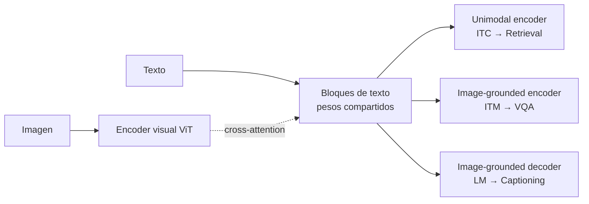

> **Celdas 0-6 del notebook.** Qué es BLIP, por qué su arquitectura unificada (el MED) puede hacer captioning, VQA y retrieval con los mismos pesos, y cómo se carga el modelo de VQA desde HuggingFace. Conecta con la [Clase 23](/clases/clase-23), el paper [BLIP (Li et al., 2022)](/papers/blip-li-2022) y el fundamento [Vision-Language Models](/fundamentos/vision-language-models).

## Qué es BLIP

**BLIP** = **B**ootstrapping **L**anguage-**I**mage **P**re-training. Es un modelo de visión-lenguaje publicado por **Salesforce Research** (Junnan Li, Dongxu Li, Caiming Xiong, Steven Hoi) en **ICML 2022** ([arXiv:2201.12086](https://arxiv.org/abs/2201.12086)). Un mismo preentrenamiento sirve para tres tareas:

- **Image Captioning** — generar una descripción en lenguaje natural de una imagen.
- **VQA** (Visual Question Answering) — responder una pregunta en lenguaje natural sobre una imagen.
- **Image-Text Retrieval** — dada una imagen, encontrar el texto más afín (y viceversa).

La celda markdown inicial del notebook resume exactamente esto. Lo interesante no es la lista de tareas, sino que **las tres salen de una sola arquitectura con pesos compartidos**: el MED.

## El MED: Multimodal mixture of Encoder-Decoder

El corazón de BLIP es el **MED** (*Multimodal mixture of Encoder-Decoder*). Es una arquitectura que opera en **tres modos** según la tarea, reutilizando los mismos bloques de capas. La imagen siempre pasa por un **encoder visual ViT** (parches → secuencia de embeddings); lo que cambia es cómo se procesa el texto y cómo se conecta (o no) con la imagen.

| Modo | Cómo trata el texto | Objetivo de preentrenamiento | Tareas downstream |
|---|---|---|---|
| **Unimodal encoder** | Texto e imagen por separado, sin atención cruzada | **ITC** (Image-Text Contrastive) — alinea los embeddings `[CLS]` de imagen y texto | Retrieval (rápido, por dot-product) |
| **Image-grounded text encoder** | Texto atiende a la imagen vía **cross-attention** | **ITM** (Image-Text Matching) — clasificación binaria ¿coinciden imagen y texto? | VQA, matching fino |
| **Image-grounded text decoder** | Igual, pero con **self-attention causal** (no bidireccional) | **LM** (Language Modeling) — predecir el siguiente token | Captioning, generación |

Los tres modos **comparten los pesos** de las capas de feed-forward y self-attention del texto; solo difieren en (a) si hay cross-attention con la imagen y (b) si la self-attention es bidireccional o causal. Esto es lo que permite un único preentrenamiento multi-objetivo en vez de tres modelos separados.



Este lab usa el modo de **VQA**, que en `transformers` se expone como la clase `BlipForQuestionAnswering`.

## CapFilt: el "bootstrapping" del nombre

La otra contribución del paper —el *Bootstrapping* de BLIP— es **CapFilt**, una receta para limpiar los datos de entrenamiento. Los datos web (pares imagen-texto raspados de internet) son ruidosos: muchos *alt-text* no describen la imagen. CapFilt usa el propio modelo en dos roles:

- **Captioner** — genera captions sintéticos para las imágenes web.
- **Filter** — descarta los pares (sintéticos y originales) que considera ruidosos vía el cabezal ITM.

El resultado es un dataset más limpio sobre el que se reentrena BLIP. Es decir, **el modelo mejora su propio conjunto de entrenamiento**: de ahí "bootstrapping". El detalle completo está en el [paper de BLIP](/papers/blip-li-2022); para el lab basta saber que la calidad del checkpoint que vamos a cargar viene en parte de este proceso.

## Setup: las tres librerías (celda 3)

```python
!pip -q install transformers timm accelerate -q
```

| Librería | Para qué | Por qué es necesaria aquí |
|---|---|---|
| `transformers` | Las clases `BlipProcessor` y `BlipForQuestionAnswering` | Es la API que define la arquitectura BLIP y orquesta la carga de pesos |
| `timm` | *PyTorch Image Models* — provee el backbone **ViT** | BLIP construye su encoder visual sobre ViT de `timm`; **sin `timm` la instanciación del ViT falla** |
| `accelerate` | Colocación de tensores en device (CPU/GPU) | `from_pretrained` lo usa para *device placement* eficiente |

> **Detalle cosmético:** el comando trae `-q` **dos veces** (al inicio y al final). El segundo es **redundante** — `pip` ya está en modo silencioso. No causa error, solo es ruido.

## Imports (celda 4)

```python
from transformers import BlipProcessor, BlipForQuestionAnswering
from PIL import Image
import requests
import matplotlib.pyplot as plt
```

- `BlipProcessor` / `BlipForQuestionAnswering` — el procesador y el modelo (se cargan en la celda 6).
- `PIL.Image` — abrir imágenes en el formato que espera el procesador.
- `requests` — descargar imágenes por URL.
- `matplotlib` — visualizar imagen + pregunta + respuesta.

## Cargar el modelo VQA (celda 6)

```python
model = BlipForQuestionAnswering.from_pretrained("Salesforce/blip-vqa-base")
processor = BlipProcessor.from_pretrained("Salesforce/blip-vqa-base")
```

### Qué hace `from_pretrained`

`from_pretrained("Salesforce/blip-vqa-base")` ejecuta una cadena de pasos:

1. **Resuelve** el identificador del repo en el HuggingFace Hub.
2. **Descarga y cachea** (en `~/.cache/huggingface/`) el `config.json`, los **pesos** (~1.5 GB) y el **vocabulario** del tokenizador.
3. **Instancia** la arquitectura BLIP a partir del `config.json` (define ViT-B/16, dimensiones, número de capas).
4. **Carga los pesos** en esa estructura.

El checkpoint `blip-vqa-base` usa un backbone **ViT-B/16** y **ya viene fine-tuneado sobre VQAv2** — no hay que entrenar nada, solo inferir. Existe una variante mayor, **`blip-vqa-capfilt-large`** (backbone ViT-L), más precisa pero más pesada.

### Por qué `processor` y `model` por separado — y desde el MISMO repo

El **`processor`** empaqueta dos cosas: el preprocesamiento de imagen (resize, normalización con la media/desviación exactas del entrenamiento) y el **tokenizador** del texto. El **`model`** son los pesos.

> **Gotcha clásico:** el `processor` debe usar **exactamente la misma normalización y tokenización con las que se entrenó el modelo**. Si cargas el processor de un repo y el modelo de otro, no obtienes un error — obtienes **degradación silenciosa**: imágenes mal normalizadas o tokens mal mapeados que el modelo "ve" como ruido. Por eso ambos se cargan desde `"Salesforce/blip-vqa-base"`. Mantenerlos sincronizados es la regla.

## El contraste central del lab: clasificación vs. generación

En la [clase teórica](/clases/clase-23) el VQA se presenta principalmente como un problema de **clasificación** (el enfoque de [Pythia](/papers/pythia-jiang-2018) y la familia bottom-up). Este lab usa el enfoque **generativo** de BLIP. La diferencia es de fondo:

| Aspecto | VQA como **clasificación** (Pythia, clase teórica) | VQA como **generación** (BLIP, este lab) |
|---|---|---|
| Espacio de respuestas | **Vocabulario cerrado** (~3000 respuestas más frecuentes) | **Vocabulario abierto** (cualquier secuencia de tokens) |
| Cabezal de salida | **Sigmoid multi-etiqueta** sobre las clases candidatas | `generate()` **autoregresivo** token a token |
| Representación de imagen | Regiones de objetos (**Mask R-CNN** / bottom-up) | **Parches** del ViT (sin detector de objetos) |
| Naturaleza | Elige la respuesta más probable de una lista fija | Compone la respuesta palabra por palabra |

La consecuencia práctica: BLIP **no está limitado a un catálogo de respuestas**. Puede responder con frases que nunca vio como clase, a costa de poder "alucinar" texto plausible pero incorrecto (ver [modos de fallo](modos-de-fallo)). Cómo se ejecuta esa generación es el tema de la página siguiente.

---

**Siguiente:** [VQA como generación](vqa-generacion)
