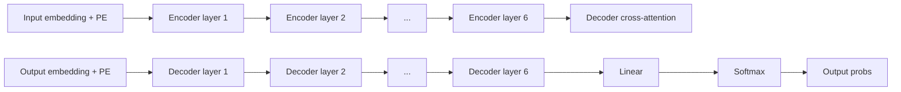


Introduce el **Transformer** -- la arquitectura que reemplazo por completo recurrencia y convolucion por **self-attention**, demostrando que la atencion sola basta para modelado de secuencias. El paper define scaled dot-product attention, multi-head attention y positional encoding sinusoidal, y obtiene estado del arte en traduccion (WMT'14 EN-DE 28.4 BLEU, EN-FR 41.0 BLEU) entrenando en 3.5 dias en 8 GPUs P100, una fraccion del costo de los baselines. Es el paper fundacional sobre el que descansa BERT, GPT, T5, ViT, AlphaFold y la era moderna de los LLMs.


---

## Contexto

A mediados de 2017 el campo de NMT (neural machine translation) ya habia consolidado el paradigma **encoder-decoder + attention** introducido por [Bahdanau 2015](/papers/bahdanau-attention-2015) y refinado por Luong 2015. Los sistemas de produccion (Google GNMT 2016) eran torres profundas de LSTMs con atencion adicional. Existian variantes convolucionales (ByteNet, ConvS2S de Gehring et al.) que ganaban paralelizacion pero pagaban en distancia efectiva entre tokens lejanos.

El cuello de botella estructural era la **recurrencia**: el estado $h_t$ depende de $h_{t-1}$, lo que impide paralelizar a lo largo del eje temporal y satura los aceleradores modernos en secuencias largas. Vaswani y co-autores (Google Brain / Google Research / U. Toronto) llevaron la idea al extremo: si la atencion ya hace casi todo el trabajo de modelar dependencias, **eliminemos la recurrencia por completo**. El resultado fue el Transformer, presentado en NeurIPS 2017.

---

## Ideas principales

### 1. Scaled dot-product attention

El bloque elemental. Dadas matrices de queries $Q \in \mathbb{R}^{n \times d_k}$, keys $K \in \mathbb{R}^{m \times d_k}$ y values $V \in \mathbb{R}^{m \times d_v}$:

$$\text{Attention}(Q, K, V) = \text{softmax}\left(\frac{QK^T}{\sqrt{d_k}}\right) V$$

El factor $1/\sqrt{d_k}$ es la innovacion sutil pero critica: para $d_k$ grande el producto punto crece en magnitud (varianza $d_k$), saturando el softmax y matando los gradientes. Escalar restablece varianza unitaria.

### 2. Multi-head attention

En lugar de una atencion sobre vectores de dimension $d_{model}$, se proyecta linealmente a $h$ subespacios de dimension $d_k = d_v = d_{model}/h$, se atiende en paralelo y se concatena:

$$\text{MultiHead}(Q, K, V) = \text{Concat}(\text{head}_1, \ldots, \text{head}_h) W^O$$

$$\text{head}_i = \text{Attention}(Q W_i^Q, K W_i^K, V W_i^V)$$

Cada cabeza aprende a atender a relaciones distintas (sintacticas, semanticas, de coreferencia). Con $h=8$ y $d_k=64$ el costo total es similar a una sola cabeza de $d_{model}=512$.

### 3. Positional encoding sinusoidal

Sin recurrencia ni convolucion, el modelo no sabe el orden de los tokens. Se inyectan codificaciones posicionales sumadas al embedding:

$$PE_{(pos, 2i)} = \sin(pos / 10000^{2i / d_{model}})$$
$$PE_{(pos, 2i+1)} = \cos(pos / 10000^{2i / d_{model}})$$

Las longitudes de onda forman una progresion geometrica de $2\pi$ a $10000 \cdot 2\pi$. La eleccion no es arbitraria: para cualquier offset fijo $k$, $PE_{pos+k}$ es una **funcion lineal** de $PE_{pos}$, lo que permite al modelo aprender posiciones relativas trivialmente.

### 4. Encoder-decoder stack ($N=6$)

Cada **encoder layer** tiene dos sub-capas: multi-head self-attention + FFN posicional. Cada **decoder layer** tiene tres: masked self-attention (causal), cross-attention al encoder, y FFN. Hay tres usos distintos de atencion:

- **Encoder self-attention**: Q, K, V del mismo encoder.
- **Decoder self-attention enmascarada**: previene que la posicion $i$ vea posiciones $> i$.
- **Encoder-decoder attention**: queries del decoder, keys/values del encoder (atencion clasica seq2seq).

### 5. Layer norm + residuals

Cada sub-capa se envuelve como $\text{LayerNorm}(x + \text{Sublayer}(x))$. Las conexiones residuales permiten que el gradiente fluya sin atenuarse a traves de las 6 (o 12) capas, y la normalizacion estabiliza activaciones a lo largo de cada token.

### 6. Position-wise FFN

Una MLP de dos capas aplicada **identicamente** a cada posicion (peso compartido en el eje temporal, distinto entre capas):

$$\text{FFN}(x) = \max(0, xW_1 + b_1)W_2 + b_2$$

Con $d_{model}=512$ y $d_{ff}=2048$. Equivale a dos convoluciones de kernel 1. Es donde el modelo procesa la informacion mezclada por la atencion.

---

## Resultados experimentales

WMT'14, comparacion contra todo el zoo NMT del momento:

| Modelo | BLEU EN-DE | BLEU EN-FR | Training cost (FLOPs) |
|---|---|---|---|
| GNMT + RL (Wu 2016) | 24.6 | 39.92 | 2.3 e19 |
| ConvS2S (Gehring 2017) | 25.16 | 40.46 | 9.6 e18 |
| MoE (Shazeer 2017) | 26.03 | 40.56 | 2.0 e19 |
| ConvS2S Ensemble | 26.36 | **41.29** | 7.7 e19 |
| **Transformer (base)** | 27.3 | 38.1 | **3.3 e18** |
| **Transformer (big)** | **28.4** | **41.0** | 2.3 e19 |

Lo notable no es solo el BLEU. Es **el costo**:

- Base model: 3.3 e18 FLOPs -- entre 3x y 30x menos que cualquier baseline competitivo.
- Big model: 3.5 dias en 8 GPUs P100 vs **semanas** para GNMT.
- Generalizacion: el mismo Transformer (4 capas) consigue 91.3 F1 en constituency parsing del WSJ, sin tuning especifico de la tarea.

---

## Por que importa

El Transformer no resolvio solo NMT. Es la arquitectura que habilito **toda la era de los foundation models**:

- **BERT** (Devlin 2018) -- encoder-only, preentrenamiento masked LM.
- **GPT-1/2/3/4** (Radford 2018+, Brown 2020) -- decoder-only, escalado a billones de parametros.
- **T5** (Raffel 2019) -- encoder-decoder unificado, "text-to-text".
- **ViT** (Dosovitskiy 2020) -- transformer puro sobre patches de imagen, derroto a las CNNs en vision.
- **AlphaFold 2** (Jumper 2021) -- atencion sobre residuos para plegamiento de proteinas.
- **Whisper, MusicLM, Sora, Claude, Gemini, LLaMA** -- todos son transformers.

La razon estructural: la atencion **paraleliza perfectamente**, escala linealmente con compute, y captura dependencias arbitrarias en $O(1)$ pasos. Es la primitiva que mejor explota TPUs y GPUs.

Las "scaling laws" (Kaplan 2020, Hoffmann 2022) descubrieron que el rendimiento del Transformer mejora de forma predecible con compute, datos y parametros -- una propiedad que CNNs/RNNs no exhibian con la misma claridad. Ese hallazgo justifica economicamente entrenar modelos de cientos de billones de parametros.

---

## Limitaciones

- **Complejidad cuadratica** $O(n^2 \cdot d)$ en la longitud de la secuencia. Para $n$ del orden de 100K tokens (libros, codigo) se vuelve prohibitivo. Linea entera de trabajo posterior: Longformer, Reformer, Performer, Linformer, FlashAttention, RWKV, Mamba.
- **Sin sesgo inductivo de localidad**: a diferencia de CNNs, el Transformer debe **aprender** que tokens cercanos suelen ser relevantes. Necesita mucha mas data para generalizar bien (ViT solo supera a ResNet con datasets grandes).
- **Positional encoding sinusoidal subóptimo**: trabajos posteriores (RoPE, ALiBi) muestran que existen codificaciones relativas mejores para extrapolacion a longitudes no vistas.
- **Capa cuadratica de memoria** durante training: limito durante anos el largo de contexto practico hasta la llegada de FlashAttention (Dao 2022).
- **Cuello de botella autoregresivo**: la generacion sigue siendo secuencial token-a-token (el paralelismo solo aplica en training y en encoding).

---

## Notas y enlaces

- Codigo original: [github.com/tensorflow/tensor2tensor](https://github.com/tensorflow/tensor2tensor).
- Implementacion didactica clasica: [The Annotated Transformer](http://nlp.seas.harvard.edu/annotated-transformer/) (Sasha Rush).
- Tutorial visual definitivo: [The Illustrated Transformer](https://jalammar.github.io/illustrated-transformer/) (Jay Alammar).
- Follow-ups directos:
  - **Devlin et al. 2018** -- BERT (encoder-only, bidireccional).
  - **Radford et al. 2018-2020** -- GPT-1/2/3 (decoder-only, autoregresivo).
  - **Dosovitskiy et al. 2020** -- ViT (transformer en vision).
  - **Dao et al. 2022** -- FlashAttention (atencion exacta y eficiente en memoria).
- El paper es de lectura obligada y notablemente corto (10 paginas + apendices). La Tabla 3 (ablations) es una clase magistral sobre como justificar decisiones de diseno.

Ver fundamentos: [Self-Attention](/fundamentos/self-attention) | [Transformer](/fundamentos/transformer) | [Positional Encoding](/fundamentos/positional-encoding) | [Mecanismo de Atencion](/fundamentos/mecanismo-atencion) | [Clase 14](/clases/clase-14).
