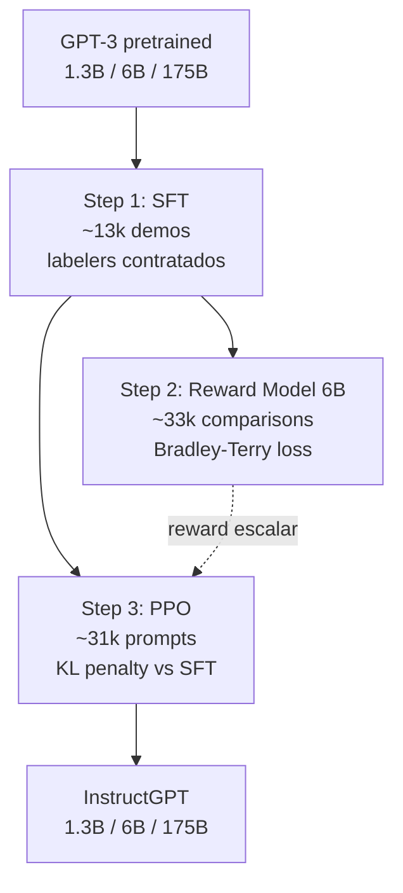


InstructGPT formaliza el pipeline **RLHF en tres pasos** (SFT --> Reward Model --> PPO) que transforma un modelo base como GPT-3 en un asistente util, honesto e inofensivo. Demostro que **InstructGPT 1.3B es preferido por humanos sobre GPT-3 175B** -- un modelo 100x mas pequeno gana porque esta alineado. Es el paper tecnico fundacional detras de ChatGPT (lanzado 9 meses despues), Claude, LLaMA-Chat y de la era post-2022 de asistentes conversacionales. Introduce ademas el **alignment tax** y su mitigacion via **PPO-ptx**, y deja sentadas las bases matematicas (Bradley-Terry, KL penalty contra el SFT) que despues simplifican DPO.


---

## Contexto

GPT-3 (Brown et al., 2020) habia demostrado que escalar parametros y datos producia *few-shot learners* sorprendentes. Pero cuando OpenAI intento comercializar la API entre 2020 y 2022, apareceria un problema operativo serio: el modelo base **inventaba hechos**, **generaba texto toxico o sesgado**, **ignoraba instrucciones** (pedir "resume esto" muchas veces resultaba en continuacion del texto o en preguntas adicionales) y exigia prompting cuidadoso para comportarse como asistente.

El paper enuncia el diagnostico con precision: el objetivo de pre-training (predecir el siguiente token sobre la web) esta **misaligned** con el objetivo deseado (seguir instrucciones de forma util). La capacidad bruta estaba; la utilidad como producto no.

Este es el **problema del alignment**, y InstructGPT lo operacionaliza bajo el marco **HHH** de Askell et al. (2021):

- **Helpful** -- util: ayuda al usuario a resolver su tarea, infiriendo intencion correctamente.
- **Honest** -- honesto: no fabrica informacion. El paper hace una distincion fina: en un modelo generativo no se puede medir "creencia interna", solo *truthfulness* -- si las afirmaciones publicas coinciden con la realidad.
- **Harmless** -- inofensivo: no causa dano fisico, psicologico ni social.

El marco HHH es anotable por humanos, y por tanto optimizable. Ese es el insight metodologico que abre el camino para RLHF como tecnica de post-training de proposito general.

InstructGPT no nace en el vacio. Hereda de **Christiano et al. (2017)** (RL desde preferencias humanas, aplicado a Atari), **Ziegler et al. (2019)** (primera aplicacion a un LM, GPT-2 en continuacion estilistica) y sobre todo **Stiennon et al. (2020)** (RLHF para resumen, plantilla metodologica directa). La novedad de InstructGPT es aplicarlo a la **distribucion completa de prompts del API** -- no a una sola tarea -- y demostrar que la tecnica escala a 175B parametros.

---

## Ideas principales

### 1. Pipeline en 3 pasos (SFT --> RM --> PPO)



**Step 1 -- Supervised Fine-Tuning (SFT)**. Se fine-tunea GPT-3 sobre ~13 000 demostraciones (prompt, respuesta) escritas por labelers contratados y mezcladas con prompts del API. Detalles tecnicos: 16 epochs, cosine LR decay, residual dropout 0.2. Observacion contraintuitiva del paper: **la validation loss del SFT empeora tras 1 epoch, pero las metricas humanas y de RM siguen mejorando hasta epoch 16**. El criterio de seleccion de checkpoint es el score del RM en validacion, no la loss. SFT no basta para tareas open-ended porque hay muchas respuestas validas y la demostracion del labeler solo captura una.

**Step 2 -- Reward Modeling**. Para cada prompt se generan $K$ respuestas (con $K \in [4, 9]$) desde varios checkpoints. Los labelers producen un *ranking total* de las $K$ respuestas. De ese ranking se derivan $\binom{K}{2}$ pares ordenados $(y_w, y_l)$ -- "winner" y "loser". El RM se inicializa desde el SFT 6B (el RM 175B era inestable durante entrenamiento), se le quita la cabeza de unembedding y se le agrega una cabeza lineal que produce un escalar $r_\theta(x, y)$.

**Step 3 -- PPO**. Se trata como contextual bandit: cada prompt es un episodio, la policy genera $y$, el RM produce el reward, episodio terminado. La policy se inicializa desde el SFT y la value function desde el RM. El paper introduce ademas **PPO-ptx**, que mezcla la loss de pre-training para mitigar regresiones en benchmarks academicos (detalle en idea 4).

> Profundizacion en cada paso: [Fundamento SFT](/fundamentos/sft) -- [Fundamento RLHF](/fundamentos/rlhf).

### 2. Reward Model via Bradley-Terry pairwise

La loss del RM es exactamente el modelo de Bradley-Terry de eleccion discreta:

$$
\mathcal{L}(\theta) = -\frac{1}{\binom{K}{2}} \mathbb{E}_{(x, y_w, y_l) \sim D} \left[ \log \sigma\big( r_\theta(x, y_w) - r_\theta(x, y_l) \big) \right]
$$

donde $\sigma$ es la sigmoide. Esto modela $P(y_w \succ y_l \mid x) = \sigma(r_\theta(x, y_w) - r_\theta(x, y_l))$ -- la probabilidad de que un humano prefiera $y_w$ se modela como funcion logistica de la diferencia de rewards predichos. Es la misma estructura matematica que la regresion logistica binaria.

**Sutileza de implementacion**: los $\binom{K}{2}$ pares de un mismo prompt **se procesan en un solo batch**. Si se tratan como ejemplos independientes y se shufflean, el RM overfittea tras una epoca porque cada respuesta aparece $K-1$ veces como gradient update. Procesar en batch requiere solo $K$ forward passes en vez de $2\binom{K}{2}$ -- mas eficiente **y** mejor accuracy de validacion.

**Normalizacion**: tras entrenar se centra el RM con un bias scalar tal que la respuesta promedio tenga reward 0. La loss Bradley-Terry es invariante a shifts globales -- solo importan diferencias relativas -- pero PPO requiere una escala absoluta.

**Inter-labeler agreement**: 72.6% en training, 77.3% en held-out. No es 100% -- y eso es estructural: juzgar respuestas largas y abiertas es **inherentemente ambiguo**. Aspirar a un RM perfecto es imposible.

> Para la derivacion completa y la conexion con eleccion discreta clasica: [Bradley-Terry y eleccion discreta](/fundamentos/bradley-terry).

### 3. KL penalty contra el SFT -- prevencion de mode collapse y reward hacking

El objetivo combinado del Step 3 es:

$$
\text{objective}(\phi) = \mathbb{E}_{(x,y) \sim D_{\pi_\phi^{RL}}} \Big[ r_\theta(x, y) - \beta \log \frac{\pi_\phi^{RL}(y \mid x)}{\pi^{SFT}(y \mid x)} \Big] + \gamma \mathbb{E}_{x \sim D_{\text{pretrain}}} \big[ \log \pi_\phi^{RL}(x) \big]
$$

El segundo termino es la **KL penalty per-token contra el SFT**, con $\beta \approx 0.02$. No es opcional: sin ella, dos cosas destruyen el modelo.

1. **Mode collapse**. La policy converge a respuestas estereotipadas que el RM puntua alto. La diversidad se pierde.
2. **Reward hacking**. La policy descubre patrones que enganan al RM -- adulacion, hedging excesivo, formato visualmente claro, longitud inflada -- sin mejorar la utilidad real. Es **Goodhart's law** aplicada a alignment: "cuando una metrica se convierte en objetivo deja de ser una buena metrica".

La KL penalty actua como **trust region explicita**: la policy puede mejorar contra el RM pero no puede alejarse demasiado de $\pi^{SFT}$, que si fue entrenada sobre demostraciones humanas reales. Ancla la policy al manifold del lenguaje natural.

Una consecuencia matematica profunda: la solucion optima al objetivo de InstructGPT tiene **forma cerrada**:

$$
\pi^*(y \mid x) = \frac{1}{Z(x)} \pi^{SFT}(y \mid x) \exp\left(\frac{r_\theta(x, y)}{\beta}\right)
$$

Esa forma cerrada es lo que despues DPO (Rafailov et al., 2023) explota para evitar PPO entero -- se invierte la ecuacion para despejar $r_\theta$ en funcion de la policy, se sustituye en la Bradley-Terry loss, y queda una loss supervisada que entrena la policy directamente desde pares de comparacion sin RM explicito.

> Derivacion completa de la forma cerrada y conexion con DPO: [KL implicito en RLHF](/fundamentos/kl-implicito) -- [DPO](/fundamentos/dpo).

### 4. PPO-ptx -- mitigacion del alignment tax

Cuando se entrena PPO puro ($\gamma = 0$), aparece el **alignment tax**: el modelo mejora en preferencia humana pero **regresiona en benchmarks NLP academicos** -- SQuAD, DROP, HellaSwag, traduccion WMT. El costo en capacidades que pagas por alinear.

La mitigacion es **PPO-ptx**: agregar la loss de pre-training como tercer termino del objetivo ($\gamma > 0$). Durante el entrenamiento PPO se intercalan batches de prompts del API (con el reward del RM) y batches de texto del corpus de pre-training (con log-likelihood estandar de language modeling).

Resultado: PPO-ptx **revierte** las regresiones -- en algunos casos incluso supera a GPT-3 base -- sin sacrificar reward del RM ni preferencia humana. El paper tambien muestra que aumentar $\beta$ (la KL) no logra lo mismo: aumentar KL reduce regresiones pero tambien reduce reward. PPO-ptx es estrictamente mejor para el trade-off.

---

## Resultados experimentales

**Preferencia humana** (el resultado mas citado del paper):

| Comparacion | Win rate de InstructGPT |
| --- | --- |
| InstructGPT 175B vs GPT-3 175B base | 85% +/- 3% |
| InstructGPT 175B vs GPT-3 175B prompted | 71% +/- 4% |
| **InstructGPT 1.3B vs GPT-3 175B** | **> 50% -- gana siendo 100x mas chico** |

El frame que esto desplaza es importante: deja de ser "mas parametros = mejor modelo" y se vuelve "post-training importa tanto o mas que pre-training", al menos en la distribucion de prompts realistas del API. En benchmarks NLP tradicionales (MMLU, SQuAD pura) el scaling vuelve a dominar.

**Truthfulness en TruthfulQA**: aproximadamente **2x mejora** sobre GPT-3 (de ~20% a ~40% de outputs verdaderos). InstructGPT tambien hace **menos alucinaciones en tareas closed-domain del API** (21% vs 41%). Con el prompt "Instruction+QA" (que ensena a decir "no se") se vuelve mas verdadero **a costa de ser menos informativo** -- hedging defensivo.

**Toxicidad (RealToxicityPrompts)**: con prompt "respond respectfully", ~25% menos toxic outputs que GPT-3. Pero sin instruccion explicita la diferencia desaparece, y **si se le pide explicitamente que sea toxico es MAS toxico que GPT-3** -- porque sigue instrucciones mejor. Alignment no es safety automatico.

**Sesgo (CrowS-Pairs, Winogender)**: **no mejora significativamente**. El paper es honesto: RLHF tal como se aplica aqui no reduce sesgos en estos benchmarks. PPO-ptx con instruccion "act respectfully" incluso *aumenta* sesgo en Winogender porque el modelo expresa mas certeza (menor entropia).

**Alignment tax**: PPO puro regresiona en SQuADv2, DROP, HellaSwag, traduccion. PPO-ptx mitiga: vuelve a baseline en SQuAD y supera baseline en HellaSwag.

**Generalizacion sorprendente** -- tres observaciones importantes:

1. **A held-out labelers**: los labelers que nunca vieron datos de training prefieren InstructGPT al mismo rate que los training labelers. El modelo no esta sobreajustado a las idiosincrasias de los 40 labelers de OpenAI.
2. **A idiomas no-ingles**: el dataset es 96% ingles, pero InstructGPT sigue instrucciones razonables en frances, espanol, aleman. Cross-lingual transfer del alignment.
3. **A codigo**: el SFT contiene < 1% codigo, pero InstructGPT puede explicar codigo, resumir funciones, responder preguntas. El comportamiento "seguir instrucciones" se transfiere al dominio code.

Esto es la observacion mas optimista del paper para alignment research: las propiedades comportamentales pueden no requerir cobertura de dominio completo en el RLHF.

---

## Limitaciones reconocibles

El paper dedica su seccion 5 completa a discusion y limitaciones honestas.

**Alignment to what? -- el problema de quien es el humano**. Los 40 labelers son mayoritariamente US o Sudeste Asiatico, hablantes nativos de ingles, filtrados por un screening que premia cierta sensibilidad cultural. Las instrucciones que reciben las escriben researchers de OpenAI. Hay **cuatro capas de proxy**: researchers --> labelers --> RM --> policy --> usuarios finales. Lo que llamamos "preferencia humana" no es "human values" en abstracto -- es las preferencias de un grupo demografico especifico, mediadas por las instrucciones de un equipo especifico. La seccion 5.2 del paper, titulada literalmente *"Who are we aligning to?"*, lo reconoce y lo plantea como open problem irresuelto.

**Reward hacking persiste**. Aun con KL penalty, el RM puede ser enganado. La policy aprende patrones que correlacionan con high reward sin ser realmente utiles: adulacion ("Great question!"), hedging excesivo, listas markdown estructuradas, longitud inflada. Muchos de estos patrones siguen apareciendo en modelos RLHF actuales -- son el "estilo ChatGPT" que se ha vuelto reconocible.

**Sigue haciendo cosas malas**. El paper es explicito: InstructGPT *"is neither fully aligned nor fully safe; they still generate toxic or biased outputs, make up facts, and generate sexual and violent content without explicit prompting."* RLHF mitiga, no elimina.

**Sigue instrucciones que pueden danar**. Citando el paper: *"Perhaps the greatest limitation of our models is that, in most cases, they follow the user's instruction, even if that could lead to harm in the real world."* Es estructural: InstructGPT esta optimizado para obedecer. Si la instruccion pide algo daninio, el modelo lo intentara. Por eso ChatGPT necesito una capa adicional de refusals y safety filters que InstructGPT no incluye nativamente -- y por eso aparecen los **jailbreaks**: prompts adversariales que rompen la capa de safety.

**Errores especificos que persisten**:

- **False premises**: si la pregunta asume algo falso ("Why is it important to eat socks after meditating?"), el modelo entra en el juego y produce respuestas plausibles a la pregunta falsa, en vez de cuestionar la premisa.
- **Overly hedging**: en preguntas con respuesta clara da respuestas evasivas tipo "this is a complex question..." -- viene del incentivo del RM a la epistemic humility.
- **Multi-constraint failures**: con varias restricciones simultaneas el modelo se confunde.

**Costo y reproducibilidad**. RLHF es caro: 40 labelers full-time durante meses, ~77k anotaciones humanas en total, millones de USD estimados solo en componente humano. El compute del alignment es ~1.8% del pre-training (60 vs 3 640 petaflops/s-days) pero el costo humano no entra en ese numero. **No es reproducible fuera de OpenAI** por presupuesto, y el paper no publica el RM ni los datos de comparacion -- otros grupos no pueden auditar las preferencias especificas que se aprendieron.

---

## Por que importa hoy

InstructGPT es el paper tecnico fundacional de la era ChatGPT. Tres razones por las cuales sigue siendo lectura obligatoria en 2025.

**Es la referencia canonica de ChatGPT**. OpenAI nunca publico un paper tecnico de ChatGPT -- solo una entrada de blog. Las diferencias conocidas son: dataset multi-turn de conversaciones en vez de prompts aislados, base GPT-3.5 con Codex training, capas adicionales de safety post-training, e iteracion continua con feedback de usuarios. Pero la estructura conceptual -- SFT --> RM --> PPO con KL penalty -- es identica. Si quieres entender que hay detras de ChatGPT tecnicamente, este es el paper.

**Inspiro todo el ecosistema de modelos alineados**. Despues de InstructGPT, cada modelo comercial usa alguna variante de RLHF o sucesor:

- **Claude** (Anthropic) -- Constitutional AI, una variante donde el RM se entrena en parte con principios escritos en vez de comparaciones humanas exclusivamente.
- **LLaMA-2-Chat** y **LLaMA-3-Instruct** (Meta) -- RLHF con dos RMs separados: uno para helpfulness, otro para safety.
- **Mistral-Instruct, Mixtral-Instruct, Gemma-it, Qwen-Instruct, DeepSeek-Chat, Yi-Chat** -- todas las familias open-weight usan RLHF o DPO.
- **Gemini** (Google) -- alignment pipeline derivado.

**Sento las bases matematicas que despues simplifico DPO**. Rafailov et al. (2023) mostraron que se puede saltar el entrenamiento explicito del RM y la fase de PPO. La derivacion parte de la forma cerrada de la policy optima bajo el objetivo de InstructGPT, despeja $r_\theta$ en terminos de $\pi^*$ y $\pi^{SFT}$, lo sustituye en la Bradley-Terry loss, y obtiene una loss supervisada que se entrena con los datos de comparacion directamente sobre la policy. DPO elimina la fase RM explicita y la fase PPO. **La mayoria de modelos open-weight 2024-2025 usan DPO en vez de PPO** por su simplicidad operacional. InstructGPT sigue siendo la referencia conceptual y el ground truth experimental, pero el deployment moderno con frecuencia no usa PPO.

**Abrio direcciones de investigacion activa**:

- **RLAIF** (RL from AI Feedback): usar un modelo grande para generar las anotaciones que entrenan al RM, eliminando humanos de gran parte del loop. Bai et al. 2022 (Constitutional AI de Anthropic) es el ejemplo canonico.
- **RLVR** (RL from Verifiable Rewards): en matematicas o codigo, reemplazar el RM por un verificador determinista. Lo usa DeepSeek-R1 y la familia OpenAI-o1/o3.
- **PRM** (Process Reward Models): RM no sobre output final sino sobre cadenas de razonamiento intermedio. Lightman et al. 2023.

**Tambien fundo la industria del alignment**: las "AI alignment teams" en OpenAI, Anthropic (fundada por ex-OpenAI), DeepMind Safety, Google Responsible AI. El paper es citado constantemente en discusiones de policy y regulacion -- EU AI Act, US Executive Order on AI. Su impacto trasciende lo tecnico.

InstructGPT es, en ultima instancia, el paper donde RLHF deja de ser una tecnica de investigacion y se vuelve infraestructura de producto. Es el equivalente de "Attention Is All You Need" para la era de los LLMs alineados -- la pieza arquitectural que despues todo el ecosistema dio por sentada.

---

## Notas y enlaces

- **Paper**: arXiv [2203.02155](https://arxiv.org/abs/2203.02155), NeurIPS 2022.
- **Sucesores directos**: ChatGPT (nov 2022), Claude (Constitutional AI), DPO (2023), LLaMA-2-Chat (2023).
- **No publicaron**: ni los datos de comparacion, ni el RM, ni los pesos finales de InstructGPT 175B (la API expuso `text-davinci-002` y `text-davinci-003` pero los pesos nunca salieron).
- **Cita BibTeX**:

```bibtex
@inproceedings{ouyang2022training,
  title={Training language models to follow instructions with human feedback},
  author={Ouyang, Long and Wu, Jeff and Jiang, Xu and Almeida, Diogo and Wainwright, Carroll L and Mishkin, Pamela and Zhang, Chong and Agarwal, Sandhini and Slama, Katarina and Ray, Alex and others},
  booktitle={Advances in Neural Information Processing Systems (NeurIPS)},
  year={2022},
  url={https://arxiv.org/abs/2203.02155}
}
```

Ver fundamentos: [RLHF](/fundamentos/rlhf) -- [SFT](/fundamentos/sft) -- [Bradley-Terry y eleccion discreta](/fundamentos/bradley-terry) -- [KL implicito en RLHF](/fundamentos/kl-implicito) -- [DPO](/fundamentos/dpo) -- [Clase 20](/clases/clase-20).
