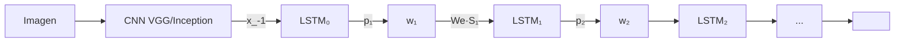


Combina un **CNN como encoder de imagen** con un **LSTM como decoder de texto** para generar descripciones en lenguaje natural de imagenes end-to-end. Modelo NIC (Neural Image Caption). Establece el patron CNN+RNN para tareas vision-language y duplica el estado del arte previo en BLEU.


---

## Contexto

Antes de 2014, generar descripciones de imagenes era un problema abordado con pipelines complejos: detectores de objetos + atributos + plantillas o gramaticas formales. Los resultados eran rigidos, frecuentemente "en el laboratorio" y mal generalizaban. Este paper de Google extendio el blueprint de **traduccion neural seq2seq** (Sutskever 2014) a vision-language: en vez de codificar una oracion fuente con un RNN, codifica una imagen con un CNN, y deja al LSTM generar la descripcion.

---

## Ideas principales

### 1. Arquitectura NIC: CNN encoder + LSTM decoder

Maximiza la log-verosimilitud condicional:

$$\theta^* = \arg\max_\theta \sum_{(I, S)} \log p(S \mid I; \theta)$$

donde $I$ es la imagen y $S = (S_0, S_1, \ldots, S_N)$ la descripcion.

Por la regla de la cadena:

$$\log p(S \mid I) = \sum_{t=0}^{N} \log p(S_t \mid I, S_0, \ldots, S_{t-1})$$

cada termino se modela con un LSTM:

$$
\begin{aligned}
x_{-1} &= \text{CNN}(I) \quad \text{(la imagen es la entrada inicial)} \\
x_t &= W_e \, S_t, \quad t \in \{0, \ldots, N-1\} \quad \text{(word embeddings)} \\
p_{t+1} &= \text{LSTM}(x_t) \quad \text{(softmax sobre vocabulario)}
\end{aligned}
$$

### 2. Imagen como entrada inicial, no en cada paso

Decision crucial: la imagen se introduce **una sola vez**, al inicio (paso $t = -1$), no en cada paso. Probaron alimentarla en cada paso y **empeora**: la red sobre-explota la imagen y memoriza, en lugar de modelar la dependencia entre palabras.

### 3. CNN preentrenado en ImageNet

El CNN encoder es preentrenado en clasificacion de ImageNet (1.2M imagenes, 1000 clases). La ultima capa fully-connected se reemplaza por una proyeccion al espacio de embedding del LSTM. Es un caso temprano de **transfer learning** masivo: la red de vision aprende features genericas en una tarea grande, y se especializa en captioning.

### 4. Inferencia: Sampling vs Beam Search

- **Sampling**: muestrea token por token segun $p_t$.
- **Beam Search**: mantiene los $k$ best beams en cada paso. Beam de tamano 20 mejora ~2 BLEU vs greedy.

### 5. Loss

Negative log-likelihood agregada sobre todas las palabras de la oracion verdadera:

$$L(I, S) = -\sum_{t=1}^{N} \log p_t(S_t)$$

Optimizada con SGD.

---

## Resultados experimentales

| Dataset | NIC (este paper) | State-of-the-art previo | Humano |
|---|---|---|---|
| Pascal VOC 2008 | 59 (BLEU-1) | 25 | 69 |
| Flickr30k | 66 | 56 | -- |
| SBU | 28 | 19 | -- |
| MSCOCO | 27.7 (BLEU-4) | -- | -- |

NIC **mas que duplico** BLEU-1 en Pascal y se acerco al rendimiento humano (59 vs 69). En MSCOCO establecio el state-of-the-art en BLEU-4 (27.7).

---

## Limitaciones identificadas

El paper muestra **failure cases**:

- Confusion entre objetos visualmente similares (pajaro vs gato persa).
- Descripciones plausibles pero **no fieles** a la imagen (el modelo "alucina" objetos que no estan).
- Fallo en composiciones espacialmente complejas.

Estas limitaciones motivaron lineas posteriores:

- **Show, Attend and Tell** (Xu et al. 2015) -- atencion sobre regiones de la imagen.
- **Bottom-up attention** (Anderson 2018) -- usar features de detector Faster R-CNN.
- **CLIP** (Radford 2021) y modelos vision-language modernos (BLIP, LLaVA, GPT-4V).

---

## Por que importa hoy

- Es el **paper fundacional** del patron CNN encoder + RNN decoder para vision-language.
- Establecio que **transfer learning desde ImageNet** funciona para tareas multimodales -- precursor de los foundation models multimodales.
- El uso de **beam search** y **MLE training** son el estandar para generacion en muchos modelos posteriores.
- Aunque los modelos modernos usan Transformers (encoder Vision Transformer + decoder GPT-style), el **principio de descomponer la prediccion como suma de log-probabilidades condicionales** sigue siendo el mismo.
- Vinyals (autor) co-creo despues **Pointer Networks** y trabajo en **AlphaStar** -- este paper marco el inicio de su carrera en seq2seq.

---

## Notas y enlaces

- El paper es muy claro y accesible -- lectura recomendada para entender el patron CNN+RNN.
- La **figura 2** (LSTM con forget gate) usa la formulacion moderna de LSTM (Gers et al. 2000), no la original de Hochreiter 1997.
- Para reproducir: el repo "im2txt" de TensorFlow implementa NIC con Inception V3 + LSTM.
- Sucesores conceptuales: **Karpathy & Fei-Fei 2015** "Deep Visual-Semantic Alignments" (alignments region-frase), **Xu et al. 2015** "Show, Attend and Tell" (atencion).

Ver fundamentos: [Redes Recurrentes](/fundamentos/redes-recurrentes) · [LSTM y GRU](/fundamentos/lstm-gru) · [Transfer Learning](/fundamentos/transfer-learning).
