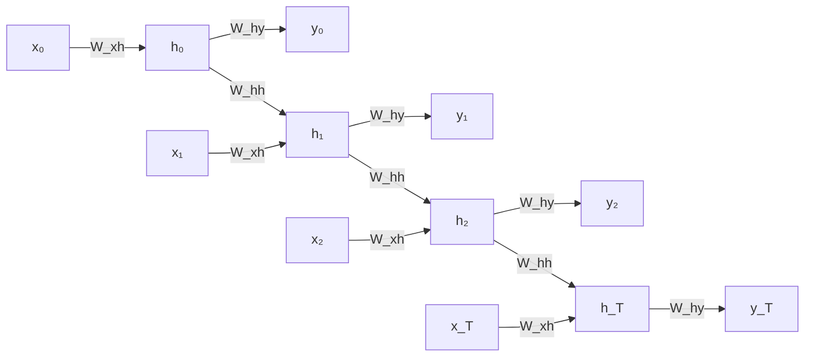
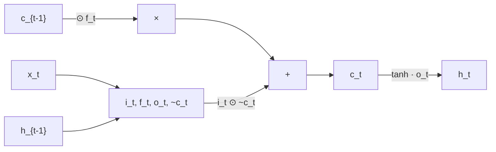
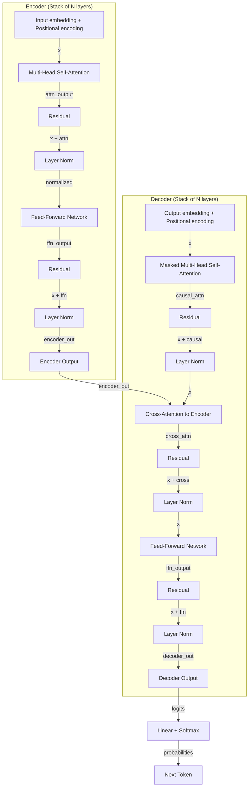

> Recorrido tematico de las 83 diapositivas del lecture, organizado por contenido (no por slide). Citas a slides especificas en *cursiva*.

**Video original:** [YouTube](https://www.youtube.com/watch?v=d02VkQ9MP44)
**Slides:** [PDF local (4.4 MB)](/videos/mit-6s191-l2-2026/slides.pdf) - [Original MIT](https://introtodeeplearning.com/slides/6S191_MIT_DeepLearning_L2.pdf)

---

## 1. Motivación: por qué modelar secuencias

El mundo está lleno de datos secuenciales: audio, video, texto, series temporales financieras, secuencias de ADN biológicas. A diferencia de las redes feed-forward o convolucionales que procesan entradas de **tamaño fijo**, una red recurrente maneja secuencias de **longitud variable** mediante un estado oculto que persiste entre pasos temporales *(slides 1-6)*.

La pregunta fundamental es: **dado el contexto pasado, ¿qué viene después?** Esta pregunta subyace en tareas como predecir la trayectoria de un objeto en movimiento ("dada una imagen de una pelota, ¿dónde estará en el siguiente frame?") o generar el siguiente token en una secuencia de palabras. Las secuencias aparecen en múltiples dominios —carácter a carácter, palabra a palabra, frame a frame— y el desafío es capturar tanto **dependencias de corto plazo** como **dependencias de largo plazo** que pueden estar separadas por cientos de pasos temporales.

---

## 2. Limitaciones de los enfoques ingenuos

Antes de presentar las RNNs, Amini expone tres soluciones ingenuas y por qué fallan *(slides 7-13)*.

### 2.1 Ventana fija pequeña

La forma más simple es usar una **ventana deslizante** de tamaño fijo para predecir el siguiente elemento. Dado un contexto de dos palabras anteriores ("for a"), se predice la siguiente. Cada palabra se codifica en **one-hot encoding**, sin perder información de la identidad.

El problema: una ventana de dos palabras captura muy poco contexto. En la oración *"Francia es donde crecí, pero ahora vivo en Boston. Hablo fluidamente ____"*, para predecir "francés" se necesita información del **pasado distante** (que viví en Francia al inicio). Una ventana pequeña falla categóricamente.

### 2.2 Bag of words (contar palabras)

Codificar todo el texto como un vector de conteos por palabra. El problema es que los **conteos no preservan el orden**. Las frases *"The food was good, not bad at all"* y *"The food was bad, not good at all"* tienen el mismo vector de conteos, pero significan lo **opuesto**. Sin preservar el orden, es imposible capturar negaciones, contexto temporal o relaciones sintácticas.

### 2.3 Ventana fija grande

Expandir la ventana a toda la secuencia, con un vector one-hot independiente por posición. El problema fundamental: **sin compartir parámetros**. Cada palabra en cada posición es un parámetro separado; lo aprendido sobre "this" en posición 1 no transfiere a "this" en posición 5. El modelo no generaliza y el número de parámetros crece sin límite con la longitud de la secuencia.

---

## 3. Criterios de diseño para el modelado de secuencias

Tras exponer las limitaciones, Amini enumera **cuatro criterios clave** que debe cumplir una solución robusta *(slide 14)*:

1. **Manejar secuencias de longitud variable** sin padding artificial ni truncamiento.
2. **Rastrear dependencias de largo plazo**: el estado interno debe retener y propagar información del pasado distante.
3. **Preservar información sobre el orden**: el orden de la secuencia debe estar implícitamente codificado.
4. **Compartir parámetros entre pasos**: los mismos pesos en cada paso temporal, permitiendo generalización y eficiencia de parámetros.

Las **redes neuronales recurrentes (RNNs)** emergen como la respuesta natural a estos cuatro requisitos.

---

## 4. Arquitectura de redes neuronales recurrentes

### 4.1 Concepto fundamental: recurrencia

Una RNN aplica la **misma función** en cada paso temporal, con una entrada que incluye el estado oculto del paso anterior *(slides 15-17)*. La ecuación fundamental es:

$$h_t = f_W(x_t, h_{t-1})$$

donde:

- $x_t$ es la entrada en el paso $t$.
- $h_t$ es el **estado oculto** — un "resumen lossy" de toda la información procesada hasta el momento.
- $f_W$ es una función parametrizada (típicamente una red neuronal pequeña) con pesos aprendibles $W$.

Este mecanismo cumple los cuatro criterios:

- **Longitud variable**: se aplica el mismo paso recurrente tantas veces como sea necesario.
- **Largo plazo**: el estado $h_t$ propaga información desde $h_0$ por composición a través del tiempo.
- **Orden**: la secuencia se procesa paso a paso, preservando estructura temporal.
- **Parámetros compartidos**: $f_W$ es idéntica en cada $t$; la red reutiliza los mismos pesos.

### 4.2 Parametrización estándar: lineal + activación

La implementación típica usa una combinación de transformación lineal y activación no-lineal:

$$h_t = \tanh(W_{hh}^\top h_{t-1} + W_{xh}^\top x_t)$$

donde:

- $W_{hh} \in \mathbb{R}^{d_h \times d_h}$ es la matriz de transición del estado oculto ("recurrente").
- $W_{xh} \in \mathbb{R}^{d_h \times d_x}$ es la matriz entrada-a-oculto.
- $\tanh$ es una activación no-lineal que introduce expresividad.
- El bias se absorbe implícitamente.

La dimensión crítica es $d_h$, el **tamaño del estado oculto**: suficientemente grande para capturar contexto, pero eficiente en parámetros.

Para generar una predicción en cada paso, se añade una capa de salida:

$$\hat{y}_t = W_{hy}^\top h_t$$

donde $W_{hy} \in \mathbb{R}^{d_y \times d_h}$ mapea del estado oculto al espacio de salida.

### 4.3 Pseudocódigo de RNN

La implementación operativa, con pesos compartidos en cada paso, se resume *(slides 18-19)*:

```python
my_rnn = RNN()
hidden_state = [0, 0, 0, 0]      # h_0 inicializado en cero

sentence = ["I", "love", "recurrent", "neural"]

for word in sentence:
    prediction, hidden_state = my_rnn(word, hidden_state)

next_word_prediction = prediction  # predicción para "networks"
```

La misma instancia `my_rnn` (con los mismos pesos) procesa cada palabra, actualizando `hidden_state` en cada iteración.

---

## 5. Arquitecturas según la tarea

Las RNNs permiten múltiples configuraciones según cómo se alineen las secuencias de entrada y salida *(slides 16-19)*:

- **Many-to-one** (clasificación de secuencias): se procesan todos los inputs $x_1, \ldots, x_T$ generando estados $h_1, \ldots, h_T$, pero solo el **último estado** $h_T$ alimenta una salida $y$. Ejemplo: análisis de sentimiento de una oración completa.
- **One-to-many** (generación condicionada): se proporciona un único input (o contexto inicial codificado en $h_0$) que genera una secuencia de outputs $y_1, \ldots, y_T$. Ejemplo: image captioning, donde la imagen se codifica y la RNN genera palabras secuencialmente.
- **Many-to-many síncrono** (misma longitud): se generan outputs en cada paso temporal, con igual número de pasos que inputs. Ejemplo: etiquetado POS (part-of-speech) de oraciones.
- **Many-to-many asíncrono** (encoder-decoder): dos RNNs en cascada: un **encoder** procesa la secuencia de entrada y resume en $h_T$ (el "contexto"); un **decoder** alimentado por el contexto genera la secuencia de salida. Permite entrada y salida de **longitudes distintas**. Ejemplo: traducción automática.

---

## 6. Grafo computacional desplegado en el tiempo

Para entender cómo entrenar una RNN, visualizar el **grafo computacional desplegado** es fundamental *(slides 23-25)*. En lugar de ver la RNN como un ciclo, se "despliega" en el tiempo: en cada paso $t = 1, \ldots, T$ hay una copia del módulo RNN recibiendo $x_t$ y $h_{t-1}$, produciendo $h_t$ y $y_t$.



El grafo resultante es una **red feed-forward profunda** (con profundidad $T$). Las **mismas matrices $W_{xh}$, $W_{hh}$, $W_{hy}$ se repiten** en cada paso: los parámetros se **comparten profundamente** a través del tiempo. Esta visualización es esencial para comprender por qué el entrenamiento es desafiante: el gradiente debe fluir hacia atrás a través de muchas capas, ampliando el riesgo de vanishing o exploding gradients.

---

## 7. Backpropagation through time (BPTT)

Entrenar una RNN requiere extender backpropagation al grafo desplegado. El procedimiento se llama **backpropagation through time (BPTT)** *(slides 24-26)*:

1. **Forward pass**: propagar $x_1, \ldots, x_T$ por el grafo desplegado, computando $h_1, \ldots, h_T$ y $y_1, \ldots, y_T$.
2. **Definir pérdida**: sumar la pérdida en cada paso (típicamente cross-entropy):

   $$L = \sum_{t=1}^{T} L_t(y_t, \text{target}_t)$$
3. **Backward pass**: aplicar la regla de la cadena a través del grafo desplegado. El gradiente respecto a $W_{hh}$ recibe contribuciones de **todos** los pasos temporales, porque $W_{hh}$ aparece en cada transición $h_{t-1} \to h_t$.
4. **Actualizar**: aplicar SGD, Adam o RMSprop con los gradientes computados.

Al calcular el gradiente respecto a $h_0$, la señal debe fluir hacia atrás a través de $T$ pasos. Cada factor incluye la derivada de la activación y la matriz $W_{hh}$. Para una RNN vanilla con tanh:

$$\frac{\partial h_t}{\partial h_{t-1}} = W_{hh}^\top \cdot \mathrm{diag}\bigl(\tanh'(z)\bigr)$$

donde $z$ es la pre-activación y $\tanh'(z) = 1 - \tanh^2(z) \in (0, 1)$.

---

## 8. Vanishing y exploding gradients

El flujo del gradiente a través de muchos pasos temporales es **multiplicativo**: la derivada de $h_t$ respecto a $h_{t-k}$ es un producto de $k$ jacobianos *(slides 27-28)*:

$$\frac{\partial h_t}{\partial h_{t-k}} = \prod_{i=0}^{k-1} \frac{\partial h_{t-i}}{\partial h_{t-i-1}}$$

Si los valores singulares de las jacobianas son **menores que 1**, el gradiente decae exponencialmente: **vanishing gradient**. Si son **mayores que 1**, explota: **exploding gradient**.

$$\left\| \frac{\partial L}{\partial h_0} \right\| \;\approx\; C \cdot \sigma_{\max}(W_{hh})^T$$

**Vanishing**: silencioso e impide aprender dependencias de largo plazo. El gradiente que viaja desde el paso 100 al paso 1 se vuelve negligible, y los pesos que afectan el paso 1 casi no se actualizan.

**Exploding**: causa inestabilidad numérica (NaN, Inf), pero al menos provoca alertas visibles.

Ambos fenómenos surgen del diseño arquitectónico: una RNN vanilla intenta comprimir toda la historia en un vector de estado oculto de dimensión fija, y multiplicar repetidamente por matrices $W_{hh}$ causa decaimiento o crecimiento exponencial. Las soluciones —gradient clipping, arquitecturas con compuertas, mecanismos de atención— se desarrollan en las partes siguientes.

---

## 9. Recortado de gradientes (Gradient Clipping)

Durante el entrenamiento de RNNs mediante BPTT, los gradientes se propagan hacia atrás a través de muchos pasos temporales. Cuando la magnitud de estos gradientes crece de manera descontrolada, produce **exploding gradients**, causando inestabilidad numérica y divergencia del entrenamiento *(slide 48)*.

El **gradient clipping** es una técnica simple pero efectiva para mitigar este problema. El procedimiento es directo: antes de actualizar los parámetros, se verifica la norma del gradiente total. Si excede un umbral $\tau$, se escala proporcionalmente:

$$\hat{g} \leftarrow \begin{cases} g & \text{si } \|g\| \leq \tau \\ \dfrac{\tau}{\|g\|} \cdot g & \text{si } \|g\| > \tau \end{cases}$$

A continuación, se realiza la actualización de parámetros con el gradiente recortado: $\theta \leftarrow \theta - \eta \hat{g}$.

**Por qué funciona**: el clipping limita la magnitud del paso de actualización sin alterar la dirección del gradiente. Esto evita saltos numéricos extremos que podrían causar NaN o Inf. El umbral típico $\tau$ se elige empíricamente (por ejemplo, 5.0 o 10.0).

**Limitación crítica**: el gradient clipping **no resuelve el vanishing gradient**, solo mitiga la explosión. Para el desvanecimiento silencioso de gradientes, que impide aprender dependencias a largo plazo, se requiere una arquitectura con mecanismos de memoria explícitos.

---

## 10. Limitaciones fundamentales de las RNNs vanilla

Las redes recurrentes estándar enfrentan dos desafíos críticos que limitan su capacidad de modelar secuencias largas *(slides 49-52)*.

### 10.1 El problema del desvanecimiento de gradientes

Cuando se calcula el gradiente respecto a un estado oculto temprano $h_0$, este debe fluir hacia atrás a través de $T$ pasos temporales. Matemáticamente:

$$\frac{\partial L}{\partial h_0} = \frac{\partial L}{\partial h_T} \cdot \frac{\partial h_T}{\partial h_{T-1}} \cdot \frac{\partial h_{T-1}}{\partial h_{T-2}} \cdots \frac{\partial h_1}{\partial h_0}$$

Cada factor en esta cadena de jacobianos incluye la derivada de la activación (por ejemplo, $\tanh'(z)$) y la matriz de recurrencia $W_{hh}$. Si los valores singulares de estas jacobianas son consistentemente menores que 1, el producto de muchos factores decae exponencialmente. El gradiente que viaja desde el paso 100 al paso 1 se vuelve negligible, y la red no puede aprender cómo el paso inicial afecta la salida final.

**Impacto práctico**: la red desarrolla un sesgo hacia las **dependencias de corto plazo**. Los parámetros que influyen en predicciones cercanas se actualizan eficientemente, mientras que los que afectan predicciones distantes casi no reciben señal de error.

### 10.2 El cuello de botella de información

Una RNN vanilla comprime toda la historia de la secuencia en un vector de estado oculto de dimensión fija. Para secuencias de miles de pasos, un vector de 128 o 256 dimensiones es insuficiente para retener toda la información relevante. La red debe olvidar información antigua para dejar espacio a información nueva.

El ejemplo clásico ilustra el problema: *"Francia es donde crecí, pero ahora vivo en Boston. Hablo fluidamente ___."* Para predecir "francés", el modelo debe recordar información del **pasado distante** (mencionada al principio). Sin un mecanismo explícito, esta información se diluye conforme procesa palabras intermedias.

---

## 11. Motivación para los mecanismos de compuertas (gating)

La solución a ambos problemas es introducir **compuertas** que controlen selectivamente qué información fluye, qué se olvida y qué se retiene en la celda de memoria *(slides 53-55)*.

La intuición combina dos mecanismos clave:

1. **Multiplicación elemento-a-elemento por vectores de compuerta**: los valores de las compuertas están entre 0 y 1 (producidos por activación sigmoide). Un valor de 0 "cierra" completamente el flujo; un valor de 1 lo abre completamente.

2. **Conexiones "shortcut" o caminos alternativos**: en lugar de transformar información a través de múltiples capas no-lineales, se permite que fluya relativamente sin cambios cuando se desea. Esto crea caminos para que el gradiente viaje sin acumulación de transformaciones.

Estas dos ideas en combinación mitigan el vanishing gradient: los caminos directos reducen la "distancia" que el gradiente debe viajar, mientras que las compuertas aprendibles permiten a la red desarrollar control fino sobre qué retener y qué descartar.

Típicamente se introduce una tríada de compuertas:

- **Forget gate**: controla qué del estado anterior se retiene.
- **Input gate**: controla cuánta información nueva entra.
- **Output gate**: controla qué se expone al siguiente paso.

---

## 12. LSTM: Long Short-Term Memory

### 12.1 Arquitectura fundamental

LSTM, propuesto por Hochreiter y Schmidhuber (1997), es la arquitectura con compuertas más icónica *(slides 54-55)*. A diferencia de una RNN vanilla que mantiene un único estado oculto $h_t$, el LSTM mantiene **dos estados paralelos**:

- **Cell state** $c_t$: la "memoria" principal o "cinta de contexto". Fluye con cambios mínimos cuando el forget gate es alto, preservando información a largo plazo.
- **Hidden state** $h_t$: la salida "filtrada" del cell state, que se pasa al siguiente paso y se usa para la predicción.



### 12.2 Ecuaciones del LSTM

Las ecuaciones formales *(slides 54-55)*:

$$i_t = \sigma(W_{xi} x_t + W_{hi} h_{t-1} + b_i) \quad \text{(input gate)}$$

$$f_t = \sigma(W_{xf} x_t + W_{hf} h_{t-1} + b_f) \quad \text{(forget gate)}$$

$$\tilde{c}_t = \tanh(W_{xc} x_t + W_{hc} h_{t-1} + b_c) \quad \text{(candidate cell state)}$$

$$c_t = f_t \odot c_{t-1} + i_t \odot \tilde{c}_t \quad \text{(new cell state)}$$

$$o_t = \sigma(W_{xo} x_t + W_{ho} h_{t-1} + b_o) \quad \text{(output gate)}$$

$$h_t = o_t \odot \tanh(c_t) \quad \text{(hidden state)}$$

donde $\odot$ denota multiplicación elemento-a-elemento. Todos los pesos $W$ y biases $b$ son aprendibles.

### 12.3 Rol de cada compuerta

**Forget gate** $f_t$: produce valores en $(0, 1)$ que multiplican elemento-a-elemento el cell state anterior. Si $f_t$ es cercano a 0, el contenido de $c_{t-1}$ se "olvida"; si es cercano a 1, se preserva. La red aprende cuándo olvidar información antigua.

**Input gate** $i_t$ y **candidate** $\tilde{c}_t$: el input gate decide cuánta información nueva entra en el cell state. El candidato, computado con tanh, proporciona los valores que pueden entrar. La combinación $i_t \odot \tilde{c}_t$ filtra el candidato según importancia.

**Output gate** $o_t$: controla qué información del cell state se comunica al siguiente paso y al exterior. El cell state se filtra con una activación tanh y se multiplica por $o_t$.

### 12.4 Por qué LSTM mitiga el vanishing gradient

La derivada del cell state respecto al paso anterior es:

$$\frac{\partial c_t}{\partial c_{t-1}} = f_t$$

**Críticamente**, no hay matriz $W_{hh}$ multiplicando: es únicamente una multiplicación elemento-a-elemento por valores en $(0, 1)$. Aunque cada elemento sea menor que 1, rara vez **todos** los elementos simultáneamente son cercanos a cero. En contraste, una RNN vanilla multiplica repetidamente por $W_{hh}$, causando decaimiento exponencial rápido cuando sus valores singulares son pequeños. El LSTM evita esto, permitiendo que la red mantenga un "camino directo" para el flujo de información y gradientes.

---

## 13. GRU: Gated Recurrent Unit

La arquitectura **GRU** (Cho et al., 2014) simplifica el diseño de LSTM combinando el forget gate y el input gate en una única **update gate**, y eliminando el cell state separado. En su lugar, usa un único estado oculto $h_t$ que se actualiza de forma similar *(slide 55)*.

Las ecuaciones principales:

$$z_t = \sigma(W_{xz} x_t + W_{hz} h_{t-1}) \quad \text{(update gate)}$$

$$r_t = \sigma(W_{xr} x_t + W_{hr} h_{t-1}) \quad \text{(reset gate)}$$

$$\tilde{h}_t = \tanh(W_{x\tilde{h}} x_t + W_{h\tilde{h}} (r_t \odot h_{t-1})) \quad \text{(candidate)}$$

$$h_t = (1 - z_t) \odot h_{t-1} + z_t \odot \tilde{h}_t$$

**Update gate** $z_t$: balance entre retener el estado anterior y adoptar el candidato nuevo.

**Reset gate** $r_t$: controla cuánto del estado anterior se considera al computar el candidato.

**Ventajas de GRU**: menos parámetros que LSTM (no requiere el cell state separado), entrenamiento más rápido y rendimiento típicamente comparable. Es una opción preferida en contextos donde la eficiencia de parámetros es crítica.

---

## 14. Limitaciones de los modelos recurrentes y motivación para attention

Aunque LSTM y GRU resolvieron el vanishing gradient, siguen procesando secuencias **secuencialmente**, paso a paso. Esto introduce limitaciones que motivan el salto hacia mecanismos de atención.

### 14.1 Cuello de botella secuencial

Cada paso $t$ depende de la salida del paso $t-1$. Esto impide la paralelización a través del tiempo y hace que el entrenamiento de secuencias largas sea lento, incluso en hardware altamente paralelo (GPUs/TPUs).

### 14.2 Distancia efectiva entre tokens

Aunque las compuertas LSTM permiten teóricamente preservar información indefinidamente, en la práctica las dependencias de muy largo alcance siguen siendo difíciles. La señal entre tokens distantes debe atravesar muchos pasos de procesamiento, atenuándose por interferencia de tokens intermedios.

### 14.3 Cuello de botella de codificación en seq2seq

En arquitecturas **seq2seq** con LSTM, el encoder comprime toda la entrada en un vector de contexto fijo $c$ de dimensión limitada. El decoder genera la salida usando únicamente este vector. Para secuencias largas, toda la información debe fluir a través de este cuello de botella, causando pérdida de información.

Ejemplo: traducir *"El auto rojo de Carlos está averiado"* requiere que el encoder capture estructura gramatical, identidades de entidades (Carlos, auto), atributos (rojo) y estado (averiado). Todo en un vector $c$. El decoder, sin acceso directo a palabras específicas del input, debe generar la traducción palabra por palabra; cuando necesita generar "Carlos", no tiene acceso directo a esa palabra en el input, debe "recordarla" en $c$, que ahora contiene información sobre todas las otras palabras también.

La **atención** resuelve esto permitiendo que el decoder, en cada paso, genere su propio context vector adaptativo que enfatiza las partes relevantes del input.

---

## 15. Self-attention: queries, keys y values

La **self-attention** (o intra-attention) emerge como un mecanismo alternativo para capturar dependencias en una secuencia **sin necesidad de recurrencia**. En lugar de procesar token por token, permite que cada posición "atienda" directamente a todas las demás posiciones simultáneamente.

### 15.1 La metáfora de búsqueda

La idea central es derivar tres representaciones para cada token:

- **Query** (pregunta): ¿Qué información necesito?
- **Key** (clave): ¿Qué información puedo ofrecer?
- **Value** (valor): ¿Cuál es esa información?

Es análogo a una búsqueda en una base de datos: la *query* se compara con todas las *keys*; las que más coinciden seleccionan los *values* correspondientes.

### 15.2 Proyecciones aprendibles

Si la entrada es $X \in \mathbb{R}^{n \times d}$ ($n$ tokens, $d$ dimensiones):

$$Q = X W_Q, \quad K = X W_K, \quad V = X W_V$$

donde $W_Q, W_K, W_V \in \mathbb{R}^{d \times d_k}$ son matrices aprendibles. En self-attention, los tres provienen de la **misma** secuencia $X$ — de ahí el "self".

---

## 16. Scaled dot-product attention

Una vez derivados queries y keys, se computa la "compatibilidad" entre cada query y cada key:

$$\text{scores} = QK^T \in \mathbb{R}^{n \times n}$$

Cada elemento $(i, j)$ indica cuán relevante es la posición $j$ para la posición $i$. Para estabilizar estos scores, se escalan:

$$\text{attention\_scores} = \frac{QK^T}{\sqrt{d_k}}$$

donde $d_k$ es la dimensión de los keys. El factor $\sqrt{d_k}$ evita que los productos punto sean muy grandes cuando $d_k$ es grande, lo cual saturaría el softmax (gradientes muy pequeños).

Finalmente, se aplica softmax fila por fila para convertir los scores en probabilidades, y se ponderan los values:

$$\text{Attention}(Q, K, V) = \text{softmax}\!\left(\frac{QK^T}{\sqrt{d_k}}\right) V$$

El output es una combinación ponderada de los values, donde los pesos se aprenden según la relevancia capturada por queries y keys. La derivación formal del factor $\sqrt{d_k}$ se desarrolla en `profundizacion.md`.

---

## 17. Síntesis del bloque intermedio

Las limitaciones de las RNNs vanilla —vanishing gradients y cuello de botella de codificación— impulsaron el desarrollo de arquitecturas progresivamente más sofisticadas:

1. **Gradient clipping** mitiga la explosión, pero no el desvanecimiento.
2. **LSTM/GRU** resuelven el desvanecimiento mediante caminos directos y compuertas aprendibles, permitiendo aprender dependencias de centenas de pasos.
3. **Self-attention** elimina el cuello de botella secuencial: cada posición accede directamente a todas las demás, en paralelo.

El siguiente bloque (Parte III) construye sobre la self-attention para llegar al **Transformer** completo: multi-head attention, positional encoding, normalización por capas, conexiones residuales y aplicaciones más allá del lenguaje.

---

## 18. Mecanismo de Atención Escalada (Scaled Dot-Product Attention)

La atención es el mecanismo fundamental que permite a las redes neuronales identificar y enfocarse en las características más importantes de una entrada. El objetivo central es reconocer qué partes del input merecen mayor atención *(slides 56-58)*.

El proceso comprende cuatro pasos clave:

1. **Codificación de información posicional**: Dado que los datos se procesan en paralelo (no secuencialmente como en RNNs), es necesario inyectar información sobre la posición de cada elemento en la secuencia. Sin esto, la arquitectura no distingue el orden de los tokens.

2. **Extracción de query, key, value**: Cada posición genera tres representaciones aprendidas mediante capas lineales aplicadas a la entrada con codificación posicional.

3. **Cálculo del peso de atención**: Se computa la similitud entre cada query y todos los keys usando el producto punto, escalado por un factor de normalización:

$$\text{Attention}(Q, K, V) = \text{softmax}\left(\frac{QK^T}{\sqrt{d_k}}\right)V$$

Aquí, $d_k$ es la dimensión de los keys. El escalamiento evita valores extremos en la softmax *(slide 59)*.

4. **Extracción de características con alta atención**: Los pesos resultantes se usan para ponderar los values, obteniendo una representación que enfatiza los tokens relevantes.

### Multi-Head Attention

Una cabeza de atención solo puede enfocarse en un patrón simultáneamente. La solución es usar múltiples cabezas en paralelo, cada una aprendiendo patrones diferentes. Una cabeza podría atender a relaciones sintácticas, otra a semánticas, etc. *(slides 60-61)*

Cada cabeza:
- Proyecta entrada a query, key, value independientes
- Computa atención con dimensión reducida
- Genera un output que se concatena con los de otras cabezas
- Se proyecta nuevamente a la dimensión original

## 19. Codificación Posicional (Positional Encoding)

Como el Transformer procesa toda la secuencia simultáneamente, pierde información inherente del orden. La solución clásica es sumar una codificación posicional a cada embedding *(slides 62-63)*.

La codificación usa funciones sinusoidales:

$$PE_{(pos, 2i)} = \sin\left(\frac{pos}{10000^{2i/d_{model}}}\right)$$

$$PE_{(pos, 2i+1)} = \cos\left(\frac{pos}{10000^{2i/d_{model}}}\right)$$

Donde:
- $pos$ es la posición en la secuencia
- $i$ es la dimensión del modelo
- Las frecuencias varían logarítmicamente entre dimensiones

Esta formulación permite al modelo aprender tanto dependencias locales como de largo alcance, pues diferentes dimensiones capturan patrones a diferentes escalas temporales.

## 20. Arquitectura Completa del Transformer

*(Slides 64-70 aproximadamente)*

### Bloque Encoder

El encoder es una pila de capas idénticas. Cada capa contiene:

1. **Multi-head self-attention**: Los tokens atienden a todos los demás tokens (incluido a sí mismo)
2. **Conexión residual**: $\text{output} = x + \text{MultiHeadAttention}(x)$
3. **Normalización de capa**: Layer normalization estabiliza el entrenamiento
4. **Feed-forward block**: Red neuronal de dos capas con ReLU
   - Primera capa expande la dimensión (típicamente 4x)
   - Segunda capa proyecta de vuelta
5. **Otra conexión residual**: $\text{output} = x + \text{FFN}(x)$

Las conexiones residuales y normalizaciones son críticas para permitir que redes muy profundas entrenen efectivamente.

### Bloque Decoder

El decoder es similar al encoder pero con tres modificaciones:

1. **Self-attention enmascarada**: Causal/masked attention. Un token solo puede atender a posiciones anteriores, no futuras. Esto es esencial en tareas generativas para evitar acceso a información futura.

2. **Cross-attention**: El decoder atiende a la salida del encoder, permitiendo que la información codificada se incorpore al proceso decodificador.

3. **Salida decodificada secuencialmente**: A diferencia del encoder que procesa todo paralelamente, el decoder típicamente genera un token por paso de tiempo (durante inferencia).

### Arquitectura Encoder-Decoder Completa



## 21. Mecanismos Especializados: Atención Enmascarada y Causal

### Atención Enmascarada (Masked Attention)

En tareas generativas, durante el entrenamiento no queremos que el modelo vea posiciones futuras. Se implementa multiplicando los scores de atención por una máscara triangular antes del softmax: los valores correspondientes a posiciones futuras se establecen a $-\infty$, asegurando que softmax produce probabilidad 0 *(slides 65-67)*.

### Cross-Attention

En arquitecturas encoder-decoder, la cross-attention permite que cada posición del decoder atienda a todas las posiciones del encoder. Las queries provienen del decoder, mientras que keys y values vienen del encoder. Esto es fundamental para tareas como traducción automática, donde el decoder necesita acceder selectivamente a diferentes partes de la entrada codificada.

## 22. Aplicaciones Transversales de Transformers

*(Slides 71-76)*

### Procesamiento de Lenguaje Natural (NLP)

**BERT (Devlin et al., 2019)**: Transformer bidireccional preentrenado. Usa solo el encoder, enfocándose en tareas de comprensión (clasificación, extracción de entidades). La atención bidireccional permite que cada token vea contexto futuro y pasado.

**GPT (Brown et al., 2020)**: Transformer solo-decoder. Usa atención causal para tareas de generación (continuación de texto, resumen). Preentrenado con objective language modeling: predecir el siguiente token.

### Visión por Computadora (Computer Vision)

**Vision Transformer (ViT, Dosovitskiy et al., 2020)**: Divide la imagen en parches (patches), los embebe, añade codificación posicional, y pasa por Transformer estándar. Demostró que los Transformers pueden competir o superar a CNNs en tareas de clasificación de imágenes, especialmente con datos de entrenamiento suficientes.

La ventaja clave: los Transformers capturan relaciones de largo alcance sin los sesgos inductivos de las convoluciones locales.

### Modelado de Secuencias Biológicas

**AlphaFold (Jumper et al., 2021, Lin et al., 2023)**: Usa Transformers para predecir estructura de proteínas a partir de secuencias de aminoácidos. La atención aprende qué residuos interaccionan a través de la cadena 3D. Revolucionó la biología estructural.

El breakthrough: la atención multi-head puede representar explícitamente interacciones entre pares de residuos, lo que es perfecto para estructura proteica.

## 23. Ventajas sobre Modelos Recurrentes

*(Slides 77-79)*

Los RNNs sufren limitaciones críticas:

- **Cuello de botella de codificación**: Toda la información de entrada debe comprimirse en un vector de estado oculto de dimensión fija
- **Sin paralelización**: El procesamiento es secuencial; cada step depende del anterior
- **Memoria limitada**: La información temprana se diluye al propagar a través de muchos pasos

Los Transformers eliminan estas limitaciones:

- **Atención directa**: Cada posición puede acceder directamente a cualquier otra, sin intermediarios
- **Paralelización completa**: Todos los tokens se procesan simultáneamente
- **Memoria de largo plazo**: Los gradientes fluyen directamente entre posiciones distantes

## 24. Cierre: El Futuro de los Modelos de Secuencias

*(Slide 83)*

Los Transformers son el bloque constructivo fundamental de los grandes modelos de lenguaje (Large Language Models, LLMs) modernos. La lección destaca seis puntos:

1. RNNs son adecuados para tareas de modelado de secuencias, pero tienen limitaciones estructurales
2. La recurrencia permite modelar dependencias secuenciales
3. El entrenamiento requiere backpropagation a través del tiempo (BPTT)
4. Existen aplicaciones exitosas en música, clasificación, traducción, etc.
5. **La atención permite procesar secuencias sin recurrencia**, eliminando cuellos de botella
6. **La atención es la base de muchos modelos de lenguaje grandes** — el futuro pertenece a arquitecturas basadas en Transformers

---

> Material adaptado de **MIT 6.S191 (2026) Lecture 2: Recurrent Neural Networks, Transformers, and Attention**, Ava Amini, 5 de enero de 2026.
> [Video](https://www.youtube.com/watch?v=d02VkQ9MP44) - [Slides oficiales](https://introtodeeplearning.com/slides/6S191_MIT_DeepLearning_L2.pdf) - [Sitio del curso](https://introtodeeplearning.com/).
> Notas en espanol como elaboracion independiente. Sin afiliacion oficial con MIT.
