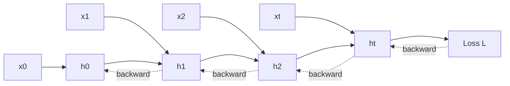
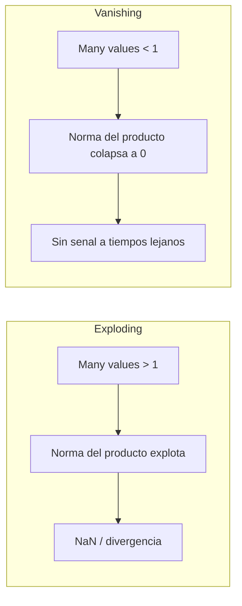
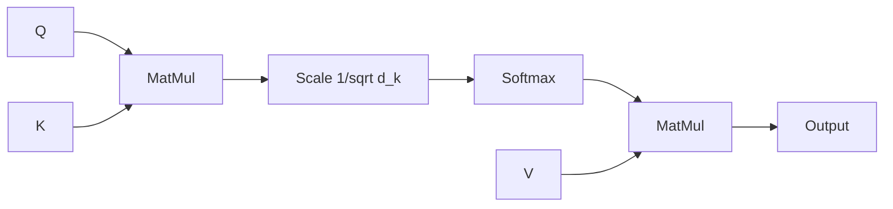
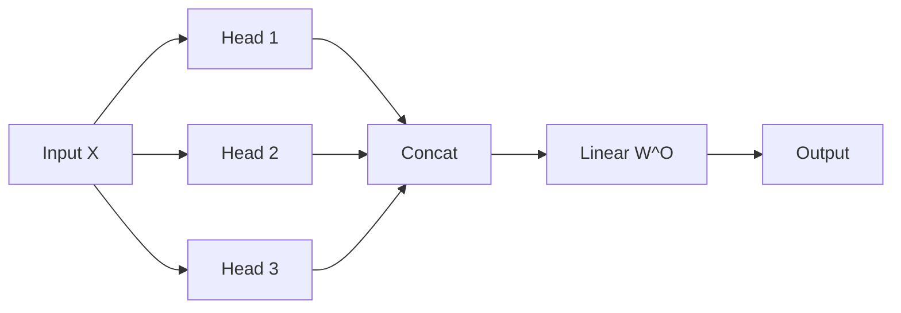

> Material complementario al lecture 2 de MIT 6.S191 edicion 2026 ("Deep Sequence Modeling", Ava Amini, 5 enero 2026). El lecture motiva muchos conceptos pero no los deriva al detalle: BPTT solo se muestra como diagrama de flechas backward, vanishing/exploding aparecen como recetas, LSTM/GRU obtienen una sola slide, y toda la genealogia seq2seq -> attention queda implicita. Esta profundizacion rellena esos huecos: deriva BPTT mecanicamente, analiza el producto de jacobianos detras del vanishing, repasa LSTM/GRU conceptualmente, reconstruye la transicion historica seq2seq -> Bahdanau -> Vaswani, y desarma el scaled dot-product paso a paso, con multi-head, position encoding y aplicaciones modernas.

---

## 1. BPTT al detalle

El lecture 2026 cubre **backpropagation through time** en cuatro slides (41-44): primero recuerda backprop en feed-forward (slide 42), luego despliega el grafo computacional con la perdida total $L = \sum_t L_t$ (slide 43), y finalmente superpone flechas rojas backward sobre el unrolling (slide 44, citando *Mozer, Complex Systems 1989* — el trabajo seminal sobre variantes de BPTT). Lo que NO se muestra es la formula explicita del gradiente que justifica por que aparece el problema de vanishing/exploding. La derivamos aqui.

Recordemos las ecuaciones de la celula RNN del lecture (slide 23):

$$
\mathbf{h}_t = \tanh(\mathbf{W}_{hh}^T \mathbf{h}_{t-1} + \mathbf{W}_{xh}^T \mathbf{x}_t), \qquad \hat{\mathbf{y}}_t = \mathbf{W}_{hy}^T \mathbf{h}_t.
$$

La perdida total sobre una secuencia de longitud $T$ es $L = \sum_{t=1}^{T} L_t$, donde $L_t = \ell(\hat{\mathbf{y}}_t, \mathbf{y}_t)$. El parametro mas delicado es $\mathbf{W}_{hh}$: aparece en la actualizacion de $\mathbf{h}_t$ tanto **directamente** (al combinar $\mathbf{h}_{t-1}$ con la entrada actual) como **indirectamente** a traves de todos los $\mathbf{h}_{t-1}, \mathbf{h}_{t-2}, \ldots, \mathbf{h}_1$ que dependen recursivamente del mismo $\mathbf{W}_{hh}$.

Aplicando regla de la cadena multivariada sobre el grafo desplegado, el gradiente de una perdida puntual $L_t$ respecto a $\mathbf{W}_{hh}$ es:

$$
\frac{\partial L_t}{\partial \mathbf{W}_{hh}} \;=\; \sum_{k=1}^{t} \frac{\partial L_t}{\partial \hat{\mathbf{y}}_t} \cdot \frac{\partial \hat{\mathbf{y}}_t}{\partial \mathbf{h}_t} \cdot \left( \prod_{j=k+1}^{t} \frac{\partial \mathbf{h}_j}{\partial \mathbf{h}_{j-1}} \right) \cdot \frac{\partial \mathbf{h}_k}{\partial \mathbf{W}_{hh}}.
$$

El gradiente total es entonces $\partial L / \partial \mathbf{W}_{hh} = \sum_{t=1}^{T} \partial L_t / \partial \mathbf{W}_{hh}$. La pieza critica es el **producto de jacobianos** $\prod_{j=k+1}^{t} \partial \mathbf{h}_j / \partial \mathbf{h}_{j-1}$: cuando $t-k$ es grande (dependencia de largo alcance), este producto encadena $t-k$ matrices que dependen ambas del mismo $\mathbf{W}_{hh}$ y de la derivada del $\tanh$. Cada jacobiano vale aproximadamente

$$
\frac{\partial \mathbf{h}_j}{\partial \mathbf{h}_{j-1}} = \mathbf{W}_{hh}^T \cdot \mathrm{diag}(\tanh'(\mathbf{z}_j)),
$$

con $\mathbf{z}_j = \mathbf{W}_{hh}^T \mathbf{h}_{j-1} + \mathbf{W}_{xh}^T \mathbf{x}_j$ y $\tanh'(z) = 1 - \tanh^2(z) \in (0, 1]$. La norma del producto crece o decrece **exponencialmente** con la profundidad temporal, segun el radio espectral de $\mathbf{W}_{hh}$ y la saturacion del $\tanh$. Esa es exactamente la observacion de la slide 46 ("**many factors of $\mathbf{W}_{hh}$** + **repeated gradient computation**") y motiva todo el bloque de vanishing/exploding (slides 47-48).



El diagrama muestra el flujo forward (flechas solidas) y backward (flechas punteadas) que el lecture dibuja en la slide 44. Cada flecha backward horizontal corresponde a multiplicar por un jacobiano $\partial \mathbf{h}_j / \partial \mathbf{h}_{j-1}$.

Cross-link: [Fundamento: BPTT](/fundamentos/backpropagation-through-time).

---

## 2. Vanishing y exploding gradients

El lecture 2026 enuncia el problema en la slide 46 ("computing the gradient wrt $h_0$ involves many factors of $\mathbf{W}_{hh}$") y luego separa las dos patologias en las slides 47 (exploding) y 48 (vanishing) con una caja "many values > 1" vs "many values < 1". La fundamentacion teorica completa proviene de **Bengio, Simard y Frasconi (1994)**, que en *IEEE Transactions on Neural Networks* mostraron analiticamente por que las RNN no pueden aprender dependencias largas: si $\rho(\mathbf{W}_{hh})$ es el radio espectral (mayor valor singular), el producto de jacobianos $\prod_{j} \partial \mathbf{h}_j / \partial \mathbf{h}_{j-1}$ crece como $\rho^{t-k}$ cuando $\rho > 1$ y decae como $\rho^{t-k}$ cuando $\rho < 1$. En ambos casos la dependencia con la profundidad temporal es **exponencial**, no polinomial, y por eso no hay learning rate ni mas datos que arregle el problema.



**Para exploding**, la solucion estandar es **gradient clipping**, propuesta por **Pascanu, Mikolov y Bengio (2013)** en *On the difficulty of training recurrent neural networks* (ICML 2013). La idea es simple: si la norma del gradiente excede un umbral $\theta$, escalarlo proporcionalmente para mantenerlo acotado:

$$
\nabla \;\leftarrow\; \nabla \cdot \min\!\left(1, \frac{\theta}{\|\nabla\|}\right).
$$

La direccion del gradiente se preserva, solo se acota la magnitud. En la practica $\theta \in [1, 10]$ funciona bien.

**Para vanishing**, no hay un parche tan simple. La slide 48 enumera tres familias de soluciones:

1. **Activation function**: usar ReLU (derivada $1$ para $z > 0$) en lugar de $\tanh$ (derivada $\leq 1$ siempre, saturando a $0$ para $|z|$ grande). Esto evita que el factor $\tanh'(\mathbf{z}_j)$ del jacobiano contribuya al colapso.
2. **Weight initialization**: inicializar $\mathbf{W}_{hh}$ con matrices ortogonales (radio espectral exactamente $1$) o usar identity initialization. La idea es arrancar el entrenamiento con $\rho(\mathbf{W}_{hh}) \approx 1$ para que el producto de jacobianos no decaiga ni explote en las primeras iteraciones.
3. **Network architecture**: el cambio mas profundo. Reemplazar la celula RNN simple por **gated units** (LSTM, GRU) que aprenden dinamicamente cuando preservar y cuando borrar informacion del estado oculto. Esta es la motivacion directa para la slide 54 del lecture.

Cross-link: [Fundamento: BPTT](/fundamentos/backpropagation-through-time).

---

## 3. LSTM y GRU (extension conceptual)

El lecture 2026 dedica **una sola slide** al gating (slide 54): introduce los componentes basicos ($\sigma$ como sigmoid layer, $\times$ como multiplicacion pointwise, una "gated cell" verde) y enuncia que "**Long Short Term Memory (LSTMs)** networks rely on a gated cell to track information throughout many time steps", sin entrar en las ecuaciones internas. Aqui se cubre conceptualmente para cerrar el arco motivacional. Los detalles completos viven en [Fundamento: LSTM y GRU](/fundamentos/lstm-gru).

**LSTM** fue introducida por **Hochreiter y Schmidhuber (1997)** en *Neural Computation* con la idea fundacional del **constant error carousel (CEC)**: en lugar de propagar gradientes a traves de una activacion no lineal saturante, mantener una **cell state** $\mathbf{c}_t$ que se actualiza de forma **aditiva**. El gradiente $\partial \mathbf{c}_t / \partial \mathbf{c}_{t-1}$ deja de depender del producto de matrices y pasa a ser controlado por una **forget gate** $\mathbf{f}_t \in [0, 1]$ aprendida. Cuando $\mathbf{f}_t \approx 1$, la informacion se conserva intacta a traves del tiempo; cuando $\mathbf{f}_t \approx 0$, se descarta. La celda LSTM moderna combina cuatro gates:

- **Input gate** $\mathbf{i}_t$: controla cuanto del nuevo candidato se incorpora.
- **Forget gate** $\mathbf{f}_t$: controla cuanto del estado anterior se preserva.
- **Output gate** $\mathbf{o}_t$: controla cuanto del estado se expone como hidden state.
- **Cell state** $\mathbf{c}_t$: la "autopista" de informacion de largo plazo.

```mermaid
graph LR
  prev[c_{t-1}, h_{t-1}] --> forget[Forget gate sigma]
  prev --> input[Input gate sigma]
  prev --> output[Output gate sigma]
  forget --> cell[Cell state c_t]
  input --> cell
  cell --> output
  output --> h[h_t]
```

**GRU** fue propuesta por **Cho et al. (2014)** en *Learning phrase representations using RNN encoder-decoder for statistical machine translation* (EMNLP 2014). Simplifica LSTM combinando input y forget gates en una unica **update gate** $\mathbf{z}_t$, y eliminando la separacion entre cell state y hidden state. Quedan solo dos gates (reset $\mathbf{r}_t$ y update $\mathbf{z}_t$), con menos parametros y menor costo computacional. En muchas tareas (especialmente con datasets pequenos a medianos) GRU iguala o supera ligeramente a LSTM.

Ambas arquitecturas resuelven el problema de **vanishing gradient** porque el camino aditivo a traves de la cell state mantiene el gradiente acotado. Sin embargo, **no resuelven exploding**: sigue siendo necesario aplicar gradient clipping en el entrenamiento. Esta es la razon por la que el lecture (y la literatura) menciona LSTM como solucion al "long-term dependency problem" pero no abandona el clipping.

---

## 4. De seq2seq a attention: la genealogia historica

El lecture 2026 hace un pivot abrupto: en la slide 59 enumera tres limitaciones de RNN (encoding bottleneck, slow / no parallelization, not long memory) y de ahi salta directo a self-attention en las slides 65+. Lo que **NO** muestra es la evolucion historica que llevo de RNN a Transformer, y que es esencial para entender por que el Transformer tiene la forma que tiene. Aqui se rellena ese hueco.

**Seq2Seq (Sutskever, Vinyals, Le, 2014)** en *Sequence to sequence learning with neural networks* (NeurIPS 2014) fue el primer modelo encoder-decoder con LSTMs apiladas para traduccion automatica. La arquitectura era simple: una LSTM "encoder" lee la oracion fuente y comprime toda su informacion en un **vector de contexto fijo** $\mathbf{c}$ (su ultimo hidden state). Una LSTM "decoder" recibe ese vector como estado inicial y genera la traduccion palabra por palabra. Funcionaba sorprendentemente bien (alcanzo estado del arte en WMT'14 ingles-frances), pero tenia un problema fundamental: **el bottleneck**. Toda la informacion de una oracion de 50 palabras tenia que caber en un solo vector de unos pocos cientos de dimensiones. Para oraciones largas, la performance degradaba dramaticamente.

**Bahdanau attention (Bahdanau, Cho, Bengio, 2015)** en *Neural machine translation by jointly learning to align and translate* (ICLR 2015) rompio el bottleneck. La idea: en vez de comprimir el input en UN vector, dejar que el decoder **mire todos los hidden states del encoder en cada paso** con pesos aprendidos. En cada paso $j$ del decoder, computar:

$$
\alpha_{ij} = \frac{\exp(e_{ij})}{\sum_k \exp(e_{kj})}, \qquad e_{ij} = \mathbf{v}_a^T \tanh(\mathbf{W}_a [\mathbf{h}_i; \mathbf{s}_j]),
$$

donde $\mathbf{h}_i$ son los hidden states del encoder, $\mathbf{s}_j$ es el estado del decoder y $\mathbf{v}_a, \mathbf{W}_a$ son parametros aprendidos. El context vector pasa a ser $\mathbf{c}_j = \sum_i \alpha_{ij} \mathbf{h}_i$, una mezcla ponderada de TODOS los estados del encoder. Esta es la formulacion **additive attention** (tambien llamada concat o Bahdanau attention).

**Luong attention (Luong, Pham, Manning, 2015)** en *Effective approaches to attention-based neural machine translation* (EMNLP 2015) propuso variantes mas eficientes computacionalmente reemplazando la red feed-forward de Bahdanau por funciones de scoring mas simples: **dot** ($\mathbf{s}_j^T \mathbf{h}_i$), **general** ($\mathbf{s}_j^T \mathbf{W}_a \mathbf{h}_i$) y **concat** (similar a Bahdanau). El scoring **dot** de Luong es el ancestro directo del **scaled dot-product attention** del Transformer.

El paso final fue **Vaswani et al. (2017)** con *Attention is all you need*: eliminaron por completo la recurrencia, dejando solo bloques de attention apilados. Pero conceptualmente, todo el aparato de Q/K/V que veremos en la siguiente seccion es la generalizacion natural de la attention de Bahdanau-Luong al setting "encoder = decoder = lo mismo".

Cross-link: [Fundamento: Mecanismo de atencion](/fundamentos/mecanismo-atencion), [Clase 13](/clases/clase-13).

---

## 5. Scaled dot-product attention: derivacion completa

El lecture 2026 dedica **nueve slides** (70-78) a construir progresivamente el scaled dot-product attention, con un build paso a paso que culmina en el diagrama completo del head (slide 77) y la frase punchline "**Attention is the foundational building block of the Transformer architecture**" (slide 78). Aqui se hace la derivacion formal completa.

**Paso 1: position encoding.** Como toda la secuencia se procesa en paralelo (no hay recurrencia), el modelo no tiene forma intrinseca de saber el orden de los tokens. La solucion es **inyectar** informacion posicional sumando un vector $\mathbf{p}_i$ al embedding del token:

$$
\mathbf{x}_i \;=\; \mathbf{e}_i + \mathbf{p}_i,
$$

donde $\mathbf{e}_i$ es el embedding del token y $\mathbf{p}_i$ es el position encoding (detalles en seccion 7). El resultado $\mathbf{x}_i$ es un **position-aware encoding**. La slide 71 lo visualiza explicitamente: 7 columnas de embedding $\oplus$ 7 vectores de position $\rightarrow$ 7 columnas verdes "position-aware encoding".

**Paso 2: tres proyecciones lineales.** A partir de la matriz $\mathbf{X} \in \mathbb{R}^{n \times d_{\text{model}}}$ (donde $n$ es la longitud de la secuencia), se computan tres proyecciones independientes:

$$
\mathbf{Q} = \mathbf{X} \mathbf{W}_Q, \qquad \mathbf{K} = \mathbf{X} \mathbf{W}_K, \qquad \mathbf{V} = \mathbf{X} \mathbf{W}_V,
$$

con $\mathbf{W}_Q, \mathbf{W}_K \in \mathbb{R}^{d_{\text{model}} \times d_k}$ y $\mathbf{W}_V \in \mathbb{R}^{d_{\text{model}} \times d_v}$. La intuicion (slides 68-69 con la analogia YouTube) es que cada token se transforma en tres roles distintos: **query** (lo que estoy buscando), **key** (lo que ofrezco para ser encontrado) y **value** (el contenido que entrego cuando me eligen).

**Paso 3: similarity scoring.** Se computa una matriz de similitudes $\mathbf{S} \in \mathbb{R}^{n \times n}$:

$$
\mathbf{S} = \mathbf{Q} \mathbf{K}^T,
$$

donde cada entrada $S_{ij} = \mathbf{q}_i \cdot \mathbf{k}_j$ mide la afinidad del query $i$ con el key $j$. El producto punto es una buena medida de "cuanto se parecen": cuando los dos vectores apuntan en direcciones similares, el producto es grande; cuando son ortogonales, es cero; cuando apuntan en direcciones opuestas, es negativo. La slide 73 lo describe explicitamente como "cosine similarity" (estrictamente, cosine similarity es producto punto normalizado por las magnitudes; el producto punto sin normalizar combina similitud direccional y magnitud).

**Paso 3.5: la justificacion del $\sqrt{d_k}$.** Aqui esta una de las contribuciones mas sutiles de Vaswani et al. (2017). Cuando $d_k$ es grande (digamos $d_k = 64$ o $128$), los productos punto $\mathbf{q}_i \cdot \mathbf{k}_j$ tienen varianza proporcional a $d_k$ (suma de $d_k$ productos de variables aleatorias independientes). Magnitudes grandes en los logits empujan la softmax a regiones donde una entrada domina y todas las demas colapsan a cero, **saturando** la funcion y produciendo gradientes cercanos a cero. La solucion es normalizar dividiendo por $\sqrt{d_k}$ para que la varianza de los logits se mantenga $O(1)$:

$$
\mathbf{S} \;\leftarrow\; \frac{\mathbf{Q} \mathbf{K}^T}{\sqrt{d_k}}.
$$

Sin este factor, los Transformers de gran $d_k$ no entrenan estable.

**Paso 4: softmax por filas.** Se aplica softmax a cada fila de $\mathbf{S}$ para obtener una matriz de pesos de atencion $\mathbf{A}$:

$$
\mathbf{A} = \mathrm{softmax}\!\left(\frac{\mathbf{Q} \mathbf{K}^T}{\sqrt{d_k}}\right),
$$

donde cada fila $\mathbf{A}_{i,:}$ suma 1 y representa una distribucion de probabilidad sobre que values atender desde la posicion $i$. La slide 75 lo visualiza como una matriz $7 \times 7$ con gradientes rojos (mas oscuro = mas peso).

**Paso 5: ponderar values.** Finalmente:

$$
\mathrm{Attention}(\mathbf{Q}, \mathbf{K}, \mathbf{V}) \;=\; \mathbf{A} \mathbf{V} \;=\; \mathrm{softmax}\!\left(\frac{\mathbf{Q} \mathbf{K}^T}{\sqrt{d_k}}\right) \mathbf{V} \;\in\; \mathbb{R}^{n \times d_v}.
$$

Cada fila del output es una combinacion ponderada de los values, donde los pesos vienen dados por la similitud query-key. Esta es la formula central del Transformer (slide 76).



---

## 6. Multi-head attention: mecanica

Una sola operacion de attention captura un solo "punto de vista" sobre la secuencia. Vaswani et al. observaron que es mucho mas potente computar **varias attentions en paralelo**, cada una con sus propias proyecciones $\mathbf{W}_{Q_i}, \mathbf{W}_{K_i}, \mathbf{W}_{V_i}$ aprendidas, y luego concatenar y proyectar:

$$
\mathrm{head}_i = \mathrm{Attention}(\mathbf{Q} \mathbf{W}_{Q_i}, \mathbf{K} \mathbf{W}_{K_i}, \mathbf{V} \mathbf{W}_{V_i}),
$$

$$
\mathrm{MultiHead}(\mathbf{Q}, \mathbf{K}, \mathbf{V}) = \mathrm{Concat}(\mathrm{head}_1, \ldots, \mathrm{head}_h) \mathbf{W}^O.
$$

El lecture 2026 lo intuye en la slide 79 con tres imagenes de Iron Man: head 1 atiende al casco, head 2 al edificio del fondo, head 3 a un objeto distante. La idea es **diversidad de subespacios**: cada head aprende a fijarse en un aspecto distinto del input. En la practica, analisis post-hoc de Transformers entrenados muestran que algunos heads aprenden relaciones sintacticas (sujeto-verbo), otros relaciones semanticas, otros patrones posicionales (atender al token previo), etc.

La configuracion estandar de Vaswani et al. usa $h = 8$ heads con $d_k = d_v = d_{\text{model}} / h = 64$ cuando $d_{\text{model}} = 512$. Esta eleccion mantiene el costo computacional total de multi-head approximately igual al de single-head: cada head opera en un subespacio mas pequeno, pero hay $h$ de ellos. La proyeccion final $\mathbf{W}^O \in \mathbb{R}^{h d_v \times d_{\text{model}}}$ recombina los outputs de todos los heads en el espacio original.



---

## 7. Position encoding: tres enfoques

El lecture solo muestra position encoding implicitamente en la slide 71 (la suma $\mathbf{e}_i \oplus \mathbf{p}_i$). Hay tres enfoques principales en la literatura:

**1. Sinusoidal (Vaswani et al., 2017).** El paper original propone funciones senoidales y cosenoidales fijas (no aprendidas):

$$
PE_{(pos, 2i)} = \sin\!\left(\frac{pos}{10000^{2i/d}}\right), \qquad PE_{(pos, 2i+1)} = \cos\!\left(\frac{pos}{10000^{2i/d}}\right),
$$

donde $pos$ es la posicion absoluta y $i$ es el indice de la dimension. La eleccion de $10000^{2i/d}$ produce longitudes de onda en progresion geometrica desde $2\pi$ hasta $10000 \cdot 2\pi$. Ventajas: deterministico (no consume parametros), generaliza a longitudes de secuencia no vistas en entrenamiento (porque las funciones son continuas), y permite al modelo aprender a atender a posiciones relativas (porque $PE_{pos+k}$ se puede expresar como combinacion lineal de $PE_{pos}$ via identidades trigonometricas).

**2. Learned position embeddings (BERT, GPT-2).** En vez de funciones fijas, se aprende una matriz de embeddings $\mathbf{E}_{\text{pos}} \in \mathbb{R}^{L \times d}$ exactamente como cualquier otra tabla de embeddings. Cada posicion $0, 1, \ldots, L-1$ tiene su propio vector aprendido. Suele alcanzar performance ligeramente superior al sinusoidal en tareas con longitudes acotadas, pero **no extrapola**: el modelo no sabe que hacer con posiciones $> L$.

**3. RoPE (rotary position embedding).** Aplica rotaciones en pares de dimensiones del query y key, codificando posicion **relativa** (no absoluta) en el producto punto. Es el enfoque dominante en LLMs modernos (LLaMA, GPT-NeoX, varios open-source). Tiene la propiedad elegante de que el producto $\mathbf{q}_i^T \mathbf{k}_j$ depende solo de la diferencia $i - j$ y no de las posiciones absolutas, lo que extrapola mucho mejor a longitudes largas. Para detalles ver [fundamentos/mecanismo-atencion](/fundamentos/mecanismo-atencion).

La eleccion entre los tres importa en la practica: BERT y GPT-2 usaron learned, los Transformers originales sinusoidal, y los LLMs post-2022 mayoritariamente RoPE o variantes (ALiBi, etc.).

---

## 8. Aplicaciones modernas que el lecture menciona

La slide 80 cierra el lecture conectando self-attention con cinco aplicaciones modernas, organizadas en tres dominios: **Language Processing**, **Biological Sequences** y **Computer Vision**. Aqui se resume cada una.

**BERT (Devlin et al., 2019, NAACL).** *Bidirectional Encoder Representations from Transformers*. Un Transformer **encoder-only** pre-entrenado con dos tareas auto-supervisadas: **masked language modeling** (predecir tokens enmascarados al azar, con contexto bidireccional) y **next sentence prediction** (decidir si dos oraciones son consecutivas). Cambio el paradigma de NLP a "pre-train + fine-tune": un solo modelo masivo se entrena una vez y se especializa con pocos datos a tareas downstream (clasificacion, NER, QA, etc.). Establecio estados del arte simultaneos en GLUE, SQuAD y otros benchmarks. Inicio la era de los foundation models en NLP.

**GPT-3 (Brown et al., 2020, NeurIPS).** *Language models are few-shot learners*. Un Transformer **decoder-only** autoregresivo de $175 \times 10^9$ parametros, entrenado en cientos de billones de tokens de texto. La contribucion conceptual fue mostrar la **emergencia de few-shot learning sin fine-tuning**: dado un prompt con pocos ejemplos en contexto, el modelo aprende la tarea en tiempo de inferencia sin actualizar pesos. Esto inauguro el paradigma de **in-context learning** que define los LLMs modernos (ChatGPT, Claude, Gemini son descendientes directos de esta linea).

**AlphaFold (Jumper et al., 2021, Nature).** *Highly accurate protein structure prediction with AlphaFold*. Aplico Transformers (con variantes equivariantes y geometric attention) al problema de predecir la estructura tridimensional de proteinas a partir de su secuencia de aminoacidos. Resolvio CASP14 con precision atomica, esencialmente cerrando un problema de 50 anos en biologia computacional. Demostro que self-attention generaliza mucho mas alla de NLP.

**ESM (Lin et al., 2023, Science).** *Evolutionary-scale prediction of atomic-level protein structure*. Entreno Transformers gigantes solo en **secuencias** de proteinas (sin estructuras), usando masked language modeling al estilo BERT. Las representaciones aprendidas predicen contactos residuo-residuo, estabilidad termica y propiedades funcionales con precision comparable a AlphaFold pero usando solo evolucion natural como senal de entrenamiento. Es la version "GPT for proteins" del campo.

**ViT (Dosovitskiy et al., 2020/2021, ICLR).** *An image is worth 16x16 words*. Trata cada parche $16 \times 16$ pixeles de una imagen como un token, los proyecta linealmente a embeddings, agrega position encodings y los procesa con un Transformer estandar. Demostro que la atencion **sin priors visuales** (sin convoluciones, sin pooling) puede igualar y superar a CNNs cuando se entrena a escala suficiente. Inauguro la era de los Vision Transformers que hoy dominan ImageNet, deteccion de objetos, segmentacion y modelos multimodales (CLIP, DINO, SAM).

El patron es claro: el bloque computacional unico inventado en *Attention is all you need* se ha convertido en el sustrato universal del deep learning moderno, atravesando lenguaje, biologia, vision y mas alla. La slide 81 del lecture lo resume en su sexto takeaway: "Self-attention is the basis for many **large language models** -- stay tuned!".
