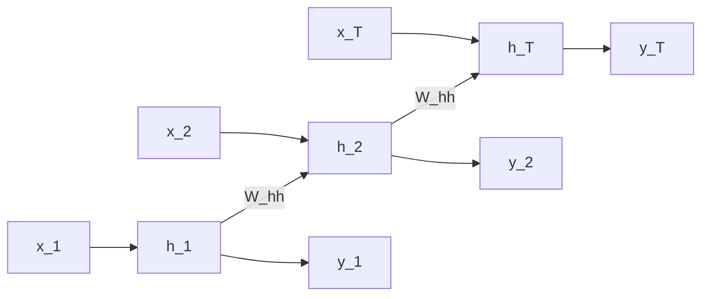
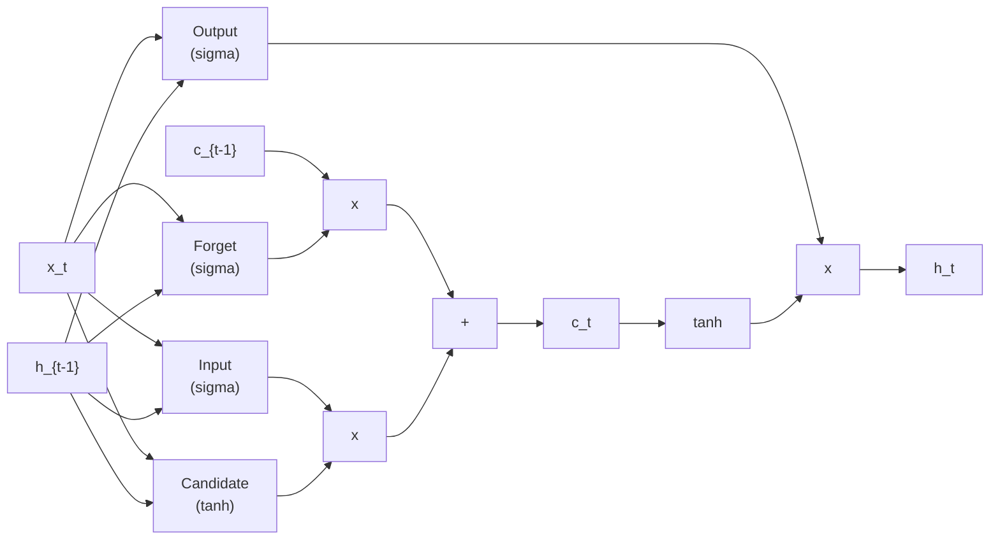

> Recorrido tematico de las 93 diapositivas del lecture, organizado por contenido (no por slide). Citas a slides especificas en *cursiva*.

**Video original:** [YouTube](https://www.youtube.com/watch?v=SEnXr6v2ifU)
**Slides:** [PDF local](/videos/mit-6s191-rnn/slides.pdf) - [Original MIT](http://introtodeeplearning.com/2020/slides/6S191_MIT_DeepLearning_L2.pdf)

---

## 1. Motivacion: Por que modelar secuencias

El mundo de los datos esta lleno de secuencias: audio, video, texto, series temporales financieras, secuencias de ADN. A diferencia de las redes feed-forward (MLP) o convolucionales (CNN), que trabajan con entradas de **tamano fijo**, una red neuronal recurrente procesa secuencias de **longitud variable** manteniendo un estado oculto que persiste entre pasos.

La pregunta fundamental que motiva el modelado de secuencias es: **dado un contexto pasado, que viene despues?** *(slides 1-6)*. Es la tarea central, ejemplificada con preguntas como "dada una imagen de una pelota en movimiento, donde estara en el siguiente frame?" o "dada una secuencia de palabras, cual es la proxima palabra?".

Las secuencias aparecen en multiples dominios -- caracter a caracter, palabra a palabra, frame a frame -- y el desafio es capturar tanto **dependencias de corto plazo** como **dependencias de largo plazo**.

---

## 2. Limitaciones de los enfoques ingenuos

Antes de presentar las RNNs, Soleimany expone tres ideas previas y por que fallan *(slides 7-13)*.

### Idea #1: Ventana fija pequena

La forma mas simple de predecir el siguiente elemento es usar una **ventana deslizante** de tamano fijo. Dado un contexto de dos palabras anteriores ("for a"), predecir la siguiente. Cada palabra se codifica en **one-hot encoding**.

El problema: una ventana de dos palabras no captura contexto suficiente. En "Francia es donde creci, pero ahora vivo en Boston. Hablo fluidamente ____", necesitamos informacion del **pasado distante** (que vivi en Francia) para predecir "frances". Una ventana pequena falla por completo.

### Idea #2: Bag of words (contar palabras)

Codificar el texto entero como un vector de conteos por palabra. El problema: los **conteos no preservan el orden**. Las oraciones "The food was good, not bad at all" y "The food was bad, not good at all" tienen el mismo vector, pero significan lo **opuesto**. Sin orden, es imposible capturar negaciones, contexto temporal o relaciones sintacticas.

### Idea #3: Ventana fija grande

Expandir la ventana a toda la secuencia, con un vector one-hot independiente por posicion. El problema fundamental: **sin compartir parametros**. Cada palabra en cada posicion es un parametro separado; lo aprendido sobre "this" en posicion 1 no transfiere a "this" en posicion 5. El modelo no generaliza y el numero de parametros crece sin limite.

---

## 3. Criterios de diseno para el modelado de secuencias

Tras exponer las limitaciones, Soleimany enumera **cuatro criterios clave** que debe cumplir una solucion *(slide 14)*:

1. **Manejar secuencias de longitud variable** sin padding artificial ni truncamiento.
2. **Rastrear dependencias de largo plazo**: el estado interno debe retener y propagar informacion del pasado distante.
3. **Mantener informacion sobre el orden**: la secuencia debe preservarse implicitamente, no solo como conteos.
4. **Compartir parametros entre pasos**: los mismos pesos en cada paso temporal, permitiendo generalizacion y eficiencia de parametros.

Las **redes neuronales recurrentes (RNNs)** emergen como la respuesta natural a los cuatro requisitos.

---

## 4. Arquitectura de redes neuronales recurrentes

### 4.1 La recurrencia

Una RNN aplica la **misma funcion** en cada paso temporal, con una entrada que incluye el estado oculto del paso anterior *(slide 15)*. La ecuacion fundamental:

$$h_t = f(h_{t-1}, x_t)$$

donde:

- $x_t$ es la entrada en el paso $t$.
- $h_t$ es el **estado oculto** -- un "resumen lossy" de toda la informacion vista hasta el momento.
- $f$ es una funcion parametrizada (tipicamente una red neuronal pequena).

Este mecanismo cumple los cuatro criterios:

- **Longitud variable**: se aplica el mismo paso recurrente tantas veces como sea necesario.
- **Largo plazo**: el estado $h_t$ propaga informacion desde $h_0$ por composicion.
- **Orden**: la secuencia se procesa paso a paso, preservando estructura temporal.
- **Parametros compartidos**: $f$ es la misma en cada $t$.

### 4.2 Parametrizacion tipica: lineal + no-linealidad

La implementacion estandar usa **combinacion lineal + activacion**:

$$h_t = \sigma(W_{hh} \, h_{t-1} + W_{xh} \, x_t)$$

donde:

- $W_{hh} \in \mathbb{R}^{d_h \times d_h}$ es la matriz de transicion del estado oculto ("recurrente").
- $W_{xh} \in \mathbb{R}^{d_h \times d_x}$ es la matriz entrada-a-oculto.
- $\sigma$ es una activacion no-lineal (tanh o ReLU).
- El bias se absorbe anadiendo una entrada constante 1.

La dimension critica es $d_h$, el **tamano del estado oculto**: suficientemente grande para capturar contexto, pero eficiente en parametros.

### 4.3 Codificacion de la salida

Para producir una prediccion en cada paso o solo al final, se anade una capa de salida:

$$y_t = \sigma(W_{hy} \, h_t)$$

donde $W_{hy} \in \mathbb{R}^{d_y \times d_h}$ mapea del estado oculto al espacio de salida.

---

## 5. Configuraciones de RNN segun la tarea

Las RNNs son flexibles y permiten muchas configuraciones *(slides 16-19)*:

### Muchos-a-uno: clasificacion de secuencias

Se procesan todos los inputs $x_1, \ldots, x_T$ generando estados $h_1, \ldots, h_T$, pero solo el **ultimo estado** $h_T$ alimenta una salida $y$. **Ejemplo**: analisis de sentimiento de una oracion completa.

### Uno-a-muchos: generacion condicionada

Se proporciona un unico input (o contexto inicial codificado en $h_0$) que genera una secuencia de outputs $y_1, \ldots, y_T$. **Ejemplo**: image captioning, donde la imagen se codifica y la RNN genera una secuencia de palabras.

### Muchos-a-muchos sincrono (misma longitud)

Se generan outputs en cada paso temporal, con el mismo numero de pasos que los inputs. **Ejemplo**: POS tagging, etiquetado de frames en video.

### Encoder-decoder (seq2seq)

Dos RNNs en cascada: un **encoder** procesa la secuencia de entrada y resume la informacion en $h_T$ (el "contexto" $c$); un **decoder** alimentado por $c$ genera la secuencia de salida. Permite entrada y salida de **longitudes distintas**. **Ejemplo**: traduccion automatica.

---

## 6. Ejemplo practico: generacion de texto a nivel de caracter

Un caso ilustrativo es la **generacion de texto caracter a caracter** *(slides 20-22)*. Dado un vocabulario pequeno como $\{\text{'h'}, \text{'e'}, \text{'l'}, \text{'o'}\}$ y una secuencia de entrenamiento "hello":

- En el paso $t$, la RNN recibe el caracter $x_t$ en **one-hot encoding**.
- Genera un estado oculto $h_t$ que codifica "he visto los caracteres h, e, l, ...".
- Produce logits sobre el vocabulario $y_t$, que indican la probabilidad del siguiente caracter.
- Durante entrenamiento, se compara $y_t$ con la etiqueta (el siguiente caracter real).
- Durante inferencia, se muestrea del softmax de $y_t$ y se realimenta como entrada del siguiente paso.

**Resultado notable**: entrenar el modelo en las obras completas de Shakespeare produce, despues de suficientes iteraciones, texto que **conserva la estructura sintactica** (pentametro yambico, dialogos correctos con escenografia) aunque sin coherencia semantica profunda. Las primeras iteraciones generan ruido; la estructura emerge con el entrenamiento.

---

## 7. Grafo computacional desplegado en el tiempo

Para entender como entrenar una RNN, conviene visualizar el **grafo computacional desplegado** *(slides 23, 31-35)*. En lugar de ver la RNN como un ciclo, se "despliega" en el tiempo: en cada paso $t = 1, \ldots, T$ hay una copia del mismo modulo RNN recibiendo $x_t$ y $h_{t-1}$, produciendo $h_t$ y $y_t$.



El grafo resultante es una **red feed-forward profunda** (con profundidad $T$). La visualizacion muestra que **las mismas matrices $W_{xh}$, $W_{hh}$, $W_{hy}$ se repiten** en cada paso: los parametros se **comparten profundamente** a traves del tiempo.

---

## 8. Backpropagation through time (BPTT)

### 8.1 El algoritmo

Entrenar una RNN requiere extender backpropagation al grafo desplegado. El procedimiento se llama **backpropagation through time (BPTT)** *(slides 24-26, 36-40)*:

1. **Forward pass**: propagar $x_1, \ldots, x_T$ por el grafo desplegado, computando $h_1, \ldots, h_T$ y $y_1, \ldots, y_T$.
2. **Definir perdida**: sumar la perdida en cada paso (cross-entropy o ranking loss):
   $$L = \sum_{t=1}^{T} L_t(y_t, \text{target}_t)$$
3. **Backward pass**: aplicar la regla de la cadena a traves del grafo desplegado. El gradiente respecto a $W_{hh}$ recibe contribuciones de **todos** los pasos temporales, porque $W_{hh}$ aparece en cada transicion $h_{t-1} \to h_t$.
4. **Actualizar**: aplicar SGD (o Adam, RMSprop, etc.).

### 8.2 La cadena de jacobianos

Al calcular el gradiente respecto a $h_0$, la senal debe fluir hacia atras a traves de $T$ pasos. Matematicamente:

$$\frac{\partial L}{\partial h_0} = \frac{\partial L}{\partial h_T} \cdot \frac{\partial h_T}{\partial h_{T-1}} \cdot \frac{\partial h_{T-1}}{\partial h_{T-2}} \cdots \frac{\partial h_1}{\partial h_0}$$

Cada factor incluye la derivada de la activacion y la matriz $W_{hh}$. Para una RNN vanilla con tanh:

$$\frac{\partial h_t}{\partial h_{t-1}} = W_{hh}^T \cdot \text{diag}(\tanh'(z))$$

> Para la derivacion completa con $\delta_t^h$, $\delta_t^z$ y gradientes respecto a $W_{xh}$, $W_{hh}$, $W_{hy}$, ver [Profundizacion de Clase 11 (parte II)](/clases/clase-11/profundizacion).

---

## 9. Vanishing y exploding gradients

### 9.1 El problema

El flujo del gradiente a traves de muchos pasos temporales es **multiplicativo**: la derivada de $h_t$ respecto a $h_{t-k}$ es un producto de $k$ jacobianos *(slide 27, 41-45)*.

$$\frac{\partial h_t}{\partial h_{t-k}} = \prod_{i=0}^{k-1} \frac{\partial h_{t-i}}{\partial h_{t-i-1}}$$

Si los valores singulares de las jacobianas son **menores que 1**, el gradiente decae exponencialmente: **vanishing gradient**. Si son **mayores que 1**, explota: **exploding gradient**.

$$\left\| \frac{\partial L}{\partial h_0} \right\| \approx C \cdot \sigma_{\max}(W_{hh})^T$$

- **Vanishing**: silencioso, impide aprender dependencias de largo plazo. El gradiente que viaja desde el paso 100 al paso 1 se vuelve negligible, y los pesos que afectan el paso 1 casi no se actualizan.
- **Exploding**: causa inestabilidad numerica (NaN), pero al menos provoca alertas.

### 9.2 Soluciones parciales (antes de las compuertas)

Antes de las arquitecturas con compuertas, se intentaron tres trucos *(slides 61-66)*:

**Truco #1 -- Funciones de activacion**: usar ReLU en lugar de tanh o sigmoide ayuda porque la derivada de ReLU es 1 cuando $x > 0$, evitando decaimiento. Solucion incompleta.

**Truco #2 -- Inicializacion de pesos**: inicializar $W_{hh}$ como matriz identidad ayuda a prevenir que decaigan los gradientes durante entrenamiento. El bias se inicializa a cero.

**Truco #3 -- Gradient clipping**: para el problema opuesto (exploding), normalizar el gradiente cuando su norma excede un umbral.

Estos trucos son utiles pero **insuficientes para dependencias realmente largas**. La solucion de fondo requiere arquitecturas especializadas.

---

## 10. Gradient clipping

**Gradient clipping** es una tecnica simple para mitigar exploding gradients *(slides 46-48)*. Si la norma del gradiente excede un umbral $\tau$, se escala proporcionalmente:

$$\hat{g} \leftarrow \begin{cases}
g & \text{si } \|g\| \leq \tau \\
\dfrac{\tau}{\|g\|} \cdot g & \text{si } \|g\| > \tau
\end{cases}$$

Despues, se actualiza con el gradiente recortado: $\theta \leftarrow \theta - \eta \hat{g}$.

**Por que funciona**:

- Limita la magnitud del paso de actualizacion.
- Mantiene la **direccion** del gradiente (solo normaliza la magnitud).
- Evita overflow / underflow numerico.

**Limitacion**: el clipping **no resuelve el vanishing gradient**; solo evita la explosion. Para el desvanecimiento se requiere una arquitectura distinta (LSTM, GRU).

---

## 11. Por que las RNNs vanilla fallan en secuencias largas

Una RNN vanilla intenta comprimir toda la historia en un vector de estado oculto de dimension fija. Para secuencias largas (T >> 1000), esto es insuficiente *(slides 49-52)*.

- **Cuello de botella de informacion**: $h_t$ debe conservar toda informacion relevante de $x_0, \ldots, x_{t-1}$. Con vanishing gradients, el gradiente de $L$ no llega a $h_0$, asi que la red no puede aprender a retener informacion critica de pasos lejanos.
- **Dependencias de largo plazo**: traduccion, analisis de parrafos, etc. requieren correlacionar informacion separada por 100+ pasos. Sin un mecanismo de memoria explicito, la RNN no puede mantenerla.

Empiricamente, una RNN vanilla alcanza precision casi constante al predecir palabras lejanas; LSTM/GRU mejoran dramaticamente.

---

## 12. Motivacion para las compuertas (gating)

La solucion es introducir **compuertas** que controlen que informacion fluye, que se olvida y que se retiene *(slides 53-55)*. La intuicion combina dos ideas:

1. **Multiplicacion elemento-wise** por vectores de compuerta (valores en $[0, 1]$).
2. **Conexiones "shortcuts"** que evitan pasar por multiples transformaciones no-lineales.

Esto reduce la distancia que el gradiente debe viajar y mitiga el desvanecimiento. Tipicamente se introducen tres compuertas:

- **Forget gate**: que del estado anterior se retiene.
- **Input gate**: cuanta informacion nueva entra.
- **Output gate**: que se expone al exterior.

Cada compuerta es aprendible, lo que permite a la red desarrollar control fino sobre la memoria.

---

## 13. LSTM: long short-term memory

### 13.1 El bloque LSTM

LSTM, propuesto por Hochreiter y Schmidhuber (1997), es la arquitectura con compuertas mas iconica *(slides 56-72)*. En lugar de un unico estado oculto $h_t$, el LSTM mantiene dos estados:

- **Cell state** $c_t$: la "memoria" principal, que fluye casi sin cambios cuando el forget gate es alto.
- **Hidden state** $h_t$: la salida "filtrada" del cell state.



### 13.2 Ecuaciones del LSTM

Las ecuaciones formales *(slide 59)*:

$$i_t = \sigma(W_{xi} x_t + W_{hi} h_{t-1} + b_i) \quad \text{(input gate)}$$

$$f_t = \sigma(W_{xf} x_t + W_{hf} h_{t-1} + b_f) \quad \text{(forget gate)}$$

$$\tilde{c}_t = \tanh(W_{xc} x_t + W_{hc} h_{t-1} + b_c) \quad \text{(candidate cell state)}$$

$$c_t = f_t \odot c_{t-1} + i_t \odot \tilde{c}_t \quad \text{(new cell state)}$$

$$o_t = \sigma(W_{xo} x_t + W_{ho} h_{t-1} + b_o) \quad \text{(output gate)}$$

$$h_t = o_t \odot \tanh(c_t) \quad \text{(hidden state)}$$

donde $\odot$ denota multiplicacion elemento-wise; todos los $W$ y $b$ son aprendibles.

### 13.3 Analisis de las compuertas

- **Forget gate** $f_t$: en $[0, 1]$, multiplica elemento-wise el cell state anterior. Si $f_t \approx 0$, se "olvida"; si $f_t \approx 1$, se preserva.
- **Input gate** $i_t$ y **candidato** $\tilde{c}_t$: el input gate decide cuanto del candidato entra; el candidato se computa con tanh (rango $[-1, 1]$), introduciendo no-linealidad.
- **Output gate** $o_t$: controla que se comunica al siguiente paso. El cell state se filtra con tanh y se multiplica por $o_t$.

### 13.4 Por que LSTM evita el vanishing gradient

La derivada del cell state respecto al paso anterior es:

$$\frac{\partial c_t}{\partial c_{t-1}} = f_t$$

No hay matriz $W_{hh}$ multiplicando: es **solo una multiplicacion elemento-wise** por $f_t \in (0, 1)$. Aunque cada elemento sea menor que 1, rara vez **todos** los elementos son cercanos a cero, asi que el gradiente fluye significativamente. En contraste, una RNN vanilla multiplica por $W_{hh}$ repetidamente, causando decaimiento exponencial cuando los valores singulares son pequenos.

> Para la demostracion formal, ver [Profundizacion de Clase 11](/clases/clase-11/profundizacion).

---

## 14. GRU: gated recurrent unit

La arquitectura **GRU** (Cho et al., 2014) simplifica LSTM combinando forget e input gates en una **update gate** y eliminando el cell state separado *(slide 60)*:

- **Reset gate**: cuanto del estado anterior se ignora al computar el candidato.
- **Update gate**: balance entre estado anterior y candidato nuevo.

GRU suele lograr rendimiento comparable a LSTM con menos parametros y es preferida en algunos contextos por su eficiencia.

---

## 15. Aplicacion: generacion de musica

Tarea clasica de RNN: entrenar un modelo a nivel de caracteres en notacion musical (ej. notas como E, F#, G, C en formato ABC) para **generar secuencias musicales** *(slide 73)*.

**Arquitectura**:

- **Input**: secuencia de caracteres musicales.
- **Output**: distribucion de probabilidad sobre el siguiente caracter.
- **Training**: cada paso predice el caracter siguiente; la perdida es cross-entropy.
- **Inference**: se muestrea del softmax para generar secuencias largas.

El modelo aprende patrones ritmicos, progresiones de acordes y estructura melodica. Los resultados producen musica coherente, aunque sin estructura armonica profunda.

---

## 16. Aplicacion: clasificacion de sentimiento

Tarea many-to-one: clasificar el sentimiento (positivo / negativo) de una secuencia de palabras *(slides 74-75)*.

- **Input**: palabras "I love this class!" codificadas como embeddings.
- **Hidden states**: procesados secuencialmente por un LSTM.
- **Output**: solo del **ultimo estado** $h_T$, que se proyecta a las clases.
- **Loss**: softmax cross-entropy.

Ejemplo real: el modelo clasifica correctamente tweets como "The @MIT Introduction to #DeepLearning is definitely one of the best courses of its kind currently available online" como positiva.

---

## 17. Aplicacion: traduccion automatica con encoder-decoder

La traduccion automatica (ej. ingles a frances) requiere mapear una secuencia de entrada a una secuencia de salida de **longitud distinta** *(slides 76-78)*.

**Patron encoder-decoder**:

1. **Encoder RNN**: procesa la secuencia en ingles palabra por palabra, acumulando informacion en el hidden state.
2. **Context vector $C$**: el estado final del encoder, que codifica el significado de la oracion entera.
3. **Decoder RNN**: inicializado con $C$, genera la traduccion palabra por palabra en frances.

**Ejemplo**:

```
Entrada:  "the dog eats" (ingles)
Encoder:  [the] -> [the, dog] -> [the, dog, eats]
Context:  h_final  <- semantica de la oracion
Decoder:  h_0 = context -> "le" -> "chien" -> "mange"
```

Durante training, los outputs reales (**teacher forcing**) se realimentan al decoder. Durante inference, el decoder genera autorregresivamente muestreando de las distribuciones predichas.

---

## 18. Cuello de botella del encoder

En el modelo seq2seq estandar, **toda la informacion del input debe comprimirse en un unico vector $C$** de dimension fija *(slide 79)*.

Cuando el input es largo (oraciones de 20+ palabras), $C$ debe capturar:

- Estructura sintactica completa.
- Significado de cada palabra.
- Relaciones gramaticales.
- Orden de palabras.

Pero el decoder debe generar la traduccion sin acceso directo a palabras especificas del input. Cuando genera "mange" (eats), no tiene conexion directa a "eats"; solo accede a $C$. **Resultado**: el rendimiento degrada significativamente con oraciones largas, porque $C$ pierde informacion.

---

## 19. Mecanismo de atencion

### 19.1 Idea central

Para resolver el cuello de botella, se introduce un **mecanismo de atencion** que permite al decoder "mirar" adaptativamente diferentes partes del input mientras genera cada palabra *(slides 80-82)*.

En lugar de un unico context vector $C$, hay un context vector adaptativo $C_t$ que **cambia en cada paso $t$ del decoder**, ponderando los hidden states del encoder segun su relevancia:

$$C_t = \sum_{i=1}^{T} \alpha_{t,i} \, h_i^{\text{encoder}}$$

donde $\alpha_{t,i}$ son pesos de atencion (softmax normalizado) que indican cuanta atencion poner en la posicion $i$ del input cuando se genera la palabra $t$ del output.

### 19.2 Calculo de los pesos (Bahdanau et al., 2015)

Los coeficientes $\alpha_{t,i}$ se calculan con una red pequena aditiva:

$$\text{score}(s_{t-1}, h_i) = V^T \tanh(W_1 s_{t-1} + W_2 h_i)$$

$$\alpha_{t,i} = \frac{\exp(\text{score}(s_{t-1}, h_i))}{\sum_j \exp(\text{score}(s_{t-1}, h_j))}$$

**Interpretacion**:

- El estado del decoder $s_{t-1}$ "pregunta" que parte del input necesita.
- El score combina el estado actual con cada hidden state del encoder.
- El softmax convierte scores en probabilidades, permitiendo que la red **enfoque** en posiciones relevantes.

### 19.3 Ejemplo: traduccion con alineamiento

Para traducir "El auto rojo de Carlos esta averiado" a ingles:

- Al generar "Carlos" -> $\alpha$ alto en "Carlos" del input.
- Al generar "red" -> $\alpha$ alto en "rojo".
- Al generar "broken" -> $\alpha$ alto en "averiado".

Las visualizaciones de attention weights muestran un **alineamiento suave palabra-a-palabra** entre los lenguajes.

---

## 20. Arquitectura completa: BiLSTM + atencion

### 20.1 Encoder bidireccional

*(slide 83)*. Para capturar contexto pasado y futuro, el encoder es tipicamente bidireccional (BiLSTM):

- **Forward LSTM**: procesa izquierda a derecha, produce $\overrightarrow{h_i}$.
- **Backward LSTM**: procesa derecha a izquierda, produce $\overleftarrow{h_i}$.
- **Annotation**: $h_i = [\overrightarrow{h_i}; \overleftarrow{h_i}]$ (concatenacion).

Esto permite que cada posicion $i$ del encoder tenga informacion de toda la secuencia.

### 20.2 Decoder con atencion

El decoder genera cada palabra usando el context vector $C_t$:

$$y_t = \text{softmax}(W_{out} [s_t; C_t])$$

$$s_t = \text{LSTM}(s_{t-1}, y_{t-1}, C_t)$$

El estado del decoder $s_t$ se condiciona en:

- El estado previo $s_{t-1}$.
- La palabra previa $y_{t-1}$ (embedded).
- El context vector $C_t$ computado dinamicamente.

---

## 21. Otras aplicaciones de attention

### 21.1 Image captioning con atencion espacial

*(slides 84-85)*. Tarea: generar descripciones textuales de imagenes. La modificacion clave es que se **atiende a regiones espaciales** en lugar de posiciones temporales:

- Una CNN (ej. VGG) extrae un grid de features de la imagen.
- El decoder genera cada palabra mientras "mira" diferentes regiones.
- Las attention maps visualizan a donde mira el modelo para cada palabra.

Ejemplo: "A woman is throwing a **frisbee** in a park." Al generar "frisbee", el mapa de atencion se ilumina en la region del objeto.

### 21.2 Sumarizacion abstractiva

*(slides 86-87)*. Tarea: generar resumenes **nuevos** (no solo seleccionar oraciones). **Pointer-generator networks** (See et al., 2017) permiten mezclar:

- **Generacion**: crear palabras nuevas no presentes en el documento.
- **Pointing**: copiar palabras del documento via attention.

El modelo aprende a **copiar hechos clave** mientras **parafrasea**, mejorando significativamente sobre la sumarizacion extractiva pura.

### 21.3 Bottom-up attention para vision

*(slide 88)*. Mejora sobre el grid-based attention: se usan **caracteristicas de objetos detectados** (Faster R-CNN) en lugar de grillas uniformes (Anderson et al., 2018). Los objetos son una abstraccion mas natural que pixeles, y el modelo atiende a unidades discretas como "elefante" o "bebe elefante", produciendo captions semanticamente mas coherentes.

---

## 22. Sintesis: evolucion de arquitecturas

1. **RNN vanilla**: simple pero sufre vanishing gradients.
2. **LSTM / GRU**: introducen compuertas que permiten flujo ininterrumpido del gradiente.
3. **Attention**: permite acceso selectivo a la memoria del encoder, resolviendo el cuello de botella.

Propiedades clave:

- **Flexibilidad**: las RNNs manejan secuencias de longitud variable mediante compartir parametros.
- **Memoria de largo plazo**: las LSTMs pueden aprender dependencias a centenas o miles de pasos gracias al cell state.
- **Localizacion**: attention permite enfocar informacion relevante, mejorando rendimiento en oraciones largas y tareas multi-modales.

Las arquitecturas seq2seq con atencion dominaron el NLP entre 2014 y 2017 hasta la llegada de los Transformers. Son los conceptos fundamentales que **preceden y subyacen** en los modelos modernos.

---

## 23. Conexion con Transformers

Aunque no se cubre en detalle en este lecture, la atencion es el **precursor conceptual directo** del Transformer (Vaswani et al., 2017). Los Transformers eliminan la recurrencia y usan **atencion pura** (multi-head self-attention) para procesar secuencias de forma paralela, mejorando velocidad y rendimiento.

Los conceptos de alignment, weighted averaging y learnable memory access introducidos por attention son centrales en la arquitectura Transformer y todo lo que ha seguido en deep learning moderno.

> Para profundizar en la transicion de seq2seq a Transformers, ver la [Clase 13 del curso UC](/clases/clase-13/teoria).

---

> Material adaptado de **MIT 6.S191 (2020) Lecture 2: Deep Sequence Modeling**, Alexander Amini & Ava Soleimany. [Video](https://www.youtube.com/watch?v=SEnXr6v2ifU) - [Slides oficiales](http://introtodeeplearning.com/2020/slides/6S191_MIT_DeepLearning_L2.pdf) - [Sitio del curso](http://introtodeeplearning.com/2020/). Notas en espanol con investigacion complementaria. Sin afiliacion oficial con MIT.
